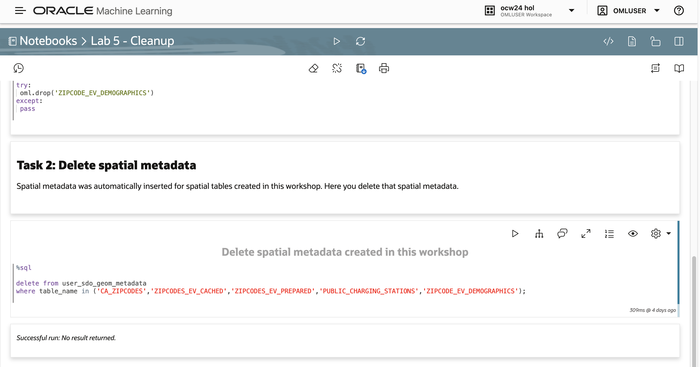
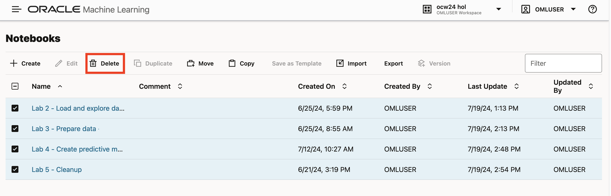

# Cleanup

## Introduction

This lab is optional. Perform the steps if you would like to remove artifacts created during this workshop, leaving your environment in a pre-workshop state. 

Estimated Lab Time: 5 minutes

### Objectives

* Remove artifacts created during this workshop, leaving your environment in a pre-workshop state. 

### Prerequisites

* Completion of previous labs
* Open the prebuilt notebook for this lab

To open a prebuilt notebook, navigate to the Notebooks page and click on the notebook name. You can navigate to the Notebooks page by clicking the main navigation toggle icon and then select Notebooks.

   

Open the notebook **Lab 5 - Cleanup**.

   

You may either run all paragraphs by clicking the play icon at the top, or run individually by moving your mouse into a paragraph and clicking the play button in the paragraph.

     

## Task 1: Drop tables

1. Follow the flow of the notebook by scrolling to view and run each paragraph of this lab.

   Scroll down to the beginning of Task 1.

     

## Task 2: Delete spatial metadata

1. Follow the flow of the notebook by scrolling to view and run each paragraph of this lab.

   Scroll down to the beginning of Task 2.

     

## Task 3: Delete pre-built notebooks

1. Navigate to the Notebooks page, select all workshop notebooks, and click **Delete**.

     

## Acknowledgements

* **Author** - David Lapp, Product Manager
* **Last Updated By/Date**  - David Lapp, July 2024
