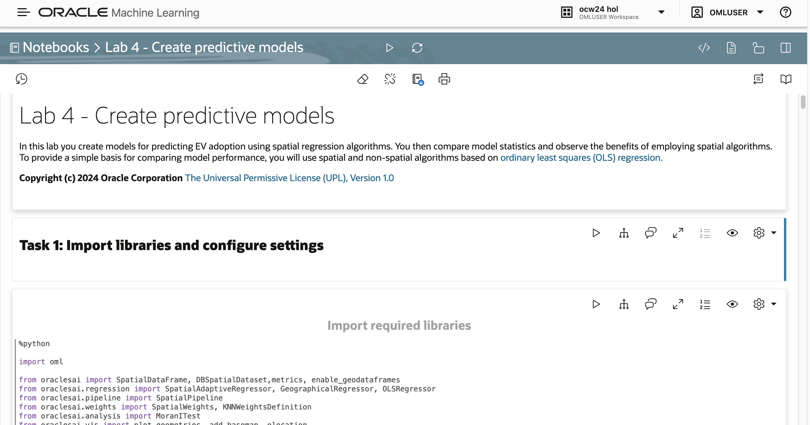
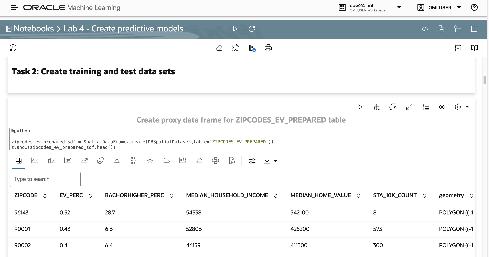
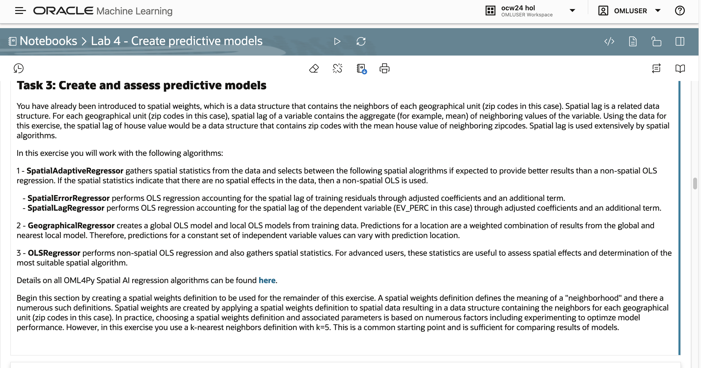
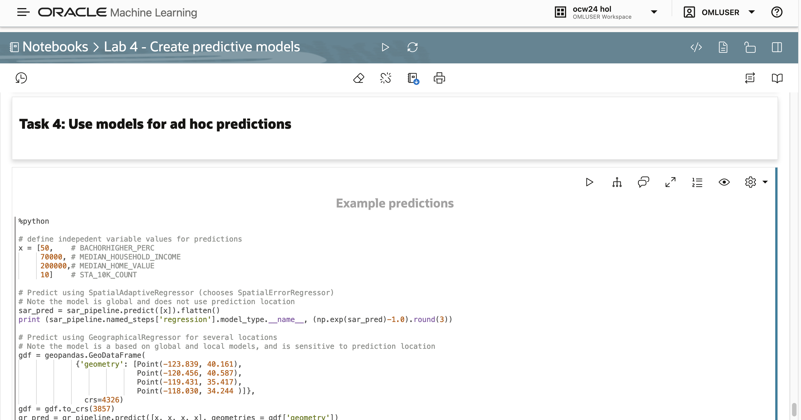

# Create spatial predictive models

## Introduction

In this lab you create models for predicting EV adoption using spatial regression algorithms.  You then compare model statistics and observe the benefits of employing spatial algorithms.

Estimated Lab Time: 45 minutes

### Objectives

* 

### Prerequisites

* Completion of Lab 3 - Prepare data
* Open the prebuilt notebook for this lab

To open a prebuilt notebook, navigate to the Notebooks page and click on the notebook name. You can navigate to the Notebooks page by clicking the main navigation toggle icon and then select Notebooks.

   

Open the notebook **Lab 4 - Create predictive models**.

   

You may either run all paragraphs by clicking the play icon at the top, or run individually by moving your mouse into a paragraph and clicking the play button in the paragraph.

      

## Task 1: Import libraries and configure settings

1. Follow the flow of the notebook by scrolling to view and run each paragraph of this lab.

   Scroll down to the beginning of Task 1.

     

## Task 2: Create training and test data sets

1. Follow the flow of the notebook by scrolling to view and run each paragraph of this lab.

   Scroll down to the beginning of Task 2.

     

## Task 3: Create and assess predictive models

1. Follow the flow of the notebook by scrolling to view and run each paragraph of this lab.

   Scroll down to the beginning of Task 3.

     

## Task 4: Use models for ad hoc predictions

1. Follow the flow of the notebook by scrolling to view and run each paragraph of this lab.

   Scroll down to the beginning of Task 4.

     

## Learn More

* ...

## Acknowledgements

* **Author** - ...
* **Last Updated By/Date**  - ...
