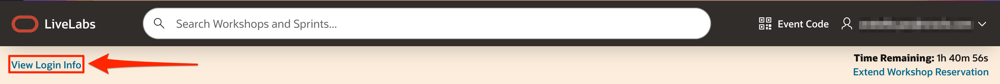
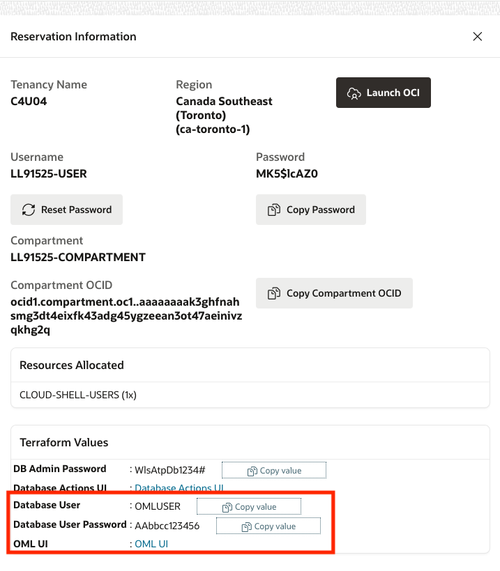
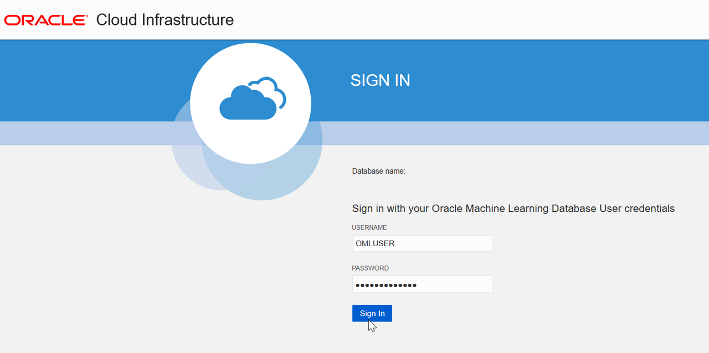
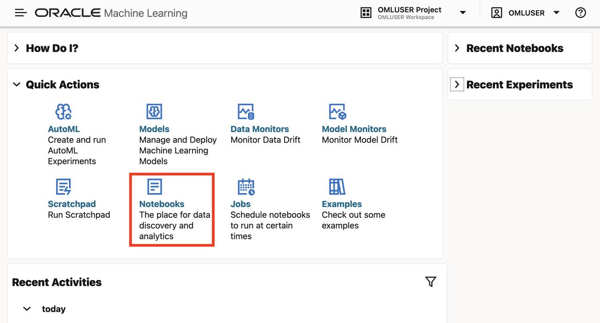
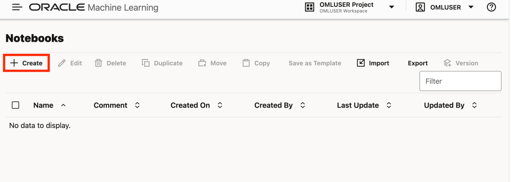
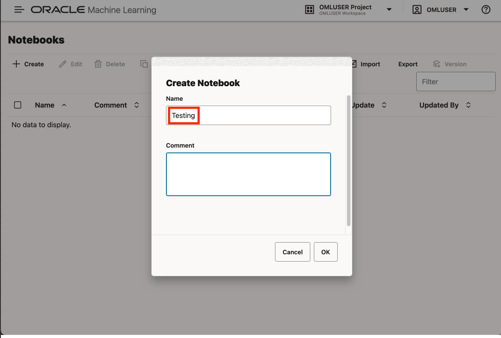

# Import notebooks

## Introduction

In this lab you log into the OML UI and import a set of pre-built notebooks used for the remainder of this workshop.

Estimated Lab Time: 5 minutes

### Objectives

* Log into OML UI
* Get familiar with OML Notebooks
* Load pre-built notebooks

### Prerequisites

* Access to the OML UI

## Task 1: Log into OML UI

1. Clink View Login Info to access your reservation information. 

   

2. Note the database user and password at the bottom. Then click the link for the OML UI. 

  

3. Sign into the OML UI using the database user and password in your reservation information.

  

## Task 2: Work with OML Notebooks

1. From OML user interface home page, click the link for Notebooks. 

  

2. Click the **Create** link to create a new notebook.

     

   When prompted, enter the name **Testing** and click OK.

      

## Task 2: Download pre-built notebooks

1. Download zip file containing pre-built notebooks [**here**](files/notebooks.zip)

   ...pic...

2. Unzip the file

    ...pic...

## Task 3: Import pre-built notebooks

1. Click Import and select all the notebooks unzipped in the previous step.
    
    ...pic...

2. Click Open to import the notebooks
    
    ...pic...

3. Verify all notebooks are imported.
    
    ...pic...

## Task 4: Review OML Notebook toolbar options

1. Opening a notebook in edit mode provides the following toolbar options:

	

    You will work with notebooks for the remainder of this workshop, so refer back to this diagram as needed.

## Learn More

* ...

## Acknowledgements

* **Author** - David Lapp, Product Manager
* **Last Updated By/Date**  - David Lapp, June 2024
