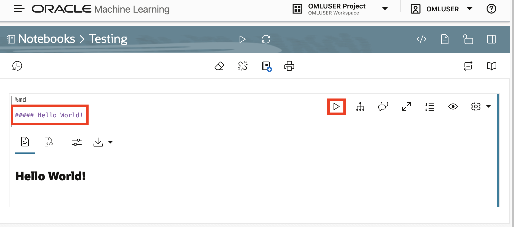
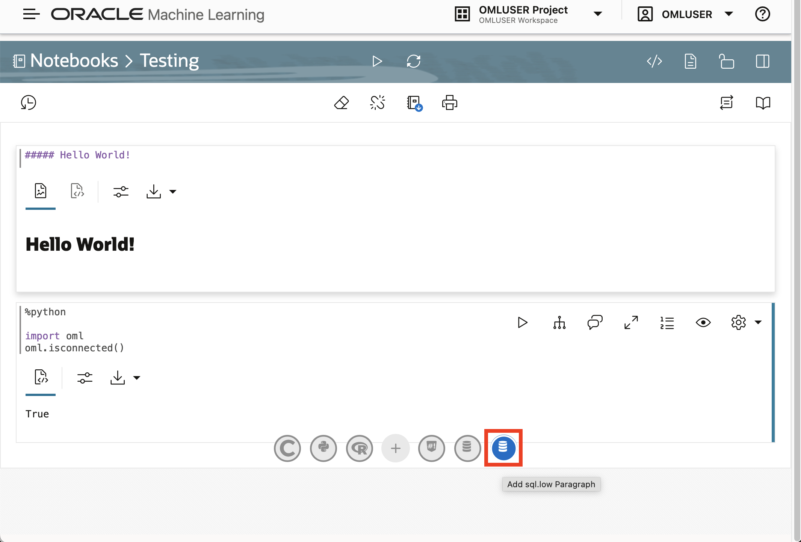
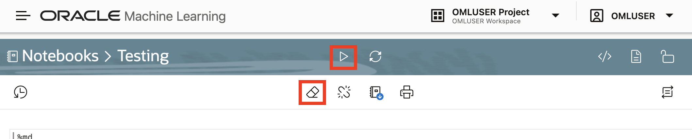
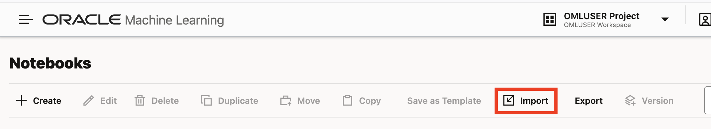

# Import notebooks

## Introduction

The Oracle Machine Learning User Interface (OML UI) is the entry point for OML, with links to OML features and artifacts. A central feature of OML is OML Notebooks, an Apache Zeppelin-based web interface for machine learning workflows using any combination of Markdown, Python, SQL, and R. In this lab you log into the OML UI, create a simple notebook, and import a set of pre-built Python notebooks used for the remainder of this workshop.

[Make Better Predictions](videohub:1_4q5ul7ex)

Estimated Lab Time: 5 minutes

### Objectives

* Log into OML UI
* Get familiar with OML Notebooks
* Load pre-built notebooks

### Prerequisites

* Access to the OML UI

## Task 1: Log into OML UI

1. Click View Login Info to access your reservation information. 

   

2. Note the database user and password at the bottom. Then click the link for the OML UI. 

  

3. Sign into the OML UI using the database user and password in your reservation information.

  

## Task 2: Work with OML Notebooks

1. From OML user interface home page, click the link for Notebooks. 

  

2. Click the **Create** link to create a new notebook.

     

   When prompted, enter the name **Testing** and click OK.

      

3. Hover your mouse above or below the empty paragraph to display buttons for creating a new paragraph. Click on the markdown icon to add a markdown paragraph.

      

4. In the markdown paragraph, add a new line, enter the following command, and click the run icon.

   

5. Hover your mouse below the markdown paragraph to display buttons for creating a new paragraph. Click on the Python icon to add a Python paragraph.

      

6. In the Python paragraph, add a new line, enter the following commands, and then click the run icon. This loads the OML Python library and verifies connectivity to your database.

     

7. Hover your mouse below the Python paragraph to display buttons for creating a new paragraph. Click on the SQL icon to add a SQL paragraph.

      

8. In the SQL paragraph, add a new line, enter the following command, and then click the run icon. This verifies SQL access by running a query that counts the objects in your database schema.

       

1. You can clear all results and run all paragraphs using the erasure and play buttons in the top button bars.

       

2. To navigate back to the Notebooks page, click the icon to open the main navigation panel and then click **Notebooks**.

       

3. You can now delete the test notebook. Select the notebook with the checkbox and click **Delete**.

       

  When prompted click OK.

       

## Task 3: Import pre-built notebooks

1. Click [**here**](https://c4u04.objectstorage.us-ashburn-1.oci.customer-oci.com/p/EcTjWk2IuZPZeNnD_fYMcgUhdNDIDA6rt9gaFj_WZMiL7VvxPBNMY60837hu5hga/n/c4u04/b/livelabsfiles/o/labfiles/oml-notebooks-2.zip) to download the file OML notebooks containing pre-built notebooks. Then unzip the file. 

       

1. Return to the OML Notebooks page and click **Import**
    
       

2. Select all the notebooks unzipped in step 1, and click Open or OK depending on your platform.
    
       

3. Verify all notebooks are imported. If truncated, you can see the full notebook name in a tooltip by hovering your mouse over the notebook name.
    
       

   OML notebooks allow selecting a service level. The pre-built notebooks for this workshop are configured to use the **Low** service level. You should leave this setting as-is. Do not switch to a different service level.
    
       

   The pre-built notebooks begin with paragraphs that import required libraries. The following summarizes the libraries that will be used:

* <a href="https://docs.oracle.com/en/database/oracle/machine-learning/oml4py/2/mlapi/" target="_blank">**oml** </a> is the core OML4Py library
* <a href="https://docs.oracle.com/en/cloud/paas/autonomous-database/serverless/saipy/" target="_blank">**oraclesai**</a> is the core OML4Py Spatial AI library
* <a href="https://numpy.org/" target="_blank"> **numpy**</a>  provides array structures
* <a href="https://pandas.pydata.org/" target="_blank"> **pandas** </a> provides data structures and manipulation
* <a href="https://pypi.org/project/shapely/" target="_blank"> **shapely**</a>  provides geometry data structure and manipulation
* <a href="https://geopandas.org" target="_blank"> **geopandas**</a>  adds spatial data capabilities to pandas
* <a href="https://scikit-learn.org" target="_blank"> **sklearn**</a>   provides machine learning  
* <a href="https://matplotlib.org/" target="_blank"> **matplotlib**</a>  provides visualizations

## Learn More

* [Oracle Machine Learning Notebooks](https://docs.oracle.com/en/database/oracle/machine-learning/oml-notebooks/omlug/get-started-oracle-machine-learning.html)

## Acknowledgements

* **Author** - David Lapp, Product Manager
* **Last Updated By/Date**  - Denise Myrick, June 2025
