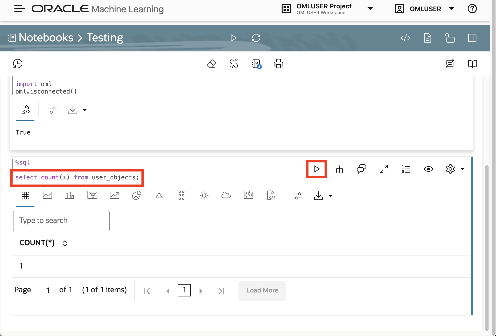

# Import notebooks

## Introduction

The Oracle Machine Learning User Interface (OML UI) is the entry point for OML, with links to OML features and artifacts. A central feature of OML is OML Notebooks, an Apache Zeppelin-based web interface for machine learning workflows using any combination of Markdown, Python, SQL, and R. In this lab you log into the OML UI, create a simple notebook, and import a set of pre-built Python notebooks used for the remainder of this workshop.

Estimated Lab Time: 5 minutes

### Objectives

* Log into OML UI
* Get familiar with OML Notebooks
* Load pre-built notebooks

### Prerequisites

* Access to the OML UI

## Task 1: Log into OML UI

1. Clink View Login Info to access your reservation information. 

   

2. Note the database user and password at the bottom. Then click the link for the OML UI. 

  

3. Sign into the OML UI using the database user and password in your reservation information.

  

## Task 2: Work with OML Notebooks

1. From OML user interface home page, click the link for Notebooks. 

  

2. Click the **Create** link to create a new notebook.

     

   When prompted, enter the name **Testing** and click OK.

      

3. Hover your mouse above or below the empty paragraph to display buttons for creating a new paragraph. Click on the markdown icon to add a markdown paragraph.

      

4. In the markdown paragraph add a new line and enter 
   
      ```
       <copy>
         ##### Hello World!
       </copy>
      ```
   
   Then click the play button to run the paragraph.

          

5. Hover your mouse below the markdown paragraph to display buttons for creating a new paragraph. Click on the Python icon to add a Python paragraph.

      

6. In the Python paragraph add a new line and enter 
   
      ```
      <copy>
      import oml
      oml.isconnected()
      </copy>
      ``` 

  Then click the play button to run the paragraph.

     

1. Hover your mouse below the Python paragraph to display buttons for creating a new paragraph. Click on the SQL icon to add a SQL paragraph.

      

2. In the SQL paragraph, enter 
   
      ```
       <copy>
         select count(*) from user_objects;
       </copy>
      ``` 

  Then click the play button to run the paragraph.

       

1. You can clear all results and run all paragraphs using the erasure and play buttons in the top button bars.

       

2. To navigate back to the Notebooks page, Click the icon to open the main navigation panel and then click **Notebooks**.

       


3. You can now delete the test notebook. Select the notebook with the checkbox and click **Delete**.

       

  When prompted click OK.

       


## Task 2: Download pre-built notebooks

1. Download zip file containing pre-built notebooks [**here**](files/notebooks.zip)

   ...pic...

2. Unzip the file

    ...pic...

## Task 3: Import pre-built notebooks

1. Click Import and select all the notebooks unzipped in the previous step.
    
    ...pic...

2. Click Open to import the notebooks
    
    ...pic...

3. Verify all notebooks are imported.
    
    ...pic...


## Task 4: Review OML Notebook toolbar options

1. Opening a notebook in edit mode provides the following toolbar options:

	

    You will work with notebooks for the remainder of this workshop, so refer back to this diagram as needed.

## Learn More

* ...

## Acknowledgements

* **Author** - David Lapp, Product Manager
* **Last Updated By/Date**  - David Lapp, June 2024
