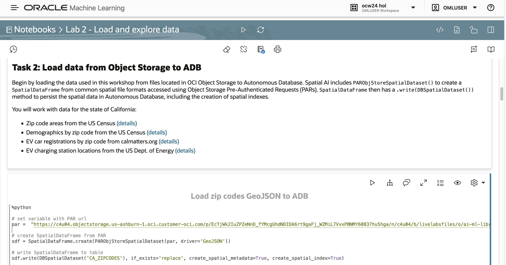
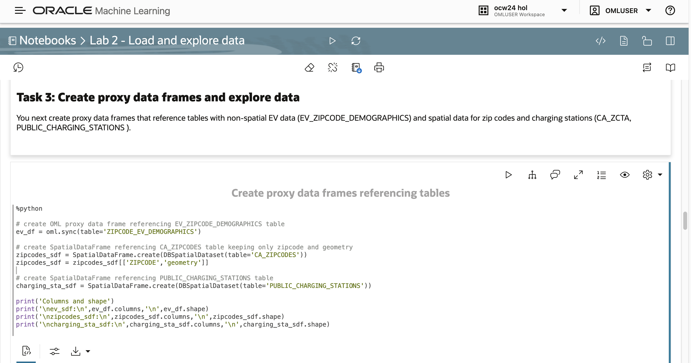

# Load and explore data

## Introduction

In this lab, you load data from files in OCI Object Storage to tables in ADB-S. You then explore the data to get  familiar with its contents. The data include spatial and non-spatial data and are used throughout this workshop. 

Estimated Lab Time: 10 minutes

### Objectives

* Load data from OCI Object Storage to ADB-S
* Gain familiarity with the data 

### Prerequisites

* Completion of Lab 1 - Import notebooks
* Open the prebuilt notebook for this lab

To open a prebuilt notebook, navigate to the Notebooks page and click on the notebook name. You can navigate to the Notebooks page by clicking the main navigation toggle icon and then select Notebooks.

   

Open the notebook **Lab 2 - Load and explore data**.

   

You may either run all paragraphs by clicking the play icon at the top, or run individually by moving your mouse into a paragraph and clicking the play button in the paragraph.

     

## Task 1: Import libraries and configure settings

1. Follow the flow of the notebook by scrolling to view and run each paragraph of this lab.

   Scroll down to the beginning of Task 1.

     

## Task 2: Load data from Object Storage to ADB

1. Follow the flow of the notebook by scrolling to view and run each paragraph of this lab.

   Scroll down to the beginning of Task 2.

     

## Task 3: Create proxy data frames and explore data

1. Follow the flow of the notebook by scrolling to view and run each paragraph of this lab.

   Scroll down to the beginning of Task 3.

     

## Learn More

* [OML4Py Spatial AI - Access Spatial Data](https://docs.oracle.com/en/cloud/paas/autonomous-database/serverless/cspai/access-spatial-data1.html)

## Acknowledgements

* **Author** - David Lapp, Product Manager
* **Last Updated By/Date**  - David Lapp, July 2024
