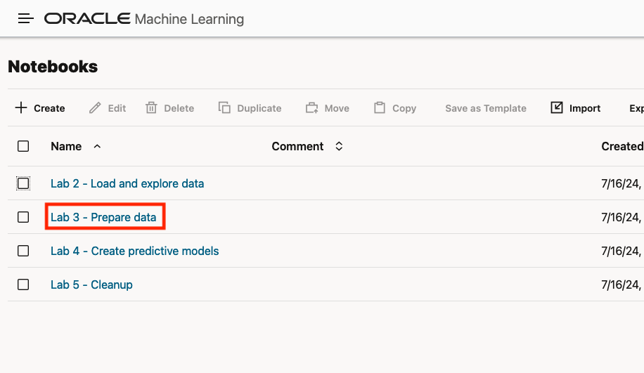

# Prepare data

## Introduction

In this lab you prepare your data for ML modeling. This includes adding spatial context to the non-spatial EV and demographics data by merging with spatial data for zip codes. In addition, you fill data gaps using a spatial algorithm and engineer a new feature using spatial analysis. You finally save the prepared data to ADB-S for use in the subsequent labs.

Estimated Lab Time: 20 minutes

### Objectives

* Add spatial context to EV and demographics data by joining to zip codes spatial data
* Fill data gaps using a spatial algorithm
* Engineer a new feature using a spatial analysis

### Prerequisites

* Completion of Lab 2 - Load and explore data
* Open the prebuilt notebook for this lab

To open a prebuilt notebook, navigate to the Notebooks page and click on the notebook name. You can navigate to the Notebooks page by clicking the main navigation toggle icon and then select Notebooks.

   

Open the notebook **Lab 3 - Prepare data**.

   

## Task 1: Import libraries and configure settings

1. ...

## Task 2: Join EV and demographics data to zip code spatial data

1. ...
   
## Task 3: Prepare the target variable

1. ...

## Task 4: Fill missing values with spatial algorithm

1. ...

## Task 5: Engineer a new feature using spatial analysis

1. ...

## Task 6: Save prepared data to ADB-S

1. ...

## Learn More

* ...

## Acknowledgements

* **Author** - ...
* **Last Updated By/Date**  - ...
