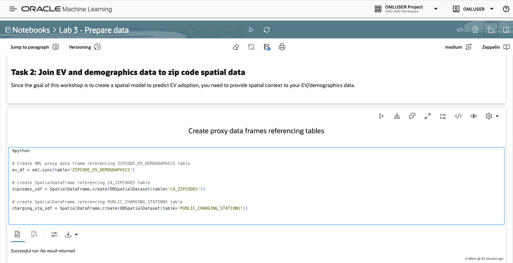

# Prepare data

## Introduction

In this lab you prepare your data for ML modeling. This includes adding spatial context to the non-spatial EV and demographics data by merging with spatial data for zip codes. In addition, you fill data gaps using a spatial algorithm and engineer a new feature using spatial analysis. You finally save the prepared data to ADB-S for use in the subsequent labs.

Estimated Lab Time: 20 minutes

### Objectives

* Add spatial context to EV and demographics data by joining to zip codes spatial data
* Fill data gaps using a spatial algorithm
* Engineer a new feature using a spatial analysis

### Prerequisites

* Completion of Lab 2 - Load and explore data
* Open the prebuilt notebook for this lab

To open a prebuilt notebook, navigate to the Notebooks page and click on the notebook name. You can navigate to the Notebooks page by clicking the main navigation toggle icon and then select Notebooks.

   

Open the notebook **Lab 3 - Prepare data**.

   

You may either run all paragraphs by clicking the play icon at the top, or run individually by moving your mouse into a paragraph and clicking the play button in the paragraph.

     

## Task 1: Import libraries and configure settings

1. Follow the flow of the notebook by scrolling to view and run each paragraph of this lab.

   Scroll down to the beginning of Task 1.

     

## Task 2: Join EV and demographics data to zip code spatial data

1. Follow the flow of the notebook by scrolling to view and run each paragraph of this lab.

   Scroll down to the beginning of Task 2.

   

## Task 3: Fill missing values using spatial algorithm

1. Follow the flow of the notebook by scrolling to view and run each paragraph of this lab.

   Scroll down to the beginning of Task 3.

   

## Task 4: Engineer a new feature using spatial analysis

1. Follow the flow of the notebook by scrolling to view and run each paragraph of this lab.

   Scroll down to the beginning of Task 4.

   

## Task 5: Save prepared data to ADB

1. Follow the flow of the notebook by scrolling to view and run each paragraph of this lab.

   Scroll down to the beginning of Task 5.

   

## Learn More

* [OML4Py Spatial AI - Preprocess Spatial Data](https://docs.oracle.com/en/cloud/paas/autonomous-database/serverless/cspai/preprocess-spatial-data1.html)
* [OML4Py Spatial AI - Oracle Spatial Based Analysis](https://docs.oracle.com/en/cloud/paas/autonomous-database/serverless/cspai/oracle-spatial-based-analysis.html)

## Acknowledgements

* **Author** - David Lapp, Product Manager
* **Last Updated By/Date**  - Denise Myrick, October 2025
