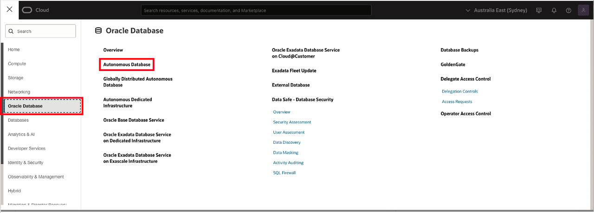
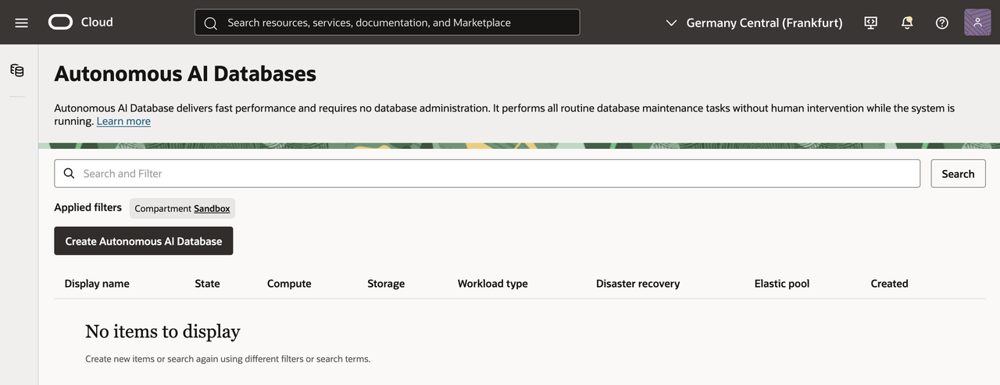
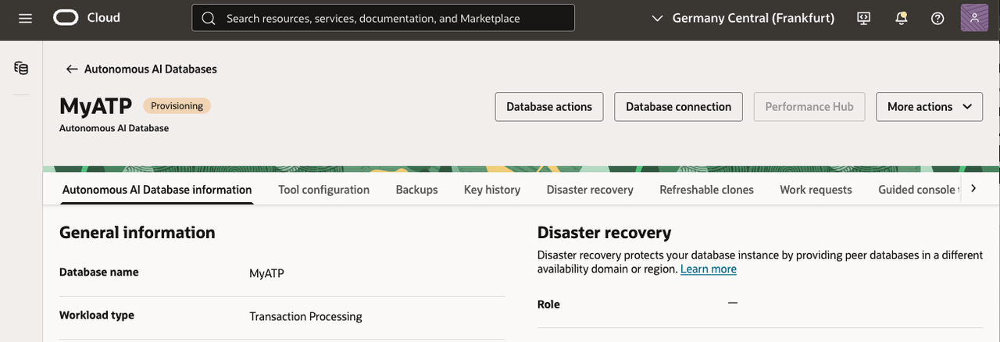
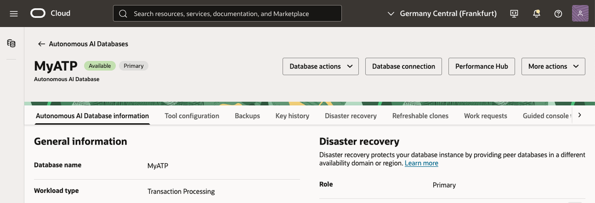
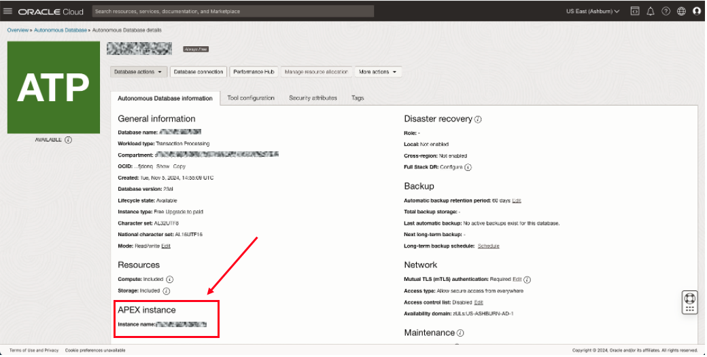
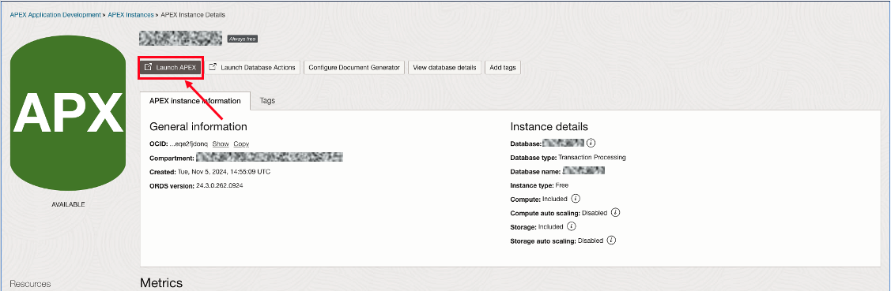
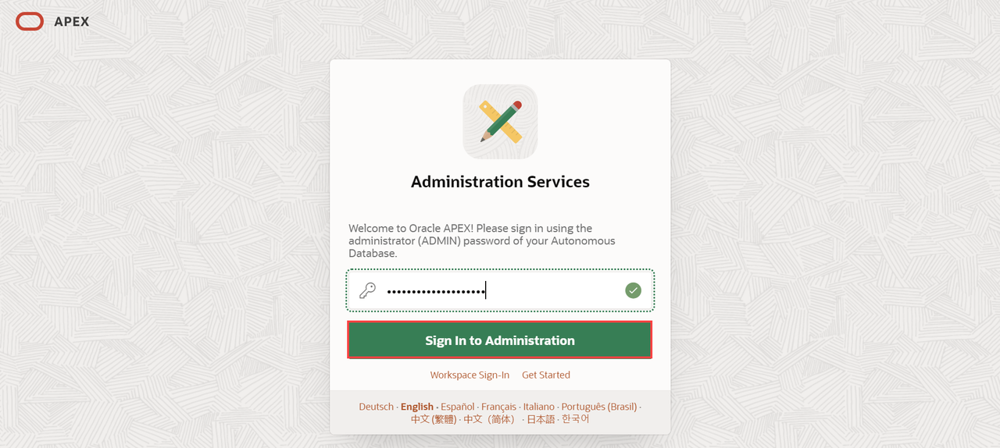
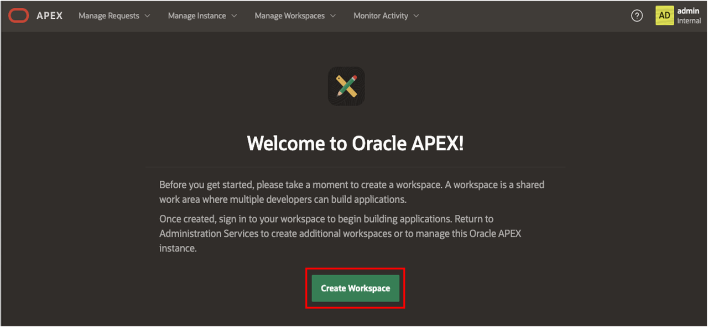
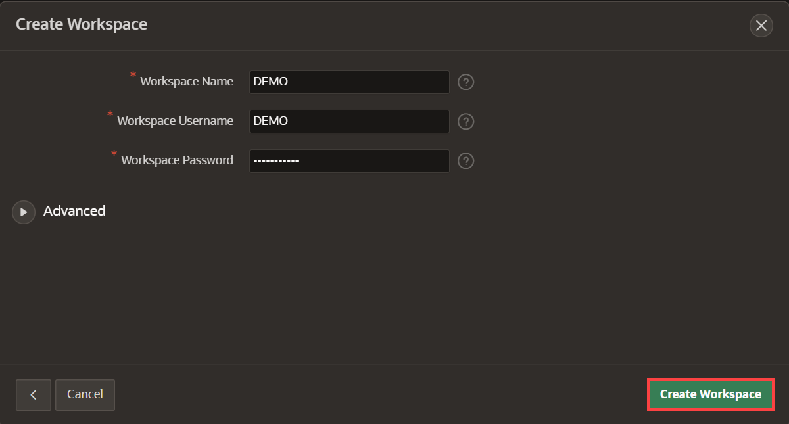
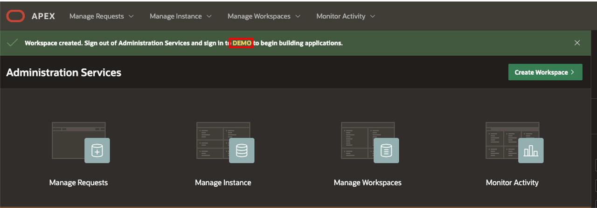

# Sign up for an APEX Workspace

## Introduction

This lab walks you through the steps to get started using Oracle APEX on Oracle Autonomous Database (Autonomous Transaction Processing [ATP]). In this lab, you provision a new ATP instance and create an APEX workspace.

Estimated Time: 10 minutes

Objectives

In this lab, you will:

- Navigate to the Oracle Autonomous Transaction Processing cloud service using the Oracle Cloud Infrastructure console.
- Provision a new Autonomous Transaction Processing database.
- Create an APEX workspace.

Watch the video below for a quick walk-through of the lab.
[Create an App from a Spreadsheet](videohub:1_rcmsmco3)

## Task 1: Create the Autonomous Database

1. Click the **Navigation Menu** in the upper left, navigate to **Oracle Database**, and select **Autonomous Database**.

    

2. Click **Create Autonomous Database**.

    

3. Input a Display name and Database name. Change Workload type to Transaction Processing and change database version to 23ai. Input your ADMIN password. For all other options, keep the default. Click Create.

    

4. You will be redirected to the Autonomous Database details page. Note the status indicator will say PROVISIONING and the icon will be brown. Wait for the indicator to say AVAILABLE and the for the icon to turn green.

  
  

## Task 2: Create a APEX workspace

1. Within your new database, APEX is not yet configured. Therefore, when you first access APEX, you will need to log in as an APEX Instance Administrator to create a workspace.

    Click the **APEX instance URL** provided on the ATP overview screen.

    

2. Now, click **Launch APEX**

    

3. Enter the password for the Administration Services and click **Sign In to Administration**.
    The password is the same as the one for the ADMIN user. You can find this password in the **View Login Info** tab.

    

4. Click **Create Workspace**.

    

5. Depending on how you would like to create your workspace, select **New Schema** or **Existing Schema**. If you are getting started, select **New Schema**.

    

6. In the Create Workspace dialog, enter the following:

    | Property | Value |
    | --- | --- |
    | Workspace Name | DEMO |
    | Workspace Username | DEMO |
    | Workspace Password | \<password\> |

    Click **Create Workspace**.

    

7. In the APEX Instance Administration page, click the **DEMO** link in the success message.
    >**Note:** This will log you out of APEX Administration so that you can log into your new workspace.

    

8. On the APEX Workspace log in page, enter the password you chose, check the **Remember workspace and username** checkbox, and then click **Sign In**.

    

## Summary

  At this point, you know how to create an APEX Workspace and you are ready to start building amazing apps, fast.

  You may now **proceed to the next lab**.

## Acknowledgements

- **Author** - Apoorva Srinivas, Senior Product Manager, Ramu Murakami Gutierrez, Product Manager
- **Last Updated By/Date** - Denise Myrick, Product Manager, April 2025
