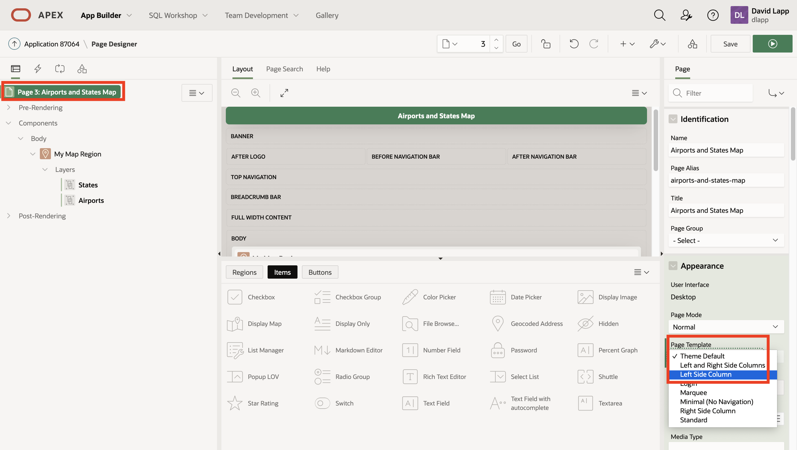
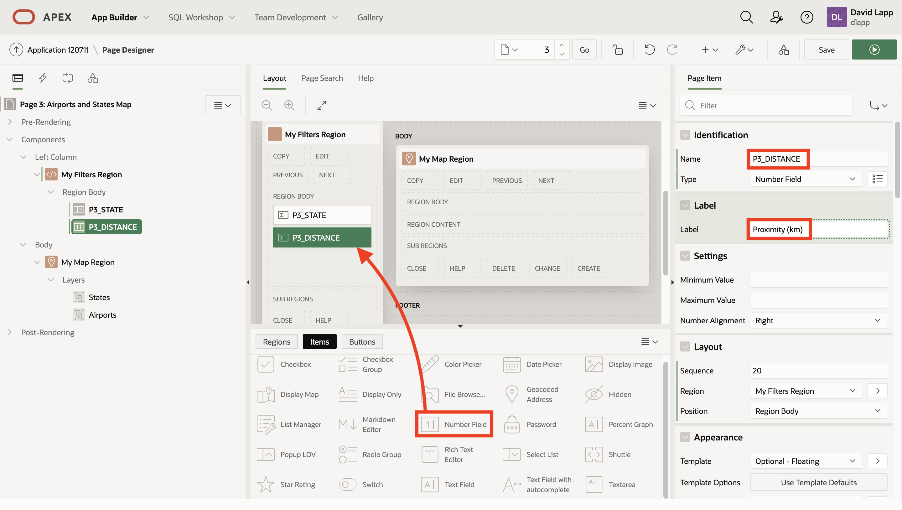
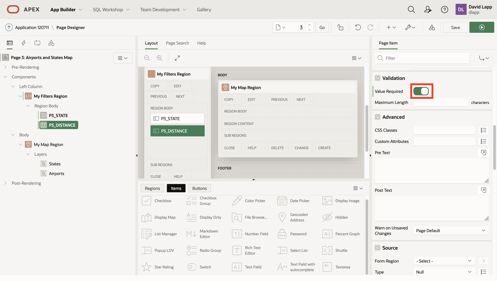
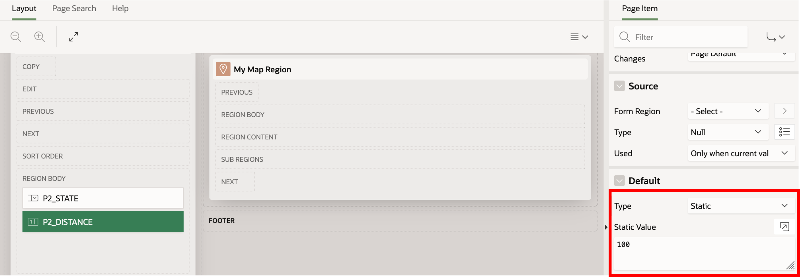
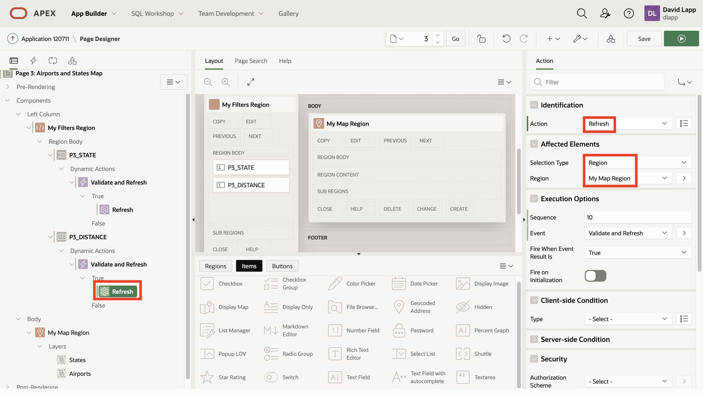
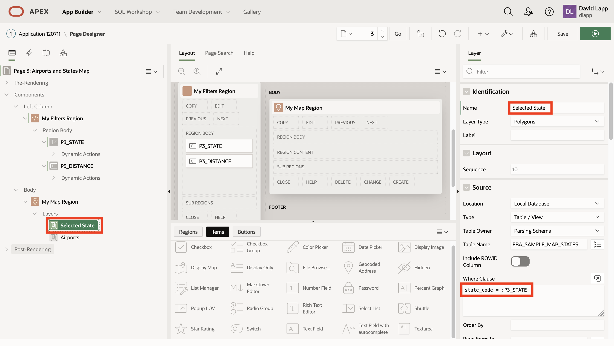
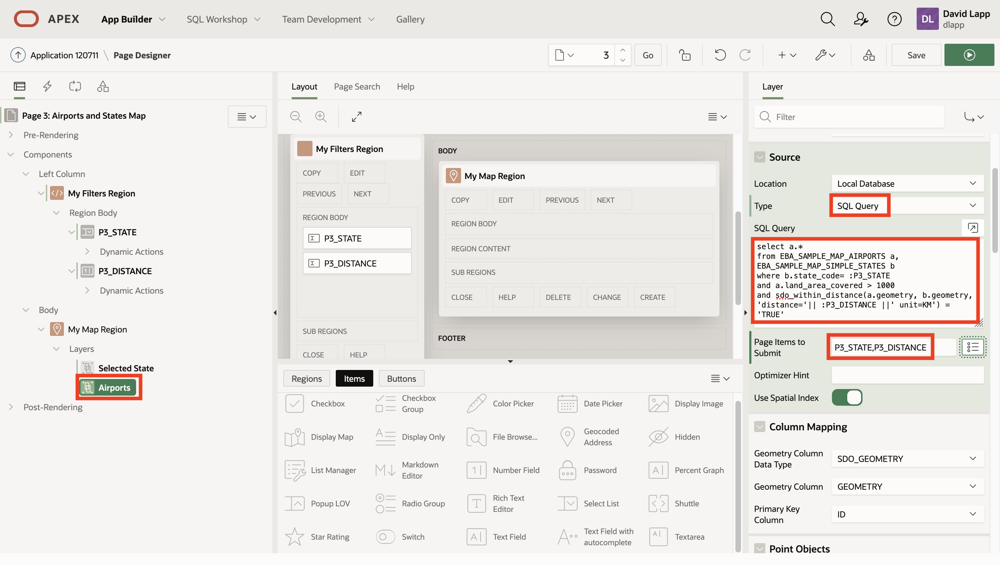
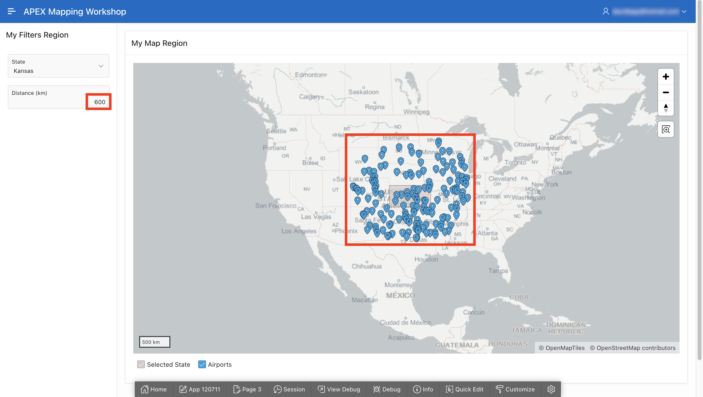

# Incorporate Spatial Analysis


## Introduction

In this lab you enhance your map from the previous lab by incorporating a spatial analysis. You will configure a search for airports located within a user-defined distance of a selected state.

Estimated Lab Time: 30 minutes

### Objectives

*  Understand a basic spatial analysis operation
*  Understand the integration of spatial analysis into APEX Map Region 

### Prerequisites

* Lab 3: Create map from scratch


## Task 1: Add a Region for Filters 

1. Click on the **Page 3: Airports and States Map** at the top of the tree on the left. Then in the Page properties panel on the right, under Appearance change the Page Template to **Left Side Column**. 

   You should then see **LEFT COLUMN** in the layout. 
   

2. Drag a Static Content region to left column.


3. Rename to **My Filters Region** or a name of your choosing.
 

## Task 2: Add an Item for State Selection 

1. Drag a Select List item your filters region and update the name to **P3_STATE**.
 

2. In the Page Item properties on the right, scroll down to the section for List of Values. Enable **Value Required** using the switch, set the Type as **SQL Query** and enter the following query:
      ```
      <copy>
      select name, state_code
      from EBA_SAMPLE_MAP_SIMPLE_STATES
      order by name
      </copy>
      ```

       

3. In the Page Item properties on the right, scroll down to the section for Default. Set the Type to **Static** and value to **'Texas'** or another state of your choosing (in single quotes).
 

## Task 3: Add an Item for Distance Entry

1. Drag Number Field into your filters region. Update the name to **P3_DISTANCE** and the label to **Proximity (km)**.  
 

2. In the Page Item properties on the right, scroll down to the Validation section and enable **Value Required**
 

1. Scroll down to the section for Default. Set the Type to **Static** and value to **100** .
 

You now have inputs for filtering airports by proximity to a state. Next you will apply the filters using Dynamic Actions.

## Task 4: Apply Filters using Dynamic Actions

You next create the actions that are invoked when state and/or distance values are changed by the user. 

1. Right-click on either your P3\_STATE or P3\_DISTANCE item and select **Create Dynamic Action**  (the action we create will be applied to both items).
 

2. In the Dynamic Action properties on the right, set the Name to **Validate and Refresh**. Under the When section, set Event to **Change**, Selection Type to **Items**, and items to the comma separated list **P3\_DISTANCE,P3\_STATE** . Note, the button to the right of the items text box allows you select items from a list. To prevent submitting negative values for distance, under the Client Side Condition section, set Type to **Item >= Value**, item to **P3\_DISTANCE** and Value to **0**. 


3.   Dynamic Actions are configured with TRUE action(s) and FALSE action(s) which are invoked based on conditions that have been configured. In this case the client-side condition (P3\_DISTANCE >= 0) determines whether to invoke the TRUE Action (condition is met) or the FALSE Action (condition is not met). This will allow us to trap negative distance entry. 

    When the client-side condition is TRUE, the action should submit the input values and refresh the page. Click on the action under True. In the Action properties on the right, under Identification set Action to **Refresh**.  Under Affected Elements, set Selection Type to **Region** and Region to **My Map Region** (or the name you used if different.) Observe in the page tree on the left that the True action changes to Refresh.
    

4.   Next you will configure the action to invoke when the client-side condition is not met, meaning a negative distance value was entered. Under Dynamic Actions for either item, right-click on False and select **Create FALSE Action**.
    

5.  The FALSE Action invoked when distance is negative will be a popup message to the user. Click on the False action. In the Action properties on the right, under Identification, set Action to **Alert**. Under Settings set the Title to **Invalid distance** (this will be the alert banner) and Message to **Distance must be >= 0** (this will be the alert body). Observe in the page tree on the left that the False action changes to Alert.
 

6.  Your Map Region currently includes a States layer displaying all states. You now adjust this layer to only display the state selected from the P3\_STATE menu. In the page tree on the left, under Layers click on States. In the Layer properties on the right, under Identification change Name to **Selected State**. Under Source set the Where Clause to **state\_code = :P3\_STATE**. Observe in the page tree on the left that the layer name changes to Selected State.
       ```
      <copy>
       state_code = :P3_STATE
      </copy>
      ```
 

7.  Finally you update the Airports layer to return items filtered by the user-specified state and proximity. In the Page tree on the left, click on the Airports layer. In the Layer properties on the right, under Source, change Type to **SQL Query**. For SQL Query enter the following which uses Oracle Database's native SQL "within distance" operator.

    ```
    <copy>
    select a.*
    from EBA_SAMPLE_MAP_AIRPORTS a, 
         EBA_SAMPLE_MAP_SIMPLE_STATES b
    where b.state_code= :P3_STATE
    and a.land_area_covered > 1000
    and sdo_within_distance(a.geometry, b.geometry, 'distance='|| :P3_DISTANCE ||' unit=KM') = 'TRUE'
    </copy>
    ```

    For Page Items to Submit, enter the comma separated list **P3\_STATE,P3\_DISTANCE** .

     


8. Your page is now ready to view. Click **Save** and then the green **Run** button at the upper right.  Once the page is rendered, for state select **Alabama**. The map displays the selected state and airports within 100km (the default distance).
 

9. Change the selected state to **Kansas**. Observe the map now displays the selected state and airports with 100km.
 

10.  Increase the distance to 600km, and then click Enter or Tab to submit. Observe the map now displays additional airports within the larger distance. 
 

11. Finally confirm that submitting a negative distance results in the Error popup we configured earlier.
 

 As shown in the Sample Maps application that you installed at the beginning of this workshop, there is a tremendous amount of additional functionally that can be achieved with Map Regions and Spatial. This workshop has introduced the basics and it is our hope that your interest has been piqued and that you will leverage the power of maps and spatial analyses in your APEX applications.


## Learn More
* [Oracle Spatial](https://www.oracle.com/database/spatial/)
* [APEX](https://apex.oracle.com/)

## Acknowledgements
* **Author** - David Lapp, Database Product Management, Oracle
* **Last Updated By/Date**  - David Lapp, Database Product Management, February 2022

