# Create Map from Scratch


## Introduction

In this lab you create a new page in your application and then configure a Map Region from scratch.  

Estimated Lab Time: 15 minutes

### Objectives

* Understand the configuration of APEX Map Region

### Prerequisites

* Lab 2: Create map with wizard

## Task 1: Create a New Page

1. In the breadcrumbs at the top left, click on the link for your application home. Then click on the **Layout** tab.
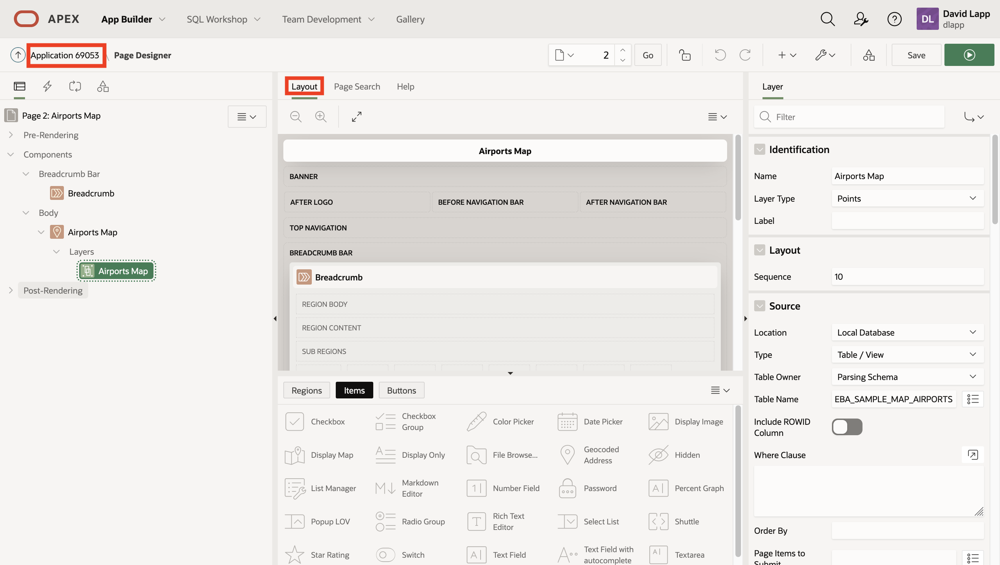

2. Click on **Create Page**.


1. You could select Map here to have the same wizard you saw in the Create App wizard. But this step is to create a map from scratch, for example if you had an existing page. Select **Blank Page** and then click **Next**. 
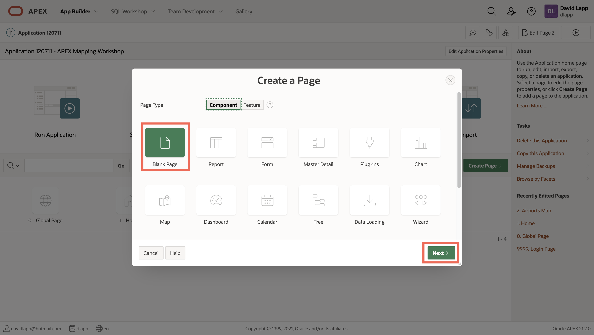

3. For name enter **Airports and States Map** and then click **Next**. 

   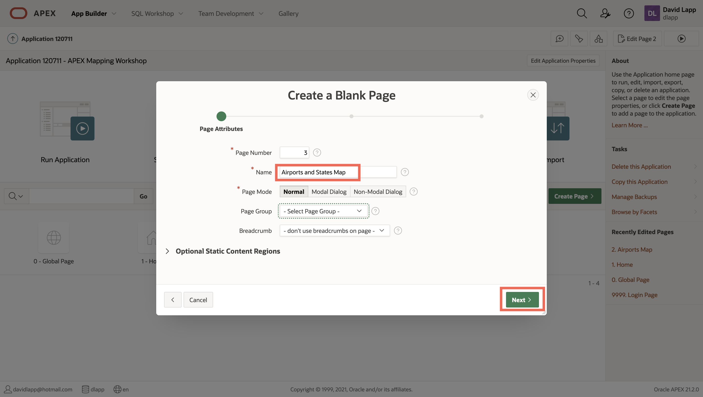

4. Select the option to create a new navigation menu entry and enter **Airports and States Map**, i.e. the same as the page name. Then click **Next**.
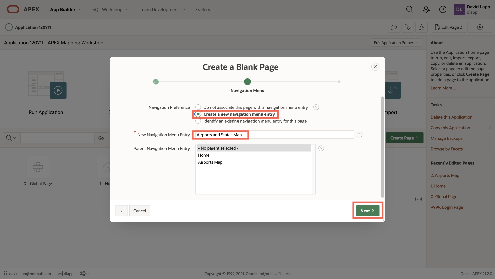

5. Review the summary and click **Finish**.
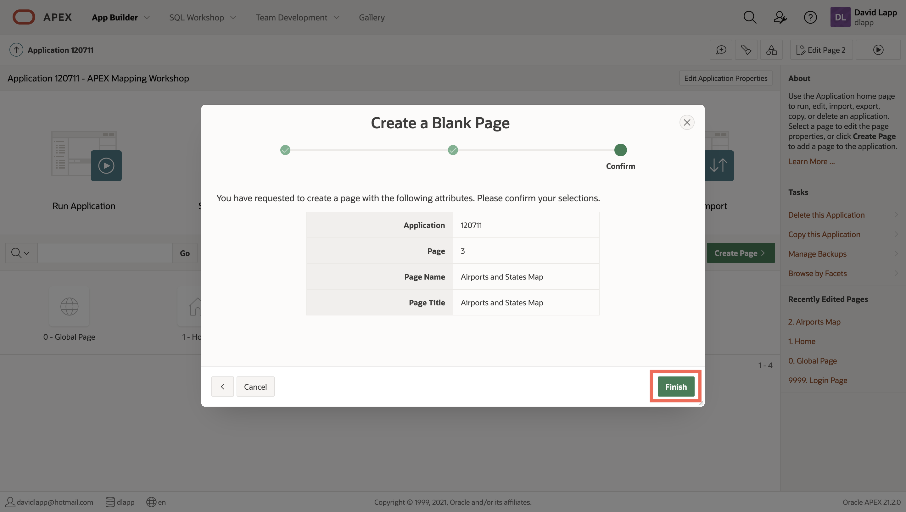

## Task 2: Add a Map to the Page

1. Drag **Map** from the Regions palette at the bottom and drop under the Body section of the page layout. Observe the Map Region appears in the Page tree under Body with default name New. Click on **New** in the Page tree and observe its properties on the right.  Observe the Region Type is Map.
    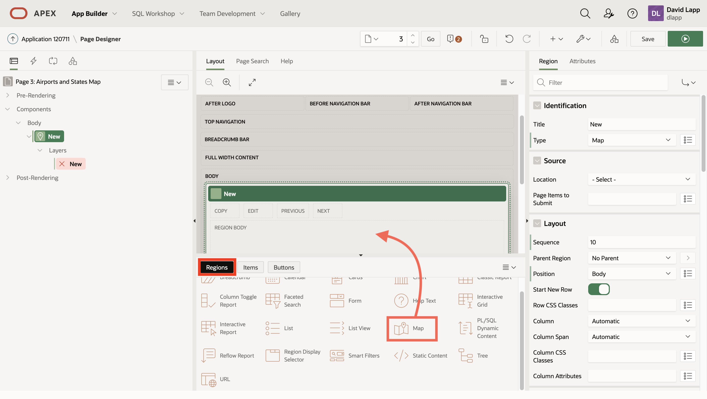

2. In the panel on the right, update the Region Title from New to a name of your choosing, for example **My Map Region**. Observe the title is updated in the page tree on the left.
    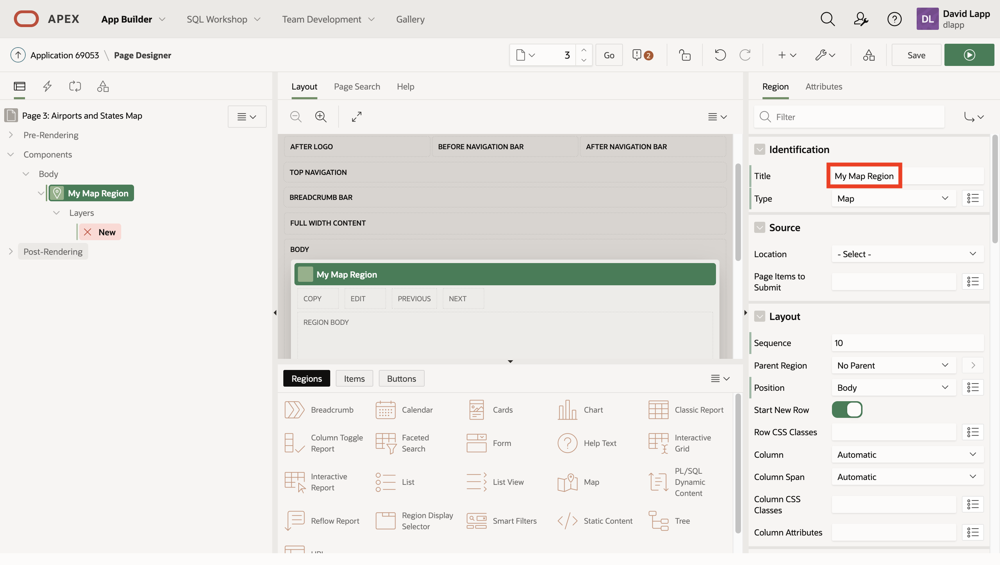

3. Observe that the Map Region includes a child element called Layers with a default Layer called New. Layers are the data driven content to be rendered on the map. Click on the Layer **New** in the page tree to see its properties in the right panel.
    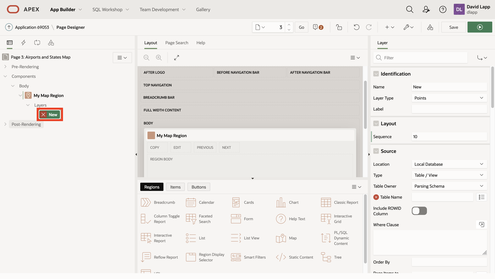

4. Update the Layer Name to **Airports** and the Type to **Points**. Observe the Layer Name update in the page tree on on the left.
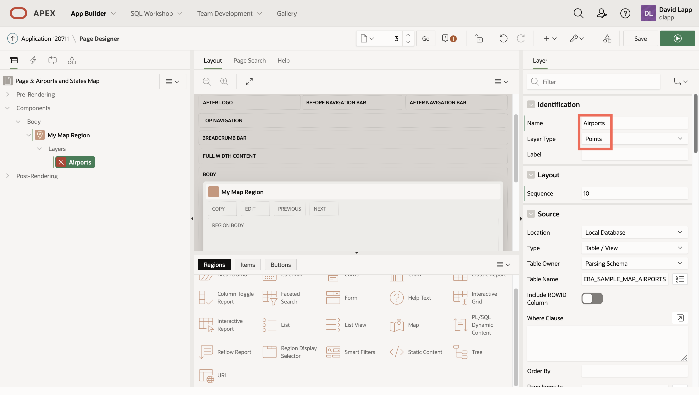

1. Scroll down in the Layer properties panel on the right. Update the **Source** to use the table **EBA\_SAMPLE\_MAP\_AIRPORTS** . To limit the airports rendered in the layer, add the where clause **LAND\_AREA\_COVERED > 2500**.  Enable the option Use Spatial Index using the switch.
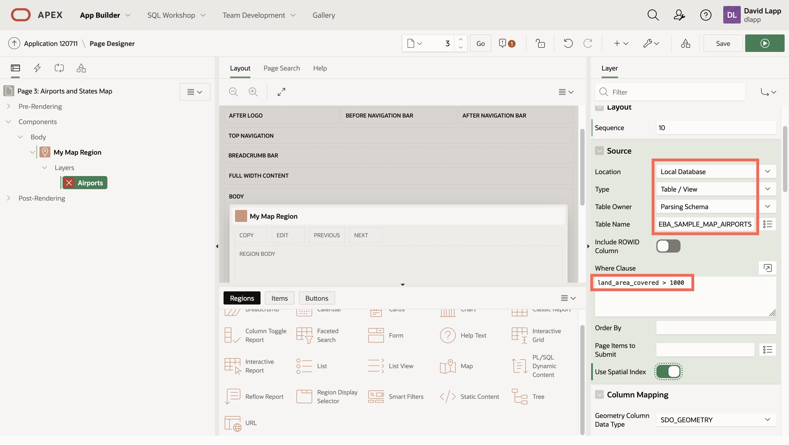


6. Scroll down in the Layer properties panel on the right to the **Column Mapping** section. This is where you configure the spatial column for rendering. Select geometry data type **SDO\_GEOMETRY** and geometry column **GEOMETRY**.
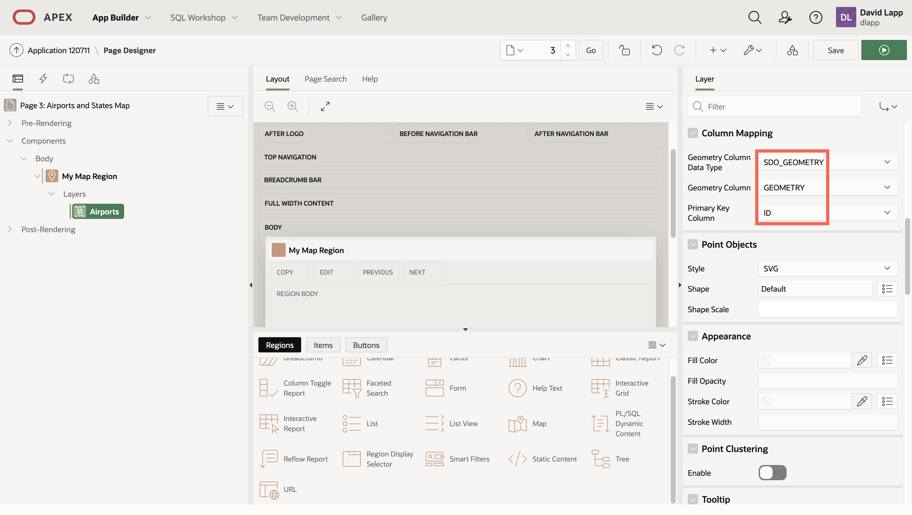

7. Scroll down in the Layer properties panel on the right to the **Info Window** section. This is where you can configure the content of a info window that pops up when clicking on an item in the map. Enable **Advanced Formatting** by clicking the switch button and then paste the following into the text area **HTML Expression**:
    ```
    <copy>
    <strong>&AIRPORT_NAME.</strong><br>
    &CITY., &STATE_NAME.<br>
    Code: &IATA_CODE.
    </copy>
    ```
    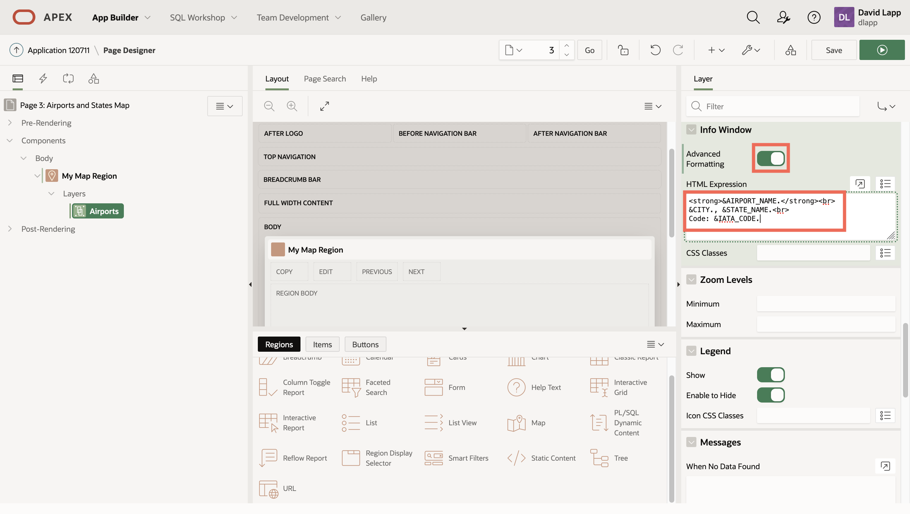

## Task 3: Add a Layer to the Map

1.   In the Page tree on the left, right-click on **Layers** under your Map Region and select **Create Layer**.  
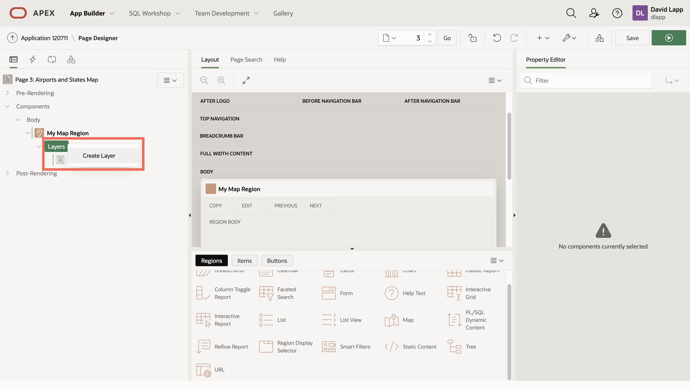

2.  Click on the newly created Layer in the Page tree under your Map Region. Then in the Layer details panel on the right, update the Name to **States**, Layer type to **Polygons**, and Source to **EBA\_SAMPLE\_MAP\_SIMPLE\_STATES**.
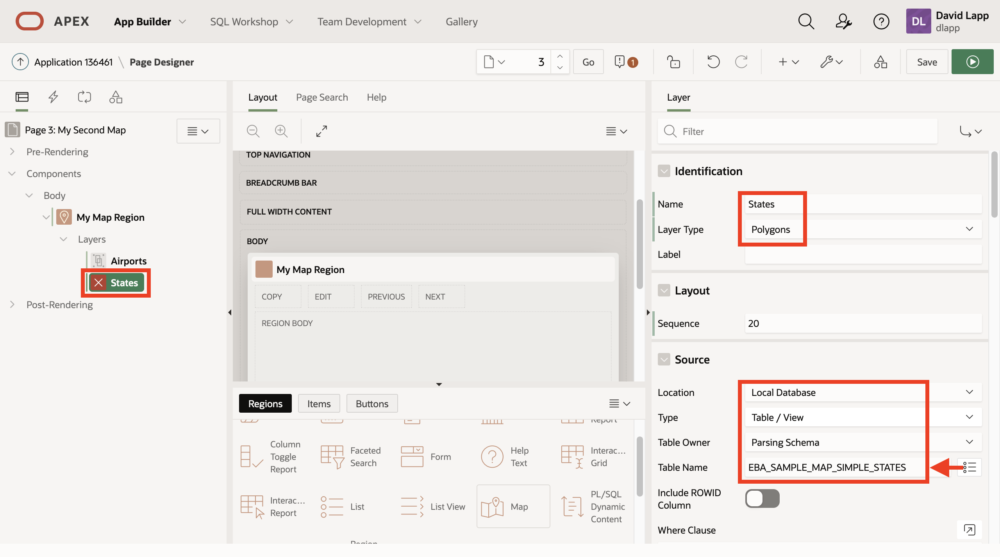

3.  Layers will be rendered in the order they appear under Layers in the page tree. To have Airports render on top States, drag the **States** layer above the Airports layer under Layers in the page tree. Scroll down in the Layer details panel on the right to the Column Mapping section section. Select geometry data type **SDO\_GEOMETRY** and geometry column **GEOMETRY**. Under Appearance, select a fill and stroke (outline) colors of your choosing. Set fill opacity to a value of your choosing, noting that a value of 1 means totally opaque so that the background map is not visible. 
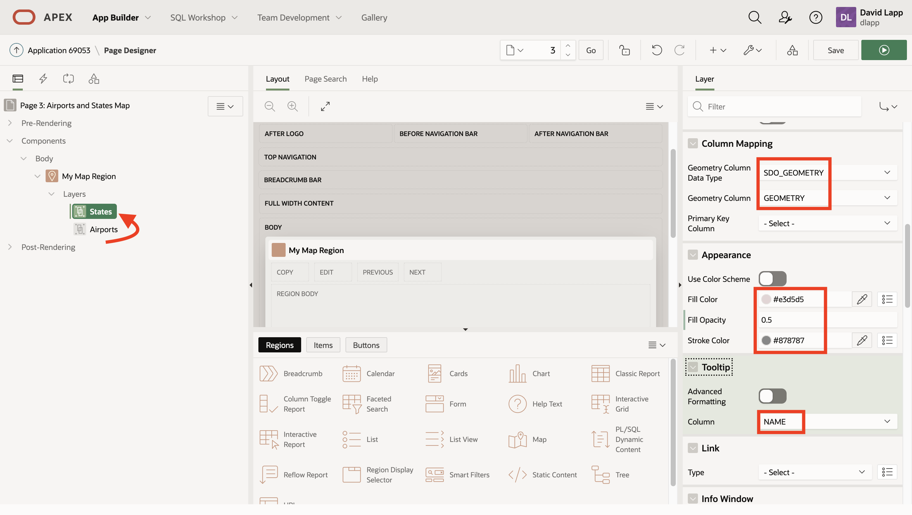

4.   At the upper right, click **Save** and then green **Run** button.
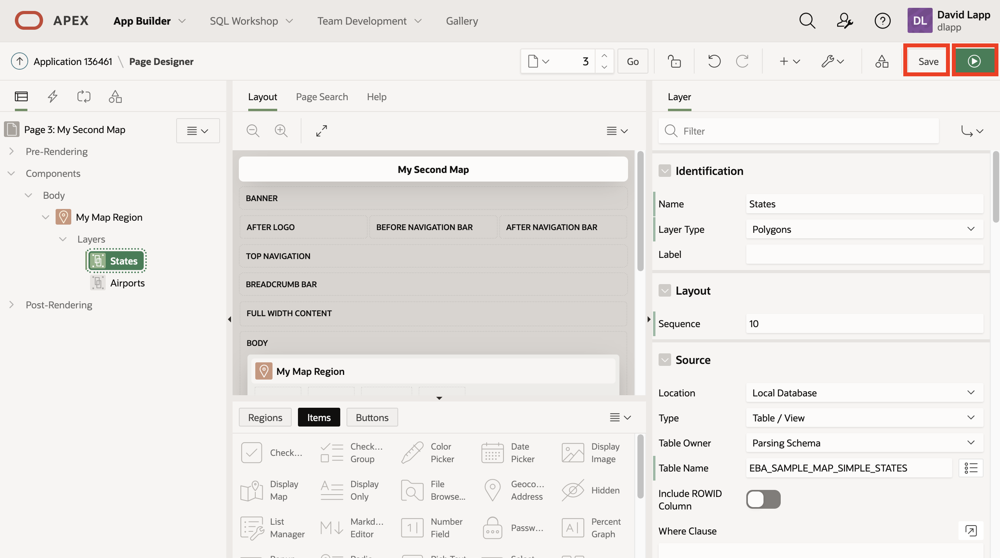

5. Observe your map render with States and Airports layers. Click and drag the map to pan, and use the navigation control at the top right to zoom in and out. Click on an Airport to see the info window that you configured. Mouse over a state to see the tooltip that you configured. Turn layers off and on with the checkboxes under the map.


Congratulations on creating your first map from scratch. In the next Lab you will incorporate spatial analysis into this map.


This concludes this lab. You may now proceed to the next lab.


## Acknowledgements
* **Author** - David Lapp, Database Product Management, Oracle
* **Last Updated By/Date**  - David Lapp, Database Product Management, February 2022

