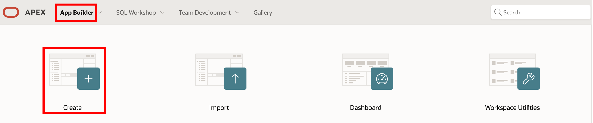
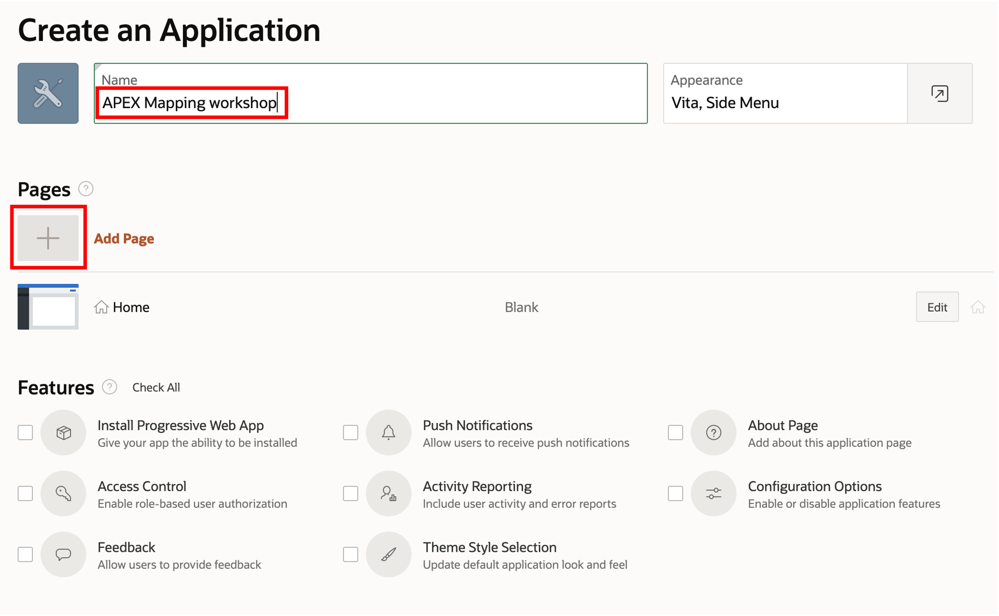
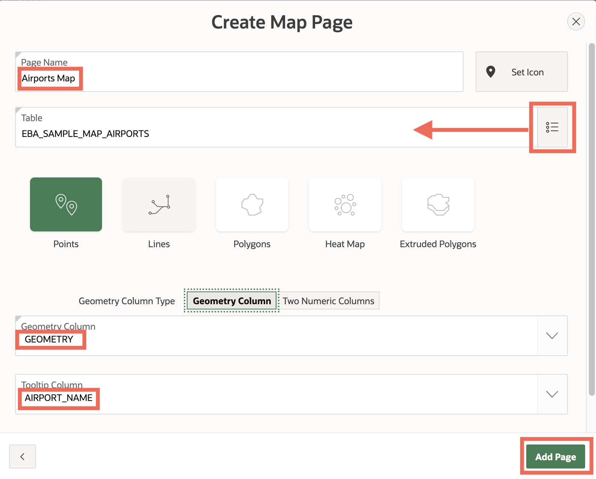
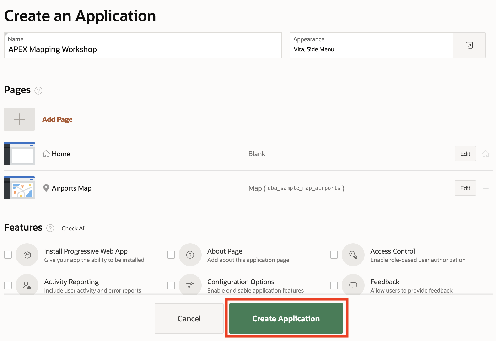
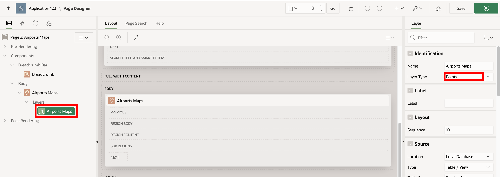
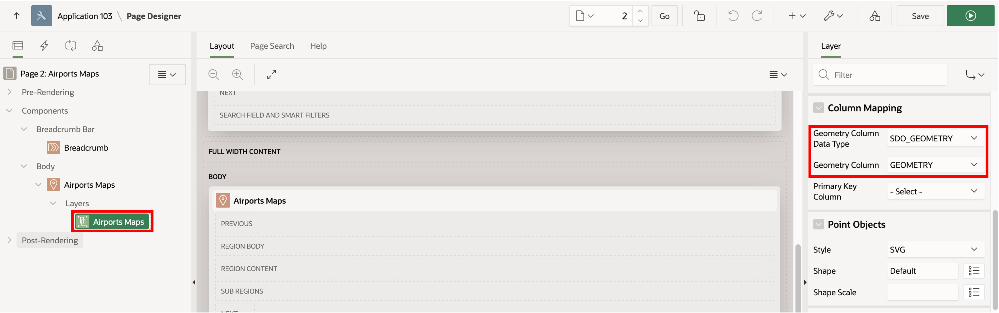

# Create Map with Wizard

## Introduction

Oracle APEX provides a wizard to create a variety of useful page types. In this lab you will use the wizard to create a new application and a page with a map. You then inspect the resulting page to gain an understanding of the Map Region.

Estimated Lab Time: 10 minutes

### Objectives

* Understand the basics of APEX Map Region

### Prerequisites

* Completion of Lab 1: Install Sample Maps application

## Task 1: Create a New App with a Map Page using the Wizard

The wizard provides a quick and easy way to create a new application and your first map. 

1. Navigate to **App Builder** and click **Create**.

2. Select **New Application**.

3. Enter a name for your application and click **Add Page**.

4. Select **Map** as the page type.  

**Note**: This is the same wizard as using  Create Page in an existing application.

5. Enter the Page Name **Airports Map**. (With this wizard, the Page Name will also be used as the name of the Map Region created in the page.)  Click the icon to the right of the table input to select the **EBA\_SAMPLE\_MAP\_AIRPORTS** table. For geometry column, select **GEOMETRY**, and finally select a column to use a tooltip when mousing over an item in the map.

6. Observe your new page is now listed under **Pages**. Click **Create Application**.

7. You are navigated to the page where you manage your new application. Click **Run Application**.

8. Sign in to your application using your APEX login username and password.

 
9. The default layout we selected for our application provides a home page with links to other pages. From the home page, navigate to the page you just created.

10. Observe the page includes an interactive map showing airport locations with tooltips as you configured.

## Task 2: Inspect the Map Page

You will now inspect the Map Region created by the wizard.

1. In the Developer Toolbar at the bottom of the page, click on the **Page 2** button to edit the page.

2. In the Page tree on the left, under **Body** click **Airports Map**. This is the title of the Map Region created by the Create Page wizard. It is, by default, the same as the Page title and can be changed as desired. In the Region details panel on the right, observe that this Region has a type of **Map**.  

3. Map Regions include Layers which are the points, lines, and polygons (from Oracle Spatial, GeoJSON, or coordinates)  displayed on top of a background map. When stepping through the Create Page wizard, you selected a Map using the GEOMETRY column in table EBA\_SAMPLE\_MAP\_AIRPORTS (i.e., Oracle Spatial data). So the wizard has created one layer containing those airport locations. By default the Layer has the same name as the Page, i.e. **Airports Map**. This can be changed as desired. 
   
   To inspect this Layer, in the Page tree on the left panel, under Layers click on **Airports Map**. Configuration details are displayed in the **Layer** panel on the right. For information about configuration items, click on the **Help** tab in the middle panel. When you then click on configuration items, help info is displayed for that item. For example click in the **Layer Type** menu to see help on its options. 

4. Scroll down in the Layer panel to see the other configuration options that were set by the wizard, including Column Mapping where the geometry data type is set. Here you are using Oracle's native spatial data type, SDO_GEOMETRY, and the column name is GEOMETRY.  

Congratulations on creating your first maps. There is a lot of capability beyond the basics you have just explored. Feel free to experiment with adjustments to parameters and then Save and Run to see results. In the next Lab you will configure a new Map Region from scratch. 

This concludes this lab. You may now proceed to the next lab.

## Acknowledgements
* **Author** - David Lapp, Database Product Management, Oracle
* **Last Updated By/Date**  - David Lapp, Database Product Management, February 2022

