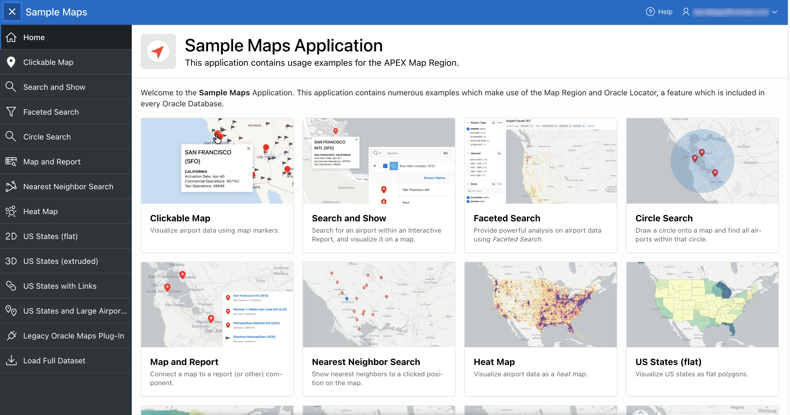

# Introduction

## About this Workshop

In this workshop you will explore mapping in Oracle APEX using the Map Region feature and Oracle Spatial. You will install and explore a pre-built sample application with many useful mapping examples. You will then create your own application with and configure maps both using a wizard and from scratch.

The Map Region is a native APEX feature introduced in APEX 21.1 providing the ability to configure interactive maps displaying spatial data from Oracle Spatial, GeoJSON, and coordinates. This workshop focuses on using Oracle Spatial as the spatial data source, so that both raw spatial data and spatial analysis results be easily incorporated.

Estimated Workshop Time: 1 hour 15 minutes

### About Oracle Application Express (APEX) and Oracle Spatial

Oracle Application Express (APEX) and Oracle Spatial are features of Oracle Database, including the Autonomous Data Warehouse (ADW) and Autonomous Transaction Processing (ATP) services. 

Oracle Application Express (APEX) is a low-code development platform that enables you to build scalable, secure enterprise apps, with world-class features, that can be deployed anywhere. More at [https://apex.oracle.com] (https://apex.oracle.com)

Oracle Spatial is a set of geospatial data management, analysis, and processing capabilities within Oracle Database. With a native spatial data type and analysis operations, location-based analysis is mainstream and co-located with all other database operations. More at [https://www.oracle.com/database/spatial] (https://www.oracle.com/database/spatial)

### Objectives

  - Understand APEX Map Region samples
  - Learn to create and configure Map Region
  - Learn to incorporate location analysis with Oracle Spatial

### Prerequisites

  - Oracle APEX 21.1+ is required. However Oracle APEX 21.2 is recommended, as the steps and screen shots in this workshop are taken from APEX 21.2. If performing this workshop with APEX 21.1, then please expect occasional small differences in the user interface.
  - Basic experience with Oracle APEX is recommended, though not required. If needed, review the following introductory LiveLabs APEX workshop: [Creating an App based on Existing Tables for Oracle Autonomous Cloud Service](https://apexapps.oracle.com/pls/apex/dbpm/r/livelabs/view-workshop?wid=628). 
  - Basic experience with Oracle Spatial is recommended, though not required. If needed review the following introductory LiveLabs Spatial workshop: [Introduction to Oracle Spatial]( https://apexapps.oracle.com/pls/apex/dbpm/r/livelabs/view-workshop?wid=736)

*Note: If you have a **Free Trial** account, when your Free Trial expires your account will be converted to an **Always Free** account. You will not be able to conduct Free Tier workshops unless the Always Free environment is available. **[Click here for the Free Tier FAQ page.](https://www.oracle.com/cloud/free/faq.html)***

## Acknowledgements
* **Author** - David Lapp, Database Product Management, Oracle
* **Contributors** - Jayson Hanes, APEX Product Management, Oracle
* **Last Updated By/Date** - David Lapp, February 2022

## Need Help?
Please submit feedback or ask for help using our [LiveLabs Support Forum](https://community.oracle.com/tech/developers/categories/oracle-spatial). Please click the **Log In** button and login using your Oracle Account. Click the **Ask A Question** button to the left to start a *New Discussion* or *Ask a Question*.  Please include your workshop name and lab name.  You can also include screenshots and attach files.  Engage directly with the author of the workshop.

If you do not have an Oracle Account, click [here](https://profile.oracle.com/myprofile/account/create-account.jspx) to create one. 
