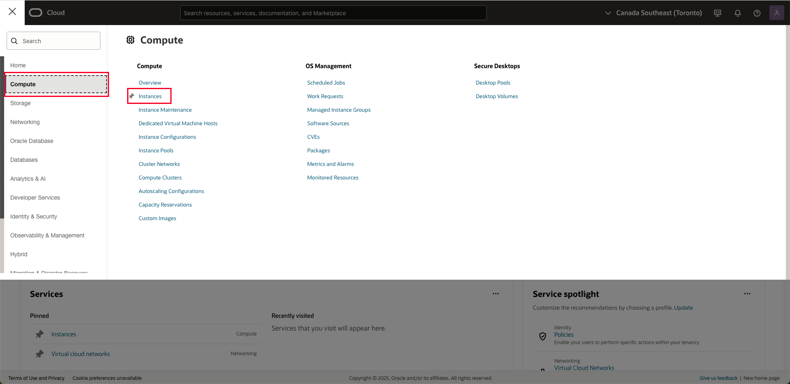

# Access JupyterLab

## Introduction

Notebooks are interactive documents for code, descriptive text, and visualizations. In this workshop you use open source JupyterLab which provides a web-based notebook environment with many user-friendly features such as file uploading.

Estimated Lab Time: 5 minutes

### Objectives

* Verify access to JupyterLab
* Explore notebook functionality
* Select option for performing remainder of hands-on lab

## Task 1: Retrieve IP address for JupyterLab

1. From the main menu, navigate to Compute > Instances

  

2. In the workshop instructions page, click **View Login Info** at the top left and copy your Compartment name.

  
  
3. In the OCI console, paste in your Compartment name and select it from the pull-down. 

  

4. Note the Public IP of your compute instance. JupyerLab has been set on on this instance. You will use this later in this and other Labs.

  

## Task 2: Verify access to JupyterLab 

1. Open a new browser tab and enter the URL **http://[IP address]:8001/lab** where [IP address] is the address retrieved in Task 1. 
   
    

2. Enter the password **livelabs** and click **Log in**. 
   
## Task 3: Explore Jupyter Notebooks

Jupyter Notebook is an interactive web-based tool that allows you to create and share documents that contain live code, equations, visualizations, and text. It is widely used in the data science community for prototyping and data analysis.

In this task, we will walk through the basics of using Jupyter Notebook.

1. Create a new notebook.

   When your Jupyter environment loads, you should see a launcher tab open.

   

   If you do not see the launcher window, select file at the top left of the window, and select 'New Launcher'.

    

   From the launcher window, select  "Python 3" to create a new notebook using the Python programming language. A new notebook will be created, and you can start working on it by entering code in the code cells or adding markdown text in the markdown cells.

    

2. Add some markdown Text.

   Click on the code cell and use the use the cell type drop down to select 'Markdown'

   

   Paste the following in the cell and click the play button on the tool bar, or press Shift+Enter to run the cell.

   	```
   	<copy>
   	# My First Notebook
   	This is my first Jupyter notebook
   	</copy>
   	``` 

   

3. Write some Python code. Paste the following into the next cell and run it. The phrase, 'Hello, World!' should appear below the cell.

	```
	<copy>
	print('Hello, World!')
	</copy>
	
	```

   

4. To save a Jupyter Notebook, click on the "Save" icon on the toolbar, or press Ctrl+S (or Cmd+S on macOS). The notebook will be saved with the .ipynb file extension.

## Acknowledgements

* **Author** - David Lapp, Database Product Management, Oracle
* **Contributors** - Rahul Tasker, Denise Myrick, Ramu Gutierrez
* **Last Updated By/Date** - Denise Myrick, February 2025
