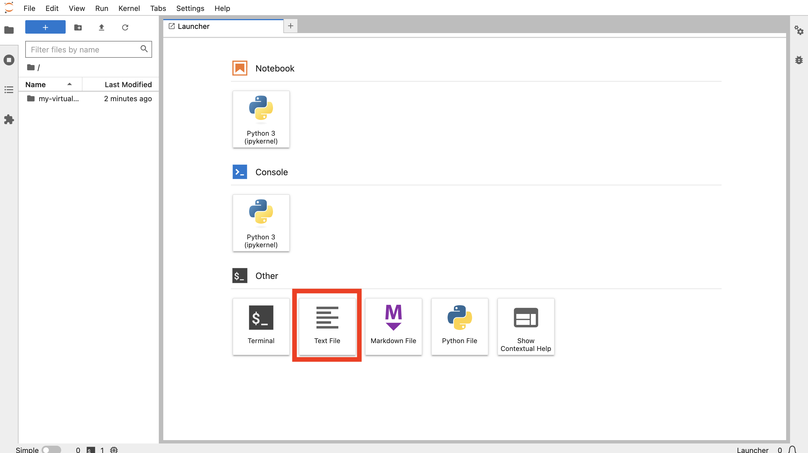

# Connect to ADB


## Introduction

...

Estimated Lab Time: xx minutes

### Objectives

* 

### Prerequisites

* 

## Task 1: Create files with connection parameters

1. In JupyterLab, click on the Text File tile to create a new text file. 
  

2. Enter your ADB ADMIN user password. Then from the File menu select **Save Text**. When prompted enter **my-pwd.txt** as your file name.
  

3. When prompted enter **my-pwd.txt** as your file name.
  

4.  Close the text file tab to return to the Launcher.
   

5. Return to your Oracle Cloud browser tab and minimize Cloud Shell.
  

1. Click on **Database Connection**.
  

1. Scroll down to the Connection Strings section. For TLS Authentication, select **TLS**. Then Under Connection String click **Copy** for the TNS Name ending in \_low.
  

1. Return to your JupyterLab browser tab. As done previously, click on the Text File tile to create another new text file. Paste the connection string just copied from yor ADB. Then save the file as **my-dsn.txt**. Then close the text file tab to return to the Launcher.
  

## Task 2: Create notebook and connect to ADB

1. From the Launcher, click the **Python 3** tile to create a new notebook.
  

1. In the first cell, paste the following statement and then click the **run** button. This loads the python-oracedb module which handles interaction with Oracle Database.

     ```
     <copy>
     import oracledb
     import csv
     oracledb.defaults.fetch_lobs = False
     </copy>
     ```
     

2. In the next cell, paste the following statements and then click the **run** button. This loads your ADB password and DSN into variables

     ```
     <copy>
     # Get ADB password and DSN from file
     my_pwd = open('./my-pwd.txt','r').readline().strip()
     my_dsn = open('./my-dsn.txt','r').readline().strip()
     </copy>
     ```
     

3. In the next cell, paste the following statements and then click the **run** button. This creates a connection to your ADB.

     ```
     <copy>
     # Create database connection and cursor
     connection = oracledb.connect(user="admin", password=my_pwd, dsn=my_dsn)
     cursor = connection.cursor()
     </copy>
     ```
     

3. In the next cell, paste the following statements and then click the **run** button. This runs a test query to verify successful connection to ADB.

     ```
     <copy>
     # Run a test query
     cursor.execute("select object_type, count(*) from all_objects group by object_type")
     for row in cursor.fetchmany(size=10):
       print(row)
     </copy>
     ```
     


4. Right-click on your notebook in the left panel and select **Rename**.

     


5. Enter **my-notebook** (or a name of your choosing). Observe the notebook name is changed.

     

You may now proceed to the next lab.

## Learn More
* 

## Acknowledgements
* **Author** - 
