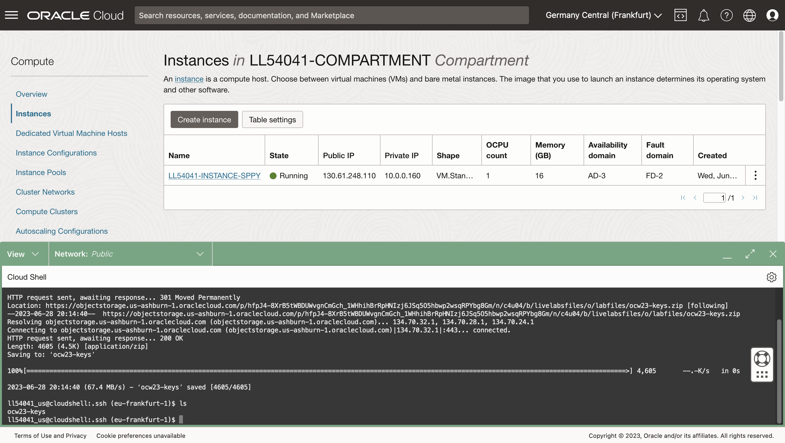

# Connect to compute

## Introduction

In order to access your Python host compute, you need a SSH key pair. Oracle Cloud Infrastructure (OCI) Cloud Shell is a web browser-based terminal accessible from the Oracle Cloud Console providing access to a Linux shell. You will will retrieve a SSH key pair and connect to your Python host in OCI Cloud Shell.

Estimated Lab Time: 5 minutes

Watch the video below for a quick walk-through of the lab.
[Lab 1](videohub:1_0tvxm2q0)

### Objectives

* Retrieve compute IP address
* Retrieve SSH key pair
* Create SSH connection to compute

### Prerequisites

* You must be logged in to the OCI console

## Task 1: Retrieve IP address of compute instance

1. From the main menu, navigate to Compute > Instances

  

2. In the workshop instructions page, click **View Login Info** at the top left and copy your Compartment name.

  
 
 
 1. In the OCI console, paste in your Compartment name and select it from the pull-down. 

  


 4. Note the Public IP of your compute instance. You will use this later in this and other Labs. 

  

## Task 2: Retrieve SSH keys
   
1. Open cloud shell.

   

1. If prompted to run tutorial, type N and enter.

   
   
3. At the command line, run each of following to create and navigate to your SSH folder.
   
     ```
    <copy>
     mkdir ~/.ssh
    </copy>
    ```
         ```
    <copy>
    cd ~/.ssh
    </copy>
    ```
 
  


1. At the command line, run the following to retrieve and list a zip file containing SSH keys.  

    ```bash
    <copy>
    wget https://objectstorage.us-ashburn-1.oraclecloud.com/p/hfpJ4-8XrB5tWBDUWvgnCmGch_1WHhihBrRpHNIzj6JSq5O5hbwp2wsqRPYbg8Gm/n/c4u04/b/livelabsfiles/o/labfiles/ocw23-keys.zip
    </copy>
    ```

    ```
    <copy>
    ls
    </copy>
    ```
   


2. At the command line, run the following to unzip and list the zip file contents.  

     ```
    <copy>
    unzip ocw23-keys
    </copy>
    ```

    ```
    <copy>
    ls
    </copy>
    ```
 
  

## Task 3: Connect to compute instance

2. At the command line, run the following to connect to your Python compute instance, where IP Address is the compute IP Address from Task 1.  

      ```
      <copy>
       ssh -i ~/.ssh/ocw23-rsa opc@[IP address]
      </copy>
      ```
      If prompted to add to the list of known hosts, reply with **yes**.
    
     


3. Click the collapse icon to minimize Cloud Shell.

   

4. Observe the Restore button to reopen Cloud Shell. You will reopen Cloud Shell in a subsequent Lab.

   


You may now **proceed to the next lab**.

## Acknowledgements

- **Author** - David Lapp, Database Product Management, Oracle
- **Contributors** - Rahul Tasker, Denise Myrick, Ramu Gutierrez
- **Last Updated By/Date** - David Lapp, August 2023