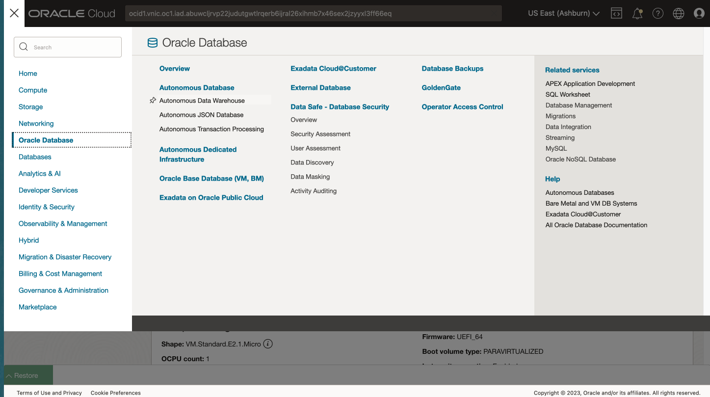
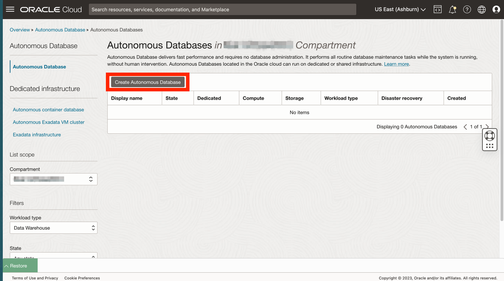
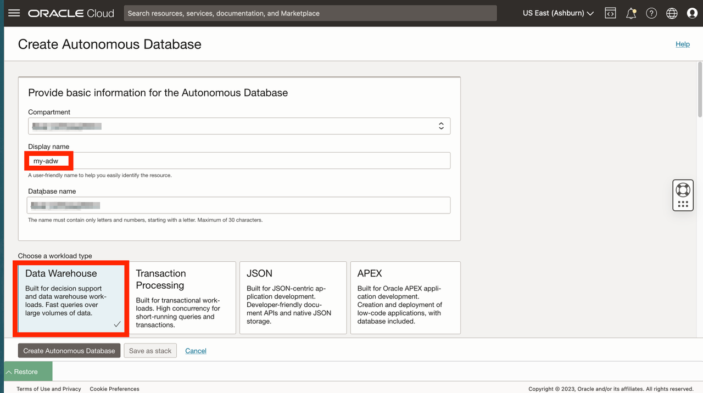
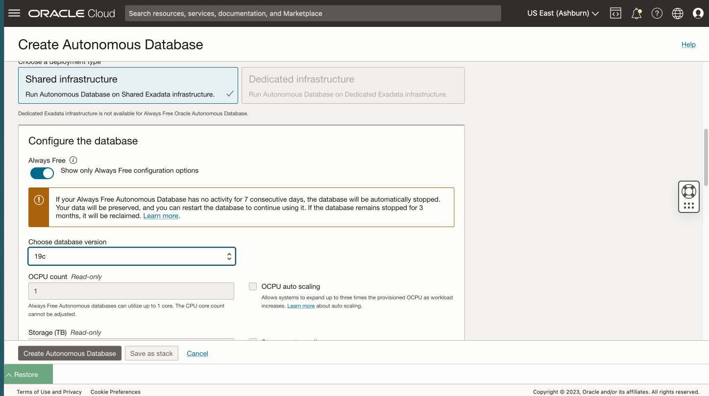
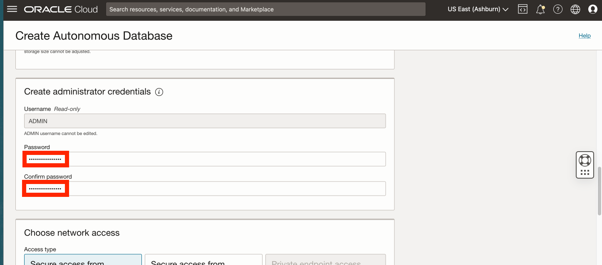
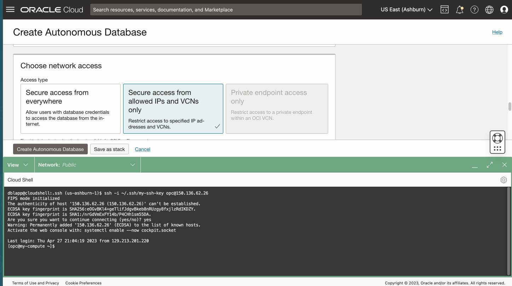
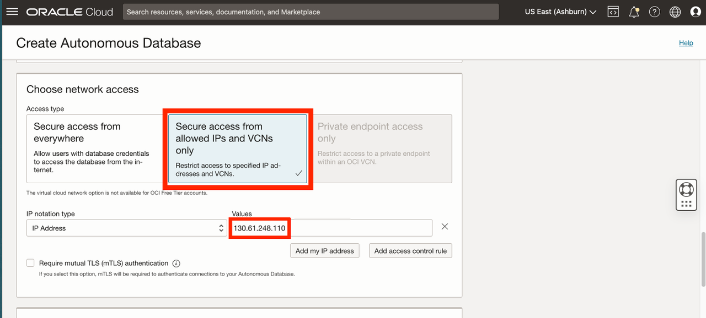
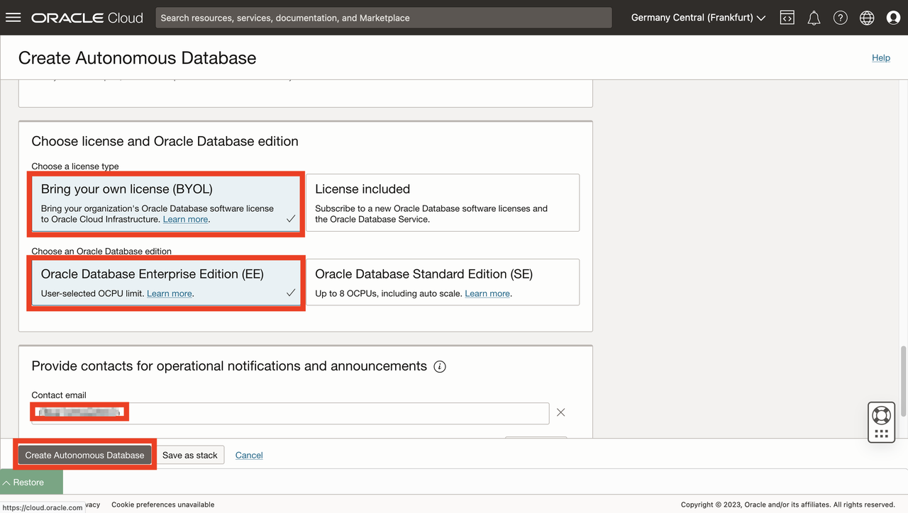
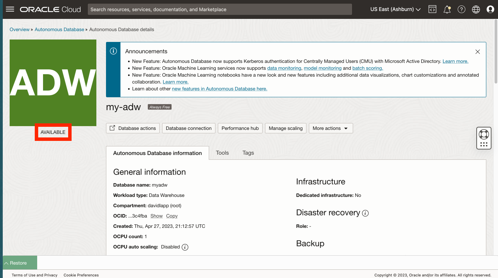
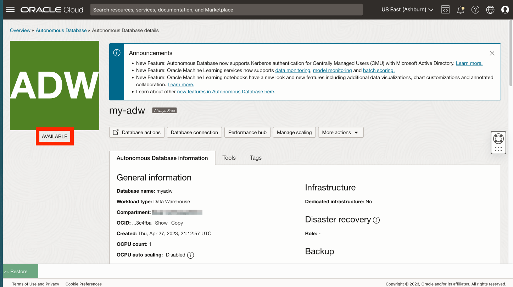

# Create Autonomous Database

## Introduction

Oracle Autonomous Database is a self-driving, self-securing, self-repairing database service, including Oracle Spatial, with offerings for data warehousing and transaction processing workloads. You do not need to configure or manage any hardware, or install any software. Oracle Cloud Infrastructure handles creating the database, as well as backing up, patching, upgrading, and tuning the database. As this workshop focuses on an analytic use case, you create an Autonomous Date Warehouse (ADW).

Estimated Lab Time: 5 minutes

Watch the video below for a quick walk-through of the lab.
[Lab 2](videohub:1_jim8q75y)

### Objectives

* Create an Autonomous Database instance 

### Prerequisites

* Completion of Lab 1: Connect to compute

## Task 1: Create Autonomous Database

1. From the main navigation panel select **Oracle Database**, then select **Autonomous Database**.
  

<if type="freetier">
2. Select root or other compartment, then click **Create Autonomous Database**.
</if>
<if type="ocw23-sandbox">
1. Your Compartment should still be selected. If not then re-select it. Then click **Create Autonomous Database**. 
   
</if>

   

1. For display name enter **my-adw** and for database name enter **myadw**. Leave workload type as Data Warehouse. 

   <if type="ocw23-sandbox">
   **Note:** You must select workload type Data Warehouse. Selecting Transaction Processing will result in a quota error. 
   </if>

    

2. For deployment type leave the default **Serverless**. Also leave the defaults for version (19c), ECPU count (2), and storage (1TB). Then scroll down.
    

3. Enter and confirm a password for the database ADMIN user. In the next step you will need the IP address of your compute instance. This is because you will be creating to a connection from Python to Autonomous Database using a simple method that does not require an Oracle Client install or Cloud Wallet. To use this method you must pre-configure your Autonomous Database to allow access from the Python host compute. Click on the restore button to expand Cloud Shell.
    

4. Copy the IP address from your SSH command. Then collapse the Cloud Shell.

  

7. For network access, select **Secure access from allowed IPs and VCNs only**. Under Values, paste your compute IP address.
  

8. In the next section select **Bring your own license (BYOL)** and **Oracle Database Enterprise Edition (EE)**.  For contacts, enter your email address. Then click **Create Autonomous Database**.
 

8. ADB provisioning will begin.
  

9. When provisioning is complete your ADB is ready.
  

You may now **proceed to the next lab**.

## Acknowledgements

- **Author** - David Lapp, Database Product Management, Oracle
- **Contributors** - Rahul Tasker, Denise Myrick, Ramu Gutierrez
- **Last Updated By/Date** - David Lapp, August 2023