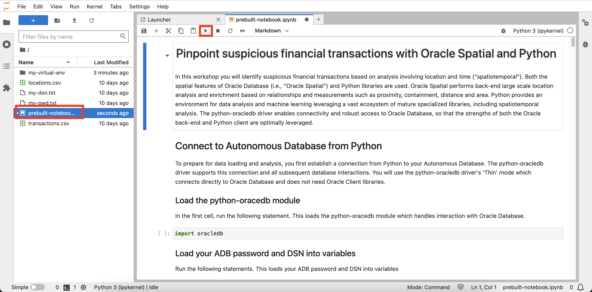

# Create Autonomous Database

## Introduction

Oracle Autonomous Database is a self-driving, self-securing, self-repairing database service, including Oracle Spatial, with offerings for data warehousing and transaction processing workloads. You do not need to configure or manage any hardware, or install any software. Oracle Cloud Infrastructure handles creating the database, as well as backing up, patching, upgrading, and tuning the database. As this workshop focuses on an analytic use case, you create an Autonomous Date Warehouse (ADW).

Estimated Lab Time: 5 minutes

### Objectives

* Create an Autonomous Database instance 

### Prerequisites

* Completion of Lab 1: Access JupyterLab

## Task 1: Create Autonomous Database

1. From the main navigation panel select **Oracle Database**, then select **Autonomous Database**.
  

1. Your Compartment should still be selected. If not then re-select it. Then click **Create Autonomous Database**. 

   

1. For display name enter **my-adw**. Leave the database name as the default value. Leave workload type as Data Warehouse. 

   **Note:** You must select workload type Data Warehouse. Selecting Transaction Processing will result in a quota error. 

    

2. For deployment type leave the default **Serverless**. Also leave the defaults for version (19c), ECPU count (2), and storage (1TB). Then scroll down.
    

3. Enter and confirm a password for the database ADMIN user. Then scroll down.
    

4. In the next lab, you will be creating to a connection from Python to Autonomous Database using a simple method that does not require an Oracle Client install or Cloud Wallet. To use this method you must pre-configure your Autonomous Database to allow access from the compute instance hosting Python. For network access, select **Secure access from allowed IPs and VCNs only**. Under Values, enter the compute IP address from Lab 1 Task 1.
  

1. In the next section select **Bring your own license (BYOL)** and **Oracle Database Enterprise Edition (EE)**.  For contacts, enter your email address. Then click **Create Autonomous Database**.
 

1. ADB provisioning will begin.
  

1. When provisioning is complete your ADB is ready.
  

## Task 2: Select option for performing the remainder of this hands-on lab

The remainder of this hands-on lab may be performed using either of the following options:

**Option 1:** Follow instructions to copy/paste/run each step into your notebook.

   1. Proceed to **Lab 3** and then subsequent labs.

**Option 2:** Load a pre-built notebook with all steps and run each cell. 
   
   1. Perform **Lab 3 - Task 1** 
   2. Perform **Lab 4 - Task 1**
   3. Perform **Lab 6 - Task 4 - Steps 5-6**
   4. Click the following link to download the pre-built notebook to you laptop:
     * [prebuit-notebook.ipynb](../access-jupyterlab/files/prebuilt-notebook.ipynb) 

   5. Click the upload button and select the prebuilt notebook.
     
     

   6. Double-click on the prebuilt notebook to open it and run each cell.

     

## Acknowledgements

- **Author** - David Lapp, Database Product Management, Oracle
- **Contributors** - Rahul Tasker, Denise Myrick, Ramu Gutierrez
- **Last Updated By/Date** - David Lapp, August 2023