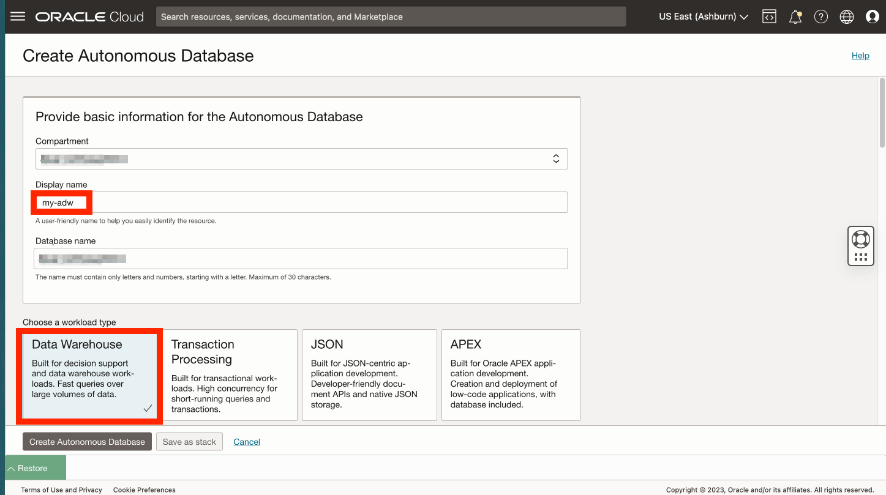

# Create adb

## Introduction

...

Estimated Lab Time: xx minutes

### Objectives

* 

### Prerequisites

* 

## Task 1: ... 

1. Navigate to Oracle Database...
  

2. Select root or other compartment, then click **Create Autonomous Database**...
   

3. For display name enter **my-adw** and for database name enter **myadw**. Leave workload type as Data Warehouse.
    

4. For database version select **19c**.
    

5. Enter and confirm a password for the database ADMIN user. In the next step you will need the IP address of your compute instance. Click on the restore link to expand Cloud Shell.
    

6. Copy the IP address from your SSH command. Then collapse the Cloud Shell.

  

7. For network access, select **Secure access from allowed IPs and VCNs only**. Under Values, paste your compute IP address. Then click **Create Autonomous Database**.
  

