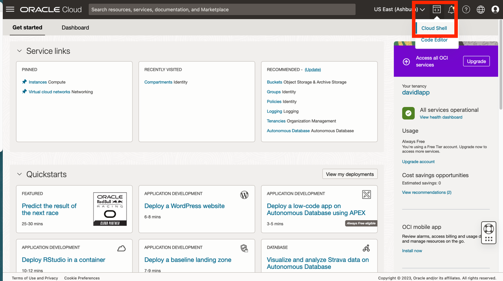
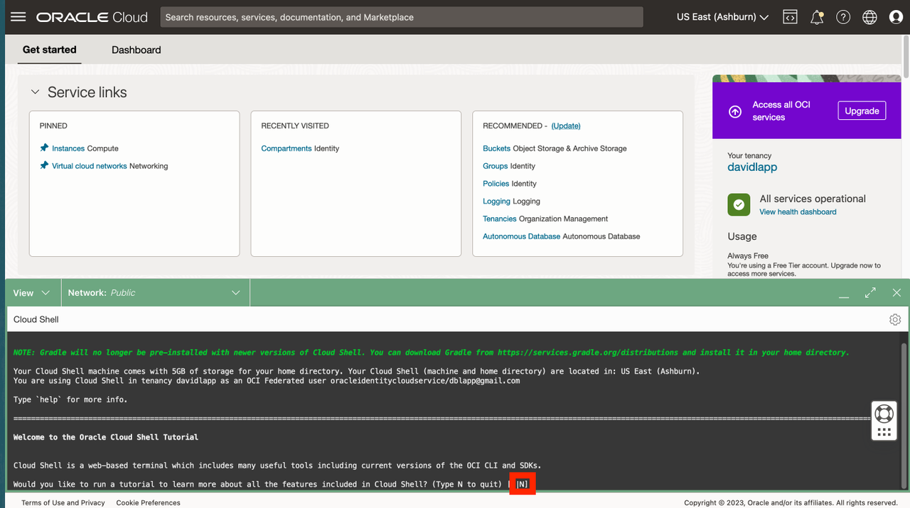
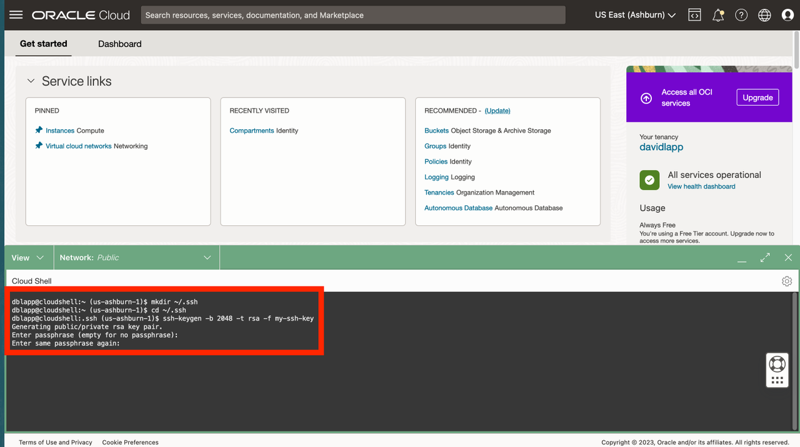
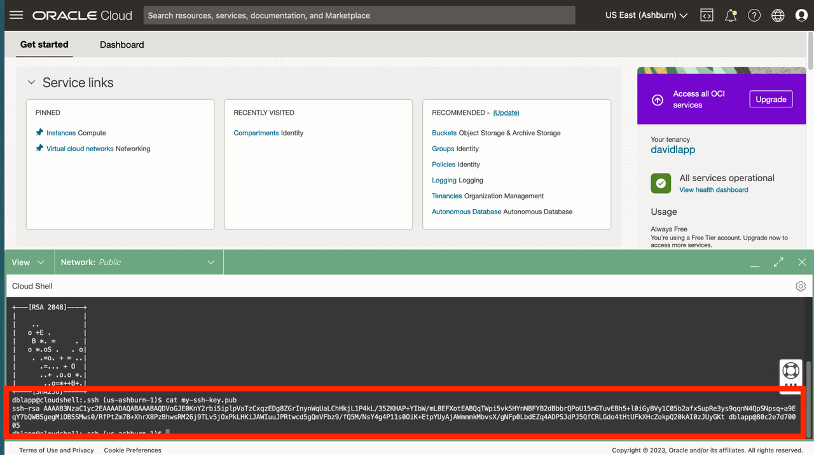
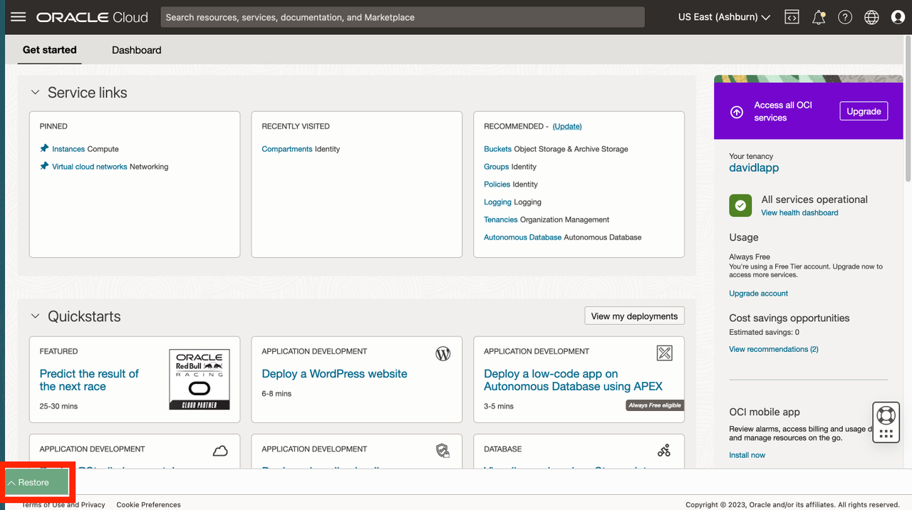

# Create SSH keys in Cloud Shell


## Introduction

In order to access your Python host compute, you will need a SSH key pair. Oracle Cloud Infrastructure (OCI) Cloud Shell is a web browser-based terminal accessible from the Oracle Cloud Console providing access to a Linux shell. You will will create your SSH key pair in OCI Cloud Shell.

Estimated Lab Time: xx minutes

### Objectives

* Create SSH key pair using OCI Cloud Shell.

### Prerequisites

* Logged in to OCI console.

## Task 1: Create SSH key pair
   
1. Open cloud shell
  

2.  When prompted to run tutorial, type N and enter.
    
   
3. At the command line, run each of following to create your SSK keys.
   
     ```
    <copy>
     mkdir ~/.ssh
    </copy>
    ```
         ```
    <copy>
    cd ~/.ssh
    </copy>
    ```

    ```
    <copy>
    ssh-keygen -b 2048 -t rsa -f my-ssh-key
    </copy>
    ```
    When prompted for passphrase, you may click enter for no passphrase and repeat to confirm.  
  

4. At the command line, run the following to view your public key. You will use this in a subsequent step.

     ```
    <copy>
     cat ~/.ssh/my-ssh-key.pub
    </copy>
    ```
   

5. Click the collapse icon to minimize Cloud Shell.

   

6. Observe the Restore button to reopen Cloud Shell. You will reopen Cloud Shell in a subsequent step.

   


You may now **proceed to the next lab**.

## Acknowledgements

- **Author** - David Lapp, Database Product Management, Oracle
- **Last Updated By/Date** - David Lapp, Database Product Management, June, 2023