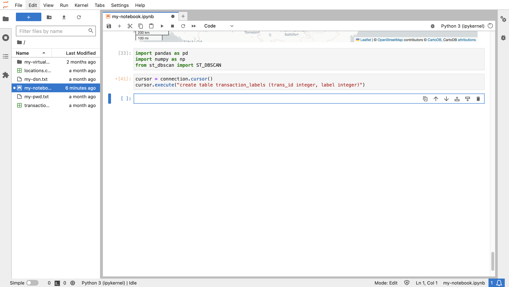

# Detect suspicious transactions


## Introduction

The spatial features of Oracle Database provide scalable and secure spatial data management, processing, and analysis. A major benefit of working in Python is the availability of open source libraries to augment the native analysis capabilities of the Oracle Database. In this lab you leverage a library that identifies clusters based on both space and time, or in other words spatiotemporal clusters. A set of transactions that occurred within a concentrated area and time window belong to a spatiotemporal cluster. A transaction that occurred within the time window of a spatiotemporal cluster but far from the area of concentration is considered suspicious. For example, if during a given week a customer's transactions were concentrated in the New York City area, then a transaction in the middle of that week in California would be suspicious. You will identify such occurrences in this lab.

Estimated Lab Time: 15 minutes

### Objectives

* Load transactions data from Oracle Spatial to Python
* Detect spatiotemporal clusters representing expected behavior
* Identify outliers that represent suspicious behavior

### Prerequisites

* Completion of previous lab

## Task 1: Experiment with spatial aggregation 

To calculate the distance of transactions from a spatiotemporal cluster, it is convenient to represent the cluster as a single geometry. This is a use case for spatial aggregation, where a set of geometries is represented by a single aggregate. Oracle Spatial provides a package of spatial aggregate functions for just this purpose. This task is meant to familiarize you with spatial aggregation. 

1. Begin by creating a GeoDataFrame of items from the **LOCATIONS** table locations within 10 miles of a longitude/latitude coordinate in Austin, TX (-97.7431,30.2672).

      ```
      <copy>
      cursor = connection.cursor()
      cursor.execute("""
       SELECT (lonlat_to_proj_geom(lon,lat)).get_wkt() as geometry
       FROM locations 
       WHERE sdo_within_distance(
                 lonlat_to_proj_geom(lon,lat),
                 lonlat_to_proj_geom(-97.7431,30.2672),
                 'distance=10 unit=MILE') = 'TRUE'
             """)
      gdfPoints = gpd.GeoDataFrame(cursor.fetchall(), columns = ['geometry'])
      gdfPoints['geometry'] = shapely.from_wkt(gdfPoints['geometry'])
      gdfPoints = gdfPoints.set_crs(3857)
      gdfPoints.head()
      </copy>
      ```

    

2. Next create a GeoDataFrame containing the location in the center of the previously selected locations. This location is referred to as an "aggregate centroid", hence the GeoDataFrame is named gdfAggCent.
   
      ```
      <copy>
      cursor.execute("""
       SELECT SDO_AGGR_CENTROID(
                SDOAGGRTYPE(lonlat_to_proj_geom(lon,lat), 0.005)).get_wkt() as geometry
       FROM locations 
       WHERE sdo_within_distance(
                 lonlat_to_proj_geom(lon,lat),
                 lonlat_to_proj_geom(-97.7431,30.2672),
                 'distance=10 unit=MILE') = 'TRUE'
             """)
      gdfAggCent = gpd.GeoDataFrame(cursor.fetchall(), columns = ['geometry'])
      gdfAggCent['geometry'] = shapely.from_wkt(gdfAggCent['geometry'])
      gdfAggCent = gdfAggCent.set_crs(3857)
      gdfAggCent
      </copy>
      ```

    

3. Next create a GeoDataFrame containing the shape that bounds the locations near the coordinate in Austin, TX. This is referred to as a "aggregate convex hull", hence the GeoDataFrame is named gdfAggHull.

      ```
      <copy>
      cursor.execute("""
       SELECT SDO_AGGR_CONVEXHULL(
                SDOAGGRTYPE(lonlat_to_proj_geom(lon,lat), 0.005)).get_wkt() as geometry
       FROM locations 
       WHERE sdo_within_distance(
                 lonlat_to_proj_geom(lon,lat),
                 lonlat_to_proj_geom(-97.7431,30.2672),
                 'distance=10 unit=MILE') = 'TRUE'
             """)
      gdfAggHull = gpd.GeoDataFrame(cursor.fetchall(), columns = ['geometry'])
      gdfAggHull['geometry'] = shapely.from_wkt(gdfAggHull['geometry'])
      gdfAggHull = gdfAggHull.set_crs(3857)
      gdfAggHull
      </copy>
      ```

    

    There are several other spatial aggregate functions that follow the same pattern.

4. Now you may visualize the points and the two spatial aggregates you've created. The original locations are shown in blue, and the aggregate centroid and aggregate convex hull are shown in red.

      ```
      <copy>
      m = gdfPoints.explore(tiles="CartoDB positron",
                             style_kwds={"color":"blue","fillColor":"blue"})
      m = gdfAggHull.explore(m=m, 
                             style_kwds={"color":"red","fillOpacity":"0"} )
      m = gdfAggCent.explore(m=m, 
                             marker_kwds={"radius":"8"},
                            style_kwds={"color":"red","fillColor":"red","fillOpacity":".7"} )
      m
      </copy>
      ```

    

 You will next identify suspicious transactions that occur during the time range of a spatiotemporal cluster but at a distance greater than a threshold. Since the area covered by a spatiotemporal cluster is insignificant compared to the distance threshold for a suspicious transaction, you will use the aggregate centroid to represent the location of a spatiotemporal cluster. 


## Task 2: Prep for cluster detection


1.  Begin by importing libraries needed for detecting spatiotemporal clusters. The main library is st\_dbscan. Also, the pandas and numpy libraries are required for configuration of the input to st\_dbscan. 

     ```
     <copy>
     import pandas as pd
     import numpy as np
     from st_dbscan import ST_DBSCAN
     </copy>
     ```

     


5. The result of cluster detection is a "label" for every data item indicating if the item is part of a cluster, and if so which cluster. You will perform cluster analysis and save the results to the database for further analysis. Run the following to create a database table that will store cluster labels.

     ```
     <copy>
     cursor.execute("CREATE TABLE transaction_labels (trans_id integer, label integer)")
     </copy>
     ```

    

## Task 3: Detect spatiotemporal clusters 

1.  In this workshop you will analyze transactions for one customer at a time. Run the following to set a variable for the customer id for analysis. You will return to this cell to switch to a different customer for analysis.

     ```
     <copy>
     cust=1
     </copy>
     ```
     

2. Create a GeoDataframe of customer's transactions. Notice the binding syntax in the WHERE clause (cust\_id=:cust) supported by the python-oracledb driver.

      ```
      <copy>
      cursor.execute("""
       SELECT a.cust_id,  a.trans_id, a.trans_epoch_date, 
             (lonlat_to_proj_geom(b.lon,b.lat)).get_wkt() 
       FROM transactions a, locations b
       WHERE a.location_id=b.location_id
       AND cust_id=:cust""", cust=cust)
      gdf = gpd.GeoDataFrame(cursor.fetchall(), columns = ['cust_id', 'trans_id', 'epoch_date', 'geometry'])
      gdf['geometry'] = shapely.from_wkt(gdf['geometry'])
      gdf.head()
      </copy>
      ```

     

2.   The st\_dbscan library requires input in numpy format, where numpy is a library for handling arrays.  Run the following two steps to convert your GeoDataFrame to a numpy array.
    
     ```
     <copy>
     # first convert to pandas dataframe
     df = pd.DataFrame(data={'time': gdf.epoch_date, 'x': gdf.geometry.x, 'y': gdf.geometry.y, 'trans_id':  gdf.trans_id, 'cust_id':gdf.cust_id})
     df.head()
     </copy>
     ```

     ```
     <copy>
     # then convert to numpy array
     data = df.values
     data = np.int_(data)
     data[1:10]
     </copy>
     ```

     

3. You are now ready to detect spatiotemporal clusters for the current customer's transactions. The operation accepts three threshold parameters: distance, time, and minimum number of items. Items with neighbors within the distance and time thresholds are considered part of a cluster, and there most be at least the minimum number of items to qualify as a cluster. Distance is in the units of the coordinate system, which in this case is meters. Time is in seconds. Run the following to detect clusters where the thresholds are 5 or more items within 5KM and roughly 1 month.

     ```
     <copy>
     st_cluster = ST_DBSCAN(eps1 = 5000, eps2 = 3000000, min_samples = 5)
     st_cluster.fit(data)
     </copy>
     ```

    

4. The result is an integer label for each input item. Each label >=0 represents a cluster. The label -1 indicates the item is not part of a cluster. Review the distinct set of resulting labels. Observe that there was one cluster detected. 

     ```
     <copy>
     np.unique(st_cluster.labels)
     </copy>
     ```

    

5. Run the following to add the cluster labels to transactions and print the first several rows. Each transaction is labelled with either -1 (meaning not part of a cluster) or an integer >=0 (meaning the cluster the item belongs to).

     ```
     <copy>
     df = pd.DataFrame(data={'trans_id': df.trans_id, 'label': st_cluster.labels})
     df.head()
     </copy>
     ```

    

6. Detecting anomalies will require database queries involving the cluster labels. So run the following to insert the the current customer's labelled transactions to the TRANSACTION\_LABELS table created in the previous task.

     ```
     <copy>
     cursor.executemany("""
      INSERT INTO transaction_labels 
      VALUES (:1, :2)""", 
      list(df[['trans_id','label']].itertuples(index=False, name=None)))
     connection.commit()
     </copy>
     ```

    

1. Run the following to retrieve the current customer's transactions with their cluster labels.

      ```
      <copy>
      # labelled transactions for customer
      cursor.execute("""
       SELECT a.cust_id, a.location_id, a.trans_id, a.trans_epoch_date, 
              (lonlat_to_proj_geom(b.lon,b.lat)).get_wkt(), c.label
       FROM transactions a, locations b, transaction_labels c
       WHERE a.location_id=b.location_id
       AND a.trans_id=c.trans_id
       """)
      gdf = gpd.GeoDataFrame(cursor.fetchall(), columns = ['cust_id', 'location_id', 'trans_id', 'trans_epoch_date', 'geometry','label'])
      gdf['geometry'] = shapely.from_wkt(gdf['geometry'])
      gdf = gdf.set_crs(3857)
      gdf.head()
      </copy>
      ```
    

1. Run the following to visualize the current customer's labelled transactions. In this case you include the parameter for color coding the items based on cluster label. You may also mouse over an item to see its attributes including the cluster label.

      ```
      <copy>
      gdf.explore("label", categorical="True", tiles="CartoDB positron", marker_kwds={"radius":4}) 
      </copy>
      ```
    


1. Zooming into the area of Austin, TX where the current customer's transaction locations are concentrated, observe the color coding indicating which are part of the spatiotemporal cluster.

      ```
      <copy>
      gdf.explore("label", categorical="True", tiles="CartoDB positron", marker_kwds={"radius":4}) 
      </copy>
      ```
    


## Task 4: Detect anomalies

5. Run the following to create aggregate centroids for the current customer's spatiotemporal clusters with attributes for cluster label, time range, and number of transactions in the cluster. Observe the first customer has only 1 cluster (label = 0).

      ```
      <copy>
      # st cluster centroids for customer
      cursor = connection.cursor()
      cursor.execute("""
       SELECT label, min(trans_epoch_date) as min_time, max(trans_epoch_date) as max_time,
               SDO_AGGR_CENTROID(
                SDOAGGRTYPE(lonlat_to_proj_geom(b.lon,b.lat), 0.005)).get_wkt() as geometry, 
               count(*) as trans_count
       FROM transactions a, locations b, transaction_labels c
       WHERE a.location_id=b.location_id
       AND a.trans_id=c.trans_id
       AND c.label != -1
       GROUP BY label
             """)
      gdf = gpd.GeoDataFrame(cursor.fetchall(), columns = ['label','min_time','max_time','geometry','trans_count'])
      gdf['geometry'] = shapely.from_wkt(gdf['geometry'])
      gdf = gdf.set_crs(3857)
      gdf.head()
      </copy>
      ```

    

6. Run the following to visualize the spatiotemporal cluster centroid.
   
      ```
      <copy>
      gdf.explore(tiles="CartoDB positron", marker_kwds={"radius":4})
      </copy>
      ```

    

7. To identify current customer transactions within the time range of cluster(s) and located at a distance greater than a threshold, you will run a query using the WITH ... AS ... SELECT .. WHERE... syntax as follows.
   
    ```
    WITH 
        x as ( [transactions] ),
        y as ( [spatiotemporal cluster aggregate centroids] )
    SELECT [transaction, cluster label, distance from cluster aggregate centroid, ...]
    FROM x, y
    WHERE [transaction time within cluster time frame]
    AND [distance from cluster > threshold]
    ```
   
   Run the following query to return suspicious transactions along with the associated cluster label and distance from the cluster.


      ```
      <copy>
      cursor = connection.cursor()
      cursor.execute("""
      WITH 
         x as (
             SELECT a.cust_id, a.location_id, a.trans_id, a.trans_epoch_date, 
                    lonlat_to_proj_geom(b.lon,b.lat) as proj_geom, c.label
             FROM transactions a, locations b, transaction_labels c
             WHERE a.location_id=b.location_id
             AND a.trans_id=c.trans_id ),
         y as (
             SELECT label, min(trans_epoch_date) as min_time, max(trans_epoch_date) as max_time,
                    SDO_AGGR_CENTROID(
                        SDOAGGRTYPE(lonlat_to_proj_geom(b.lon,b.lat), 0.005)) as proj_geom, 
                    count(*) as trans_count
             FROM transactions a, locations b, transaction_labels c
             WHERE a.location_id=b.location_id
             AND a.trans_id=c.trans_id
             AND c.label != -1
             GROUP BY label)
       SELECT x.cust_id, x.trans_epoch_date, (x.proj_geom).get_wkt(), x.trans_id, x.label, y.label,
              round(sdo_geom.sdo_distance(x.proj_geom, y.proj_geom, 0.05, 'unit=KM'))
       FROM x, y
       WHERE x.trans_epoch_date between y.min_time and y.max_time
       AND x.label!=y.label
       AND x.label=-1
       AND sdo_within_distance(x.proj_geom, y.proj_geom, 'distance=500 unit=KM') = 'FALSE'
             """)
      gdfAnomaly = gpd.GeoDataFrame(cursor.fetchall(), columns = ['cust_id','trans_epoch_date','geometry', 'trans_id','label','outlier_to_label','distance'])
      gdfAnomaly['geometry'] = shapely.from_wkt(gdfAnomaly['geometry'])
      gdfAnomaly = gdfAnomaly.set_crs(3857)
      gdfAnomaly.head()
      </copy>
      ```

    

8. Run the following to visualize the spatiotemporal cluster(s) as blue markers and associated suspicious outlier(s) as red markers. The Hover over the suspicious transaction(s) to see their attributes.
   
      ```
      <copy>
      m = gdf.explore(tiles="CartoDB positron", marker_type='circle_marker',marker_kwds={"radius":"5"}, 
                      style_kwds={"color":"blue","fillColor":"blue", "fillOpacity":"1"})
      m = gdfAnomaly.explore(m=m, marker_type='circle_marker', marker_kwds={"radius":"5"}, 
                             style_kwds={"color":"red","fillColor":"red", "fillOpacity":"1"} )
      m.fit_bounds(m.get_bounds())
      m
      </copy>
      ```

    


4. Prior to analyzing a different customer's transactions, run the following to empty the TRANSACTION\_LABELS table as a new set of labels will be created and saved for the next customer analyzed. 

      ```
      <copy>
      cursor = connection.cursor()
      cursor.execute("TRUNCATE TABLE transaction_labels")
      </copy>
      ```

    
    
5. Then right-click in the notebook and select 'Clear All Outputs' from the notebook'.
   
    

    You are now ready to analyze another customer's transactions.

6. Return to Task 3, to the cell where the customer ID variable (i.e., "cust") is set. Update the customer ID to 2, and run.
   
    

7. Re-run the subsequent cells to identify spatiotemporal clusters, finishing with the cell that returns the distinct set of cluster labels. Observe that customer 2 has two spatiotemporal clusters.

    

8. Re-run the subsequent cells finishing with the cell that renders clusters and suspicious anomalies. 

    


Repeat this process for other customer IDs (customer ID's are 1-10). You may also experiment with the cluster thresholds to see the effect on outlier detection.

We hope this workshop has been informative and that you further explore the spatial features of Oracle Database and their use in machine learning and AI workflows.


## Learn More

* For details on Spatial aggregate functions see [https://docs.oracle.com/en/database/oracle/oracle-database/19/spatl/spatial-aggregate-functions.html](https://docs.oracle.com/en/database/oracle/oracle-database/19/spatl/spatial-aggregate-functions.html)
* For details on st\_dbscan see [ST-DBSCAN: An algorithm for clustering spatial–temporal data](https://www.sciencedirect.com/science/article/pii/S0169023X06000218) and [https://github.com/eren-ck/st_dbscan](https://github.com/eren-ck/st_dbscan)

## Acknowledgements

- **Author** - David Lapp, Database Product Management, Oracle
- **Last Updated By/Date** - David Lapp, Database Product Management, June, 2023
