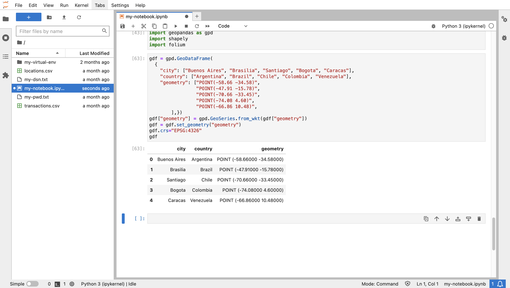

# Explore Data

## Introduction

You now explore the locations and transactions data prepared in the previous lab. By managing the data in Autonomous Database, you are able to perform back-end processing and analysis operations and then bring appropriate data subsets into Python for specialized analyses. 

Estimated Lab Time: 10 minutes

Watch the video below for a quick walk-through of the lab.
[Lab 6](videohub:1_frsuw8xp)

### Objectives

* Bring spatiotemporal data and query results from Autonomous Database into Python
* Visualize and explore the data in Python

### Prerequisites

* Completion of Lab 5: Prepare data

## Task 1: Spatial data handling in Python

The most common Python library for data handling is Pandas, which provides DataFrame as the data structure akin to a table with columns and rows. The GeoPandas library extends Pandas for spatial data handling, where DataFrame is extended to GeoDataFrame including a "geometry" column. The Shapely library provides the spatial type used to populate the geometry column. Folium is a popular map visualization library and is used by GeoPandas.

1. Import libraries for spatial data handling and map visualization. 

    ```
    <copy>
    import geopandas as gpd
    import shapely
    import folium
    </copy>
    ```
     

2.  As a basic example of spatial data in Python, run the following to manually create a GeoDataFrame containing point locations for several cities. The geometry values are in Well-Known Text ("WKT") format since that is the format used in a GeoDataFrame.

    ```
    <copy>
    gdf = gpd.GeoDataFrame(
      {
        "city": ["Buenos Aires", "Brasilia", "Santiago", "Bogota", "Caracas"],
        "country": ["Argentina", "Brazil", "Chile", "Colombia", "Venezuela"],
        "geometry": ["POINT(-58.66 -34.58)",
                     "POINT(-47.91 -15.78)",
                     "POINT(-70.66 -33.45)",
                     "POINT(-74.08 4.60)",
                     "POINT(-66.86 10.48)",
            ],})
    gdf["geometry"] = gpd.GeoSeries.from_wkt(gdf["geometry"])
    gdf.set_geometry("geometry")
    gdf.crs="EPSG:4326"
    gdf
    </copy>
    ```

     

3.  To visualize the data, run the following where you specify both the background map and marker size. Move your mouse over a map marker to see its attributes.

    ```
    <copy>
    gdf.explore(tiles="CartoDB positron", marker_kwds={"radius":8})
    </copy>
    ```
     

4.   Oracle Spatial includes functions and methods to convert from the native spatial type to common formats, including conversion to the WKT format used in a GeoDataFrame. So creating a GeoDataFrame from Oracle Spatial results is straightforward. The conversion syntax of object methods is more compact than the equivalent SQL functions. For example the method **(geometry).get\_wkt()** versus the function **sdo\_util.to_wktgeometry(geometry)**. Run the following to see a basic example of format conversions of a hard-coded SDO\_GEOMETRY to WKT and GeoJSON formats using object methods.


    ```
    <copy>
    cursor = connection.cursor()
    cursor.execute("""
      WITH x AS (
        SELECT sdo_geometry(2001,4326,sdo_point_type(-100.12, 22.34,null),null,null) 
               as geometry
        FROM dual)
      SELECT geometry, 
             (geometry).get_wkt(), 
             (geometry).get_geojson()
      FROM x
      """)
    for row in cursor.fetchone():
       print(row)
    </copy>
    ```
     

5.   In the previous lab you configured the LOCATIONS table with a function-based spatial index. The function is lonlat\_to\_proj\_geom( ) and converts longitude, latitude into a SDO\_GEOMETRY in the World Mercator coordinate system for compatibility with libraries used in a later lab.  Run the following to retrieve geometries using that function as WKT format. 

    ```
    <copy>
    cursor = connection.cursor()
    cursor.execute("""
      SELECT lon, lat, (lonlat_to_proj_geom(lon,lat)).get_wkt()
      FROM locations
      """)
    for row in cursor.fetchmany(10):
       print(row)
    </copy>
    ```
     


6.  Run the following to retrieve the LOCATIONS table and create a GeoDataFrame.
     ```
     <copy>
     cursor.execute("""
      SELECT location_id, owner, (lonlat_to_proj_geom(lon,lat)).get_wkt()
      FROM locations
      """)
     gdf = gpd.GeoDataFrame(cursor.fetchall(), columns = ['location_id', 'owner', 'geometry'])
     gdf['geometry'] = shapely.from_wkt(gdf['geometry'])
     gdf.crs="EPSG:3857"
     gdf.head()
     </copy>
     ```

     

6.  Run the following to visualize the GeoDataFrame.
     ```
     <copy>
     gdf.explore(tiles="CartoDB positron")
     </copy>
     ```

     


## Task 2: Explore transactions data


1.  Next you create a GeoDataFrame from a query joining TRANSACTIONS to LOCATIONS. Run the following to create the GeoDataFrame.

    ```
    <copy>
    cursor = connection.cursor()
    cursor.execute("""
     SELECT a.cust_id, a.trans_id, a.trans_epoch_date, 
      (lonlat_to_proj_geom(b.lon,b.lat)).get_wkt() 
     FROM transactions a, locations b
     WHERE a.location_id=b.location_id
     """)
    gdf = gpd.GeoDataFrame(cursor.fetchall(), columns = ['cust_id', 'trans_id', 'trans_epoch_date', 'geometry'])
    gdf['geometry'] = shapely.from_wkt(gdf['geometry'])
    gdf.crs="EPSG:3857"
    gdf.head()
    </copy>
    ```

     

2.  Run the following to visualize the GeoDataFrame. Mouse over an item to see transaction attributes.

    ```
    <copy>
    gdf.explore(tiles="CartoDB positron") 
    </copy>
    ```
     


You may now **proceed to the next lab**.

## Learn More
* For details on GeoPandas see [https://geopandas.org](https://geopandas.org)

## Acknowledgements

- **Author** - David Lapp, Database Product Management, Oracle
- **Contributors** - Rahul Tasker, Denise Myrick, Ramu Gutierrez
- **Last Updated By/Date** - David Lapp, August 2023

