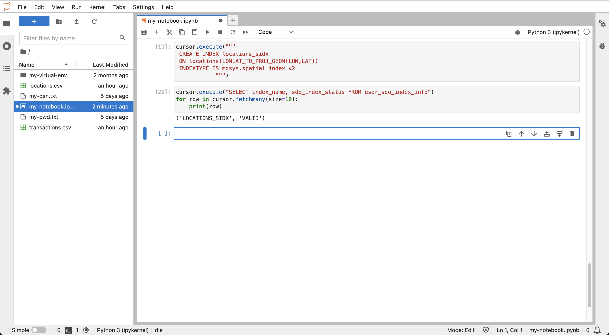

# Prepare Data


## Introduction

In this lab, fictitious financial transactions data are loaded to your Autonomous Database and configured for spatial and temporal ("spatiotemporal") analysis. 

Estimated Lab Time: xx minutes

### Objectives

* Load financial transactions data to Autonomous Database
* Configure data for spatiotemporal analysis

### Prerequisites

* Completion of previous lab 

## Task 1: Upload data files

1. Use the following links to download the data files:
 * [locations.csv](./data/locations.csv)
 * [transactions.csv](./data/transactions.csv)
   
1. Click the **Upload** icon to load the data files.
   

3. In the left panel, click on locations.csv and transactions.csv to preview the data files.

   -->> insert pic <<---

   


## Task 2: Create and load tables

4. In the next cell of your notebook, paste the following statement and then click the **run** button. This creates the table for the locations data. 

     ```
     <copy>
     # Create table for locations data
     cursor.execute("""create table locations (
                          location_id integer, 
                          owner varchar2(100),  
                          lon number, 
                          lat number)""")
     </copy>
     ```
     

5. Run the following to load the locations data.

     ```
     <copy>
     # Load the locations data
     BATCH_SIZE = 1000
     with connection.cursor() as cursor:
         with open('locations.csv', 'r') as csv_file:
             csv_reader = csv.reader(csv_file, delimiter=',')
             #skip header
             next(csv_reader) 
             #load data
             sql = "insert into locations values (:1, :2, :3, :4)"
             data = []
             for line in csv_reader:
                 data.append((line[0], line[1], line[2], line[3]))
                 if len(data) % BATCH_SIZE == 0:
                     cursor.executemany(sql, data)
                     data = []
             if data:
                 cursor.executemany(sql, data)
             connection.commit()
     </copy>
     ```
     


6. Run the following to preview the locations data, which contains one row for each for each ATM location including coordinates and a unique location ID.

     ```
     <copy>
     # Preview locations data
     cursor = connection.cursor()
     cursor.execute("select * from locations")
     for row in cursor.fetchmany(size=10):
         print(row)
     </copy>
     ```
     


5. In the next cell, paste the following statement and then click the **run** button. This creates the table for the transaction data. 

     ```
     <copy>
     # Create table for transactions data
     cursor.execute("""create table transactions (
                          trans_id integer,
                          location_id integer, 
                          trans_date date, 
                          cust_id integer)""")
     </copy>
     ```
     


5. Run the following to load the transactions data.

     ```
     <copy>
     # Load the transactions data
     BATCH_SIZE = 1000
     with connection.cursor() as cursor:
         with open('transactions.csv', 'r') as csv_file:
             csv_reader = csv.reader(csv_file, delimiter=',')
             #skip header
             next(csv_reader) 
             #load data
             sql = "insert into transactions values (:1, :2, TO_DATE(:3,'YYYY-MM-DD:HH24:MI:SS'), :4)"
             data = []
             for line in csv_reader:
                 data.append((line[0], line[1], line[2], line[3]))
                 if len(data) % BATCH_SIZE == 0:
                     cursor.executemany(sql, data)
                     data = []
             if data:
                 cursor.executemany(sql, data)
             connection.commit()
     </copy>
     ```
     


6. Run the following to preview the transactions data, which contains one row for each transaction including data and location ID.

     ```
     <copy>
     # Preview transactions data
     cursor = connection.cursor()
     cursor.execute("select * from transactions")
     for row in cursor.fetchmany(size=10):
         print(row)
     </copy>
     ```
     

## Task 3: Add epoch date

Temporal calculations are a key component of this workshop, and are best performed on an integer representation of date and time. This integer representation is generally referred to as epoch time or more specifically UNIX time. In this task you add epoch time for all transactions.

1.  Run the following to add and populate a column for epoch date.
   
     ```
     <copy>
     # add column for epoch date
     cursor.execute("alter table transactions add (trans_epoch_date integer)")
     </copy>
     ```

     ```
     <copy>
     # add column for epoch date
     cursor.execute("""update transactions 
                       set trans_epoch_date = (trans_date - date'1970-01-01') * 86400""")
     connection.commit()
     </copy>
     ```

     


2. Run the following to again preview the transactions data. Observe the epoch date column is added..
   
     ```
     <copy>
     # Preview transactions data
     cursor.execute("select * from transactions")
     for row in cursor.fetchmany(size=10):
         print(row)
     </copy>
     ```

     


## Task 5: Configure data for spatial operations  


Spatial calculations are an additional key component of this workshop. In this task you configure your locations data to utilize the spatial features of Autonomous Database. The locations table includes longitude/latitude coordinates. One option is to create and populate a new column using the native spatial data type. While that would work perfectly fine, there is another option that takes advantage of a mainstream Oracle Database feature called "function based indexing". This approach allows for all of the capability associated with creating a new spatial column, but without having to create the column. Instead, you create a database function that converts coordinates to a spatial data element, and then create an index on that function. Once the function and index are created, all spatial operations behave as if a new spatial column had been created. While this is not essential for the small data volume in this workshop, the approach is of great benefit for large scale systems where the overhead of adding a column is significant.

1. Run the following to create a function that converts longitude/latitude coordinates to Oracle's native spatial data type (i.e. SDO_GEOMETRY, referred to as a "geometry"). Not only does the function convert coordinates to the native spatial type, but it also converts the coordinates from longitude/latitude to a coordinate system called "world mercator". This is the coordinate system expected by Python libraries used in subsequent labs, hence it is convenient to perform this conversion in this function.
   
     ```
     <copy>
     # Create function to convert lon/lat coordinates to world mercator geometry
     cursor.execute("""
      create or replace function lonlat_to_proj_geom (longitude in number, latitude in number)
      return SDO_GEOMETRY deterministic is
      begin
        if latitude is NULL or longitude is NULL 
        or latitude not between -90 and 90 
        or longitude not between -180 and 180
        then
          return NULL;
        else
           return sdo_cs.transform(
             sdo_geometry(2001, 4326,
                          sdo_point_type(longitude, latitude, NULL),NULL, NULL),
             3857);
        end if;
     end;""")
     </copy>
     ```

     


9. Run the following to test the function.
   
     ```
     <copy>
     # test the function
     cursor.execute("""
      with x as (
         select location_id, lonlat_to_proj_geom(lon,lat) as geom from locations)
      select location_id, geom, (geom).get_wkt()
      from x
      """)
     for row in cursor.fetchone():
         print(row)
     </copy>
     ```

     


1. Before creating a spatial index, it is necessary to insert a row of metadata describing the geometry to be indexed. Run the following to create spatial metadata for the location geometry.
   
     ```
     <copy>
     cursor.execute("""
      insert into user_sdo_geom_metadata values (
         'LOCATIONS', 'ADMIN.LONLAT_TO_PROJ_GEOM(LON,LAT)',
          SDO_DIM_ARRAY(SDO_DIM_ELEMENT('LON', 0, 0, 0.05), 
                        SDO_DIM_ELEMENT('LAT', 0, 0, 0.05)), 
          3857)
                 """)
     </copy>
     ```

     

2. Run the following to create spatial index for the location geometry.
   
     ```
     <copy>
     cursor.execute("""
      create index locations_sidx
      on locations(LONLAT_TO_PROJ_GEOM(LON,LAT))
      indextype is mdsys.spatial_index_v2
                 """)
     </copy>
     ```

     

3.  Run the following to verify that the spatial index was successfully created.
   
    ```
    <copy>
    cursor.execute("select index_name, sdo_index_status from user_sdo_index_info")
    for row in cursor.fetchmany(size=10):
        print(row)
    </copy>
    ```

     

4.   Run the following example spatial query, which leverages the spatial index.

    ```
    <copy>
    cursor.execute("""
     select location_id, round(sdo_nn_distance(1), 2) from locations 
     where sdo_nn(
       LONLAT_TO_PROJ_GEOM(LON,LAT),
       LONLAT_TO_PROJ_GEOM( -97.6, 30.3),
       'sdo_num_res=5 unit=mile', 1) = 'TRUE' """)
    for row in cursor.fetchmany():
        print(row)  
    </copy>
    ```

     


You may now **proceed to the next lab**.

## Learn More
* For details on UNIX time please see [https://en.wikipedia.org/wiki/Unix_time](https://en.wikipedia.org/wiki/Unix_time)
* For details on function-based spatial indexing, please see the [documentation](https://docs.oracle.com/en/database/oracle/oracle-database/19/spatl/extending-spatial-indexing.html#GUID-CFB6B6DB-4B97-43D1-86A1-21C1BA853089)

## Acknowledgements

- **Author** - David Lapp, Database Product Management, Oracle
- **Last Updated By/Date** - David Lapp, Database Product Management, June, 2023