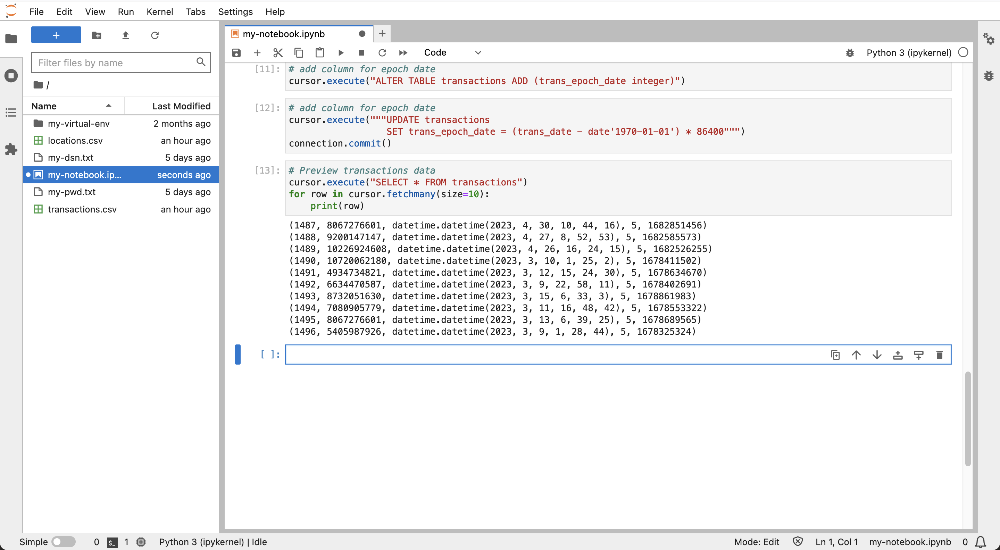

# Prepare Data


## Introduction

...

Estimated Lab Time: xx minutes

### Objectives

* 

### Prerequisites

* 

## Task 1: ... 


... insert step for oracledb.defaults.fetch_lobs = False ...

1. Click to download sample data.....
   
2. Click the **Upload** icon to load the data files.
   

3. Observe the data files in the left panel.  Click a new Jupyter tab by clicking **+**  and then select **Terminal**.
   

4.  In the terminal tab, enter the following command to unzip the transactions data. Then close the terminal tab by clicking the **x**.

     ```
     <copy>
     unzip transactions.zip 
     </copy>
     ```

     Then enter the following command to remove the zip file.

     ```
     <copy>
     rm transactions.zip 
     </copy>
     ```
     

5. In the next cell, paste the following statement and then click the **run** button. This creates the table for the locations data. 

     ```
     <copy>
     # Create table for locations data
     cursor.execute("""create table locations (
                          location_id varchar2(30), 
                          type varchar2(30), 
                          owner varchar2(100),  
                          lon number, 
                          lat number)""")
     </copy>
     ```
     

5. Run the following to load the locations data.

     ```
     <copy>
     # Load the locations data
     BATCH_SIZE = 1000
     with connection.cursor() as cursor:
         with open('locations.csv', 'r') as csv_file:
             csv_reader = csv.reader(csv_file, delimiter=',')
             #skip header
             next(csv_reader) 
             #load data
             sql = "insert into locations values (:1, :2, :3, :4, :5)"
             data = []
             for line in csv_reader:
                 data.append((line[0], line[1], line[2], line[3], line[4]))
                 if len(data) % BATCH_SIZE == 0:
                     cursor.executemany(sql, data)
                     data = []
             if data:
                 cursor.executemany(sql, data)
             connection.commit()
     </copy>
     ```
     


6. Run the following to preview the locations data.

     ```
     <copy>
     # Preview locations data
     cursor.execute("select * from locations")
     for row in cursor.fetchmany(size=10):
         print(row)
     </copy>
     ```
     


5. In the next cell, paste the following statement and then click the **run** button. This creates the table for the transaction data. 

     ```
     <copy>
     # Create table for transactions data
     cursor.execute("""create table transactions (
                          trans_id integer,
                          location_id varchar2(30), 
                          trans_date date, 
                          cust_id integer)""")
     </copy>
     ```
     


5. Run the following to load the transactions data.

     ```
     <copy>
     # Load the locations data
     BATCH_SIZE = 1000
     with connection.cursor() as cursor:
         with open('transactions.csv', 'r') as csv_file:
             csv_reader = csv.reader(csv_file, delimiter=',')
             #skip header
             next(csv_reader) 
             #load data
             sql = "insert into locations values (:1, :2, :3, TO_DATE(:4,'YYYY-MM-DD:HH24:MI:SS'))"
             data = []
             for line in csv_reader:
                 data.append((line[0], line[1], line[2], line[3], line[4]))
                 if len(data) % BATCH_SIZE == 0:
                     cursor.executemany(sql, data)
                     data = []
             if data:
                 cursor.executemany(sql, data)
             connection.commit()
     </copy>
     ```
     


6. Run the following to preview the transactions data.

     ```
     <copy>
     # Preview transactions data
     cursor.execute("select * from transactions")
     for row in cursor.fetchmany(size=10):
         print(row)
     </copy>
     ```
     

7. Run the following to add and populate a column for epoch date.
   
     ```
     <copy>
     # add column for epoch date
     cursor.execute("alter table transactions add (trans_epoch_date integer)")
     </copy>
     ```

     ```
     <copy>
     # add column for epoch date
     cursor.execute("""update transactions 
                       set trans_epoch_date = (trans_date - date'1970-01-01') * 86400""")
     connection.commit()
     </copy>
     ```

     


7. Run the following to again preview the transactions data. Observe the epoch date column is added..
   
     ```
     <copy>
     # Preview transactions data
     cursor.execute("select * from transactions")
     for row in cursor.fetchmany(size=10):
         print(row)
     </copy>
     ```

     

8. Run the following to create a view of transactions with locations and preview the data.
   
     ```
     <copy>
     # Create view
     cursor.execute("""create or replace view v_transactions as
                         select a.cust_id, a.trans_id,a. trans_epoch_date, b.lon, b.lat
                         from transactions a, locations b
                         where a.location_id = b.location_id""")
     </copy>
     ```

     ```
     <copy>
     # Preview the view data
     cursor.execute("select * from v_transactions")
     for row in cursor.fetchmany(size=10):
         print(row)
     </copy>
     ```

     


8. Run the following to create a function to convert coordinates to geometry.
   
     ```
     <copy>
      # Create function to convert lon/lat coordinates to world mercator geometry
      cursor.execute("""
       create or replace function lonlat_to_proj_geom (longitude in number, latitude in number)
       return SDO_GEOMETRY deterministic is
       begin
         if latitude is NULL or longitude is NULL 
         or latitude not between -90 and 90 
         or longitude not between -180 and 180
         then
           return NULL;
         else
            return sdo_cs.transform(
              sdo_geometry(2001, 4326,
                           sdo_point_type(longitude, latitude, NULL),NULL, NULL),
              3857);
         end if;
      end;
      """)
     </copy>
     ```

     


9. Run the following to test the function.
   
     ```
     <copy>
     # test the function
     cursor.execute("""
      with x as (
         select location_id, lonlat_to_proj_geom(lon,lat) as geom from locations)
      select location_id, geom, (geom).get_wkt()
      from x
      """)
     for row in cursor.fetchone():
         print(row)
     </copy>
     ```

     


1. Run the following to create spatial metadata for the location geometry.
   
     ```
     <copy>
     cursor.execute("""
      insert into user_sdo_geom_metadata values (
         'LOCATIONS', 'ADMIN.LONLAT_TO_PROJ_GEOM(LON,LAT)',
          SDO_DIM_ARRAY(SDO_DIM_ELEMENT('LON', 0, 0, 0.05), 
                        SDO_DIM_ELEMENT('LAT', 0, 0, 0.05)), 
          3857)
                 """)
     </copy>
     ```

     

2. Run the following to create spatial index for the location geometry.
   
     ```
     <copy>
     cursor.execute("""
      create index locations_sidx
      on locations(LONLAT_TO_PROJ_GEOM(LON,LAT))
      indextype is mdsys.spatial_index_v2
                 """)
     </copy>
     ```

3.  Run the following to verify valid spatial index.
   
    ```
    <copy>
    cursor.execute("select index_name, sdo_index_status from user_sdo_index_info")
    for row in cursor.fetchmany(size=10):
        print(row)
    </copy>
    ```

     

4.   Run the following example spatial query.

    ```
    <copy>
    cursor.execute("""
     select location_id, round(sdo_nn_distance(1), 2) from locations 
     where sdo_nn(
       LONLAT_TO_PROJ_GEOM(LON,LAT),
       LONLAT_TO_PROJ_GEOM( -97.6, 30.3),
       'sdo_num_res=5 unit=mile', 1) = 'TRUE' """)
    for row in cursor.fetchmany():
        print(row)  
    </copy>
    ```

     


You may now proceed to the next lab.

## Learn More
* 

## Acknowledgements
* **Author** - 
