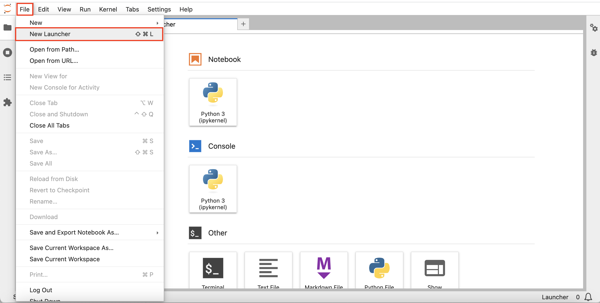
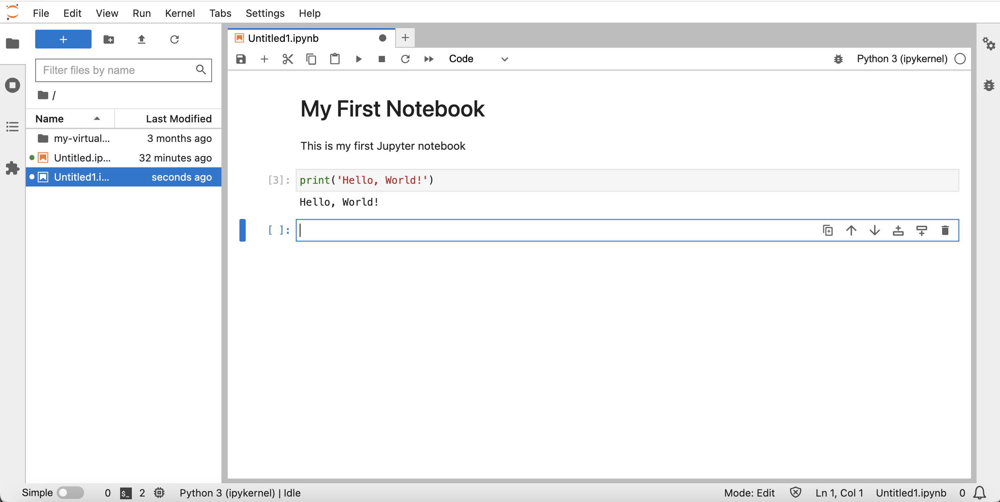

# Start JupyterLab

## Introduction

Notebooks are interactive documents for code, descriptive text, and visualizations. In this workshop you use open source JupyterLab which provides a web-based notebook environment with many user-friendly features such as file uploading.

Estimated Lab Time: 5 minutes

Watch the video below for a quick walk-through of the lab.
[Lab 3](videohub:1_p5fff23s)

### Objectives

* Start JupyterLab
* Verify access to JupyterLab
* Select option for performing remainder of hands-on lab

### Prerequisites

* Completion of Lab 2: Create Autonomous Database

## Task 1: Start JupyterLab 
   
1. Expand Cloud Shell.
     

2. You should still be connected with SSH to your compute instance. If not, then enter the following command to connect to your compute instance. 

<if type="freetier">
      ```
      <copy>
       ssh -i ~/.ssh/my-ssh-key opc@[IP address]
      </copy>
      ```
</if>
<if type="ocw23-sandbox">
      ```
      <copy>
       ssh -i ~/.ssh/ocw23-rsa opc@[IP address]
      </copy>
      ```
</if>

     

3. Your compute instance has a virtual environment with Python libraries loaded. Activate the virtual environment with the following command.

      ```
      <copy>
       source my-virtual-env/bin/activate
      </copy>
      ```

       


4. Enter the following command to start JupyterLab. 

      ```
      <copy>
       jupyter-lab --ip=0.0.0.0 --port=8001 --no-browser
      </copy>
      ```
     

    The startup process is complete when you see "To access the server ..." followed by a file path and  URL.

## Task 2: Verify access to JupyterLab 

1. Observe the JupyterLab URL including authentication token. Copy this URL and paste into a text editor.
     


6. In Cloud Shell, scroll up to your SSH command and copy your compute IP address. Then paste it into the URL in your text editor, replacing 127.0.0.1 
     

7. Open a new browser tab. Then copy the URL from your text editor and paste into the new tab and run. This will open JupyterLab where you will be creating and running Python notebooks in the following Labs.
     

## Task 3: Explore Jupyter Notebooks

Jupyter Notebook is an interactive web-based tool that allows you to create and share documents that contain live code, equations, visualizations, and text. It is widely used in the data science community for prototyping and data analysis.

In this task, we will walk through the basics of using Jupyter Notebook.

1. Create a new notebook.

   When your Jupyter environment loads, you should see a launcher tab open.

   

   If you do not see the launcher window, select file at the top left of the window, and select 'New Launcher'.

    

   From the launcher window, select  "Python 3" to create a new notebook using the Python programming language. A new notebook will be created, and you can start working on it by entering code in the code cells or adding markdown text in the markdown cells.

    


2. Add some markdown Text.

   Click on the code cell and use the use the cell type drop down to select 'Markdown'

   

   Paste the following in the cell and click the play button on the tool bar, or press Shift+Enter to run the cell.

   	```
   	<copy>
   	# My First Notebook
   	This is my first Jupyter notebook
   	</copy>
   	``` 

   

3. Write some Python code. Paste the following into the next cell and run it. The phrase, 'Hello, World!' should appear below the cell.

	```
	<copy>
	print('Hello, World!')
	</copy>
	
	```

   

4. To save a Jupyter Notebook, click on the "Save" icon on the toolbar, or press Ctrl+S (or Cmd+S on macOS). The notebook will be saved with the .ipynb file extension.

## Task 4: Select option for performing the remainder of this hands-on lab

The remainder of this hands-on lab may be performed using either of the following options:

**Option 1:** Follow instructions to copy/paste/run each step into your notebook.

   1. Proceed to Lab 4 and then subsequent labs.


**Option 2:** Load a pre-built notebook with all steps and run each cell. 
   
   1. Perform **Lab 4 - Task 1** 
   2. Perform **Lab 5 - Task 1**. 
   3. Click the following link to download the pre-built notebook to you laptop:
     * [prebuit-notebook.ipynb](./files/prebuilt-notebook.ipynb) 

   4. Click the upload button and select the prebuilt notebook.
     
     

   5. Double-click on the prebuilt notebook to open it and run each cell.

     

## Acknowledgements

- **Author** - David Lapp, Database Product Management, Oracle
- **Contributors** - Rahul Tasker, Denise Myrick, Ramu Gutierrez
- **Last Updated By/Date** - David Lapp, August 2023