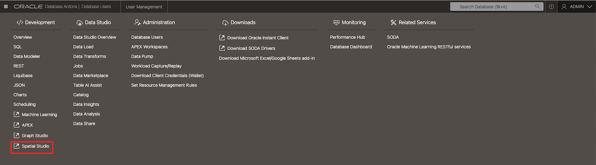

# Create User and Access Spatial Studio

## Introduction

To sign in to Oracle Spatial Studio on Autonomous AI Database Serverless, create a database user with the `SPATIAL_AUTHOR` role and the required database privileges. If your instructor has already provided an author account, skip Task 1 and use those credentials.

Estimated Time: 10 minutes

### Objectives

In this lab, you will:

- Create or inspect a `SPATIAL_AUTHOR` account with Database Users.
- Access Spatial Studio from Autonomous AI Database Serverless.

## Task 1: Create a Spatial User

1. After signing in to Oracle Cloud, open the navigation menu, select **Oracle AI Database**, and then select **Autonomous AI Database**.

    

2. Select the correct compartment, and then select your database display name to open its details page.

    

3. Select **Database Actions**, and then select **Database Users**.

    

4. Select **Create User**.

    

5. Enter `SPATIALUSER` as the user name, enter and confirm a password, and select a quota for tablespace `DATA`.

6. Open **Granted Roles**, search for `SPATIAL_AUTHOR`, and grant that role to the user.

7. Select **Create User**. The user appears in the Database Users list.

    

8. In Database Actions, open **SQL** as `ADMIN` and run the following statements to grant the required privileges and allow the user to connect through Spatial Studio:

        GRANT CREATE SESSION, CREATE TABLE, CREATE VIEW, CREATE SEQUENCE,
              CREATE PROCEDURE, CREATE TYPE, CREATE SYNONYM, CREATE TRIGGER
        TO SPATIALUSER;

        ALTER USER SPATIALUSER GRANT CONNECT THROUGH "SPATIAL$PROXY_USER";

## Task 2: Launch Spatial Studio

1. Open the Database Actions menu. Under **Development**, select **Spatial Studio**. Spatial Studio opens in a new window.

    

2. Sign in with the credentials you created in Task 1.

    

3. You will be logged into Spatial Studio.
 
    

    You may now [proceed to the next lab](#next).

## Learn More

- [Oracle Spatial product portal](https://www.oracle.com/database/spatial/)
- [Set Up Spatial Studio Users and Privileges](https://docs.oracle.com/en/cloud/paas/autonomous-database/serverless/adstu/set-spatial-studio-users-and-privileges.html)
- [Access Spatial Studio](https://docs.oracle.com/en/cloud/paas/autonomous-database/serverless/adstu/access-spatial-studio.html)

## Acknowledgements

- **Author** - Denise Myrick, Database Product Management, Oracle
- **Last Updated By/Date** - Denise Myrick, Database Product Management, October 2026
