# Apply Map Styling

## Introduction

Spatial Studio allows you to customize the "look and feel" and interactivity of your map layers. Styling a map layer includes options such as color, transparency, and, in the case of points, markers. Styling may also be automatically controlled by data values ("data-driven styling"), such that color and/or marker size is based on data values. For example, this allows you to render sales regions with colors based on revenue. Interactivity refers to what happens when a user clicks or hovers over an item in a map layer. This includes displaying a tooltip and/or opening a popup window with data values for the item. In this lab you explore some of these styling and interactivity features.

Estimated Lab Time: 30 minutes

### Objectives

* Understanding of rendering styles
* Understanding of data-driven styling
* Learn how to use color schemes
* Learn how to configure interactivity of map layers

### Prerequisites

* Successfully complete Lab 2: Create Project
## Task 1: Navigate to styling

1. From the left-panel menu, navigate to the Projects page. Open the action menu for LiveLabs Spatial Intro and select **Open**. 
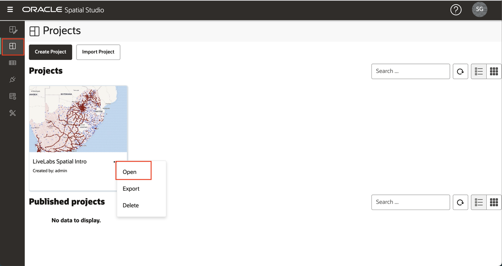

2. To focus on the ACCIDENTS layer, turn off the 2 police layers in the map by clicking on the visibility controls (i.e., blue eyeball icons.) 
  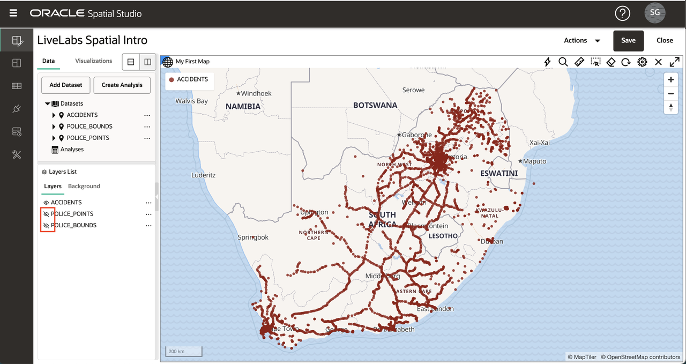

3. As you did in the previous lab, open the action menu for ACCIDENTS and select **Settings**.  

## Task 2: Apply cluster style  
   
1. Point layers, such as ACCIDENTS, can be rendered using various render styles. Each render style has its own settings.  Change the render style from Circle (the default) to Cluster.
  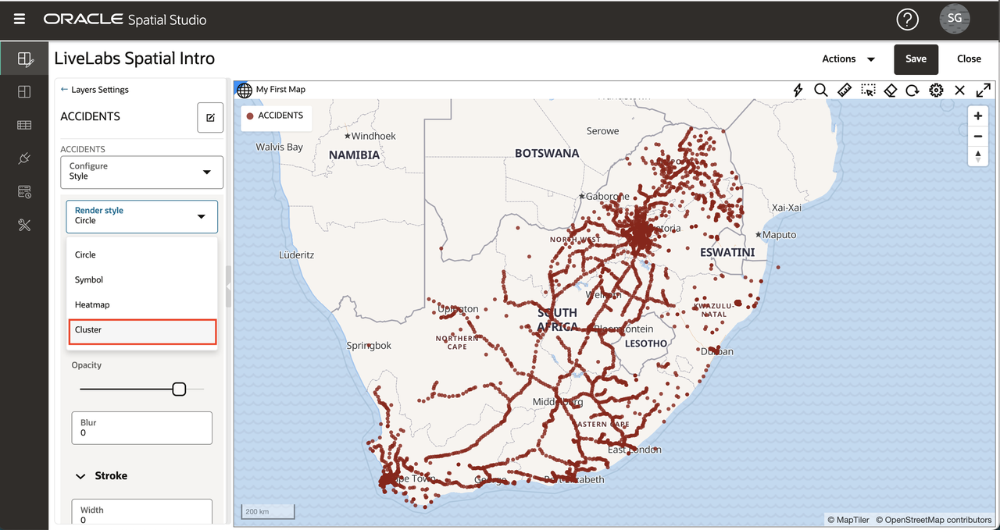

2. The map now displays ACCIDENTS using circles to represent numerous points clustered in areas. The cluster circle size is based on the number of points clustered in each area. You can experiment with the color and the style of the text labels representing the number of points in each cluster.
  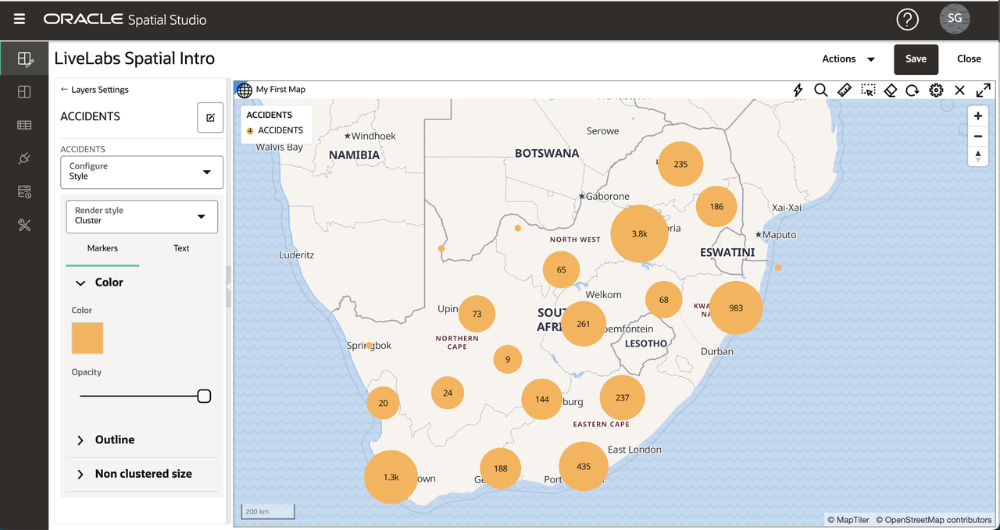
   Observe that as you zoom in (rotate mouse wheel) the clusters explode into smaller clusters, and vice versa as you zoom out.
  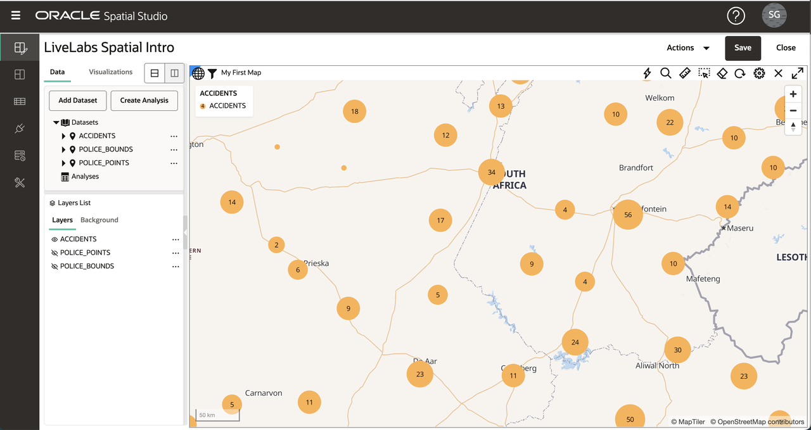

## Task 3: Apply heatmap style 

1. Change the Render Style from Cluster to Heatmap. The map now renders ACCIDENTS with continuous colors based on the concentration of points. Hot colors represent concentration of points, and cool colors represent sparsity of points. A key parameter of the Heatmap style is Radius, which controls the distance around each point for defining a concentration. The default Radius is so large that the initial heatmap just shows point concentrations along the roads, which is not very helpful.
  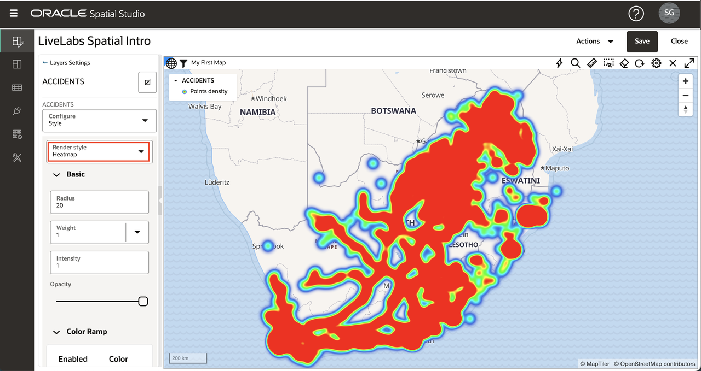
  To focus our Heatmap on more localized concentrations, reduce the Radius from the default to 10 and observe a more localized view of point concentrations.
  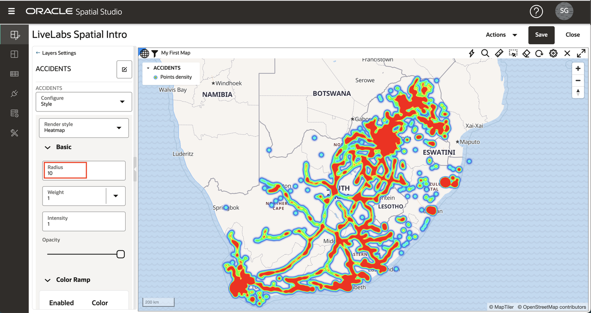

## Task 4: Apply data-driven style 

1. Change the Render Style from Heatmap to Circle. When using the Circle render style, both the radius and color can be controlled by data values. Pull down the Color menu and select "Based on data".
  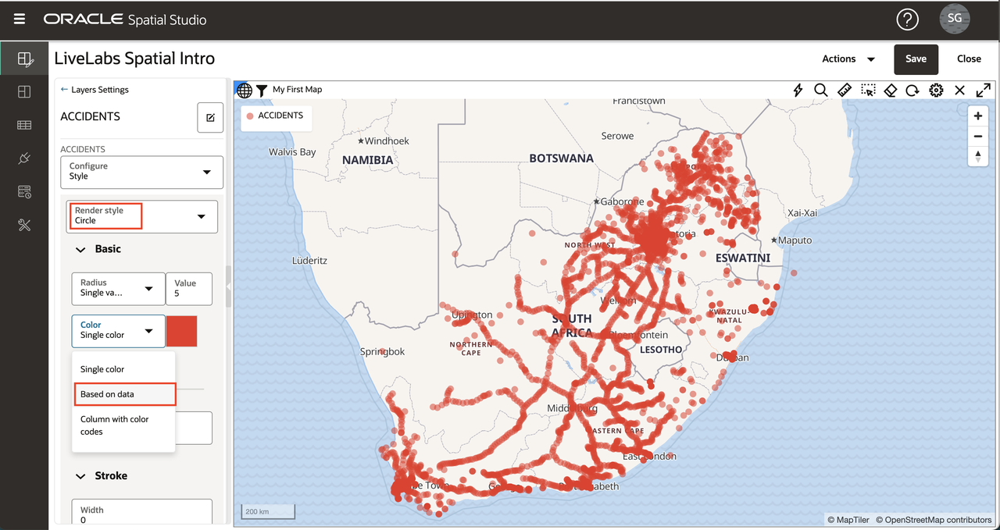

2. You now select the column to use for controlling styling. Select the column NR_VEHICLES (i.e., number of vehicles involved in the accident) and observe the ACCIDENTS become color-coded. You can accept the other default values and then click the **Back** link at the top of the Style details panel.
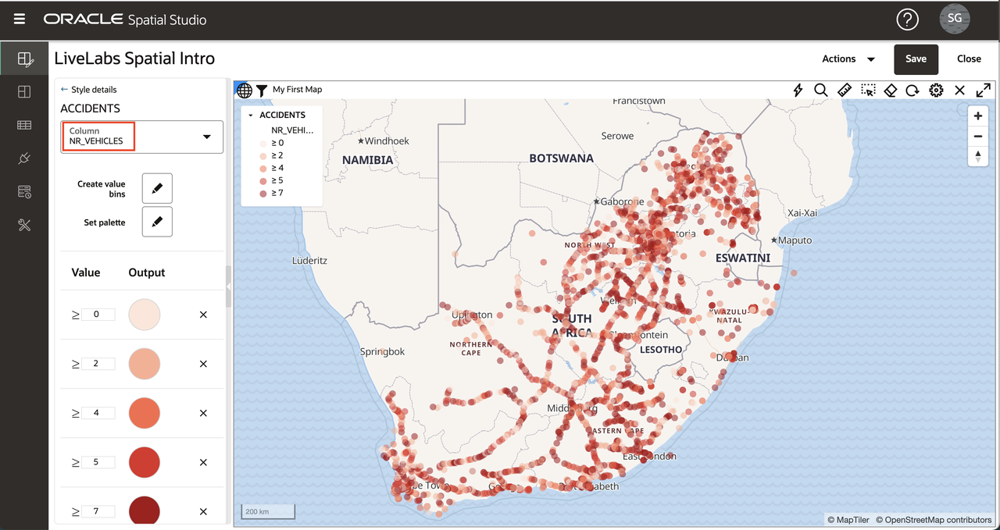

3. Now that you have assigned colors based on data values, finalize the style by setting the Radius to 3 and Opacity to 90%. Also, update the Stroke (i.e., outline) values: set Width to 0.5, Color to grey, and Opacity to 90%. You can of course pick your own values for these if you prefer. Then click the **Back** link to return to the Layers List.
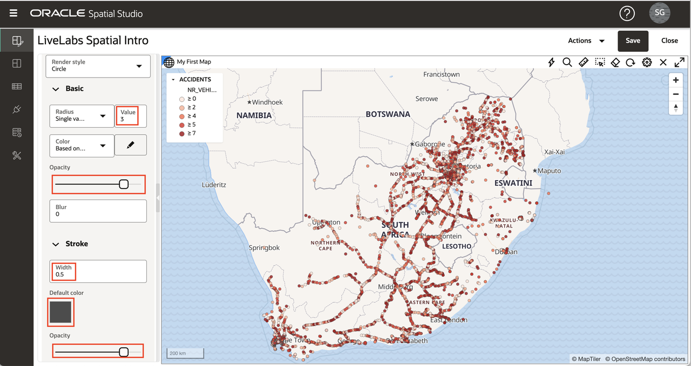

## Task 5: Apply symbol style 

1. You will next use the remaining point style option, Symbol, for the POLICE\_POINTS layer. Turn on the POLICE\_POINTS layer and turn off the other 2 layers in the map by clicking on the visibility controls (i.e., eyeball icons.)  Open the action menu for POLICE\_POINTS and select **Settings**. 

    Change Render Style to Symbol and then click inside the Image text box to open the Symbol selection dialog. Select **marker** and update the Opacity to 90% and Size factor to 0.6. You can of course pick your own values for these if you prefer.  Then click the **Back** link to return to the Layers List.
 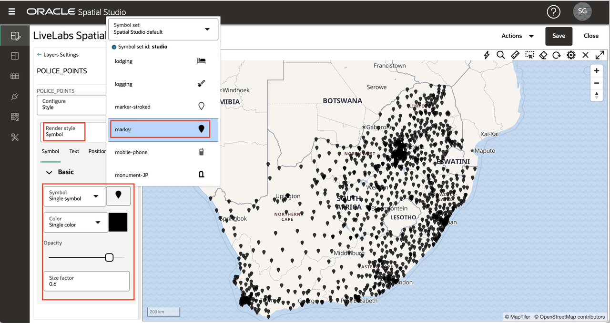

## Task 6: Apply interactivity

1. Click on the hamburger icon for the layer POLICE\_BOUNDS and select **Settings**. In the Configure pull-down menu select **Interaction** tab.  The first type of interactivity we configure for a layer is the ability to select an item(s). Selections are used for analyses, for example where we want to identify the items contained within a selected region. By default, the selectable option is on. Click inside POLICE\_BOUNDS regions and observe the selection highlighted. 

   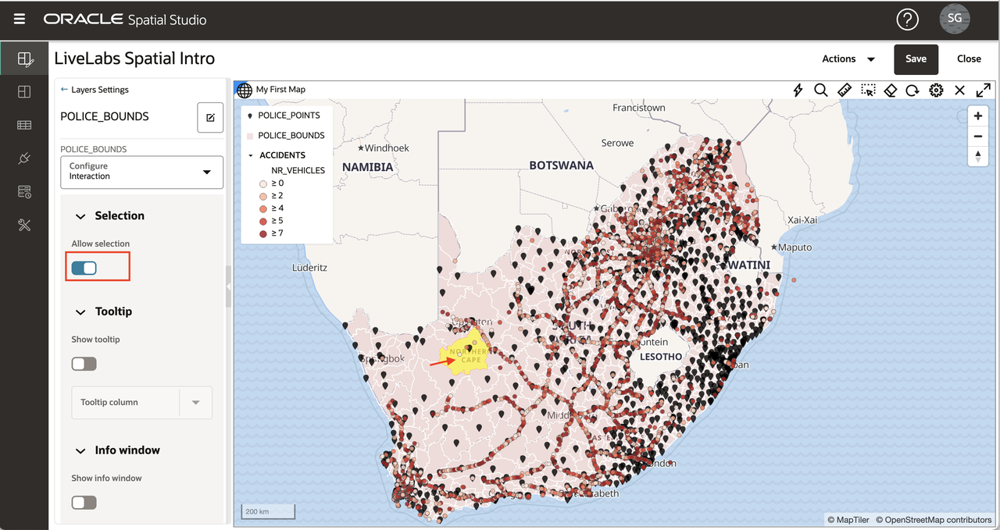

2. Next you configure tooltips, i.e., a popup displayed when hovering on an item. By default, tooltips are disabled. Hover over a POLICE_BOUNDS region and observe nothing happens. Then in the Settings panel enable **Show tooltip**, select a tooltip column, hover your mouse over a region, and observe the tooltip.

   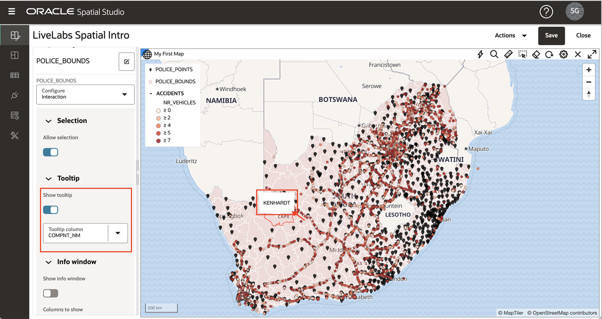

3. Finally you configure Info Window, i.e., a popup displayed when clicking on an item. By default, this option is off. Click in a POLICE_BOUNDS region and observe no info window is displayed. Then turn on **Show info window**, select column(s) to show, click inside a POLICE\_BOUNDS regions and observe the info window displayed.

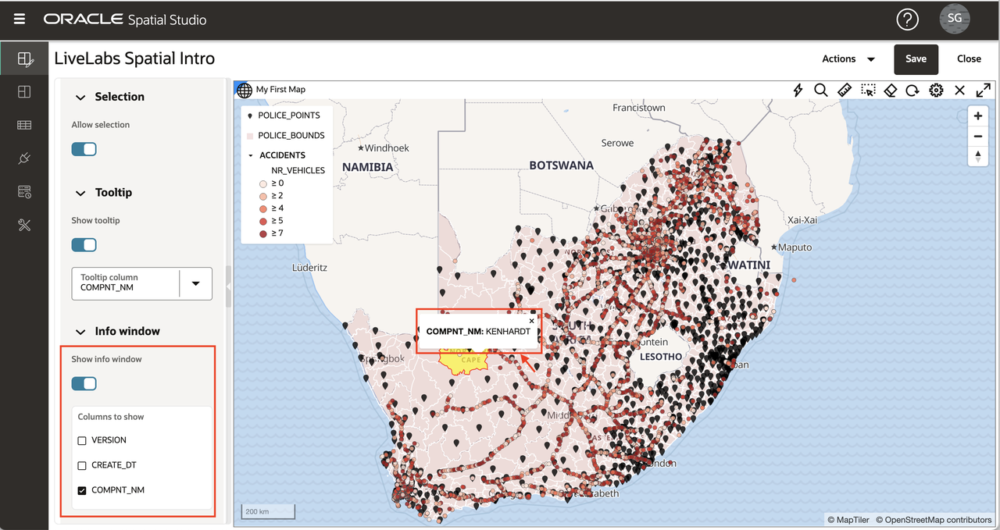

## Task 7: Save changes

1. Click the **Back** link and then click the **Save** button to save our project with the style changes.
 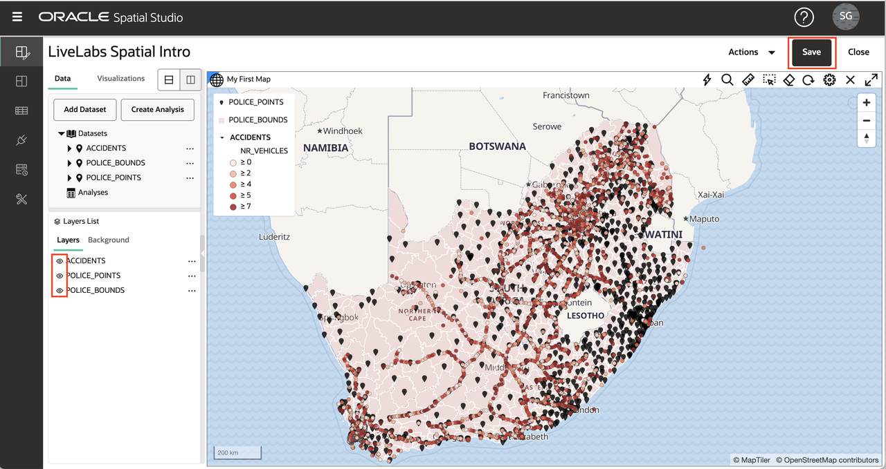

2. Return to the Project page and observe the thumbnail is updated with changes.
 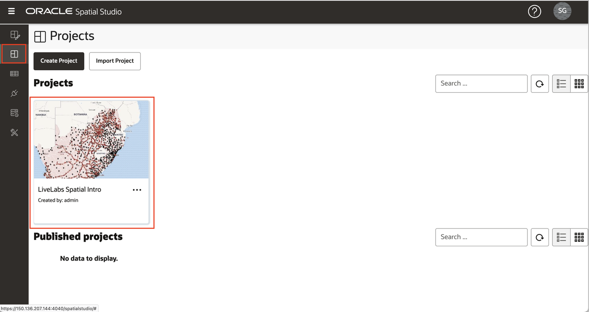

3. Click on the hamburger icon for the project and select **Open** (or click the project thumbnail) to return to the project.

You may now [proceed to the next lab](#next).

## Learn More
* [Spatial Studio product portal] (https://oracle.com/goto/spatialstudio)

## Acknowledgements
* **Author** - David Lapp, Database Product Management, Oracle
* **Last Updated By/Date** - Denise Myrick, Database Product Management, April 2023

