# Create Project

## Introduction

In Spatial Studio, a Project is where you visualize and analyze your data. Projects may be saved so that you can resume work, and they can be published so that you can share your results with others.  In this lab you create and save your first Project. 

Estimated Lab Time: 30 minutes

### Objectives

* Learn how to create and save a Project
* Learn how to add Datasets to a Project
* Learn how to visualize Datasets

### Prerequisites

* Successfully complete Lab 1: Load Spatial Data

## Task 1: Create Project

1. From the left-panel menu, navigate to the Projects page and click **Create Project**.
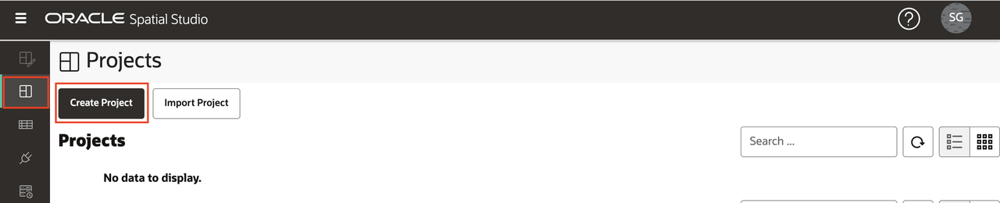

2. Click the **Add Dataset** button and select **Add Dataset**.
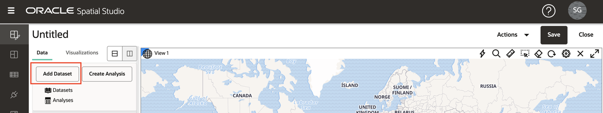

3. Select Accidents and click **OK**.
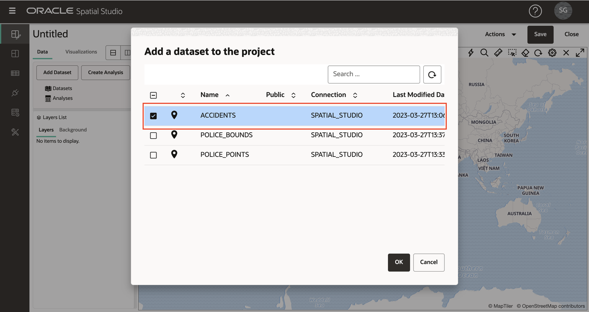

4. Drag and drop the ACCIDENTS Dataset onto the map. This creates a map Layer. 
   
   **Note:** To move around in the map, you can use your mouse wheel to zoom in/out and click and drag to pan.
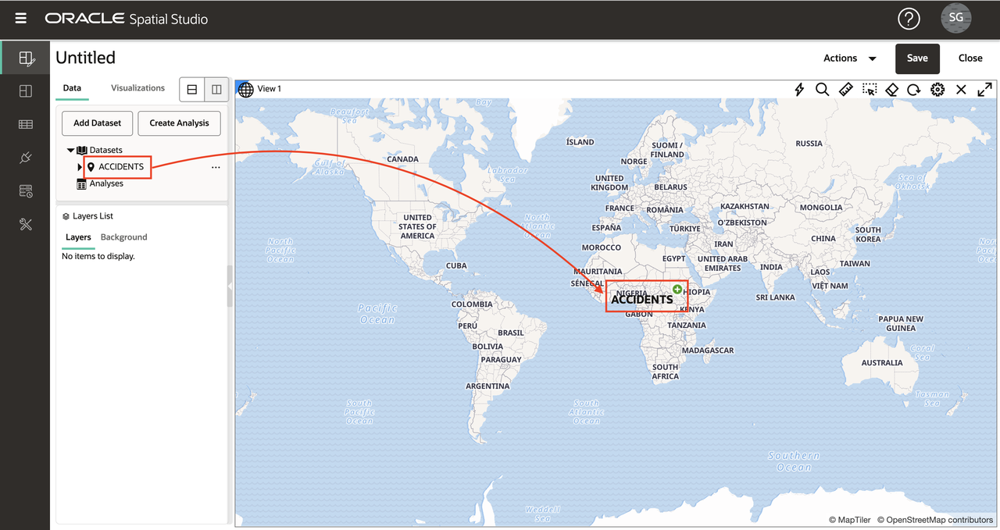

5. You may optionally configure map settings, including a label, navigation control widget, scale bar and legend. Click the gear icon to access map Settings. Select options and click **OK** to enable the selections.
  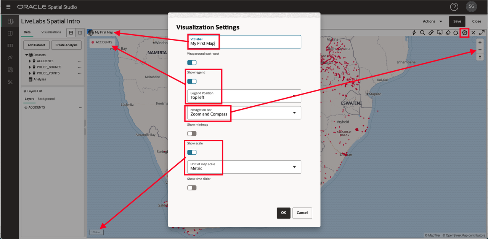
  You may keep these changes or return to Settings and turn options back off.

6. In the Layers List panel, click the hamburger icon for Accidents and select Settings.
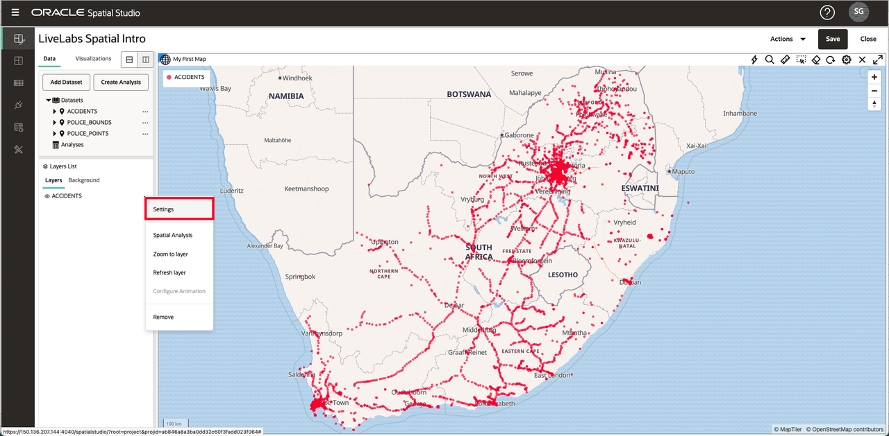

7. From here you control the layer display and interactivity settings. You will experiment with these capabilities in a later section. For the moment, just update the layer's Radius (size), Color, and Opacity and then click the **Back** link.
 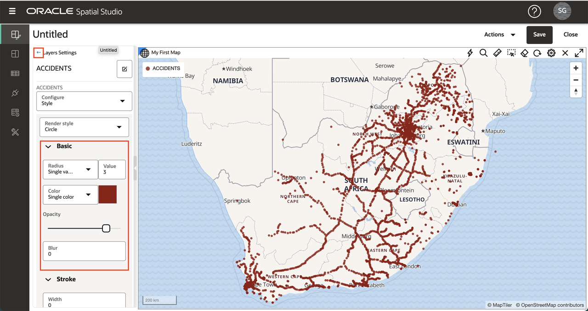

## Task 2: Add Datasets

1. Next you add your 2 police Datasets to the Project.  Click the **Add Dataset** button at the top of the Data Elements panel, select **Add Dataset**, use shift-enter to select both police Datasets and click **OK**.
 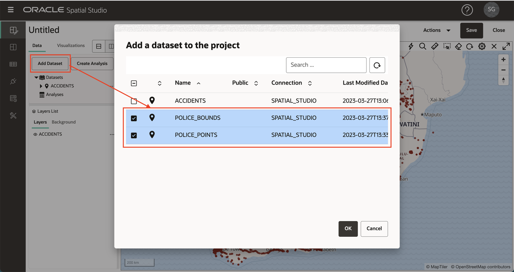

2. As you did previously with ACCIDENTS, drag and drop the POLICE\_POINTS Dataset from the Data Elements panel onto the, click the POLICE\_POINT layer's action menu and select Settings. Update Radius, Color, Opacity. Then click the **Back** link at the top of the Layers panel.
 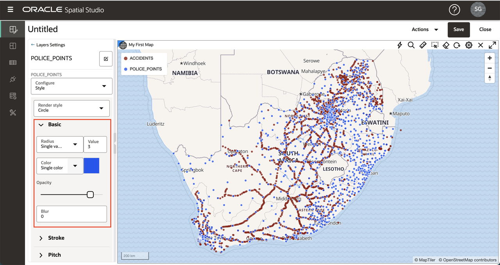

3. As Layers are added to the map, they are rendered on top of the existing Layers. Therefore POLICE\_POINTS are currently on top of ACCIDENTS. To reorder  the layers such that POLICE\_POINTS are underneath ACCIDENTS, move the mouse over POLICE\_POINTS in the Layer's list, click and hold (you'll see the cursor change to cross-hair), and drag under ACCIDENTS. 
 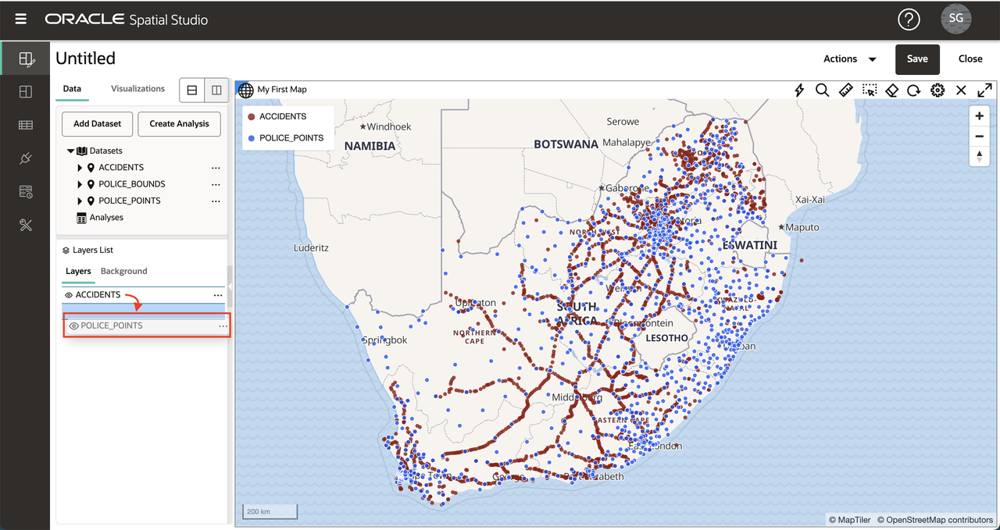
 
4. Drag and drop the POLICE\_BOUNDS Dataset onto the map. As you did with POLICE\_POINTS, re-order the layers so that POLICE\_BOUNDS are at the bottom (i.e., rendered beneath the other layers). You now have your 3 datasets added as map layers in our project.

  **Note:** Individual layers may be turned off/on by clicking the eyeball icon next to the layer name.
  
 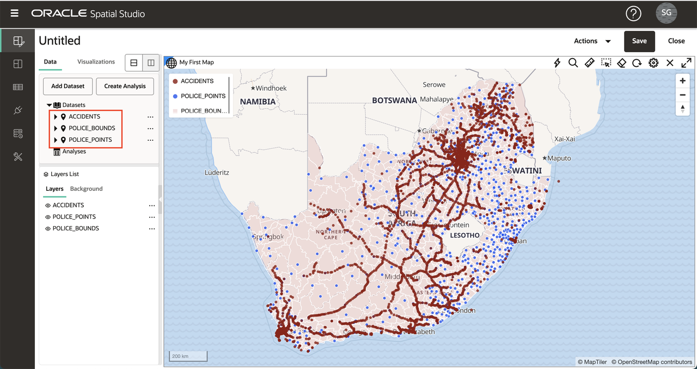  

5. Click the POLICE\_BOUNDS layer's hamburger menu and select Settings. Update Color and Opacity for the Fill and Outline. Observe that using a white outline reduces the cluttered effect of a darker outline.
 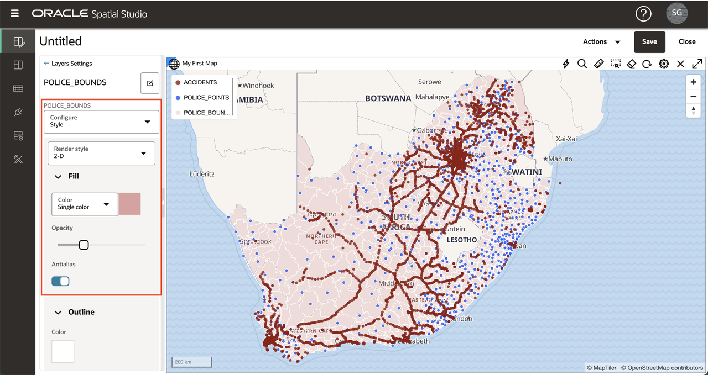   

 Click the **Back** link at the top of the Layer Settings panel to return to the Layers List.

## Task 3: Add Visualizations

1. Spatial Studio allows you to display your Datasets as maps and tables. To add visualizations, click on the **Visualizations** tab on the left and then drag-and-drop **Table** to the edge of the existing map view. You will see a grey bar appear when the table can be dropped in.

 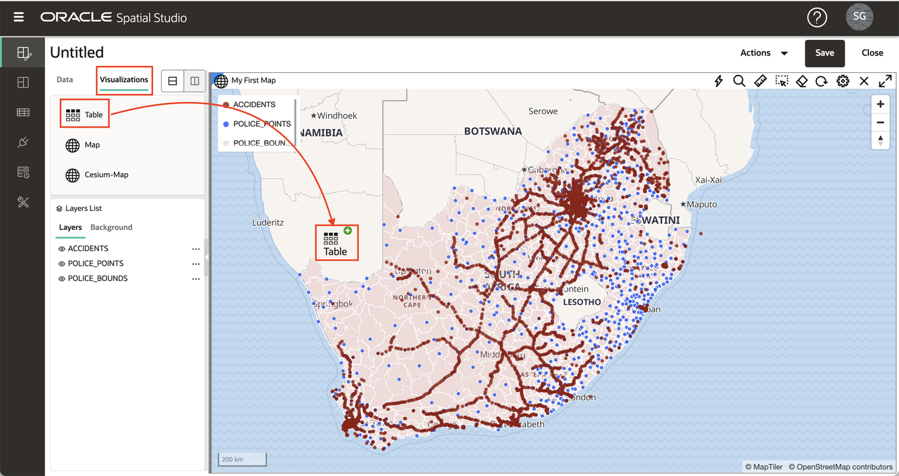   

2. Drag-and-drop **Map** above the existing map. The grey bar will appear when you are hovering on the edge of the existing map and can drop in the new map.

 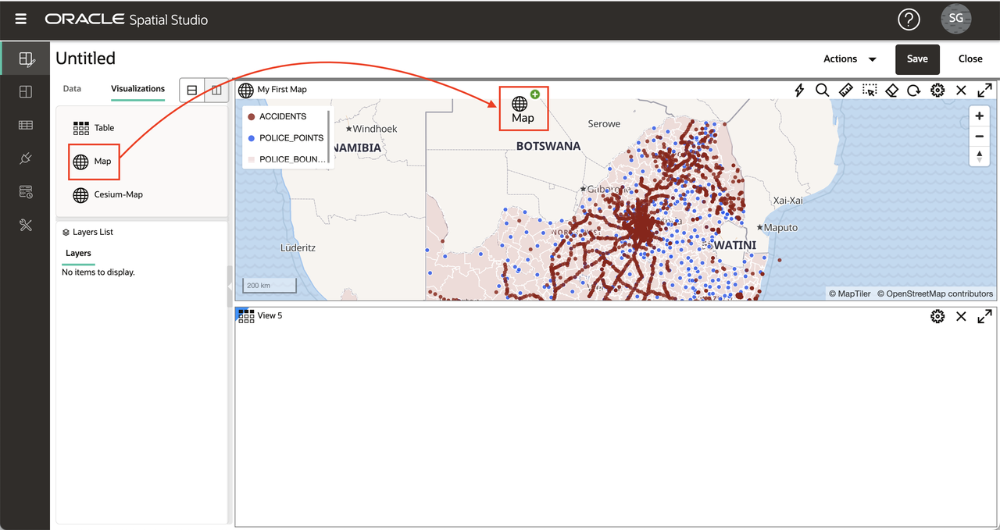   

3. Click on the **Datasets** button on the top left and then drag-and-drop ACCIDENTS into the table.

 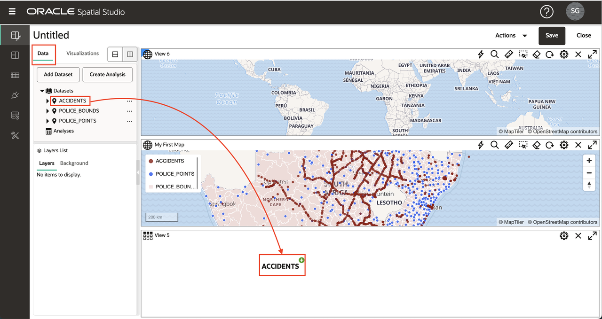   

4. Drag-and-drop ACCIDENTS into the new map.

 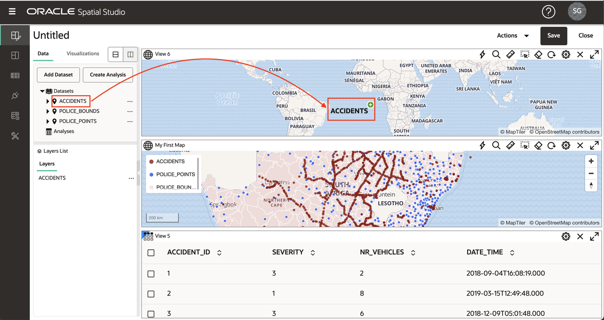   

5. To collapse the Data Elements panel and provide more screen real estate, hover over the right edge and click the grey arrow.

 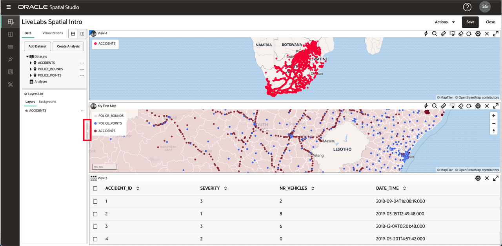    

6. To expand the Data Elements panel, hover over the left edge and click the grey arrow.

 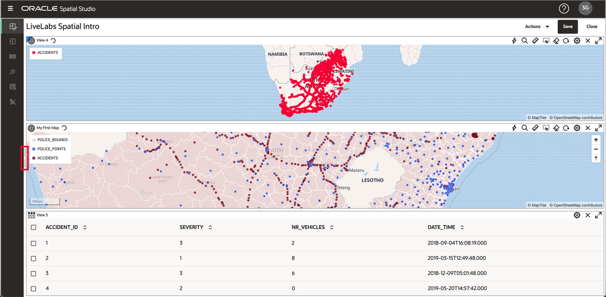    

7. You delete a visualization by clicking the **X** icon on the top right. We will use only our initial map in this workshop, so delete the new table and map you just created.

 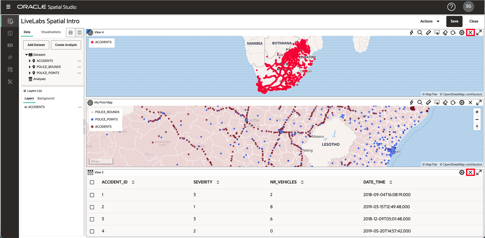  

## Task 4: Save Project 
    
1. Click the **Save** button at the top right to save the Project and supply a name, for example **LiveLabs Spatial Intro**.
 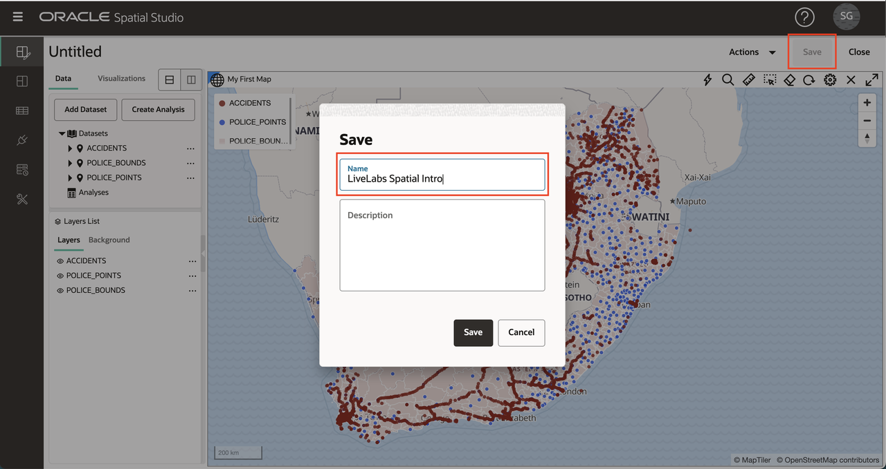

2. Navigate to the Projects page from the left navigation bar and observe your Project is now listed.
 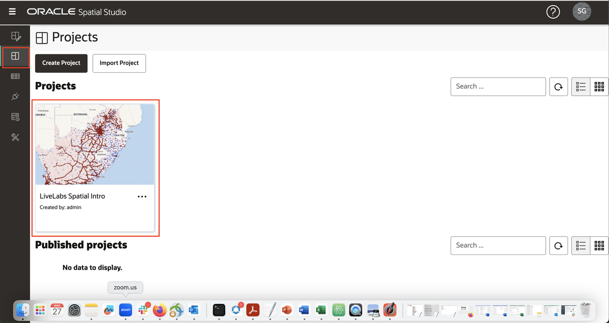

You may now [proceed to the next lab](#next).

## Learn More
* [Spatial Studio product portal] (https://oracle.com/goto/spatialstudio)

## Acknowledgements
* **Author** - David Lapp, Database Product Management, Oracle
* **Last Updated By/Date**  - Denise Myrick, Database Product Management, April 2023
