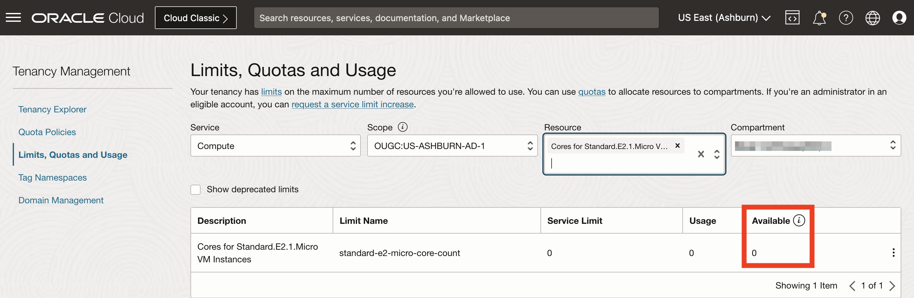
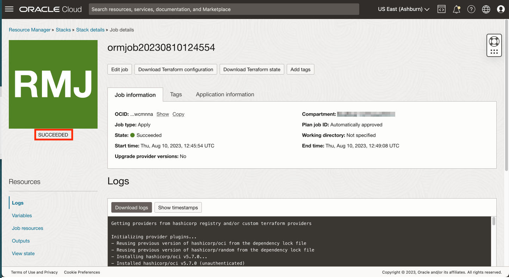

# Deploy Spatial Studio to Oracle Cloud

## Introduction

In this lab, you deploy Spatial Studio from the Cloud Marketplace using Always Free resources. The Cloud Marketplace takes care of installing and configuring Spatial Studio and an Autonomous Database. The Spatial Studio instance created is meant to be temporary for use during this workshop. 

Estimated Lab Time: 15 minutes

### Objectives

In this lab, you will:
* Deploy Spatial Studio from the Oracle Cloud Marketplace using Always Free resources.

### Prerequisites

* An Oracle Cloud Account
* You are an Admin in the cloud account. 

<!-- *This is the "fold" - below items are collapsed by default* -->

## Task 1: Verify availability of Compute resource

Before starting the Spatial Studio deployment, it is necessary to verify the availability domain having quota for the Always Free compute shape. 

1. Navigate to **Governance & Administration > Limits, Quota, and Usage**

   

2. The Scope menu lists availability domains. Select the first availability domain, type **micro** in the Resource menu, and select **Cores for Standard.E2.1.Micro VM Instances**. 

   

3. The result listing shows the service limit (quota), usage, and availability of the selected shape in the selected availability domain. In the example below, there is no availability for the selected availability domain.

  

4. If the selected availability domain does not have quota, change to the next availability domain and again enter **micro** in the Resource menu and select **Cores for Standard.E2.1.Micro VM Instances**. In this case, the second availability domain has quota.

 

 Note the availability domain having quota for your target compute shape, as you will need to select it when installing Spatial Studio from the Cloud Marketplace. 

## Task 2: Install Spatial Studio from Cloud Marketplace

1. Click the hamburger icon at the top left to open the main Navigation Menu. Select **Marketplace** and then click **All Applications**.

   

2. Search for **spatial** and then click on the **Oracle Spatial Studio** app

   
 
4. If you have an existing preferred compartment, then select it, otherwise leave the default (root). Accept the terms and conditions, and click **Launch Stack**

   

5. Accept defaults and click **Next**

   

6. Select the availability domain having quota, as you identified in Task 1.  Select the Always Free shape **VM.Standard.E2.1.Micro**.  If you have available cloud credits or a paid account, you may select a paid shape instead.

   

    Then scroll down.

7. By default, Spatial Studio allows only HTTPS access, which requires additional configuration for secure access. For this workshop you are deploying a temporary instance that will not include any sensitive information. Therefore uncheck **HTTPS only** and read the help text to be sure you understand the intended usage. For Spatial Studio Admin User Name enter **admin** (lower case). This user name will be case sensitive.
  
   

    Then scroll down.

8.  Enter a password for the Spatial Studio admin user. This is the password you will use when you log in to Spatial Studio.    

   

9.  Under Configure Networking, leave the defaults to have a network created for you.  

    Then scroll down.

10. SSH keys enable access to the Spatial Studio server for administration such as restarting the instance and checking log files. In this case your Spatial Studio instance is temporary, meant for the duration of this workshop. So administration is not needed. Therefore **uncheck** the **Add SSH key** option. 

   

  Then scroll down.

6. Spatial Studio requires access to an Oracle Database. Accept the defaults to have an Autonomous Database created and configured for you.

     

  Scroll down and enter a password for the database user that stores Spatial Studio's metadata. This will be used in the automatic configuration of metadata for your Spatial Studio instance. Then click **Next**.

      

7. You are now on the Review step of the wizard. Scroll to the bottom and make sure **Run apply** is checked. Then click **Create**.

     

8. Wait approximately 5 min for the status to change from IN PROCESS to SUCCEEDED. 
   
     

   After the status is SUCCEEDED, **wait an additional 3 min** for automated post-install steps to complete before proceeding. 
   
## Task 3: Log in to Spatial Studio

1. Click on the **Application Information** tab, and then click for **Spatial Studio HTTP URL**.

   

2. Log in with user name **admin** and the password you entered in the Step 7 above.

   

4. Once logged in, hover over the icons in the main navigation panel on the left to see tooltips with the page names.

   

5. At any time you may also click on the "hamburger" icon at the top left to expand and collapse the main navigation panel. 

      

You are now logged in and ready to start using Spatial Studio.

You may now **proceed to the next lab**.

## Learn more
* [Spatial Studio product page](https://oracle.com/goto/spatial)

## Acknowledgements
* **Author** - David Lapp, Database Product Management, Oracle
* **Contributors** - Jesus Vizcarra
* **Last Updated By/Date** - David Lapp, Database Product Management, September 2022

