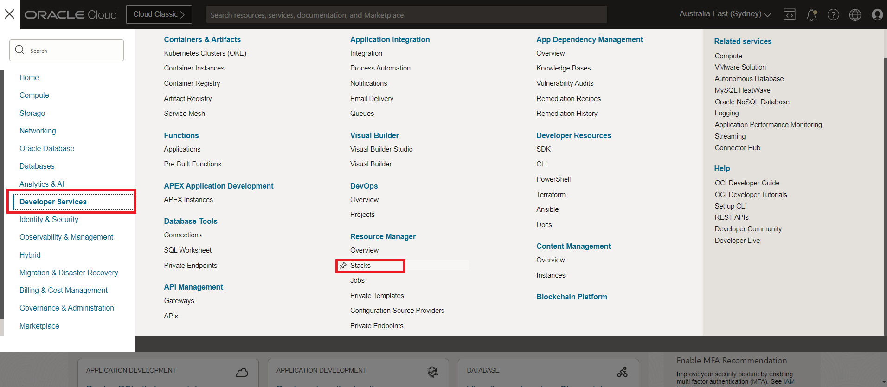
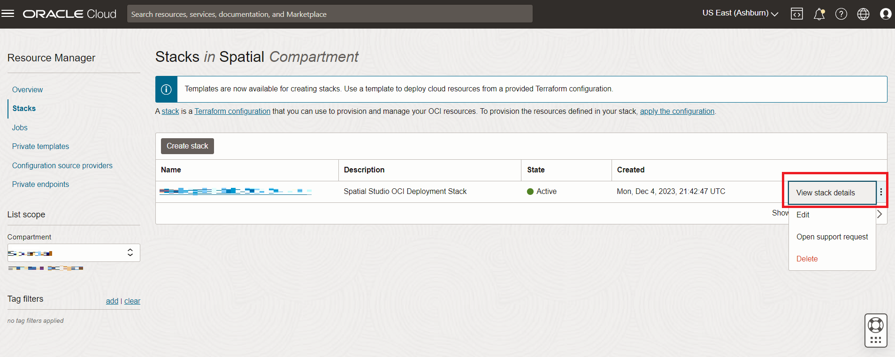
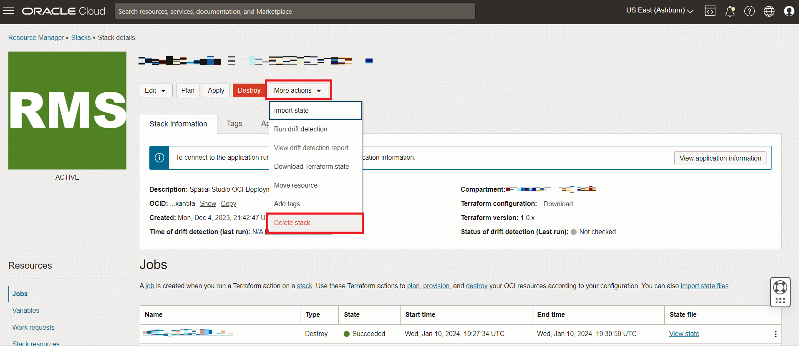
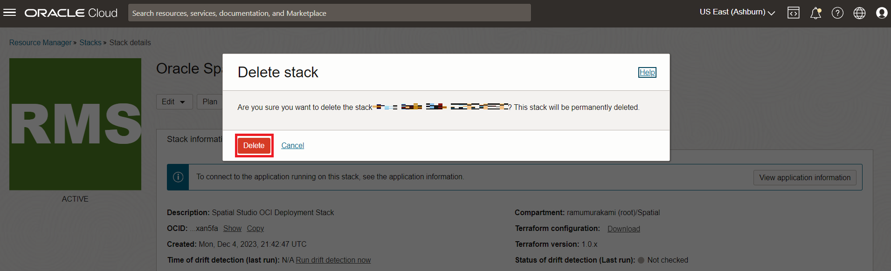

# Clean-up

## Introduction

In this lab you undeploy the Spatial Studio instance created using the Cloud Marketplace. The permanently purges all resources created as part of the Spatial Studio deployment from the Cloud Marketplace. 

Estimated Lab Time: 5 minutes

### Objectives

In this lab, you will:
* Undeploy Spatial Studio and related resources created from the Oracle Cloud Marketplace.

### Prerequisites

* Spatial Studio deployed from the Cloud Marketplace

<!-- *This is the "fold" - below items are collapsed by default* -->

## Task 1: Purge Deployed Resources

Navigate to the stack used to create your Spatial Studio instance.

1. Navigate to **Developer Services > Stacks**

   

2. From the action menu of your stack, select **View stack details** 

   

3. Click **Destroy**. This will purge the resources created by the Spatial Studio Marketplace deployment.

   

4. Confirm by again clicking **Destroy**. 

   

5. Wait for roughly 3-4 minutes for the process to complete. Observe the status in the Jobs section. When the status is **Succeeded** the unemployment is complete and all resources provisioned by the Spatial Studio Marketplace deployment are purged.

   

## Task 2: Delete the Stack (Optional)

The stack is the set of instructions for deployment. It captures the settings you selected when running the Cloud Marketplace wizard. Now that you have purged resources created when you ran the stack to create your Spatial Studio instance, you may now delete the stack itself. After deleting the stack, in order to deploy Spatial Studio again you will need to start over with the Cloud Marketplace. You may also keep the stack and re-run it as-is, or edit it to modify parameters such as adding a SSH key to create a longer term instance.

1. From the stack's **More action** menu, select **Delete stack**

   

2. When prompted to confirm, click **Delete**

   

3. All artifacts created by the Cloud Marketplace wizard, both resources and the stack, are now gone.

## Learn More
* [Spatial Studio product page](https://oracle.com/goto/spatial)

## Acknowledgements
* **Author** - David Lapp, Database Product Management, Oracle
* **Contributors** - Jesus Vizcarra
* **Last Updated By/Date** - David Lapp, Database Product Management, September 2022

