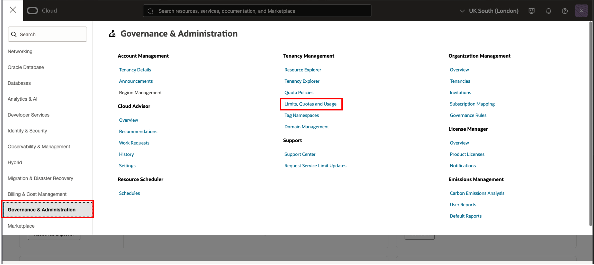
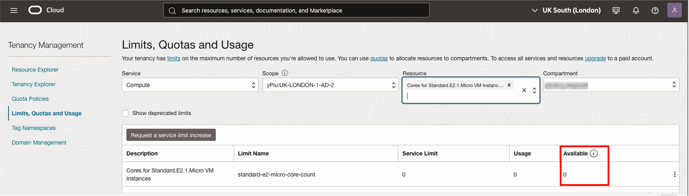
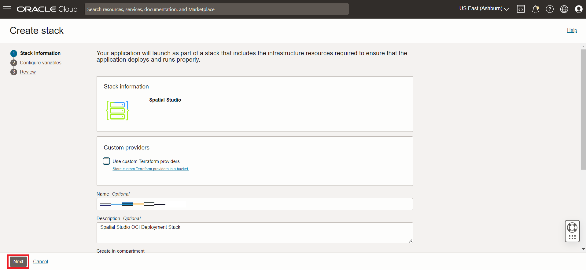
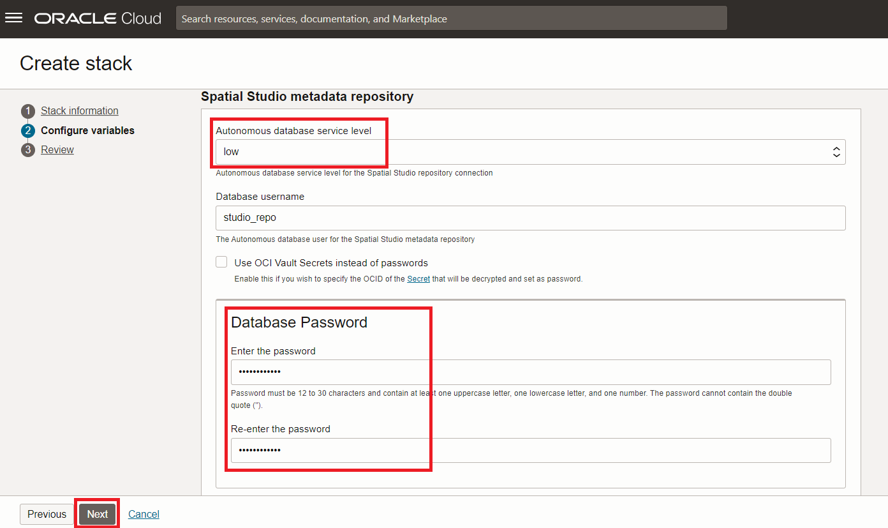

# Deploy Spatial Studio to Oracle Cloud

## Introduction

In this lab, you deploy Spatial Studio from the Cloud Marketplace. The Cloud Marketplace takes care of installing and configuring Spatial Studio and an Autonomous Database. For this workshop we will be using an Always Free account but you can use a paid account or an account with credits.

Estimated Lab Time: 15 minutes

Watch the video below for a quick walk-through of the lab.

[Deploy Spatial Studio to Oracle Cloud](videohub:1_63orvw8q)

### Objectives

In this lab, you will:

* Deploy Spatial Studio from the Oracle Cloud Marketplace.

### Prerequisites

* An Oracle Cloud Account
* You are an Admin for the cloud account.

## Task 1: Verify availability of Compute resource

Before starting the Spatial Studio deployment, it is necessary to identify the availability domain that has quota for the resource we need.

1. Navigate to **Governance & Administration > Limits, Quota, and Usage**.

   

2. The Scope menu lists availability domains. Select the first availability domain, type **micro** in the Resource menu, and select **Cores for Standard.E2.1.Micro VM Instances**.

   

3. The result listing shows the service limit (quota), usage, and availability of the selected shape in the selected availability domain. In the example below, there is no availability for the selected availability domain.

   

4. If the selected availability domain does not have quota, change to the next availability domain and again enter **micro** in the Resource menu and select **Cores for Standard.E2.1.Micro VM Instances**. In this case, the second availability domain has quota.

   

 Note the availability domain having quota for your target compute shape, as you will need to select it when installing Spatial Studio from the Cloud Marketplace.

## Task 2: Install Spatial Studio from Cloud Marketplace

01. Click the hamburger icon at the top left to open the main Navigation Menu. Select **Marketplace** and then click **All Applications**.

   

02. Search for **spatial** and then click on the **Oracle Spatial Studio** app.

   **Note:**  Make sure you select "Oracle Spatial Studio" and not "Oracle Spatial Studio for Roving Edge Infrastructure".

   

03. If you have an existing preferred compartment, then select it, otherwise leave the default (root). Accept the terms and conditions, and click **Launch Stack**

   

04. Accept defaults and click **Next**.

   

05. Select the availability domain having quota, as you identified in Task 1.  Select the Always Free shape **VM.Standard.E2.1.Micro**. If you have available cloud credits or a paid account, you may select a paid shape instead.

   

   Then scroll down.

06. By default, Spatial Studio allows only HTTPS access, which requires additional configuration for secure access. To enable both HTTPS and HTTP you may uncheck this box. However read the important note under the checkbox before unchecking it. Enter a Spatial Studio Admin User Name This user name will be case sensitive.

   

   Then scroll down.

07. Enter a password for the Spatial Studio admin user. This is the password you will use when you log in to Spatial Studio.

   

   There's also an option to use OCI Vault Secrets instead of assigning the user a password. If it is your first time take a look at the [Documentation](https://docs.oracle.com/en-us/iaas/Content/KeyManagement/Tasks/managingsecrets.htm)

   Then scroll down.

08. Under Configure Networking, you can create choose to create a new VCN or use an existing VCN. Leave the defaults to have a network created for you, or select **Use Existing VCN** and pick a previously created VCN. Then scroll down.

09. SSH keys enable access to the Spatial Studio server for administration such as restarting the instance and checking log files. Only uncheck this option if your Spatial Studio instance is for temporary use and will not require administration.

   

   Then scroll down.

10. Spatial Studio requires access to an Oracle Database. You have the options to:

* **Create New Autonomous Database**: It will create an Autonomous Database and will automatically do the Spatial Studio metadata user configuration.
* **Use Existing Autonomous Database**: It will allow you to pick an Autonomous Database that is already created and will automatically do the Spatial Studio metadata user configuration. You need the current admin credentials for this option.
* **Configure Later**: This will not do the Spatial Studio metadata user configuration. You will need to perform the Spatial Studio metadata user configuration and connection when you first log into Spatial Studio. See the [documentation] (<https://docs.oracle.com/en/database/oracle/spatial-studio/22.1/spstu/administering-spatial-studio.html#GUID-B57F59E9-B526-4916-9AF3-C430BB627E41>).

   If you are selecting **Create New Autonomous Database** and wish to use Always Free resources, check the box for **Always Free** and accept the other defaults to have an Autonomous Database created and configured for you. If you have available cloud credits or a paid account, you may uncheck this box and select a paid configuration instead.

   

   Then scroll down.

11. For Autonomous database service level, select **low**. Then enter a password for the database user that stores Spatial Studio's metadata. This will be used in the automatic configuration of metadata for your Spatial Studio instance. You will not need to use this password again in this workshop. Then click **Next**.

   

12. You are now on the Review step of the wizard. Scroll to the bottom and make sure **Run apply** is checked. Then click **Create**.

   

13. Wait approximately 5 min for the status to change from IN PROCESS to SUCCEEDED.

   

   After the status is SUCCEEDED, **wait an additional 5 min** for automated post-install steps to complete before proceeding.

## Task 3: Log in to Spatial Studio

1. Click on the **Application Information** tab, and then click the link for **Spatial Studio HTTP or HTTPS URL**.

   

2. Log in with user name **admin** and the password you entered in the Step 7 of Task 2.

   

3. Once logged in, hover over the icons in the main navigation panel on the left to see tooltips with the page names.

   

4. At any time you may also click on the "hamburger" icon at the top left to expand and collapse the main navigation panel.

   

You are now logged in and ready to start using Spatial Studio.

You may now **proceed to the next lab**.

## Learn more

* [Oracle Spatial product page](https://www.oracle.com/database/spatial)
* [Get Started with Spatial Studio](https://www.oracle.com/database/technologies/spatial-studio/get-started.html)
* [Spatial Studio documentation](https://docs.oracle.com/en/database/oracle/spatial-studio)

## Acknowledgements

* **Author** - David Lapp, Database Product Management, Oracle
* **Contributors** - Jesus Vizcarra, Ramu Murakami Gutierrez, Product Management, Oracle
* **Last Updated By/Date** - Karin Patenge, Product Management, Oracle/May 2024

