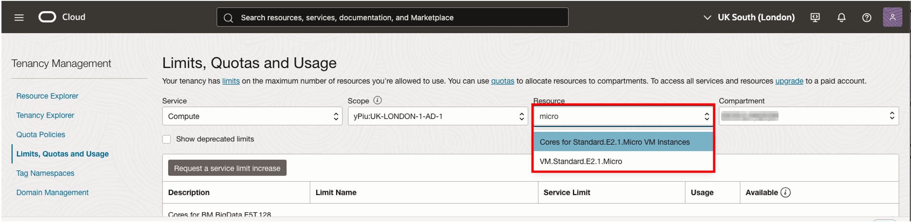
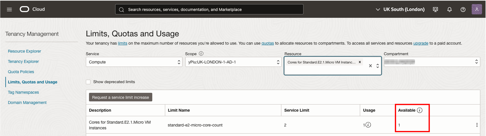
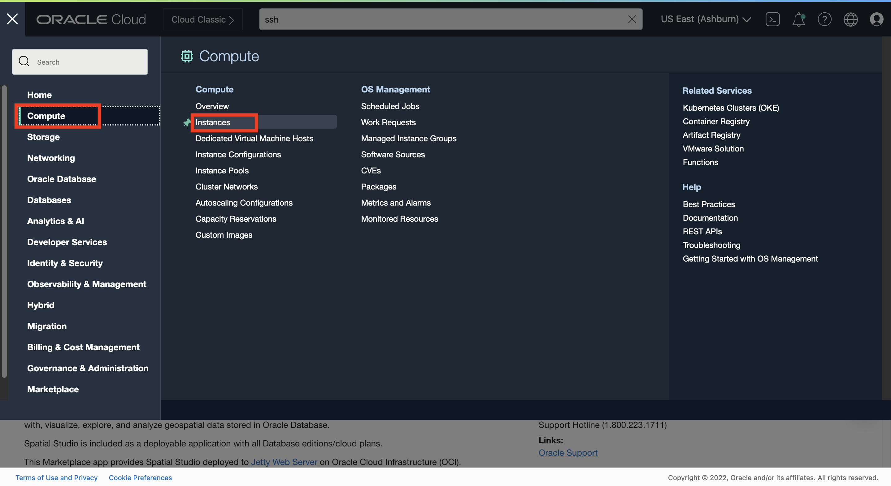
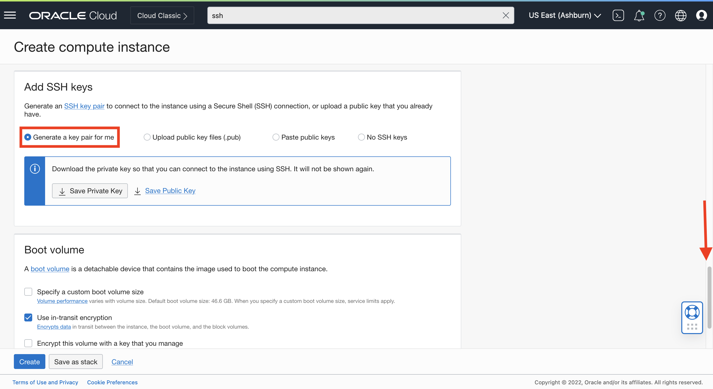
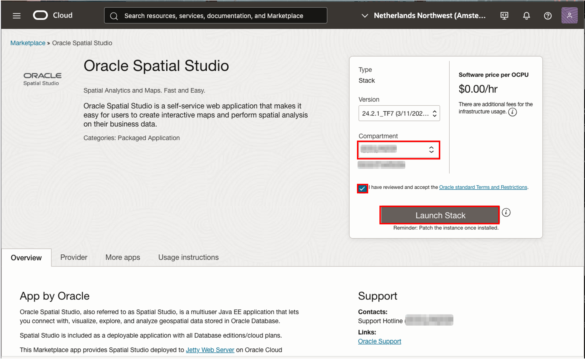
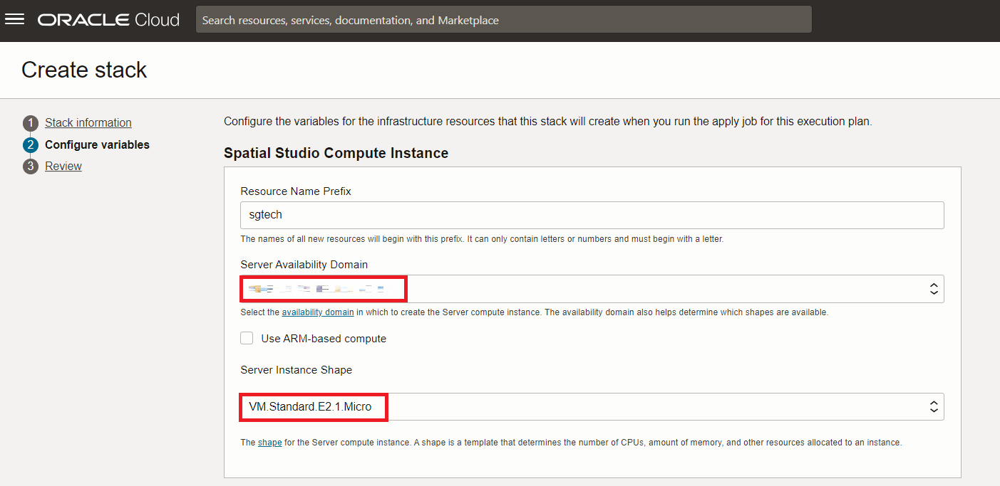
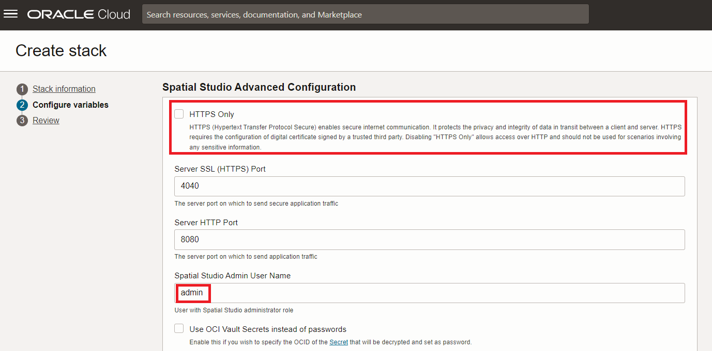
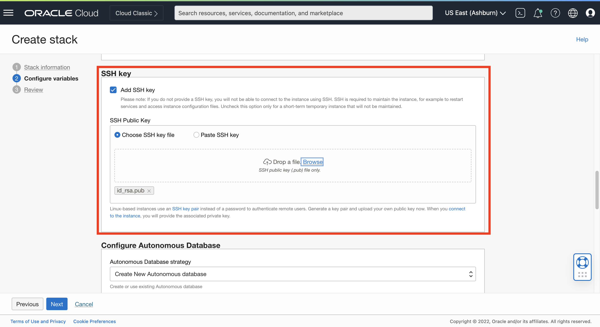
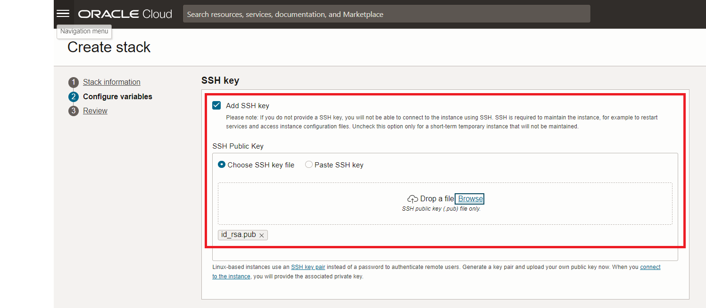
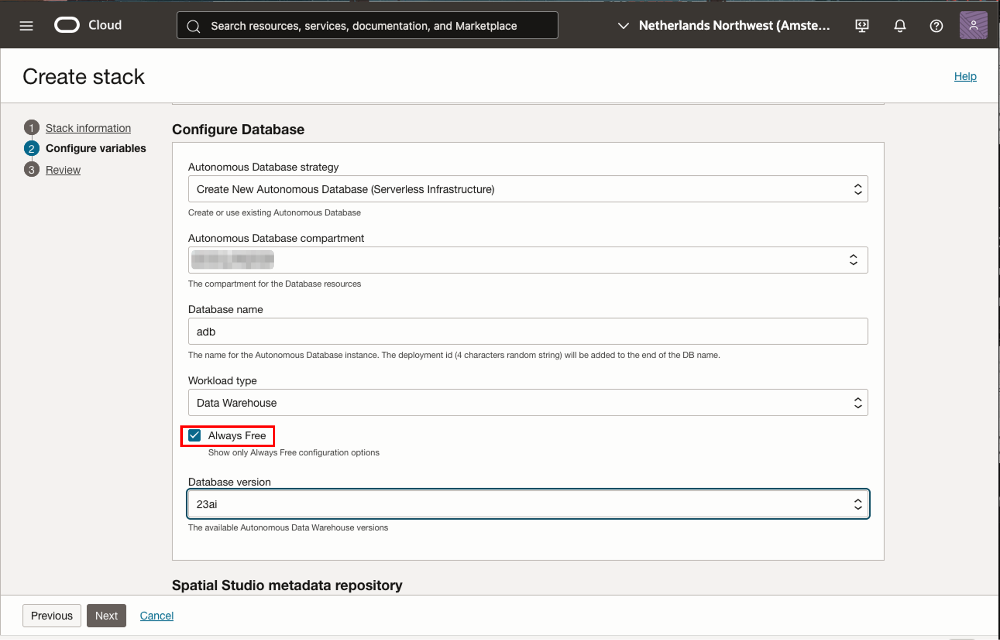

# Install Spatial Studio

## Introduction

This lab walks though the process of provisioning Oracle Spatial Studio (Spatial Studio) using the Oracle Cloud Marketplace.  The Oracle Cloud Marketplace provides apps and services provided by Oracle and 3rd parties. Details are available [here](https://docs.oracle.com/en/cloud/marketplace/marketplace-cloud/index.html). 

Estimated Lab Time: xx minutes

### Objectives

In this lab, you will:
* Learn how to deploy Spatial Studio to the Oracle Cloud from the Oracle Cloud Marketplace

### Prerequisites

* An Oracle Free Tier, Always Free, Paid or LiveLabs Cloud Account
* Repository schema created (Lab 3).

<!-- *This is the "fold" - below items are collapsed by default* -->

## Task 1: Verify Availability of Compute Resource

If you have a Free Tier account, your compute quota is 2 cores of the Standard.E2.1.Micro VM shape. Before starting the Spatial Studio deployment it is necessary to verify the availability domain having quota for this shape. The same applies for other shapes if you have a paid account. 

1. Navigate to **Governance & Administration > Limits, Quota, and Usage**

   

2. The Scope menu lists availability domains. Select the first availability domain, type **micro** in the Resource menu, and select **Cores for Standard.E2.1.Micro VM Instances**. 

   

3. The result listing shows the service limit (quota), usage, and availability of the selected shape in the selected availability domain. In the example below, there is no availability for the selected availability domain.

  

4. If the selected availability domain does not have quota, change to the next availability domain and again enter **micro** in the Resource menu and select **Cores for Standard.E2.1.Micro VM Instances**. In this case the second availability domain has quota.

 

 Note the availability domain having quota for your target compute shape, as you will need to select it when installing Spatial Studio from the Cloud Marketplace. 

## Task 2: Create SSH Keys (Optional)

**Please note: Adding a SSH key should only be skipped if the Spatial Studio instance will be temporary with no need for ongoing administration. For example an instance only needed for the duration of a workshop.**

The deployment of Spatial Studio from the Cloud Marketplace allows you to add a SSH key. Administration of a Spatial Studio instance, such as restarting the service and accessing instance configuration and log files, requires a SSH key. 

If you will be adding a SSH key, you may use an existing key pair (see requirements [here](https://docs.oracle.com/en-us/iaas/Content/Compute/Tasks/managingkeypairs.htm)), or use the steps below to create a key pair.


1. Navigate to **Compute > Instances**

   

2. Click **Create Instance**

   


2. Scroll down to the section **Add SSH Keys** and select **Generate a key pair for me**.

   

2. Click **Save Private Key** and then save the file when prompted.

   

2. Click **Save Public Key** and then save the file when prompted.

   

2. The download location will depend on your local system and is generally a Downloads folder in your home directory. Note the location of your key pair files. You will use them when deploying Spatial Studio with the Cloud Marketplace wizard. 

   

2. Click **Cancel** to dismiss the wizard.

   


## Task 1: Install Spatial Studio from Marketplace

1. Click the hamburger icon at the top left to open the main Navigation Menu. Select **Marketplace** and then click **All Applications**.

   

2. Search for **spatial** and then click on the **Oracle Spatial Studio** app

   

3. Review the Usage Instructions

   
 
4. Select the compartment for the installation, accept the terms and conditions, and click **Launch Stack**

   


5. Accept defaults and click **Next**

   

2. Select Availability Domain having quota, as you identified in Task 1.  Select you desired instance shape. The Always Free shape will be VM.Standard.E2.1.Micro.

   

     Then scroll down.

4. Leave the defaults and enter a password for the Spatial Studio admin user.
  
   

    Then scroll down.

5. SSH keys enable access to the Spatial Studio server for instance administration. 
      
   Option 1: If the Spatial Studio instance will be maintained then supply your SSH key. 

   
   
   Option 2: If the Spatial Studio instance is temporary, for example for the duration of a tutorial, then uncheck Add SSH key. 

   

  Then scroll down.

6. Spatial Studio requires access to an Oracle Database. The following options are available:

   

   - **Create New Autonomous Database:**: Have an Autonomous Database created and configured for you.
   - **Use Existing Autonomous Database**:  Configure an existing Autonomous Database for you.
   - **Configure later**: Defer database configuration and do it yourself after Spatial Studio is installed.
 
    The following shows the first option, where an Autonomous Database is created and configured for you.

     

  Accept the defaults and scroll down. Enter a password for the Spatial Studio repository (i.e. metadata) user. Then click **Next**.

      


7. 
8.  
9.  to keep the Spatial Studio instance is Leave the defaults and enter a password for the Spatial Studio admin user.
  
   

    Then scroll down.


4. For networking, you have the option to automatically create a new VCN or an existing one. Select the Compartment for creating a new VCN or searching for existing VCNs. 
   
   The image below shows an example using Create New VCN. To use an existing VCN it must be in the same Availability Domain as selected above in Step 2. If you do not have other existing VCNs then the remaining defaults can be left as is. If you do have other existing VCNs then update the CIDR values to avoid conflict. 

  

  Scroll down to the SSH Keys section.

5. Loading a SSH public key enables access to Spatial Studio's file system for administrative purposes. The dialog has links to general SSH connection documentation. Submit your SSH public key by browsing to the key file or copy-pasting the key string. If you load you SSH public key from a file, the key file name will be displayed as shown in the image below. Click Next.

  

6. Review the summary of your entries. If corrections are needed then click Back. Otherwise click Create to start the deployment process. You will be redirected to a Job Details page for the deployment.  

   

## Task 3: Monitor Deployment Progress

1. The Logs section at the bottom of the Job Details page will show progress. It will initially display a spinner while setting up for deployment. 

  

   After a couple minutes you will see log information.

  

2. Scroll down to the bottom of the logs section. When complete you will see Apply Complete! followed by instance details. The last item listed is the Spatial Studio public URL. Copy this URL and paste into a browser.

  

## Task 4: First-Time Login

1. Opening the Spatial Studio public URL for the first time will display a browser warning related to privacy and security. The specific warning depends on your platform and browser. 

  

  This is not a Spatial Studio issue; it is generic to  access of web sites that do not have a signed HTTPS certificate. Loading and configuring a signed certificate removes this warning. However the process of loading certificates in Jetty is beyond the scope of this workshop. 

  Click the link to continue to the website.

2. Enter the Spatial Studio admin user name (default is admin) and the password you entered in the Step 2 (Create Stack wizard, item 3). Then click Sign In.

  

3. On the first login to a Spatial Studio instance, you are prompted for connection information for the database schema to use as the Spatial Studio's metadata repository. This is the database schema used for all of Spatial Studio's metadata and can also be used by Spatial Studio admin users for storing other data. You will use the schema created in Lab 3 so select Oracle Autonomous Database and click Next.

    

4. Browse to (or or drag-and-drop) the Wallet file saved in Lab 3. After loading, the wallet file name will be listed as Selected Wallet. Click OK.

    

5. Enter the user name and password defined in Lab 2 and the service. Medium service level is appropriate for this workshop. Click OK.

    

6. Wait for a few moments while Spatial Studio makes its initial connection to the schema and creates several metadata tables. When finished, Spatial Studio will open with Getting Started information.

    


## Task 5: Load Data and Create a Map 

To verify that Spatial Studio is operating properly, you will load, prepare, and visualize a small data sample. The data contains a list of museums including name and address. You will geocode the data and visualize the data on an interactive map.

1. You will not create a connection here since you can use the Spatial Studio repository connection for this verification. Click the tile to **Create Dataset**. 

    

2. Download the data sample file [here](https://objectstorage.us-ashburn-1.oraclecloud.com/p/VEKec7t0mGwBkJX92Jn0nMptuXIlEpJ5XJA-A6C9PymRgY2LhKbjWqHeB5rVBbaV/n/c4u04/b/livelabsfiles/o/data-management-library-files/sf_area_museums.xlsx) and save to convenient location. Then drag and drop the file to the file upload tile.  You can also click on the file upload tile and navigate to the file.
   
    

3.  In the data preview, set the upload Connection to SPATIAL\_STUDIO and set the data type for POSTAL_CODE to String. Then click **Submit**.

   

4. When the upload is complete, the dataset will be listed with a warning icon indicating actions need to be taken. Click on the warning icon and then click the link **Go to Dataset Columns** in order to assign a key column.

    

5. Select NAME as the key and then click **Validate key**. 

   

   After you validate the key, click **Apply**. 

6. Again click the warning icon and then click the button to **Geocode Addresses** to convert addresses to coordinate locations for map visualization.

   

7. Observe that the ADDRESS and POSTAL\_CODE columns were automatically detected for use in geocoding. Accept the defaults and click **Apply**.  

   

  When geocoding is complete you are returned to the Datasets page.

8. Click on the action menu for the SF\_AREA\_MUSEUMS dataset and select **Create Project**.
   
    

9. Click and drag the SF\_AREA\_MUSEUMS dataset and drop anywhere on the map.

   

  The SF\_AREA\_MUSEUMS dataset will be added as a map layer, and the map will pan and zoom to the area of the data.

10. Click on the action menu for the SF\_AREA\_MUSEUMS layer and select **Settings**

    

11. Style the map layer by selecting a color and opacity of your choosing.

    

12. Click on the **Interaction** tab, enable **Show info window**, and select all columns. Then click on an item in the map to see an info window with the data values for the selected item.
  
   

  This verifies that basic data preparation and visualization is functioning properly.
 
13. Click on the left navigation panel button to return to the Datasets page. Select the option to **Discard Changes** since you do not need to preserve this test.
    
    

14. With verification complete, you can delete the test Dataset and database table.  Click on the action menu for SF\_AREA\_MUSEUMS and select **Delete**

     

15. Select the option to delete the database table and click **OK**.

   

Oracle Spatial Studio is now provisioned and tested. The following Lab provides steps to tear down Spatial Studio when no longer needed.

## Task 6: Uninstall Spatial Studio (When No Longer Needed)

 **If you would like to fully remove your Marketplace deployment, proceed with the following.**

1. Click the **Navigation Menu** in the upper left, navigate to **Developer Services**, and select **Stacks**.

	

2. Choose the Compartment and Name used in STEP 2. In the example shown below, a compartment named sandbox and Stack named Oracle Spatial Studio was used.

    

3. Select Terraform Actions > Destroy

    

  You will be prompted to confirm. This will remove the Compute and Network artifacts created by the Marketplace deployment.

4. After removing the Spatial Studio app, your repository schema remains in place. 
   To remove the repository schema, connect to the database as **admin** as done in Lab 3 and run the following. 

      ```
      <copy>DROP USER studio_repo CASCADE;</copy>
      ```


## Learn More
* [Spatial Studio product page](https://oracle.com/goto/spatialstudio)

## Acknowledgements
* **Author** - David Lapp, Database Product Management
* **Last Updated By/Date** - David Lapp, Database Product Management, March 2021

