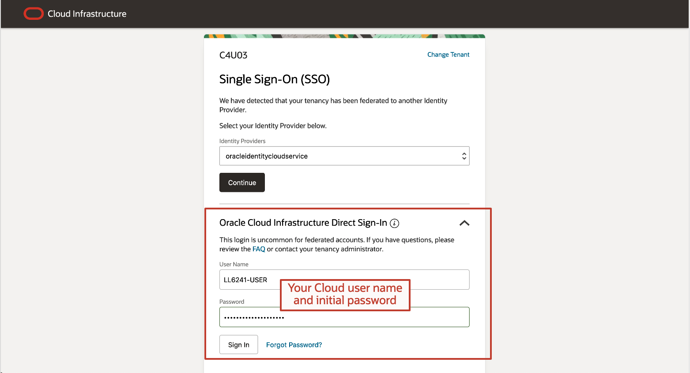
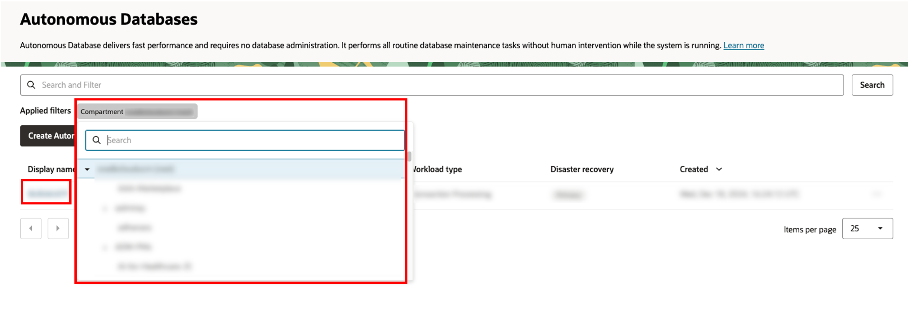
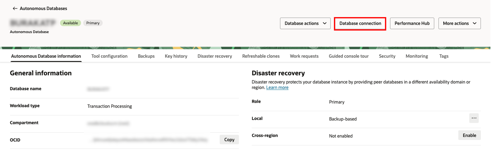

# Access Spatial Studio

## Introduction

This lab walks through the process of accessing Oracle Spatial Studio (Spatial Studio) from an Oracle LiveLabs reservation. Your environment includes Spatial Studio and an Autonomous Database. On the first login to Spatial Studio you will provide connection information for your Autonomous Database.

Estimated Lab Time: 10 minutes

### Objectives

In this lab, you will:

* Download the Cloud Wallet for your Autonomous Database
* Perform 1st-time login to Spatial Studio supplying Autonomous Database connection info

### Prerequisites

* A completed LiveLabs reservation for "Introduction to Oracle Spatial Studio"

<!-- *This is the "fold" - below items are collapsed by default* -->

## Task 1: Download Cloud Wallet for your Autonomous Database

1. In Workshop Details, note your Cloud username, password, Compartment, and Spatial Studio IP address. Then launch the Cloud Console.

 

2. Sign-in using **Oracle Cloud Infrastructure Direct Sign-in** using your Cloud user name and initial password. You will be prompted to change the default password.

 

3. Navigate to **Oracle Database** and then **Autonomous Database**.

 

4. In the Compartment form on the left, start typing your Compartment name noted earlier. This will dynamically filter the Compartments list. Once listed, select your Compartment. Your Autonomous Database will then be listed. Click on the link to your Autonomous Database.

 

5. Click on **Database Connection**. 

 

 Then **Download Wallet**. You will prompted for a wallet password. Enter any string as this password will not be used. Save the wallet to a convenient location on your computer as you will use it in the next step.

 

## Task 2: Spatial Studio First-Time Login

1. You will now use the Spatial Studio IP address you noted earlier. Open a new tab in your browser and navigate to **https://[your Spatial Studio IP address]:4040/spatialstudio**. For example, if your Spatial Studio IP address is 123.123.12.123 then you would navigate to https://123.123.12.123:4040/spatialstudio. Because your Spatial Studio instance is not configured with a signed SSL certificate you will see a browser-specific security warning. Accept the warning and proceed to the site. In a production environment a certificate would be configured and this would not occur. Log in with user **admin** and password **welcome1**.

 

2. First-time login to Spatial Studio prompts you to enter database connection information for Spatial Studio's metadata repository. Click **Autonomous Database** and then **Next**. On the next screen, drag and drop the wallet file you downloaded previously and click **Ok**.

 

3. You are now prompted for Autonomous Database connection information. Enter the user **studio_repo**, password **Welcome1Welcome1**, and select the medium service level.

 

 Spatial Studio is now building its metadata tables in Autonomous Database. This will take roughly 30 seconds.

4. When Spatial Studio opens, the first-time login is complete and you are ready to proceed with the workshop.

 

You may now [proceed to the next lab](#next).

## Learn More

* [Oracle Spatial product page](https://www.oracle.com/database/spatial-database/)

## Acknowledgements

* **Author** - David Lapp, Database Product Management
* **Contributors** - Renée Wikestad, Database Product Management
* **Last Updated By/Date** - Denise Myrick, Database Product Management, August 2025
