# Load Spatial Data

## Introduction

Spatial Studio operates on data stored in Oracle Databases. In Spatial Studio you work with "Datasets", which are database tables and views accessed through database connections. Datasets are pointers to database tables and views, and may be given friendly names to be more self-describing than the underlying database table or view name.  

Users often need to incorporate data acquired from various sources. To support this, Spatial Studio provides features for loading data from standard formats to Oracle Database.  This includes loading the 2 most common formats for exchange of spatial data: Shapefiles and GeoJSON files. This lab walks you through the steps to load spatial data in these formats using Spatial Studio. 

In addition to loading spatial formats, Spatial Studio supports loading spreadsheets. In that case, additional preparation is needed to derive geometries from spatial attributes such as addresses ("address geocoding") and latitude/longitude coordinates ("coordinate indexing"). Those cases are not covered in this lab but will be the subject of a separate lab.

Estimated Lab Time: 15 minutes

### Objectives

* Learn how to load spatial data from Shapefiles and GeoJSON
* Learn how to set key fields for datasets

### Prerequisites

* This lab requires access to Spatial Studio and Oracle Database. 
* Before you get started, complete the workshop [Install Oracle Spatial Studio from Cloud Marketplace ](https://apexapps.oracle.com/pls/apex/dbpm/r/livelabs/view-workshop?wid=778)
* No previous experience with Oracle Spatial is required.

## Task 1: Load Accidents data

You begin by loading a set of traffic accident data from a GeoJSON file. The data are  are fictitious and were generated for random locations along roadways in South Africa.. 

1. Download GeoJSON file to a convenient location: <a href="https://objectstorage.us-ashburn-1.oraclecloud.com/p/VEKec7t0mGwBkJX92Jn0nMptuXIlEpJ5XJA-A6C9PymRgY2LhKbjWqHeB5rVBbaV/n/c4u04/b/livelabsfiles/o/data-management-library-files/accidents.geojson">  accidents.geojson  </a>

2. In Spatial Studio, from the left panel menu navigate to the Datasets page, click **Create Dataset**, and drag-and-drop accidents.geojson. You can also click on the upload region and navigate to select the file.
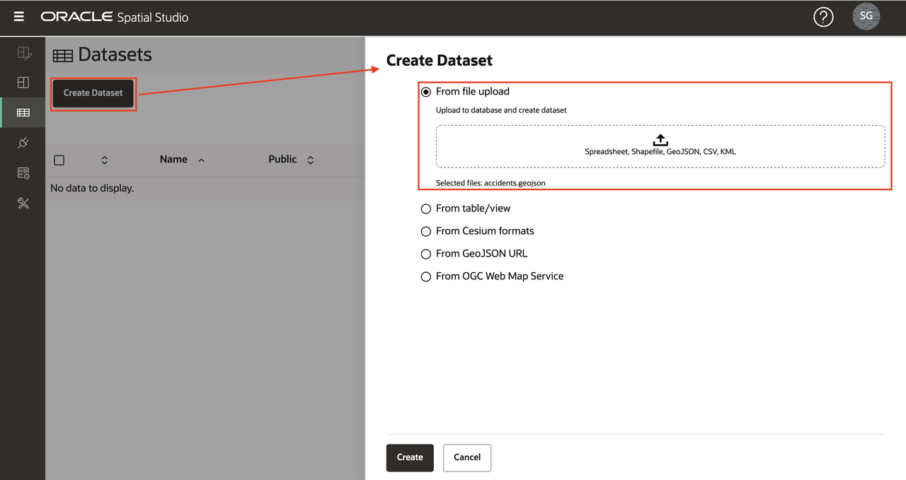

3. A preview of the GeoJSON data will be displayed. Select the destination Connection for this upload. In this workshop we are using the SPATIAL_STUDIO connection (the Spatial Studio metadata repository), but in a production scenario you would have other connection(s) for such business data, separate from the metadata repository. Click **Submit** to initiate the upload.
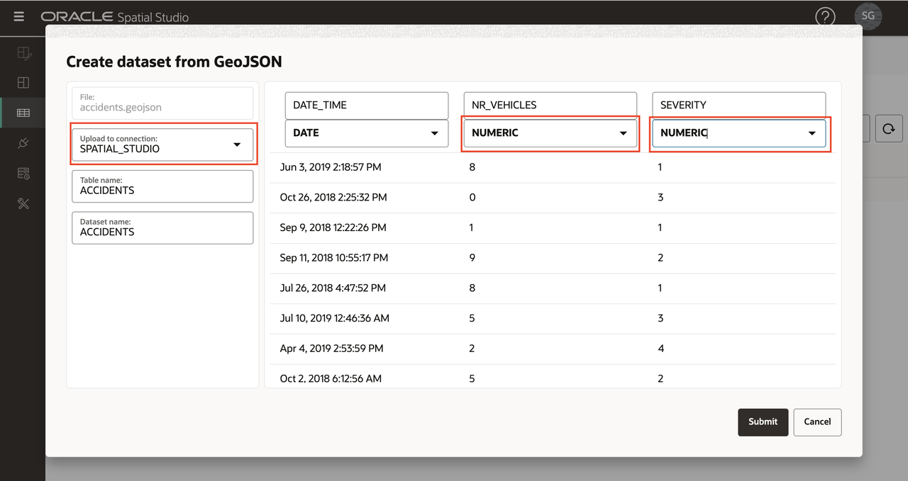

4. The uploaded ACCIDENTS Dataset will be listed with a small warning icon to indicate that a preparation step is needed. In this case we need to add a Dataset key. Although this is not needed for basic mapping, we will add the key now since we'll need it for analyses in later workshop sections. Click on the warning icon and then click the link **Go to Dataset Columns**
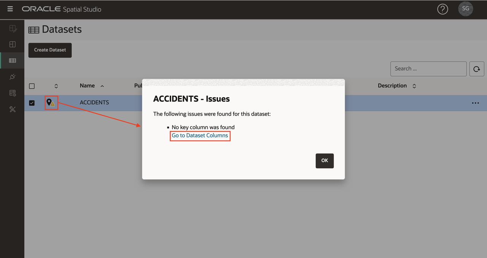

5. If our ACCIDENTS data had a unique identifier column we could assign it as a key. But this ficticious data does not have such a column, so we will have Spatial Studio create one. Click **Create Key Column**, set the name as ACCIDENT_ID, and click **Apply**.
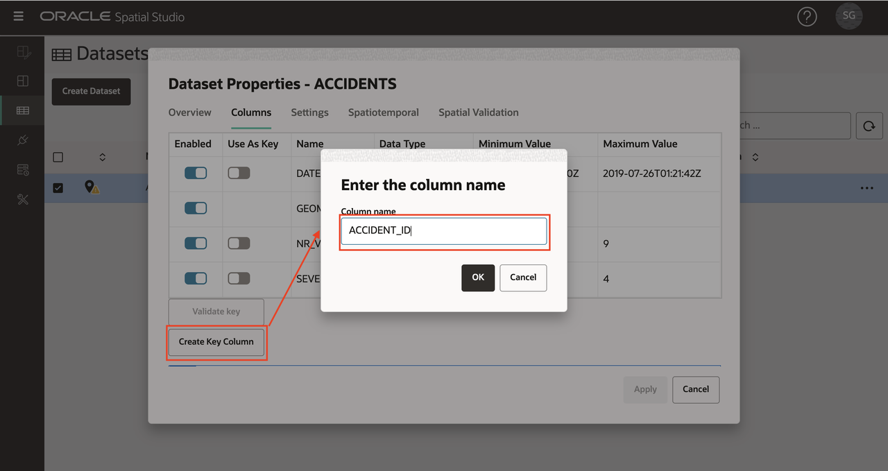
Observe the ACCIDENTS dataset now listed with no warnings, meaning that is prepared for mapping and spatial analyses.
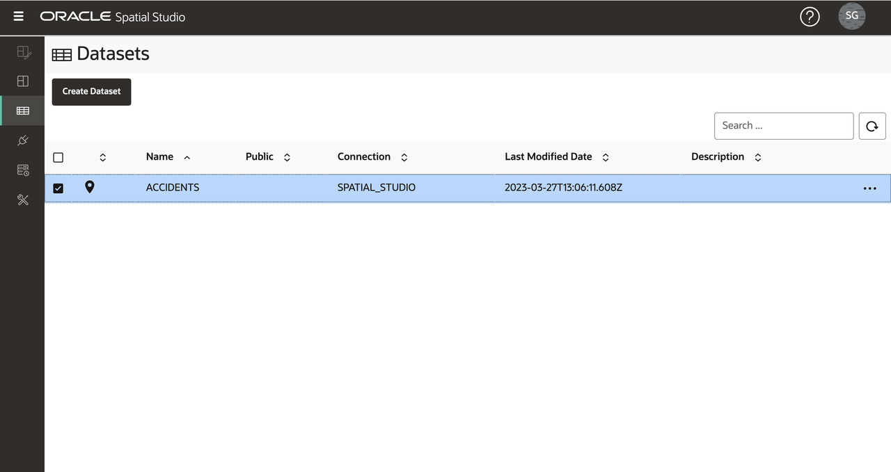

## Task 2: Load Police Station data
Next you load South African Police Servce (SAPS) Stations and Station Boundaries from Shapefiles stored in a single zip file. 

1. Download zip file containing Shapefiles to a convenient location: <a href="https://objectstorage.us-ashburn-1.oraclecloud.com/p/VEKec7t0mGwBkJX92Jn0nMptuXIlEpJ5XJA-A6C9PymRgY2LhKbjWqHeB5rVBbaV/n/c4u04/b/livelabsfiles/o/data-management-library-files/SAPS_police.zip"> SAPS_police.zip </a>  

2. Navigate to the Datasets page, click **Create Dataset**, and drag-and-drop SAPS_police.zip  Spatial Studio will extract the Shapefiles from the zip file and process them individually. 
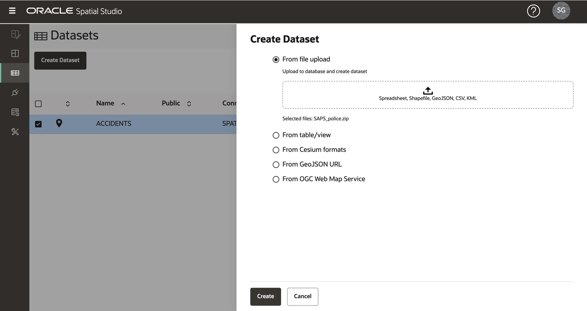

3. The first Shapefile extracted will be Police Station Boundaries, i.e., the geographical areas patrolled by stations. Select the destination Connection, and set the table and Dataset names to POLICE_BOUNDS.
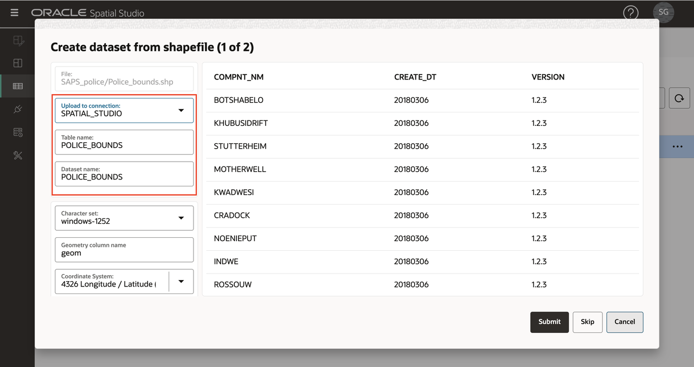

4. The second Shapefile extracted will be Police Stations. Select the destination Connection, and set the table and Dataset names to POLICE_POINTS.
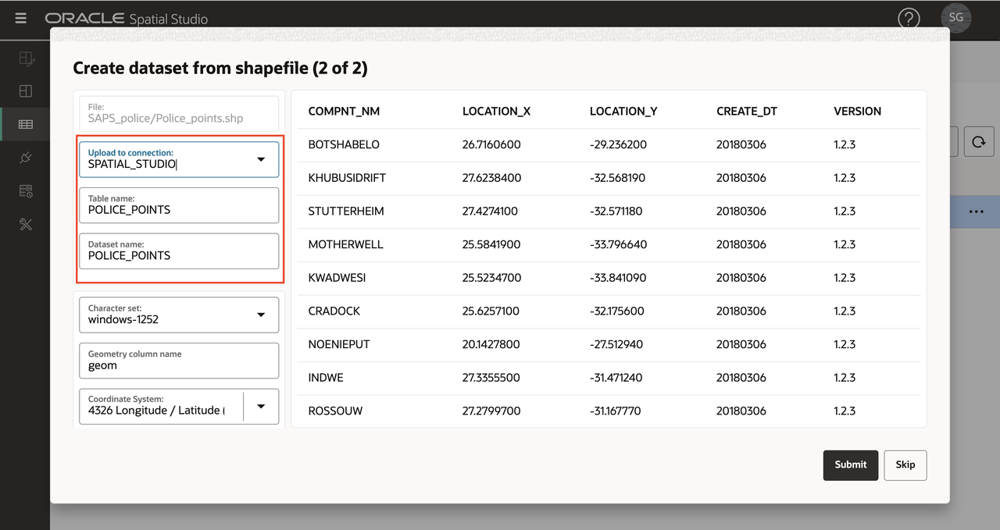

5. The POLICE\_BOUNDS and POLICE\_POINTS Datasets are now listed with warnings since keys needs to be defined. Click on the warning icon for POLICE\_BOUNDS and then click the link **Go to Dataset Columns**.
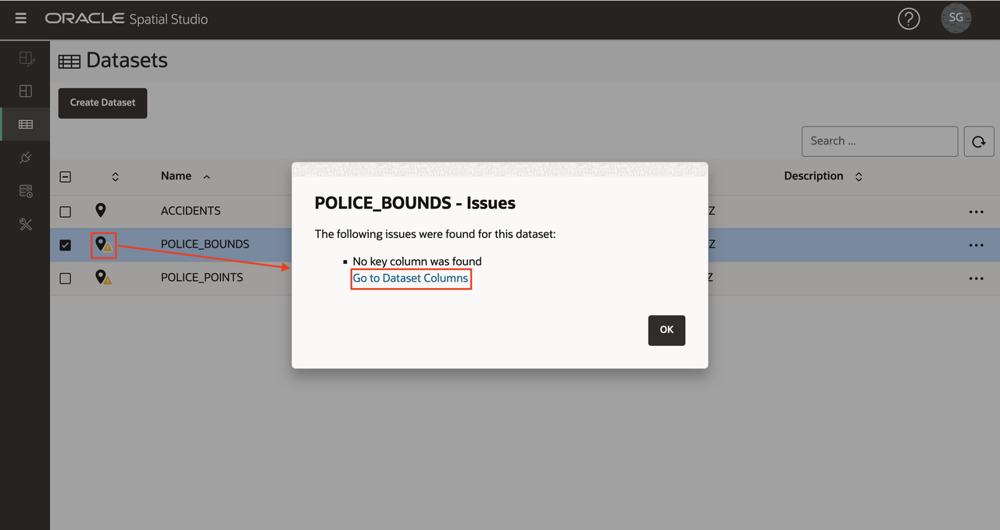 
   
6. In the case we have an existing unique column to use as the key. Select **Use as Key** for column COMPNT\_NAME,  click **Validate key**, and the then click **Apply**. 
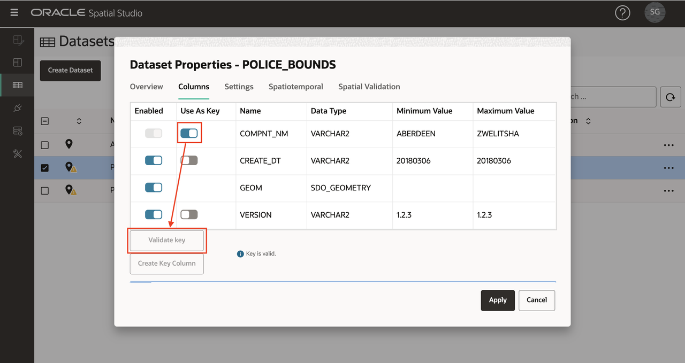

   Repeat steps 5 and 6 to set the key for Dataset POLICE_POINTS.

7. All Datasets are now ready for mapping and spatial analysis 
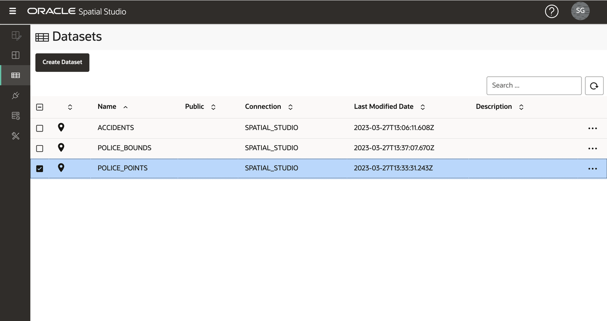

You may now [proceed to the next lab](#next).

## Learn More
* [Spatial Studio product portal] (https://oracle.com/goto/spatialstudio)

## Acknowledgements
* **Author** - David Lapp, Database Product Management, Oracle
* **Last Updated By/Date** - David Lapp, Database Product Management, April 2021
* **Lab Expiry** - March 31, 2022
