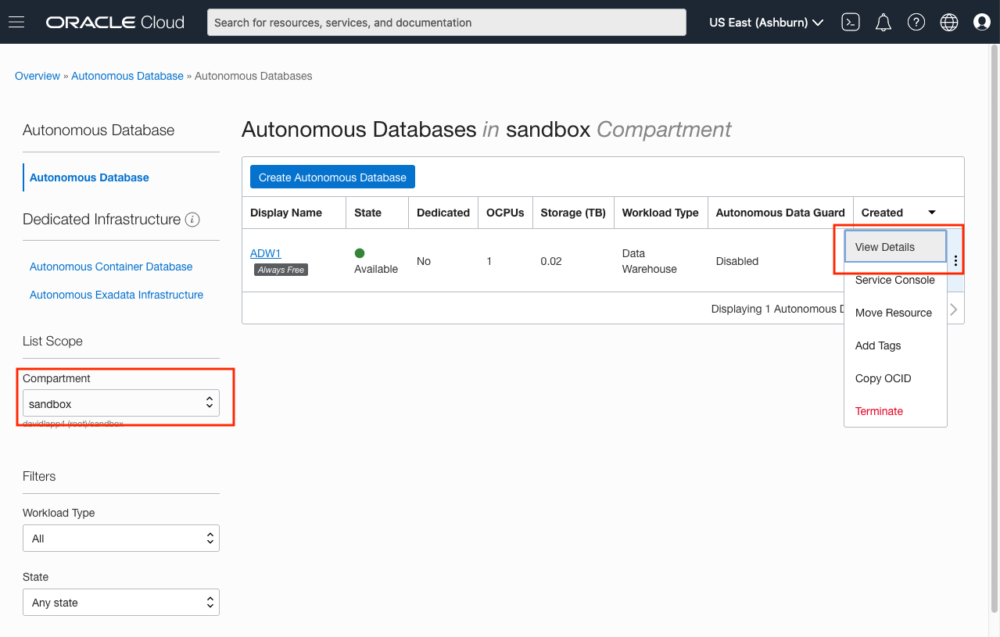
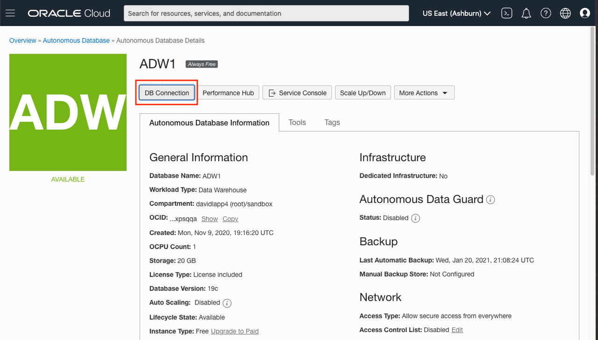
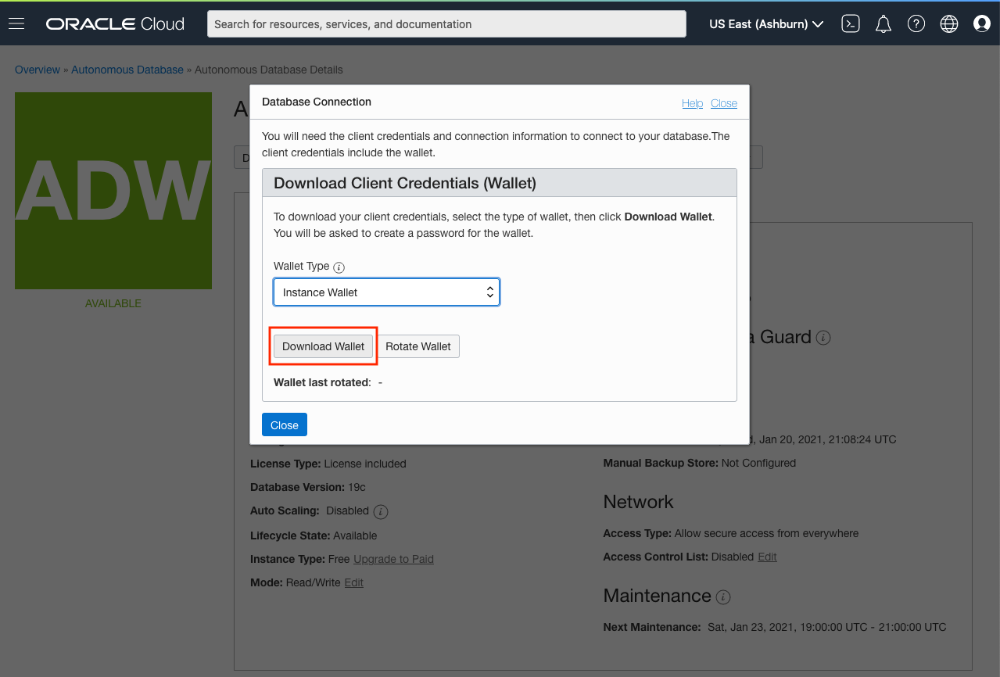

# Database User for Spatial Studio Repository

## Introduction

This lab walks though the creation of the database schema to be used for Spatial Studio's metadata repository. This is the schema that will store the work you do in Spatial Studio, such as the definitions of Datasets, Analyses, and Projects.

The database schema for Spatial Studio's repository can technically have any name. For consistency with other Spatial Studio workshops, we name the user user name **studio\_repo**.  Note that this is a database user name and is distinct from Spatial Studio application user names such as the default Spatial Studio administrator user name (studio_admin) created when we install the Spatial Studio app itself.

Estimated Lab Time: 5 minutes

### Objectives

* Learn how to create schema for Spatial Studio metadata repository
* Learn how to download Wallet for database connection

### Prerequisites

* An Oracle Free Tier, Always Free, Paid or LiveLabs Cloud Account
* Access to database SQL Developer Web.

<!-- *This is the "fold" - below items are collapsed by default*  -->

## Task 1: Create Repo Schema

1. In SQL Developer Web, connect to the Autonomous database to be used for the Spatial Studio repository as the **admin** user

2. Create the schema for the Spatial Studio repository. The schema can have any name, but for consistency with other labs we use the name **studio_repo**. Password requirements for Oracle Autonomous Database is [here](https://docs.oracle.com/en/cloud/paas/autonomous-database/adbsa/manage-users-create.html#GUID-72DFAF2A-C4C3-4FAC-A75B-846CC6EDBA3F). Make note of the password you select, as we will use it in later steps.

    ```sql
   <copy>CREATE USER studio_repo
   IDENTIFIED BY <password goes here>;</copy>
    ```

## Task 2: Assign Tablespace Quota

1. Assign default tablespace to Spatial Studio repository schema.  With Autonomous Database you can use tablespace name **data**

    ```sql
   <copy>ALTER USER studio_repo
   DEFAULT TABLESPACE data;</copy>
    ```

2. Assign tablespace quota to Spatial Studio repository schema. Spatial Studio's metadata occupies a very small amount of storage. So the quota primarily accommodates business data stored in the repo schema. For this lab, a quota value of **250M** is fine. You can also set the value to **unlimited** if you will experiment with other datasets.

    ```sql
   <copy>ALTER USER studio_repo
   QUOTA <quota value> ON data;</copy>
    ```

## Task 3: Grant Permissions

1. Grant the following permissions to the Spatial Studio repository schema user

      ```sql
      <copy>
      GRANT CONNECT,
            CREATE SESSION,
            CREATE TABLE,
            CREATE VIEW,
            CREATE SEQUENCE,
            CREATE PROCEDURE,
            CREATE SYNONYM,
            CREATE TYPE,
            CREATE TRIGGER
      TO  studio_repo
      </copy>
      ```

The studio_repo schema is now ready to be used as your Spatial Studio repository.

## Task 4: Download Wallet

   A Wallet is required for Spatial Studio to connect to the Autonomous Database repo schema we have created. We will use the Wallet in the next Lab.

1. Navigate to your Autonomous Database and select View Details

   

2. Select the DB Connection tab

   

3. Click Download Wallet
   ..
   

   You will be prompted to enter a password for the Wallet file. The Wallet is a single zip file.

4. Save the Wallet file to a convenient location. You will need this file in the next Lab.

You may now [proceed to the next lab](#next).

## Acknowledgements

* **Author** - David Lapp, Database Product Management, Oracle
* **Last Updated By/Date** - David Lapp, Database Product Management, March 2023


