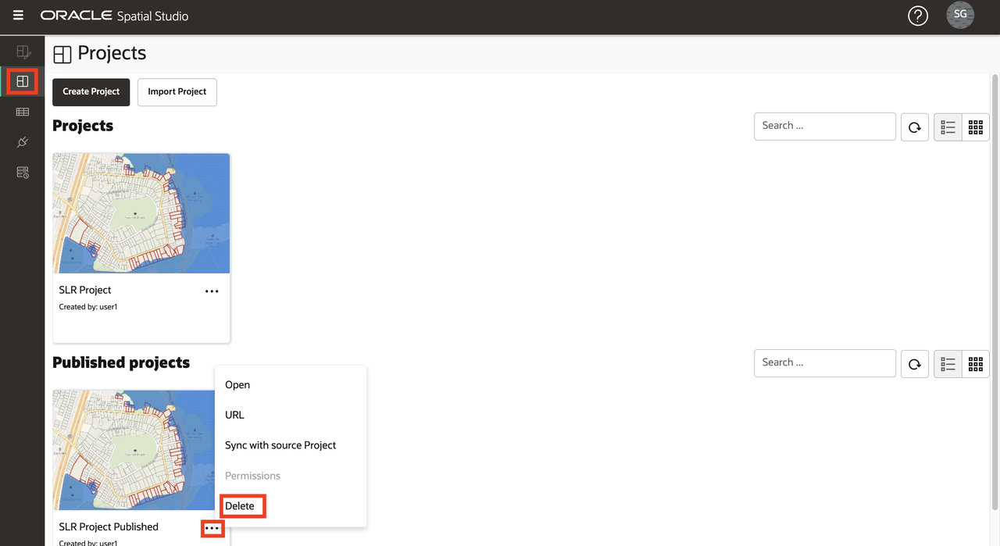
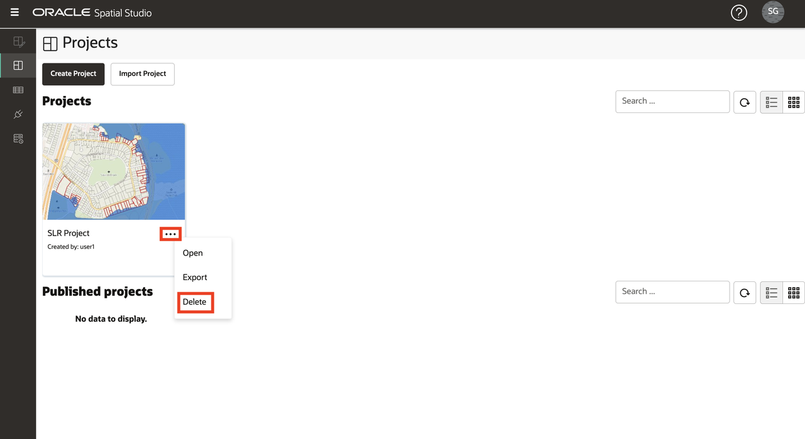
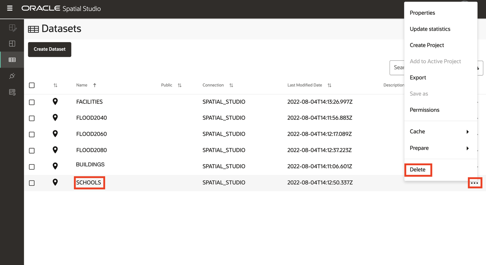
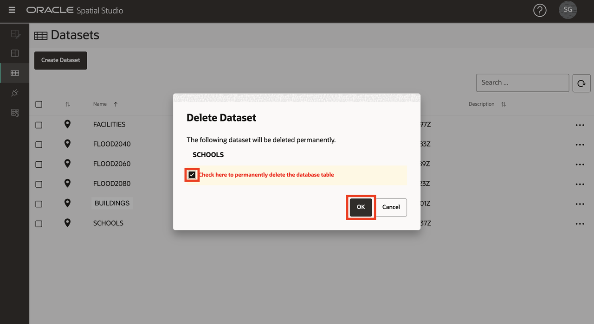

# Reset Spatial Studio and ADB to pre-workshop state

## Introduction

This lab is to remove everything created in the previous labs so that you can start over if needed.

Estimated Lab Time: 5 minutes

Watch the video below for a quick walk-through of the lab.

[Reset Spatial Studio and ADB to pre-workshop state](videohub:1_z4mhzd51)

### Objectives

In this lab, you will:

* Remove Spatial Studio and ADB artifacts created in the previous labs.

### Prerequisites

* Spatial Studio deployed from the Oracle Cloud Marketplace

<!-- *This is the "fold" - below items are collapsed by default* -->

## Task 1: Delete Projects

1. Navigate to the **Projects** page. From the action menu for Published Project(s), select the option to **Delete**.

   

2. From the action menu for Project(s), select the option to **Delete**.

   

## Task 2: Delete Datasets

1. Navigate to the **Datasets** page. From the action menu for **SCHOOLS IN FLOOD2060** analysis dataset, select the option to **Delete**.

   

2. Repeat the previous step for other analyses datasets in the following order: 1) BUILDINGS FLOOD CONTACT, 2) FACILITIES NEAR FLOOD2060 DISTANCE,  3) FACILITIES NEAR FLOOD2060

3. From the action menu for the FACILITIES dataset, select the option to **Delete**.

   

4. In the confirmation popup, select the option to drop the associated database table.

   

5. Repeat for all remaining datasets.

Spatial Studio and ADB are now reset to their pre-workshop state.

## Learn More

* [Oracle Spatial product page](https://www.oracle.com/database/spatial)
* [Get Started with Spatial Studio](https://www.oracle.com/database/technologies/spatial-studio/get-started.html)
* [Spatial Studio documentation](https://docs.oracle.com/en/database/oracle/spatial-studio)

## Acknowledgements

- **Author** - David Lapp, Database Product Management, Oracle
- **Contributors** - Denise Myrick
- **Last Updated By/Date** - David Lapp, August 2023
