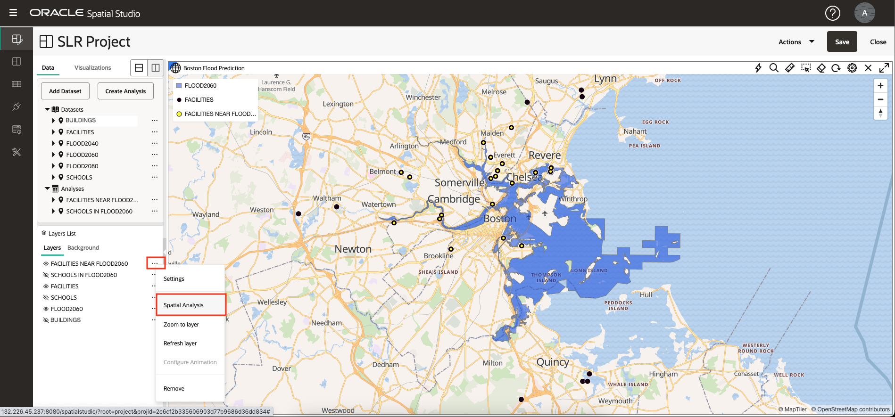

# Analyze spatial relationships

## Introduction

In this lab you perform a series of spatial analyses to identify the relationships between a projected flood region and cultural features. You create the analyses without coding and then visualize results in maps and tabular form.

Estimated Time: 30 minutes

Watch the video below for a quick walk-through of the lab.

[Analyze spatial relationships](videohub:1_u0a3coe3)

### Objectives

* Learn how to perform self-service spatial analyses, without the need to write code.
* Learn how to access the underlying spatial query code if desired.

### Prerequisites

* Completion of Lab 3: Visualize spatial data

## Task 1: Identify schools in the projected flood area

You begin by performing an analysis to filter schools based on containment in a projected flood region.

1. To focus on schools and the projected flood area, turn visibility off for FACILITIES and BUILDINGS. Then from the action menu for FLOOD2060, select **Zoom to layer**.

   

2. From the action menu for SCHOOLS, select **Spatial Analysis**. This opens the dialog to access the spatial analysis features of Oracle Database.

   

3. You will apply a spatial filter on schools based on containment in the projected flood area. So select the tab for **Filter** and click on the tile for **Return shapes that are inside another**.

   

4. For Analysis name, enter **SCHOOLS IN FLOOD2060**. For Layer to be filtered select **SCHOOLS LON&LAT** and for Layer to use as the filter select **FLOOD2060.GEOM**. Then click **Run**.

   

5. Observe your analysis listed under Analyses. Click and hold on your analysis, and then drag and drop onto the map. As you've done previously, change the style of the layer: open the action menu for **SCHOOLS IN FLOOD2060** , select **Settings** and change the color to red fill with white stroke (outline).

   

   **Note:** You can hover over a Layer, Dataset, or Analysis name that is truncated to see its full name in a tooltip.

6. To view the results of your spatial analysis in tabular form, click on the **Visualizations** tab and then drag and drop a table next to the map. You may drop the table on any edge of the map.

   

7. Click on the **Data** tab and then click and hold on your analysis, and then drag and drop into the table view.

   

8. Technical details behind analyses are available. From the action menu for you analysis, select Properties.

   

9. In the Properties dialog, observe the section showing the analysis SQL.  In particular, note the SDO\_INSIDE operator which performs the spatial filter. The SQL is slightly more involved than the most generic example because it involves a function-based spatial index for schools instead of a geometry column, and also wraps the main query with an outer SELECT to de-duplicate schools in the event that a school was inside multiple regions.

   Note also the automatically generated endpoint that streams the analysis results in GeoJSON format for consumption by any standards-based mapping client.

   When done, click **Cancel** and then click on the **X** to close the table view.

   

10. In Spatial Studio, analyses are themselves Datasets. In the main navigation panel click on the button for the **Datasets** page. Observe your analysis is listed so that it could be used in other projects, exported, or saved as a table or view.

   

## Task 2: Identify facilities near the projected flood area

You next identify facilities near the projected flood area. This is a spatial filter operation, where the facilities are filtered based on proximity to the projected flood area. This is referred to as a "within distance" operation.

1. In the main navigation panel click on the button to return to your **Active Project**. Adjust layer visibility so that the projected flood area and facilities are visible. From the action menu for FACILITIES, select **Spatial Analysis**.

   

2. Click on the tab for **Filter** analyses and then click on the tile for **Return shapes within a specified distance of another**.

   

3. In the analysis dialog, for analysis name enter **FACILITIES NEAR FLOOD2060**, for layer to be filtered select **FACILITIES LONGITUDE&LATITUDE**, and for layer to be used as the filter enter **FLOOD2060.GEOM**.  
   Enter **10** for the distance and select **Kilometer** as the unit. Then click **Run**.

   

4. Before adding the analysis results to the map, change the style of the original unfiltered Facilities layer so that the analysis results are clearly visible. As you have done previously, from the action menu for Facilities select **Settings**. Then change the radius to 6, color to black, and opacity to maximum.

   

5. Drag and drop your **FACILITIES NEAR FLOOD2060** analysis onto the map.

   Then from its action menu select Settings, and then update its size to 3, color to yellow, opacity to maximum, and stroke (outline) to black. The results are clearly visible over the unfiltered FACILITIES layer,

   

6. Spatial Studio allows you to modify the parameters of an analysis. From the action menu for **FACILITIES NEAR FLOOD2060**, select **Modify Parameters**.

   

7. Update the distance to 3, and then click **Run**.

   

8. Observe the map refresh with the updated analysis results.

   

9. Next you will determine the distance of each facility in your analysis result to the projected flood area. From the action menu for **FACILITIES NEAR FLOOD2060** select **Spatial Analysis**.

   

10. Select the tab for **Measure** analyses. Then click the tile for **Calculate minimum distance between shapes**.

   

11. For analysis name enter **FACILITIES NEAR FLOOD2060 DISTANCE**, for column name for result enter **DISTANCE\_KM**, for Geometry 1 select **FACILITIES NEAR FLOOD2060.LATITUDE\_LONGITUDE\_GEOMETRY**, and for Geometry 2 select **FLOOD2060.GEOM**, change Units to **Kilometer**. Then click **Run**.

   

12. For items with a name that is truncated, hover to see a tooltip showing the full name.

   

   To focus on your analysis results, turn off visibility for all layers except FLOOD2060.

13. Drag and drop the **FACILITIES NEAR FLOOD2060 DISTANCE** analysis onto the map and then go its Settings. Set a style of your choosing. Pick **Interaction** from the configuration drop down. Scroll down to the Info Window section. Enable info window and select columns to display including the analysis result column named DISTANCE\_KM. Then, in the map, click on a facility to view the item's information.

   

## Task 3: Identify buildings in contact with the projected flood area

You next identify buildings that have any spatial interaction with the projected flood region. This includes buildings contained in the region, overlapping the region, or touching the boundary.

1. In the layers list, turn on visibility for the BUILDINGS layer. While zoomed out you will only see a portion of the buildings since there are too many to display at such a small scale. From the action menu for BUILDINGS, select **Spatial Analysis**.

   

2. You will identify the buildings making any contact with the projected flood area. So select the tab for **Filter** analyses and then select the tile for **Return shapes having any spatial interaction with another**.

   

3. For name, enter **BUILDINGS FLOOD CONTACT**, for layer to be filtered select **BUILDINGS.GEOM**, and for layer to be used as filter select **FLOOD2060.GEOM**. Then click **Run**.

   

4. Drag and drop your new analysis onto the map. Then for the new map layer, go to Settings to update the style. In the Fill section, drag the opacity slider to 0 so no fill is shown. In the Outline section, change the color to red, opacity to maximum, and width to 2. This will effectively highlight the buildings in contact with the projected flood zone.

   

5. Zoom into an area of your choosing to see buildings with those in contact with the flood area outlined in red. You may experiment with adding a table listing of the results as well.

   

    Optionally enable a tool tip, info window, or table view for your analysis result.

You may now **proceed to the next lab**.

## Learn More

* [Oracle Spatial product page](https://www.oracle.com/database/spatial)
* [Get Started with Spatial Studio](https://www.oracle.com/database/technologies/spatial-studio/get-started.html)
* [Spatial Studio documentation](https://docs.oracle.com/en/database/oracle/spatial-studio)

## Acknowledgements

- **Author** - David Lapp, Database Product Management, Oracle
- **Contributors** - Denise Myrick, Jayant Sharma
- **Last Updated By/Date** - David Lapp, August 2023
