# Load and prepare data

## Introduction

Spatial Studio operates on data stored in Oracle Databases. In Spatial Studio you work with "Datasets", which are database tables and views accessed through database connections. Datasets are pointers to database tables and views, and may be given friendly names to be more self-describing than the underlying database table or view name.

Users often need to incorporate data acquired from various sources. To support this, Spatial Studio provides features for loading data from standard formats to Oracle Database.  This includes loading the 2 most common formats for exchange of spatial data: Shapefiles and GeoJSON files. In addition to loading spatial formats, Spatial Studio supports loading spreadsheets and csv files. In that case, additional preparation is needed to derive geometries from spatial attributes such as addresses ("address geocoding") and latitude/longitude coordinates ("coordinate indexing"). This lab walks you through the steps to load and prepare data in these formats using Spatial Studio.

**Please note the following important information about the public data used in this workshop:**

In this lab you will download a single zip file containing the following:

* **Projected flood regions** simplified from public data published at [https://data.boston.gov/group/geospatial?q=sea+level+rise+flood](https://data.boston.gov/group/geospatial?q=sea+level+rise+flood). Since they have been simplified from their published form, they are not meant to depict the precise extents of the published models
* **Buildings** extracted from public data published at [https://www.mass.gov/info-details/massgis-data-building-structures-2-d](https://www.mass.gov/info-details/massgis-data-building-structures-2-d).  
* **Schools** from OpenStreetMap fetched using [https://wiki.openstreetmap.org/wiki/Overpass_turbo](https://wiki.openstreetmap.org/wiki/Overpass_turbo)
* **TRI Facilities** from the US EPA fetched using [https://edap.epa.gov/public/extensions/TRIToxicsTracker/TRIToxicsTracker.html](https://edap.epa.gov/public/extensions/TRIToxicsTracker/TRIToxicsTracker.html). The Toxics Release Inventory (TRI) is a resource for learning about toxic chemical releases and pollution prevention activities reported by industrial and federal facilities.

Estimated Lab Time: 10 minutes

Watch the video below for a quick walk-through of the lab.

[Load and prepare data](videohub:1_h1cmu08i)

### Objectives

* Learn how to load and prepare spatial data

### Prerequisites

* Complete Lab 1: Deploy Spatial Studio to Oracle Cloud
* No previous experience with Oracle Spatial is required.

## Task 1: Load data

You begin by loading projected flood regions, parcels, schools and facilities from common formats.

1. Download the zip file containing the data to a convenient location: [SpatialStudioSlrData.zip](https://objectstorage.us-ashburn-1.oraclecloud.com/p/jyHA4nclWcTaekNIdpKPq3u2gsLb00v_1mmRKDIuOEsp--D6GJWS_tMrqGmb85R2/n/c4u04/b/livelabsfiles/o/labfiles/SpatialStudioSlrData.zip). The zip file contains the following:

   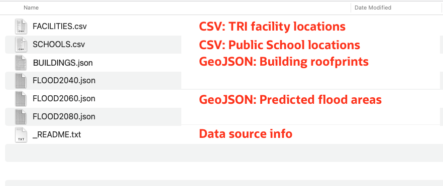

2. In Spatial Studio, from the left panel menu navigate to the Datasets page, click **Create Dataset**, and select **From file upload**. Click on the upload region, navigate to your download location, and select the zip file. You may also drag and drop the file onto the upload region. Then click **Create**.

   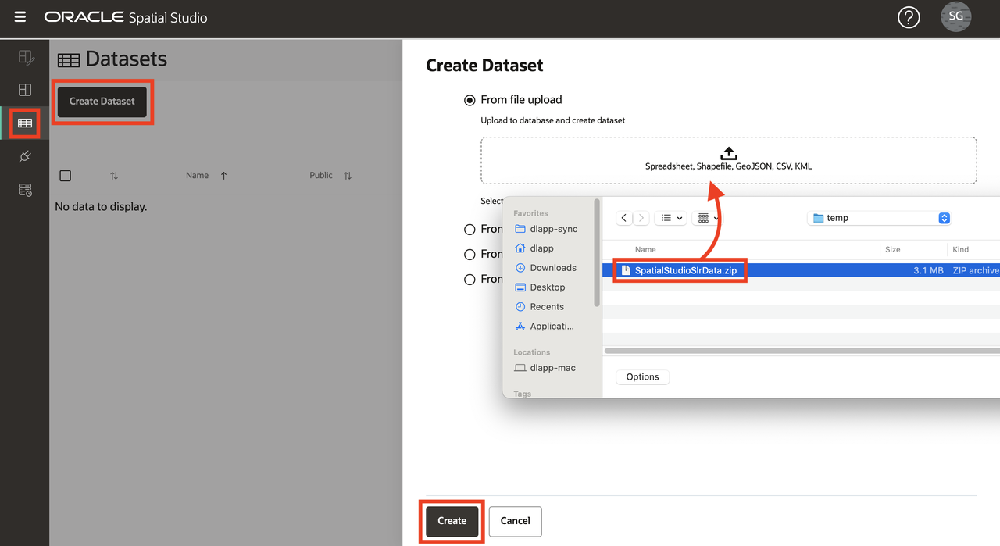

3. A preview of the 1st uploaded file will be displayed. Select the destination Connection for this upload. Select the **SPATIAL\_STUDIO** connection (the Spatial Studio metadata repository). In a production scenario you would have other connection(s) for such business data, separate from the metadata repository. Click **Submit** to initiate the 1st upload.

   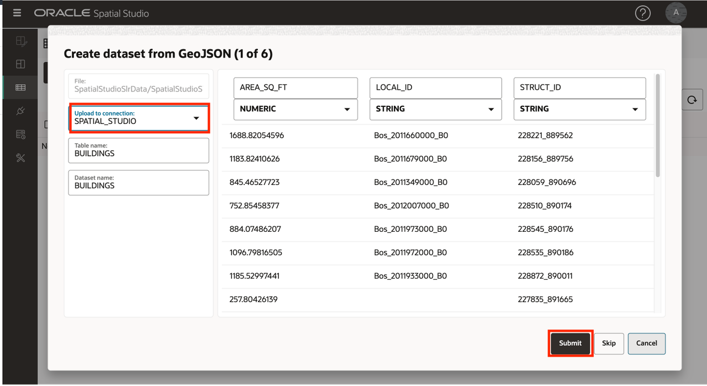

4. Repeat for all datasets.

5. When complete, the datasets are listed with a small warning icon to indicate that 1 or more preparation steps are needed. You will perform those steps in the next task.

   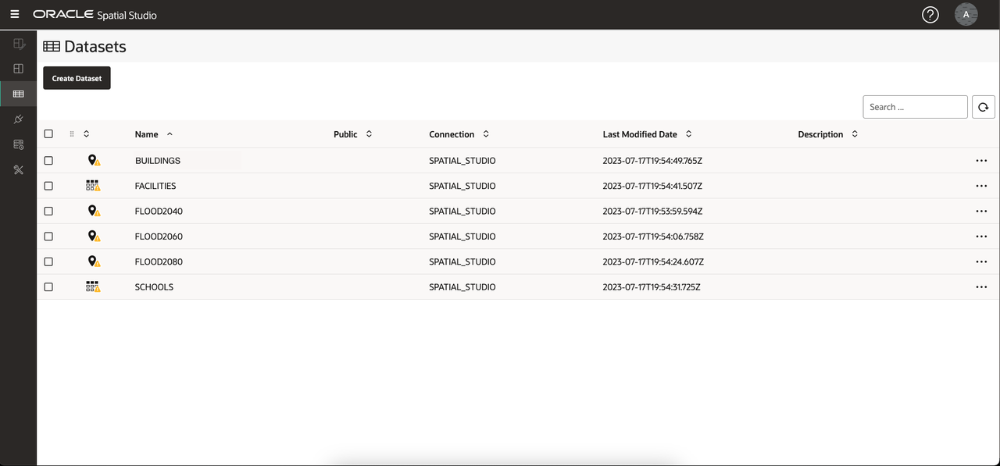

## Task 2: Prepare Data

Data preparation includes operations that allow datasets to be used for spatial analysis and map visualization. Examples include address geocoding, coordinate indexing, and identification of unique key columns. In this task you perform coordinate indexing and set dataset keys.

1. The datasets are listed with a small warning icon to indicate that 1 or more preparation steps is needed. Begin by clicking the warning badge for **SCHOOLS**. This dataset was loaded from a non-spatial format (csv) and requires preparation for mapping visualization. The dataset includes latitude/longitude columns, so select **Create Latitude/Longitude Index** and then click **Ok**.

   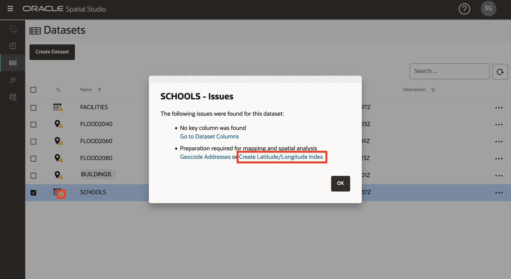

2. Populate the latitude and longitude columns for indexing and click **OK**.

   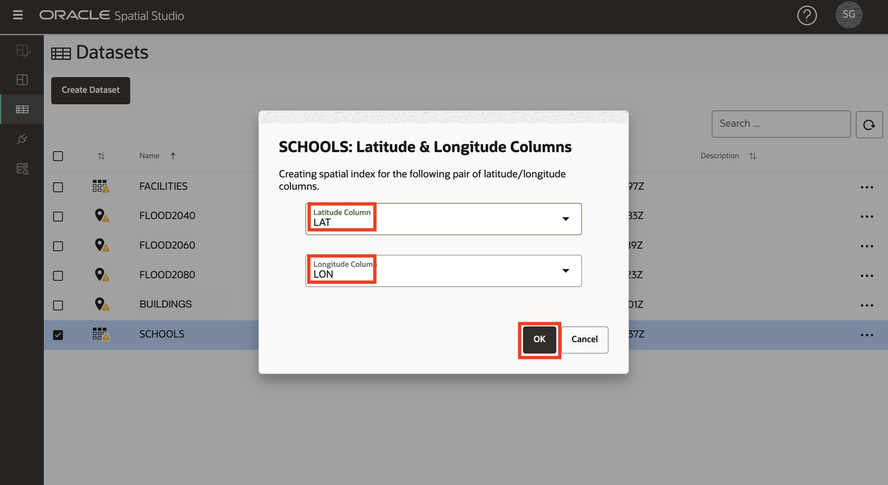

3. Repeat for **FACILITIES** by clicking on the warning badge and selecting **Create Latitude/Longitude Index**. When complete, observe that the SCHOOLS and FACILITIES icons changed from a table to a pin indicating that the datasets can be used for map visualization.

4. The remaining warning badges indicate that keys need to be defined for your datasets. Although not required for basic mapping, add keys since they are required for analyses you'll perform later in the workshop. Click on the warning icon for **BUILDINGS**. Click on the **Go to Dataset Columns** link.  

      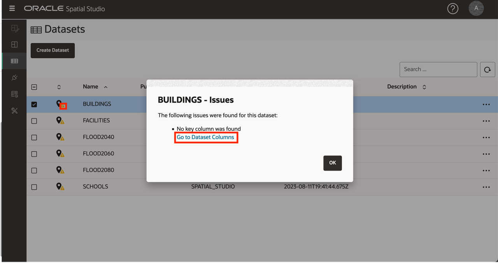  
    
   Click  the **Create Key Column** button.  
      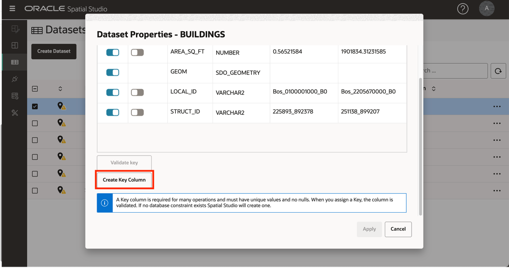  

   Name the key column **bldg_id** and click **Ok**.  
      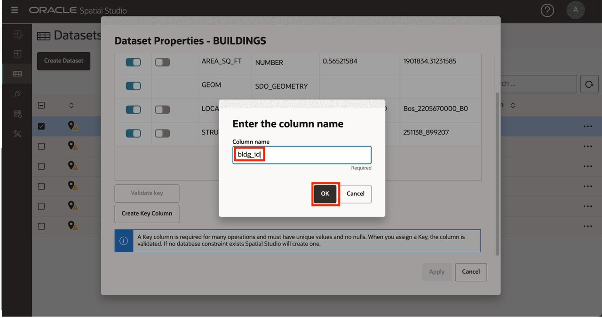  

   Finally, click **Apply**.
      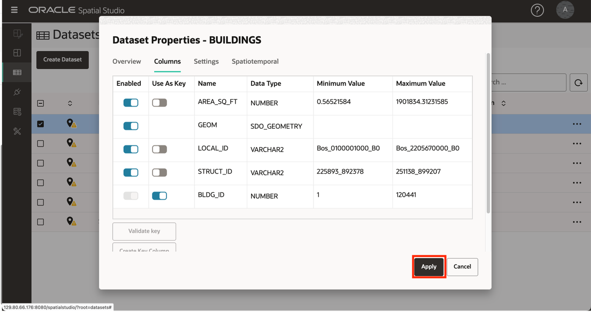  

5. Click on the warning icon for **FACILITIES** and click the link **Go to Dataset Columns**.

   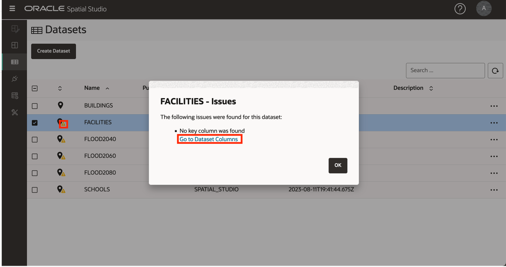

6. Select **FACILITY\_ID** as the key, click **Validate key**, and then **Apply**.

   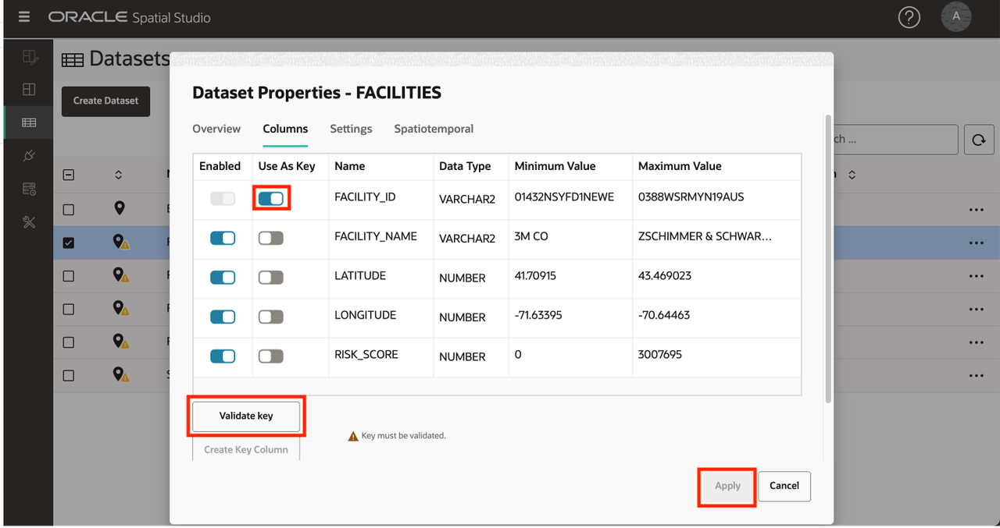

7. Repeat to add keys for your other datasets using the following columns:

   | Dataset | Column to use as Key |
   | --- | --- |
   | FLOOD2040 | FID |
   | FLOOD2060 | FID |
   | FLOOD2080 | FID |
   | SCHOOLS | OGR\_FID |

8. Observe that all of your datasets are fully prepared for mapping and spatial analysis.

   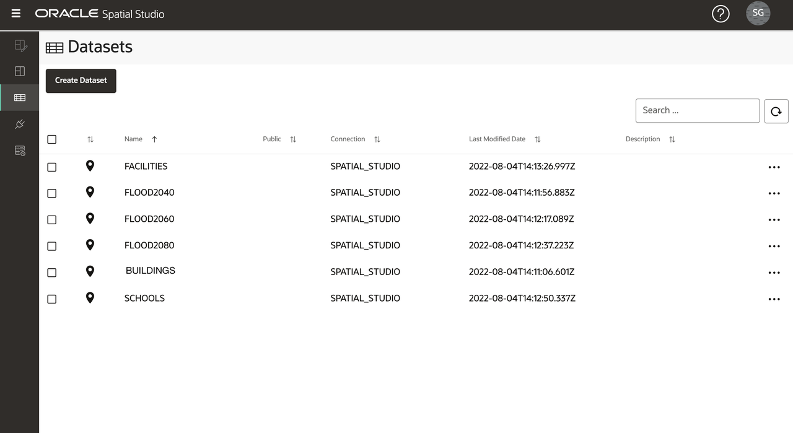

You may now **proceed to the next lab**.

## Learn more

* [Oracle Spatial product page](https://www.oracle.com/database/spatial)
* [Get Started with Spatial Studio](https://www.oracle.com/database/technologies/spatial-studio/get-started.html)
* [Spatial Studio documentation](https://docs.oracle.com/en/database/oracle/spatial-studio)

## Acknowledgements

- **Author** - David Lapp, Database Product Management, Oracle
- **Contributors** - Jayant Sharma, Denise Myrick
- **Last Updated By/Date** - David Lapp, August 2023