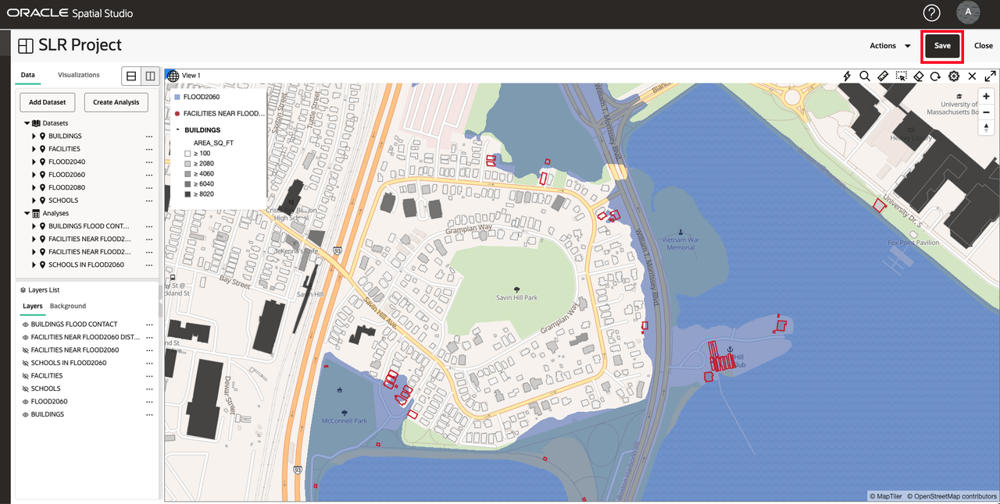
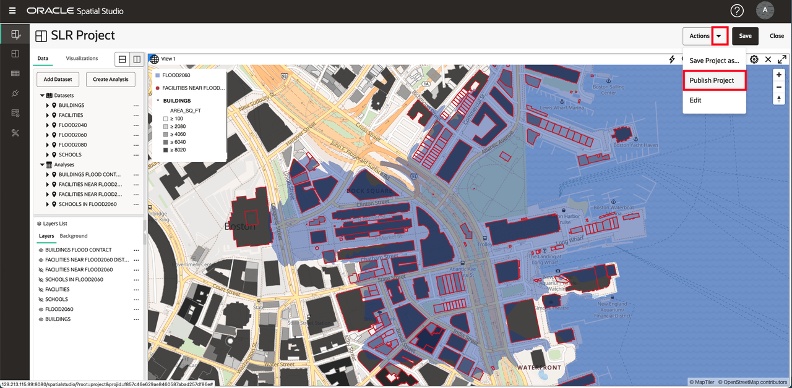
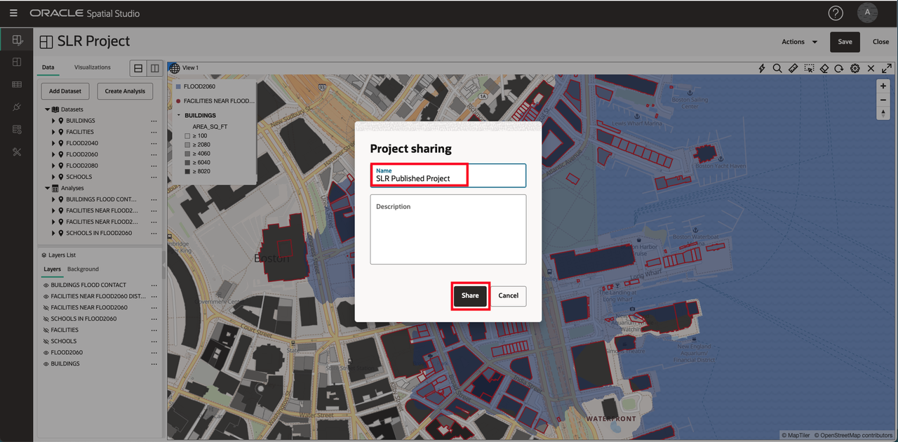
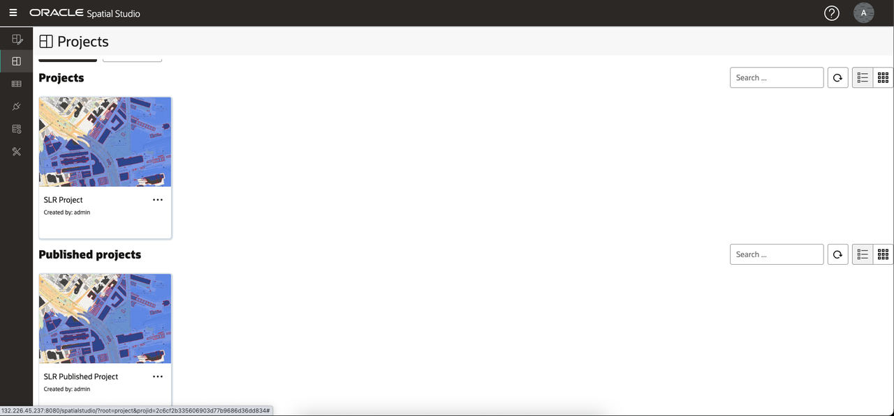
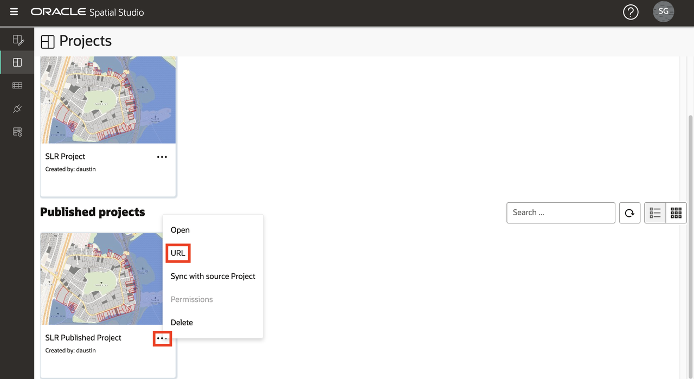
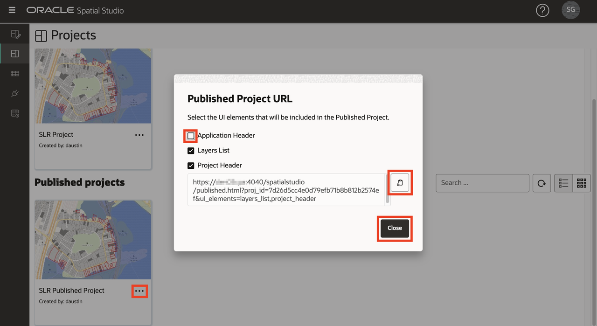
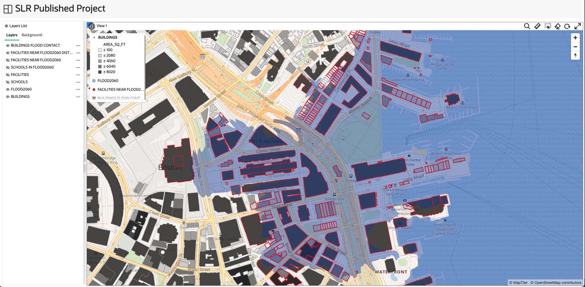

# Save and share results

## Introduction

Spatial Studio allows you to share your results in several ways. One of these ways is to publish your interactive maps for read-only access. 

Estimated Lab Time: 5 minutes

### Objectives

* Understand how to publish maps for read-only access 

### Prerequisites

* Completion of Lab 4

## Task 1: Save and publish project

You next save your work and publish your map for read-only access.

1. To save your project, click the **Save** button above the map to update the saved project with your changes. 
   
     

2. Then from the Action menu above the map, select **Publish Project**. 

     

3. In the popup dialog, enter **SLR Published Project** or a name of your choosing.  This allows your map to be shared with others via a simple URL. 

    

4. From the main navigation panel on the left, navigate to the **Projects page** to see thumbnails of your project and published project.

     

## Task 2: Test published project

Finally, you open the shared map as it would be viewed by others.

1. From the action menu of your published project, select **URL**. 
   
     

2. The published project URL dialog allows you to select the page elements to be displayed. For example, to get a URL that displays your map without the top level Spatial Studio application banner, uncheck  Application Header from the list of UI elements. Then click the button to copy the URL.
   
     

3. Open a new browser tab and paste and run the URL you copied. Observe the map is displayed without the application banner. As it is read-only, new analyses cannot be created and new layers cannot be added. But the map is fully interactive and allows re-styling, interactivity, and filtering of layers. 
   
        

 We hope you have found this workshop to be useful! There is more to learn about Spatial Studio and the Spatial platform in general. We hope you will continue this journey.

## Learn more
* [Spatial Studio product portal] (https://oracle.com/goto/spatialstudio)

## Acknowledgements
* **Author** - David Lapp, Database Product Management, Oracle
* **Last Updated By/Date** - David Lapp, Database Product Management, September 2022

