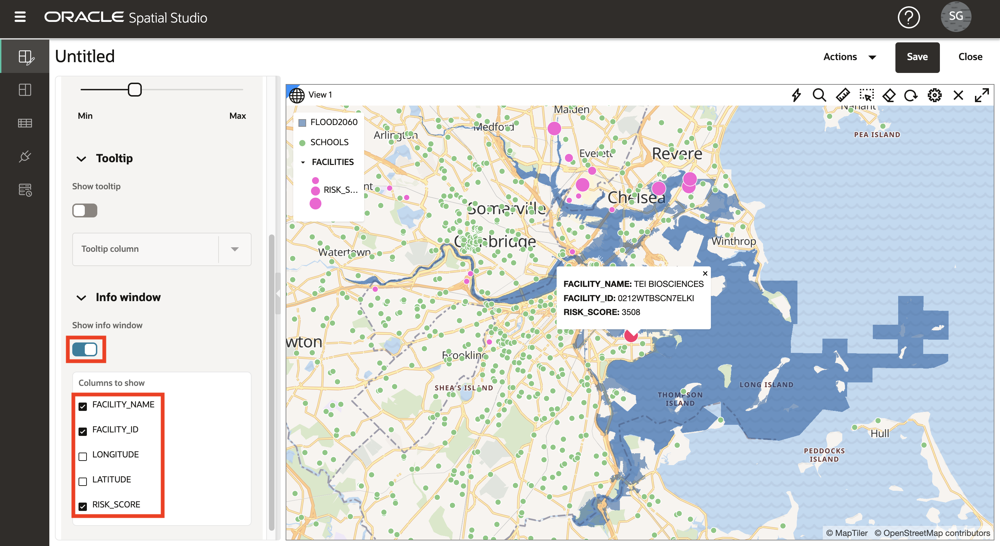

# Visualize spatial data

## Introduction

In this lab you visually explore the projected flood regions and cultural features. You create an interactive map and apply data-driven styling to expose location relationships and patterns.

Estimated Lab Time: 20 minutes

### Objectives

* Learn how to create interactive maps based on the data you have prepared.
* Learn how to configure the style and interactive behavior of your map.
* Understand the use of Projects to save your work.

### Prerequisites

* Completion of Lab 2: Load and Prepare Data

## Task 1: Create project

You begin by creating a Project. A Project is where you visualize and analyze your data, and then save your work.

1. Navigate to the Projects page and click **Create Project**.

   

2. Move your mouse over the map. To pan the pan, click and hold and then drag the map. To zoom in and out, use your mouse wheel. 

   Alternatively, you can display a navigation widget by clicking on the gear icon above the map and enabling **Show navigation controls**.

   

   If navigation controls is enabled you will have a navigation widget available. 

   

   3. Click **Add Dataset**, select all of your datasets, and then click **OK**.

   

4. Drag and drop FLOOD2080 into the map. 

   

5. Repeat for FLOOD2060 and then FLOOD2040.

   

   **Note:** If your layers are in a different order, you may click-hold-drag layers up or down in the Layers list to change their order.

6. Zoom into an area of overlapping flood areas to observe the differences in the flood models over time. 

   

7. View individual flood models by clicking the eye icon to toggle layer visibility.  

   

8. You will use the FLOOD2060 for the following steps, so remove FLOOD2040 and FLOOD2080 from the map. Select **Remove** from the action menu for FLOOD2040.

   

  Then repeat for FLOOD2080.

8. Adjust the map to fit FLOOD2060 by selecting **Zoom to layer** from the action menu.

   

## Task 2: Configure map layers

Next you add map layers and apply styling.

1. From the action menu for FLOOD2060, click **Settings**.

   

2. You are now in the Layer Settings dialog. Under Fill click on the color tile and adjust to dark blue and use the slider to reduce opacity. Under Outline, change the width to 0. You may need to scroll down to see all settings.

   

3. At the top of the Layer Settings dialog, click on **back arrow** to return to the Layers List. Please take note of this step as you will navigate using this back arrow many time in this workshop. 

   

4. Drag and drop **SCHOOLS** onto the map. Then from the SCHOOLS layer action menu select **Settings**.

   

5. Scroll down to see sections on basic (fill) and stroke (outline) styles. Change the fill opacity to 100%. Change the stroke color to white and opacity to 100%.

   

6. Scroll to the top of the Settings dialog, pull down the Configure menu, and select **Interaction**.

   

7.  Scroll down to the Tooltip section. Enable tooltips and select **NAME** as the tooltip column. Then mouse over schools to view the tooltips.

   

    As you did in a previous step, scroll to the top of the Settings dialog and click **back arrow** to return to the Layers list.
   
   

   Next you configure styles dynamically driven by data.

11. Drag and drop the **FACILITIES** dataset onto the map. Then from the FACILITIES layer action menu select **Settings**.

   

12. Change the fill color to magenta and opacity to 100%. Change the stroke color to white and opacity to 100%.

   

13. From the Radius menu, select the option **Based on data**.

   

14. From the column menu, select **RISK_SCORE** as the column to drive the map symbol size. Click the **pencil button** to create value bins for symbol sizing. Enter **0** for minimum, **1000** for maximum,  **Interval** for grouping, and **4** for number of ranges. Then click **Regenerate bin values**.

   

16. Update the sizes for the bins to **4**, **6**, **8**, **10**.

   

   Then click the **back arrow** at the top link to return to Layer Settings.

17. Next you configure pop-up windows. From the Configure menu, select **Interaction**.

   

18. In the Settings dialog, scroll down to the Info window section. Enable info windows using the **Show info window** switch, and select columns of your choosing. Then click on a facility in the map to observe the info window pop-up.

   

  Scroll to the top of the Settings dialog and click **back arrow** to return to the Layers list.

19. Drag and drop the **PARCELS** dataset onto the map. Then move the PARCELS layer to the bottom of the layers list so that other layers such as the flood model render on top. To move the layer in the layers list, click-hold-drag the layer. 

   

20. Zoom into an area with parcels along the flood boundary to observe the overlap.

   

 The PARCELS layer includes non-commercial properties tagged as either RESIDENTIAL or APARTMENT.  You next style the parcels according to this attribute.

21. As you have done in previous steps, from the PARCELS layer action menu, select **Settings**. Under the Fill section change the Color menu selection to **Based on data**.

   

21. In the Column menu select **PCAT** as the column to use for driving parcel fill color. Then update the fill colors for APARTMENT and RESIDENTIAL to colors of your choosing, for example dark and light grey.

   

   Navigate the map to explore the relationships between the flood area and your other layers. Add and remove the other flood models to observe differences in the relationships.

   In the next lab you will perform spatial analyses to identify items that satisfy various spatial relationships with the flood model.  

22. This is a good time to save your work. Click the **Save** button on the top right. Give your project a name such as SLR Project, then click **Save**.

   

23. From the main navigation panel on the left, navigate to the **Projects** page. Observe the thumbnail of your project is displayed. You can revisit the project later by clicking on the thumbnail.

   

You may now **proceed to the next lab**.

## Learn more
* [Spatial Studio product portal] (https://oracle.com/goto/spatialstudio)

## Acknowledgements
* **Author** - David Lapp, Database Product Management, Oracle
* **Last Updated By/Date** - David Lapp, Database Product Management, September 2022

