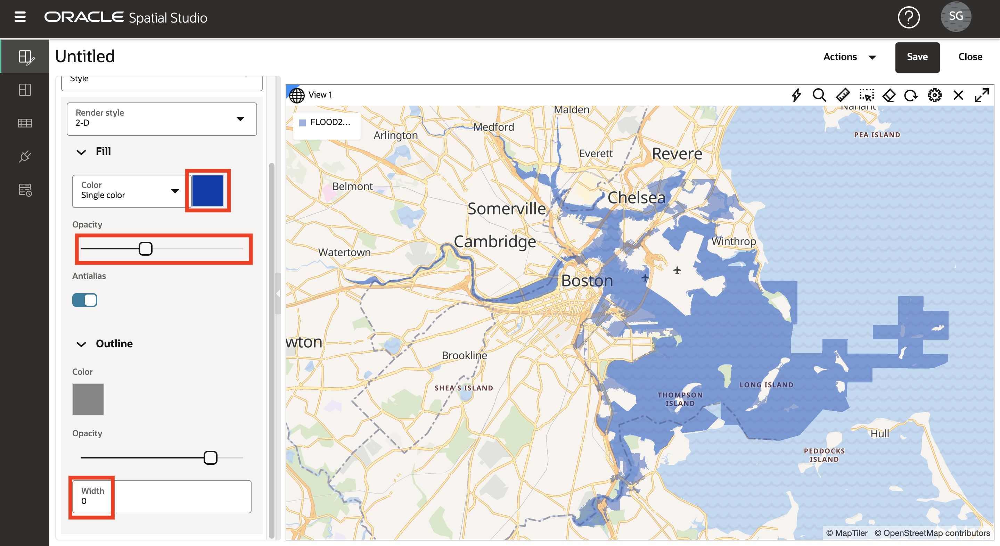

# Visualize Spatial Data

## Introduction

In this lab you visually explore the projected flood regions and cultural features. You create an interactive map and apply data-driven styling to expose location relationships and patterns.

Estimated Lab Time: 20 minutes

### Objectives

* Learn how to create interactive maps based on the data you have prepared.
* Learn how to configure the style and interactive behavior of your map.
* Understand the use of Projects to save your work.

### Prerequisites

* Completion of Lab 2: Load and Prepare Data

## Task 1: Create Project

You begin by creating a Project. A Project is where you visualize and analyze your data, and then save your work.

1. Navigate to the Projects page and click **Create Project**.

   

2. Click **Add Dataset**, select all of your datasets, and then click **OK**.

   

3. Drag and drop ANNUAL\_FLOOD\_2080\_10PCT into the map. 

   

4. Repeat for ANNUAL\_FLOOD\_2060\_10PCT and then ANNUAL\_FLOOD\_2040\_10PCT.

   

   **Note:** If your layers are in a different order, you may click-hold-drag layers up or down in the Layers list to change their order.

5. Using your mouse wheel, zoom into an area of overlapping flood areas to observe the differences in the flood models over time. 

   

6. View individual flood models by clicking the eye icon to toggle layer visibility.  

   

7. You will use the 2060 flood model for the following steps, so remove 2040 and 2080 from the map. Select **Remove** from the action menu for ANNUAL\_FLOOD\_2040\_10PCT.

   

  Then repeat for ANNUAL\_FLOOD\_2080\_10PCT.

8. Adjust the map to fit the 2060 flood model by selecting **Zoom to layer** from the action menu.

   

## Task 2: Configure map layers

Next you add map layers and apply styling.

1. In the action menu for ANNUAL\_FLOOD\_2060\_10PCT, click **Settings**.

   

2. You are now in the Layer Settings dialog. Under Fill click on the color tile and adjust to dark blue and use the slider to reduce opacity. Under Outline, change the width to 0. You may need to scroll down to see all settings.

   

3. At the top of the Layer Settings dialog, click on **Back** to return to the Layers List.

   

4. Drag and drop **PARCELS**, **SCHOOLS**, and **TRI\_FACILITIES** onto the map. You may drag individually or multi-select and drag together.

   

5. Spatial Studio allows you to create multiple maps and/or tables in your project. You will only create this one map, so you can collapse the Data/Visualizations panel to gain screen space. Hover over the right edge of the panel and click on the collapse icon (left-facing arrowhead).

   

 6. Once collapsed, panels may be restored by hovering and clicking on the expand icon (right-facing arrowhead)

   

   Next you will configure your other map layers.

7. From the **SCHOOLS** layer action menu, select **Settings**.

   

8. In the Settings dialog, scroll down to see sections on basic (fill) and stroke (outline) styles. Change the fill opacity to 100%. Change the stroke color to white and opacity to 100%.

   

9. Scroll to the top of the Settings dialog, pull down the Configure menu, and select **Interaction**.

   

10. Scroll down to the Tooltip section. Enable tooltips and select **NAME** as the tooltip column. Then mouse over schools to view the tooltips.

   

    As you did in a previous step, scroll to the top of the Settings dialog and click **Back** to return to the Layers list.

    Style can be either static or dynamic based on data. So far you can configured static styles. Next you configure styles dynamically driven by data.

11. From the **TRI_FACILITIES** layer action menu, select **Settings**.

   

12. Change the fill color to magenta and opacity to 100%. Change the stroke color to white and opacity to 100%.

   

13. From the Radius menu, select the option **Based on data**.

   

14. From the column menu, select **RISK_SCORE** as the column to drive the map symbol size.

   

15. Click the pencil button to create value bins for symbol sizing. Enter 0 for minimum, 1000 for maximum,  Interval for grouping, and 4 for number of ranges. Then click **Regenerate bin values**.

   

16. Update the sizes for the bins to 4, 6, 8, 10.

   

17. Next you configure pop-up windows. From the Configure menu, select **Interaction**.

   

18. In the Settings dialog, scroll down to the Info window section. Enable info windows using the **Show info window** switch, and select columns of your choosing. Then click on a facility in the map to observe the info window pop-up.

   

  As you have done in previous steps, scroll to the top of the Settings dialog and click **Back** to return to the Layers list.

19. Move the PARCELS layer to the bottom of the layers list so that other layers such as the flood model render on top. To move the layer down, click-hold-drag the layer to the bottom of the list.  Then use your mouse wheel to zoom into an area with parcels along the flood boundary to observe the overlap.

   

 The PARCELS layer includes non-commercial properties tagged as either RESIDENTIAL or APARTMENT.  You next style the parcels according to this attribute.

20. As you have done in previous steps, navigate to the Settings dialog for the PARCELS layer by selecting **Settings** from the action menu. Then, under the Fill section change the Color menu selection to **Based on data**.

   

21. In the Column menu select **PCAT** as the column to use for driving parcel fill color. Then update the fill colors for APARTMENT and RESIDENTIAL to colors of your choosing, for example dark and light grey.

   

   Navigate the map to explore the relationships between the flood area and your other layers. Add and remove the other flood models to observe differences in the relationships.

   In the next lab you will perform spatial analyses to identify items that satisfy various spatial relationships with the flood model.  

22. This is a good time to save your work. Click the Save button on the top right. Give your project a name such as SLR Project, then click **Save**.

   

23. From the main navigation panel on the left, navigate to the Projects page. Observe the thumbnail of your project is displayed. You can revisit the project later by clicking on the thumbnail.

   

You may now [proceed to the next lab](#next).

## Learn More
* [Spatial Studio product portal] (https://oracle.com/goto/spatialstudio)

## Acknowledgements
* **Author** - David Lapp, Database Product Management, Oracle
* **Last Updated By/Date** - David Lapp, Database Product Management, April 2021
* **Lab Expiry** - March 31, 2022
