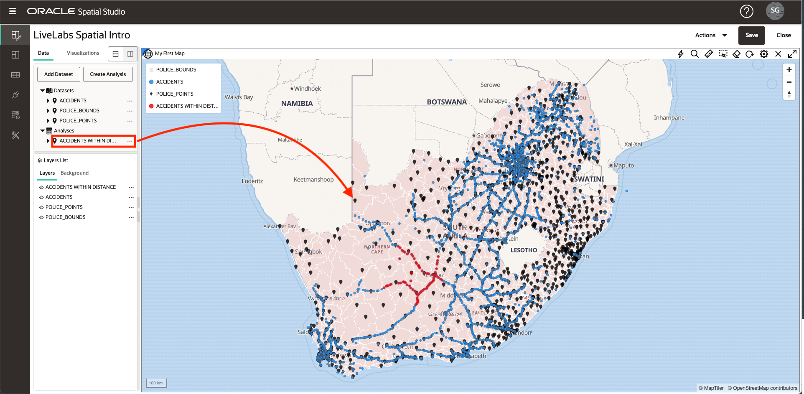
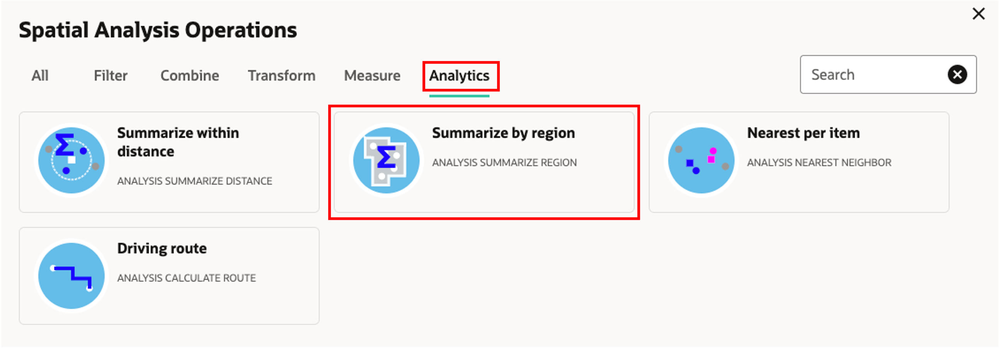
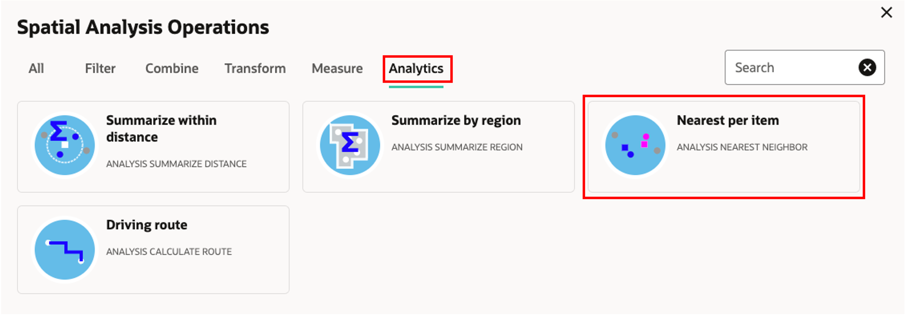

# Perform Spatial Analyses

## Introduction

Spatial Studio provides access to the spatial analysis features of Oracle Database without the need to write code. Simple user interfaces are provided for spatial analyses and all of the underlying database syntax is handled automatically behind the scenes. Spatial analysis operations in Spatial Studio are organized into categories:

**Filter** 
* Containment:  "Which of my assets are located inside a hazard area?"
* Proximity: "Which of our sites are within 5 miles of a projected storm path?" 
* ... and others

**Combine** 
* Join by location: "Associate sales leads with sales territories based on containment." 
* Merge items:  "Combine several counties into 1 sales territory"
* ... and others

**Transform** 
* Buffer: "Create the shape that surrounds a fire perimeter by 10 miles."
* Centroid: "Create points in the middle of each fire perimeter."
* ... and others

**Measure**  
* Area: "What are the areas of storm surge regions in square kilometers?"
* Distance; "What is the minimum distance from each of our assets to a projected storm path?"  
* ... and others

**Analytics** 
* Summarize by region: "What is the average age of buildings within each planning region?"
* Nearest per item: "What is the nearest warehouse to each branch location, and how far is it?"
* ... and others 

In this lab you will explore several of these spatial analyses.

Estimated Lab Time: 45 minutes

### Objectives

* Understand the categories of spatial analyses in Spatial Studio
* Learn how to perform spatial analyses and visualize results

### Prerequisites

* Successfully complete Labs 1-3

<!-- *This is the "fold" - below items are collapsed by default*  -->

## Task 1: Filter by Proximity

In this step you use a spatial filter to identify accidents within a specified distance of a selected police station.

1. Begin by clicking on a police station. In the image below, I have clicked on the police station in the red box. This selects the police station to use for the proximity analysis. If there is any issue with making the selection, confirm that **Allow selection** is turned on for the POLICE\_POINTS layer as described in Lab 3 Step 6.

   
   
2. Click the hamburger menu for the ACCIDENTS layer and select **Spatial Analysis**

     

3. Click on the **Filter** tab select **Return shapes within a specific distance of another**

     

4. In the analysis dialog, you may enter a name for the result or leave the default. We are filtering ACCIDENTS based on distance from a selected item in POLICE_POINTS. In the example show below, I have used a distance of 150 kilometers. 
   
   **Note:** The analysis includes switches to **Include only items that have been selected** for the layers involved. We are only interested in including the 1 selected police station for proximity analysis in this example. Therefore **Include only items that have been selected** should be **On** for POLICE_POINTS. 

   Once selections are made, click **Run**.

     

5. The analysis result is listed under Analyses in the Data Elements panel. Drag and drop the analysis result onto the map. This creates a new map layer displaying only the accidents within the specified distance of the selected police station.

    

   **Note:** Analysis results are just another type of Dataset in Spatial Studio. As you'll see in a later Lab, analysis results may be added to other maps/tables, used in other projects, accessed programmatically via REST or SQL, or exported as a file. 

6. You no longer need this analysis result in the map. So to avoid clutter, you next remove it from the map. Right click on the analysis result in the Layers List and select **Remove**
   
     

   **Note:** A Layer is just a Dataset rendered in a map. After removing a Layer (our analysis result in this case), the Dataset is still listed in the Data Elements panel and could be re-added to the map. To remove a Dataset from a Project you would right click on the Dataset in the Data Elements panel and select **Remove from project**.

## Task 2: Filter by Containment

In this step you use a spatial filter to identify accidents inside a selected police region.

1. Begin by clicking in a region in the POLICE\_BOUNDS layer. The selected region will be used as to filter accidents. In the image below, the region in the red box was selected.

     
   
2. As you did for the previous analysis in Step 1, click on the hamburger menu for the ACCIDENTS layer and select Spatial Analysis. This time we are filtering by containment. So select the tile **Return shapes that are inside another**  

     

3. You may enter a name for the results or leave the default. The layer to be filtered is ACCIDENTS and the layer used as the filter is POLICE\_BOUNDS. The option to **Include only items that have been selected** should be selected for POLICE\_BOUNDS since we are only filtering for accidents contained in the single selected police region.

     
   
4. Drag and drop the analysis result into the map. Observe the new layer containing the accidents inside the selected police region.

     
   
   You can use your mouse wheel to zoom into the area of results. In the image below the ACCIDENTS layer is turned off to focus on the analysis result.

     
   
 5.  Before moving on to the next analysis, zoom to the full extent of your data by opening the hamburger menu for the POLICE\_BOUNDS layer and selecting **Zoom to layer** and remove the containment analysis from the map. 
   
## Task 3: Join by Containment

Here you join Datasets based on a spatial relationship. You will join ACCIDENTS to POLICE\_BOUNDS based on containment. You may think of this as enriching or tagging each accident with the police region that contains it. 

1. As you did for previous analyses, click on the hamburger menu for the ACCIDENTS layer in the Layers List and select Spatial Analysis. Select the **Combine** tab and then the tile **Spatial Join**  

   

2. In the Spatial Join dialog, enter the name ACCIDENTS\_JOIN\_POLICE\_BOUNDS for the result. For the additional entries, you are joining items in ACCIDENTS based on the spatial relationship Inside to items in POLICE\_BOUNDS. This operation will result in a new Dataset containing ACCIDENTS enriched with the unique id of the POLICE\_BOUNDS region containing each item. The unique id (i.e., key column) for POLICE\_BOUNDS is COMPNT\_NM, therefore we expect to see that column in the result. Click **Run**.

     **Note:** The Advanced option allows you to include all columns from the secondary Dataset (POLICE\_BOUNDS in this case) in the result, instead of just the unique id.

   
   
3. The result is listed under Analyses in the Data Elements panel. Expand the result to see its columns; all original columns from ACCIDENTS, plus COMPNT\_NM (i.e., police region name) as expected.

   

4. Drag and drop the analysis ACCIDENTS\_JOIN\_POLICE\_BOUNDS into the map. In the Layers List, click the hamburger icon for the ACCIDENTS\_JOIN\_POLICE\_BOUNDS layer and select Settings to set Style as desired and enable Interaction. For Interaction, enable an Info Window including the column COMPNT\_NM. Click on a crash item in the map and observe the COMPNT\_NM (i.e., police region name) in the info window.

   

   You now have augmented the crash data with the police region name per item. The results could be used for further analysis is Spatial Studio or accessed by other tools and applications such as Oracle Analytics Cloud for broader analytics.

## Task 4: Summarize Items by Region

In the previous step, you augmented crash items with police region. In this step, you do the inverse: you augment police regions with a summary of crash info. 

1. Click on the hamburger menu for the POLICE\_BOUNDS layer in the Layers List and select Spatial Analysis. Select the **Analytics** tab and then the tile **Summarize by Region**  

   

2. In the Summarize by region dialog you can leave default results dataset name, POLICE\_BOUNDS SUMMARIZE. Enter the other items in the dialog: for each item in POLICE\_BOUNDS you are summarizing ACCIDENTS based on Count. Enter NUM_ACCIDENTS as the column to be added with accidents counts. Click **Run**.

   **Note:** In addition to Count, you can also summarize numeric attributes with this analysis, for example using Average. 

   

3. Drag the result, POLICE\_BOUNDS SUMMARIZE, onto the map. Then in the Layers List click the hamburger menu for  POLICE\_BOUNDS SUMMARIZE and select Settings.  Under Style, change Color to **Based on data**.

   

4. For column, select NUM\_ACCIDENTS. Update the values with 1, 5, 10, 15, 20. Enter each value in any cell, as they will be automatically sorted in the value list. Once the values are entered, click the edit icon to Set palette and select a color palette. Observe the map display police regions color coded by the number of accidents according to your value and palette entries.

     

   On your own, feel free to add a info window or tooltip with accident counts when clicking or hovering over a police region.  As you did in Lab 2/Step 3, you can also add a Table view and drag in POLICE\_BOUNDS SUMMARIZE to view the info in tabular form.

## Task 5: Identify Nearest Items

In this step, you determine the nearest accident to each police station. The result contains each police station augmented with the id and and distance to the nearest accident.  The analysis also provides an option include all columns for the nearest item instead of just the id and distance.

1. Click on the hamburger menu for the POLICE\_POINTS layer in the Layers List and select Spatial Analysis. Select the **Analytics** tab and then click the tile **Nearest per item**.

     

2. In the Nearest per item dialog, name the result POLICE\_POINTS WITH NEAREST ACCIDENT (or a name of your choosing). For each item in POLICE\_POINTS you are finding the nearest item in ACCIDENTS. Expand the Advanced section. Enable the options to Include distance in the result. For the distance column name enter DISTANCE\_TO\_ACCIDENT (or a name of your choosing). Change the distance units to Kilometer (or another unit of your choosing).  
      
   Then click **Run**.

     

3. In the Layers list, turn off the POLICE\_POINTS layer. Drag the POLICE\_POINTS WITH NEAREST ACCIDENT analysis onto the map.

     

4. Go to Settings for the POLICE\_POINTS WITH NEAREST ACCIDENT layer and set a Style of your choosing. Then go to the Interaction tab and enable an Info window. Select columns of your choosing, including the the columns added by this analysis: ACCIDENT\_ID and DISTANCE\_TO\_ACCIDENT. Click on a POLICE\_POINTS item and observe the info window displays the ID and distance to the nearest item in ACCIDENTS. 

     

   On your own, feel free to now style police stations based on distance to the nearest accident, using colors or size. 

   Finally, save your project to preserve your changes.

## Task 6: Access SQL code and GeoJSON endpoint [Optional]

  This optional step is for developers interested in accessing results programmatically. Spatial Studio allows you to see the SQL code for spatial analyses and provides a web endpoint that returns results as GeoJSON. This info is available in Dataset Properties and is accessed either in a Project or from the Datasets page. You will access the info from within you Project.
  
  1. In the Data Elements panel, click the hamburger menu for the one of your analysis, for example **ACCIDENTS INSIDE** and select **Properties**
  
     

  2. Observe the sections with SQL code and the GeoJSON endpoint. 

       

    On your own, paste the GeoJSON endpoint into a browser and observe your results returned as GeoJSON. Similarly, you may copy and paste the SQL code into SQL Developer Web to run the analysis directly. 

This concludes the Intro to Oracle Spatial Studio workshop. 

## Acknowledgements
* **Author** - David Lapp, Database Product Management
* **Last Updated By/Date** - David Lapp, Database Product Management, April 2021
