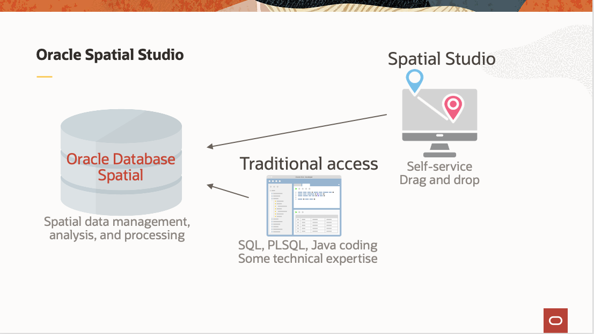

# Introduction

## About this workshop

In this workshop you will explore the spatial relationships between cultural features of a coastal area and projected flooding due to sea level rise. Given the time limitations of this workshop, the modeling and creation of projected flood areas is not included. Simplified versions of existing published models are used for visualizations and analysis. The spatial features of Oracle Database in the Oracle Cloud could be used to develop such models.

Estimated Workshop Time: 90 minutes

### About Oracle Spatial Studio

Oracle Spatial Studio (Spatial Studio) is a web application providing self-service access to the spatial capabilities of Oracle Database. While these capabilities have historically required coding and/or use of 3rd party tools, Spatial Studio allows business users to create and share spatial analysis and interactive web maps using self-service GUIs. 

  

Spatial Studio operates on spatial data in Oracle Database, meaning tables and views that include Oracle's geometry data type. This data can be pre-existing spatial data or non-spatial data which is prepared using Spatial Studio to add geometries based on attributes. 

Spatial Studio is a Java EE application that may be deployed to Oracle Cloud from the Oracle Cloud Marketplace. Spatial Studio can also be deployed manually to Oracle WebLogic or Jetty, or as a self contained pre-deployed Quick Start for testing.

For more information please visit the [Oracle Spatial Studio Guide] (https://docs.oracle.com/en/database/oracle/spatial-studio/)

### Objectives

- Learn how to load and prepare data for spatial analysis and map visualization
- Learn how to visually explore data using data-driven styling
- Learn how to identify spatial relationships using spatial analysis

### Prerequisites

- This workshop requires Oracle Spatial Studio and Oracle Autonomous Database.  
- If you already have access to these, then following this Introduction you may skip to the Lab 2. 
- Otherwise you should proceed to Lab 1.
- No previous experience with Oracle Spatial is required.

## Acknowledgements

* **Author** - David Lapp, Database Product Management, Oracle
* **Contributors** - Jesus Vizcarra, Ramu Murakami Gutierrez, Anand Kannan
* **Last Updated By/Date** - David Lapp, Database Product Management, September 2022

