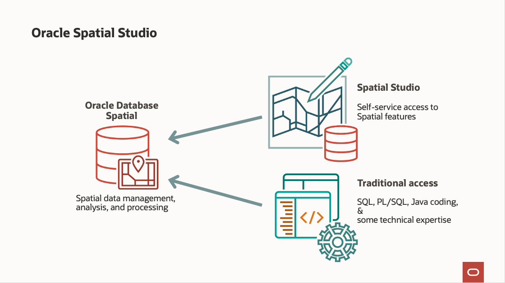

# Introduction

## About this Workshop

In this workshop you will provision Spatial Studio to the Oracle Cloud from the OCI Cloud Marketplace and prepare a schema in Autonomous Database to be used as Spatial Studio's metadata repository.

Estimated Workshop Time: 60 minutes

### About Oracle Spatial Studio

Oracle Spatial Studio (Spatial Studio) is a web application providing self-service access to the spatial capabilities of Oracle Database. While these capabilities have historically required coding and/or use of 3rd party tools, Spatial Studio allows business users to create and share spatial analysis and interactive web maps using self-service GUIs. 

  

Spatial Studio operates on spatial data in Oracle Database, meaning tables and views that include Oracle's geometry data type. This data be be pre-existing spatial data or non-spatial data which is prepared using Spatial Studio to add geometries based on attributes. 

Spatial Studio is a Java EE application that may be deployed to Oracle Cloud from the Oracle Cloud Marketplace. Spatial Studio can also be deployed manually to Oracle WebLogic or Jetty, or as a self contained pre-deployed Quick Start for testing.

For more information please visit [https://oracle.com/goto/spatialstudio] (https://oracle.com/goto/spatialstudio)

### Objectives

- Learn how to create and assign a database schema for Spatial Studio's metadata repository
- Learn how to use the Cloud Marketplace to install Spatial Studio
- Learn how to uninstall Spatial Studio when no longer needed

### Prerequisites

- This workshop requires an Oracle Autonomous Database.  
- SQL Developer Web is provided with Autonomous Database and is also used to create the Spatial Studio repository schema. 
- If you already have access to these, then following this Introduction you may skip to the Lab 3. 
- Otherwise you should proceed to Lab 1.
- No previous experience with Oracle Spatial is required.
- An Oracle Cloud Account - Please view this workshop's LiveLabs landing page to see which environments are supported

*Note: If you have a **Free Trial** account, when your Free Trial expires your account will be converted to an **Always Free** account. You will not be able to conduct Free Tier workshops unless the Always Free environment is available. **[Click here for the Free Tier FAQ page.](https://www.oracle.com/cloud/free/faq.html)***

## Acknowledgements

* **Author** - David Lapp, Database Product Management, Oracle
* **Last Updated By/Date** - David Lapp, Database Product Management, January 2021

