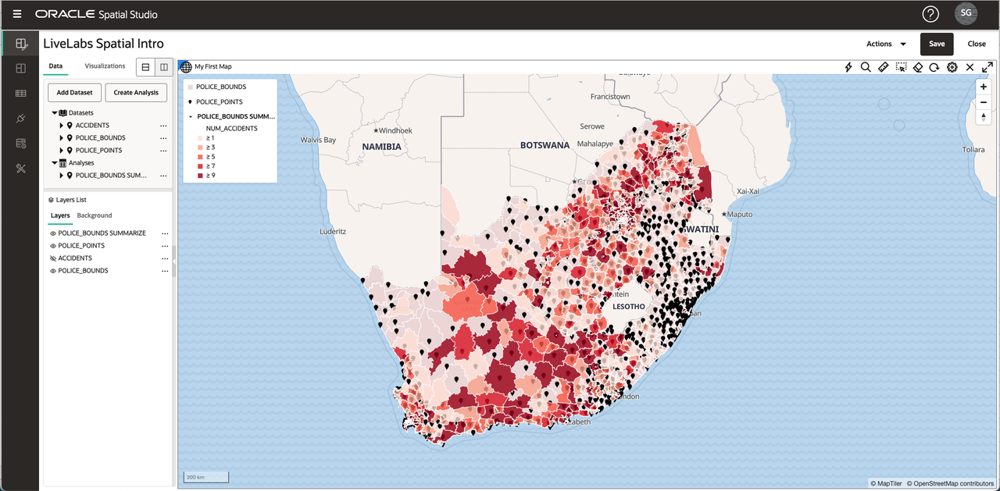

# Introduction

## About this Workshop

In this workshop you will explore the features of Spatial Studio for self-service spatial analysis and visualization. Using datasets of traffic accidents, police stations, and police station service areas, you will load and visualize spatial data, and analyze their spatial relationships as shown below. 

Estimated Workshop Time: 2 hours

### About Oracle Spatial Studio

 Oracle Spatial Studio (Spatial Studio) provides no-code access to the spatial capabilities of Oracle Database. While these capabilities have historically required coding and/or use of 3rd party tools, Spatial Studio allows business users to create and share spatial analysis and interactive web maps using self-service GUIs. 

  

Spatial Studio operates on spatial data in Oracle Database, meaning tables and views that include Oracle's geometry data type. This data be pre-existing spatial data or non-spatial data which is prepared using Spatial Studio to add geometries based on attributes. The end user features of Spatial Studio can be summarized as follows:

Access and prepare spatial data:
  - Access spatial/non-spatial data in Oracle Database
  - Load data from common formats
  - Prepare non-spatial data by geocoding addresses or indexing lat/lon columns
  - Pre-cache large datasets

Analyze and visualize spatial data:
  - Drag-and-drop map visualizations
  - Data driven styling
  - Perform spatial analyses
  - Share results

Spatial Studio also provides integration features for developers and configuration options for application administrators, which are outside the scope of this intro workshop.

For more information please visit [https://oracle.com/goto/spatialstudio] (https://oracle.com/goto/spatialstudio)

### Objectives

Understanding Spatial Studio capabilities to
  - Load spatial data
  - Visualize spatial data
  - Perform spatial analysis

### Prerequisites

 <if type="freetier"> 
   - This workshop requires access to Spatial Studio and Oracle Database.  
</if>
<if type="reservation">  
  - This workshop requires access to Spatial Studio and Oracle Database. These are created for you as part of your LiveLabs Reservation.  
</if>

*Note: If you have a **Free Trial** account, when your Free Trial expires your account will be converted to an **Always Free** account. You will not be able to conduct Free Tier workshops unless the Always Free environment is available. **[Click here for the Free Tier FAQ page.](https://www.oracle.com/cloud/free/faq.html)***

## Acknowledgements

* **Author** - David Lapp, Database Product Management, Oracle
* **Last Updated By/Date** - David Lapp, Database Product Management, April 2021
