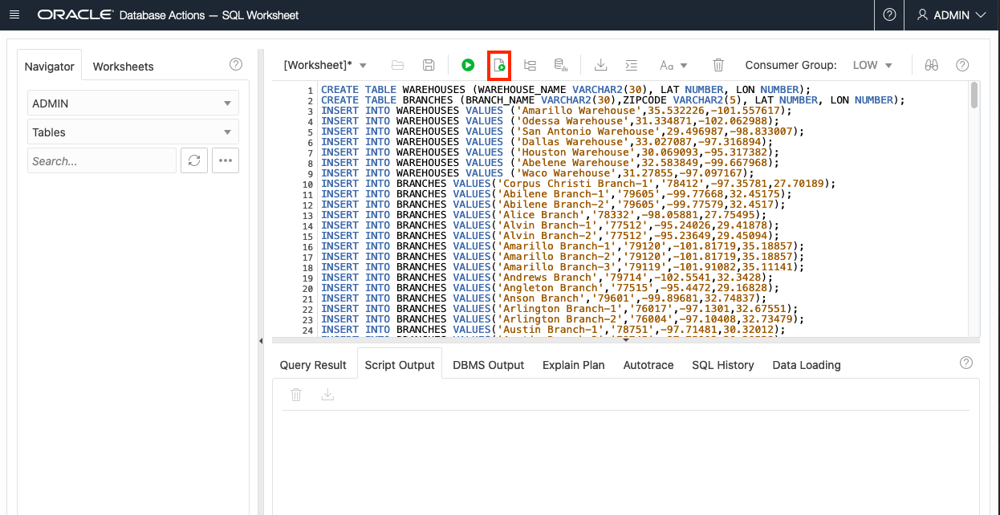
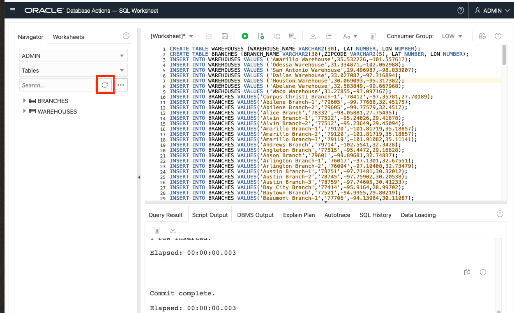
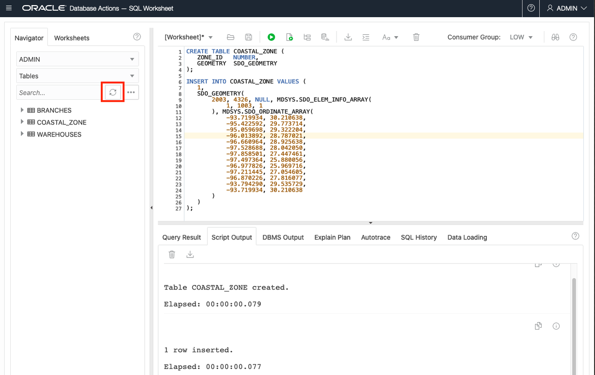
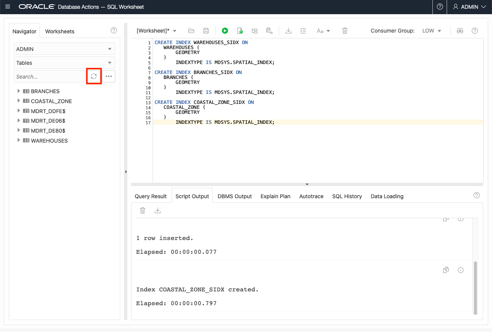

# Create sample data


## Introduction

This lab walks you through the steps to create sample spatial data in Oracle Database. 

Estimated Lab Time: 10 minutes


### About spatial data
Oracle Database stores spatial data (points, lines, polygons) in a native data type called  SDO_GEOMETRY.  Oracle Database also provides a native spatial index for high performance spatial operations. This spatial index relies on spatial metadata that is entered for each table and geometry column storing spatial data. Once spatial data is populated and indexed, robust APIs are available to perform spatial analysis, calculations, and processing.

The SDO_GEOMETRY type has the following general format: 
```
SDO_GEOMETRY( 
 [geometry type],           --ID for point/line/polygon
 [coordinate system],       --ID of coordinate system
 [point coordinate],        --for points only
 [line/polygon info],       --for lines/polygons only
 [line/polygon coordinates] --for lines/polygons only
  )
 ```

The most common geometry types are 2-dimensional:

  | ID |Type |
  | --- | --- | 
  | 2001 |Point |
  | 2002 |Line |
  | 2003 |Polygon |

The most common coordinate systems are:

  | ID |Coordinate System |
  | --- | --- | 
  | 4326 |Latitude/Longitude|
  | 3857 |World Mercator|

  When using latitude/longitude, note that latitude is the Y coordinate and longitude is the X coordinate. Since coordinates are listed as X,Y pair, the values are actually in the order longitude, latitude.

  The following is an example point geometry using latitude/longitude coordinates  :

```
SDO_GEOMETRY( 
 2001,               --2D point
 4326,               --latitude/longitude
 SDO_POINT_TYPE(     
    -100.123, 20.456 --coordinate
    ),         
 NULL,               --for lines/polygons only
 NULL                --for lines/polygons only
  )
```

  The following is an example polygon geometry using latitude/longitude coordinates  :

```
SDO_GEOMETRY( 
 2003,                  --2D polygon
 4326,                  --latitude/longitude
 NULL,                  --for points only       
 SDO_ELEM_INFO_ARRAY(
      1, 1003, 1        --indicates simple exterior polygon
        ), 
 SDO_ORDINATE_ARRAY(   
    -98.789065,39.90973, -- coordinates
    -101.2522,39.639537,
    -99.84374,37.160316,
    -96.67987,35.460699,
    -94.21875,39.639537,
    -98.789025,39.90973
      )
    )
);
```

### Objectives

In this lab, you will:
* Create tables with a geometry column
* Populate geometries
* Create spatial metadata and indexes

### Prerequisites

As described in the workshop introduction, you need access to an Oracle Database and SQL Client. If you do not have these, then go back to the sections on Oracle Cloud Account, Autonomous Database, and SQL Developer Web.


## Task 1: Create tables with coordinates

We begin by creating tables with latitude, longitude coordinates. This is a common starting point for creating spatial data, for example coordinates from GPS, or from geocoding street address or IP address.

The instructions and screen shots refer to SQL Developer Web, however the same steps apply for other SQL clients.

1. Download the SQL script [here](files/create-sample-data.sql).


2. Copy/paste/run the script in SQL Developer Web


3. Refresh listing to see the tables BRANCHES and WAREHOUSES

    


## Task 2: Create geometries from coordinates

Geometries can be populated with SQL, for exathis case by specifying the coordinates of point geometries based on  latitude and longitude columns.

1. Add geometry columns:

    ```
    <copy> 
    ALTER TABLE WAREHOUSES ADD (
     GEOMETRY SDO_GEOMETRY
    );

    ALTER TABLE BRANCHES ADD (
       GEOMETRY SDO_GEOMETRY
    );
    </copy>
    ```

2. Populate geometry columns:

    ```
    <copy> 
    UPDATE WAREHOUSES
    SET
        GEOMETRY = SDO_GEOMETRY(
            2001, 4326, SDO_POINT_TYPE(
                LON, LAT, NULL
            ), NULL, NULL
        );
     UPDATE BRANCHES
     SET
        GEOMETRY = SDO_GEOMETRY(
            2001, 4326, SDO_POINT_TYPE(
                LON, LAT, NULL
            ), NULL, NULL
        );
    </copy>
    ```

## Task 3: Create table with polygon

Lines and polygons can be created in the same way. While a point geometry requires one coordinate, lines and polygons require all of the coordinates that define the geometry. In this case we create a table to store a polygon.

1. Create table and insert row
   
	```
    <copy>
    CREATE TABLE COASTAL_ZONE (
        ZONE_ID   NUMBER,
        GEOMETRY  SDO_GEOMETRY
    );       

    INSERT INTO COASTAL_ZONE VALUES (
        1,
        SDO_GEOMETRY(
            2003, 4326, NULL, SDO_ELEM_INFO_ARRAY(
                1, 1003, 1
            ), SDO_ORDINATE_ARRAY(
                -93.719934, 30.210638,
                -95.422592, 29.773714, 
                -95.059698, 29.322204, 
                -96.013892, 28.787021, 
                -96.660964, 28.925638, 
                -97.528688, 28.042050, 
                -97.858501, 27.447461, 
                -97.497364, 25.880056, 
                -96.977826, 25.969716, 
                -97.211445, 27.054605, 
                -96.870226, 27.816077, 
                -93.794290, 29.535729, 
                -93.719934, 30.210638
            )
        )
    );
    </copy>
    ```

2. Refresh the table listing to see the COASTAL_ZONE table.
    


## Task 4:  Add spatial metadata and indexes 
Oracle Database provides a native spatial index for high performance spatial operations. Our sample data is so small that a spatial index is not really needed. However we perform the following steps since they are important for typical production data volumes. A spatial index requires a row of metadata for the geometry being indexed. We create this metadata and then the spatial indexes.


1. Add spatial metadata:

    ```
    <copy> 
    INSERT INTO USER_SDO_GEOM_METADATA VALUES (
       'WAREHOUSES',
       'GEOMETRY',
       SDO_DIM_ARRAY(
           SDO_DIM_ELEMENT(
               'x', -180, 180, 0.05
           ), SDO_DIM_ELEMENT(
               'y', -90, 90, 0.05
           )
       ),
       4326
   );

   INSERT INTO USER_SDO_GEOM_METADATA VALUES (
       'BRANCHES',
       'GEOMETRY',
       SDO_DIM_ARRAY(
           SDO_DIM_ELEMENT(
               'x', -180, 180, 0.05
           ), SDO_DIM_ELEMENT(
               'y', -90, 90, 0.05
           )
       ),
       4326
   );

   INSERT INTO USER_SDO_GEOM_METADATA VALUES (
       'COASTAL_ZONE',
       'GEOMETRY',
       SDO_DIM_ARRAY(
           SDO_DIM_ELEMENT(
               'x', -180, 180, 0.05
           ), SDO_DIM_ELEMENT(
               'y', -90, 90, 0.05
           )
       ),
       4326
   );
    </copy>
    ```

2. Create spatial indexes:

   ```
   <copy> 
   CREATE INDEX WAREHOUSES_SIDX ON
       WAREHOUSES (
           GEOMETRY
       )
           INDEXTYPE IS MDSYS.SPATIAL_INDEX;

   CREATE INDEX BRANCHES_SIDX ON
       BRANCHES (
           GEOMETRY
       )
           INDEXTYPE IS MDSYS.SPATIAL_INDEX;

   CREATE INDEX COASTAL_ZONE_SIDX ON
       COASTAL_ZONE (
           GEOMETRY
       )
           INDEXTYPE IS MDSYS.SPATIAL_INDEX;
    </copy>
    ```

    After the indexes are created, refresh the table listing. You will see 3 tables having names beginning with MDRT_. These are artifacts of the spatial indexes and are managed by Oracle Database automatically. You should never manually manipulate these tables.
    


    Our sample data is now prepared and ready for spatial queries. 

    You may now proceed to the next lab.

    If you need to revert this lab and remove the items created, run the following:

        DROP TABLE BRANCHES;   
        DROP TABLE WAREHOUSES;
        DROP TABLE COASTAL_ZONE;
        DELETE FROM USER_SDO_GEOM_METADATA;
        COMMIT;


## Learn more
* [Spatial product portal] (https://oracle.com/goto/spatial)
* [Spatial documentation](https://docs.oracle.com/en/database/oracle/oracle-database/19/spatl)
* [Spatial blogs](https://blogs.oracle.com/oraclespatial/)


## Acknowledgements
* **Author** - David Lapp, Database Product Management, Oracle
* **Last Updated By/Date** - Kamryn Vinson, November 2020

