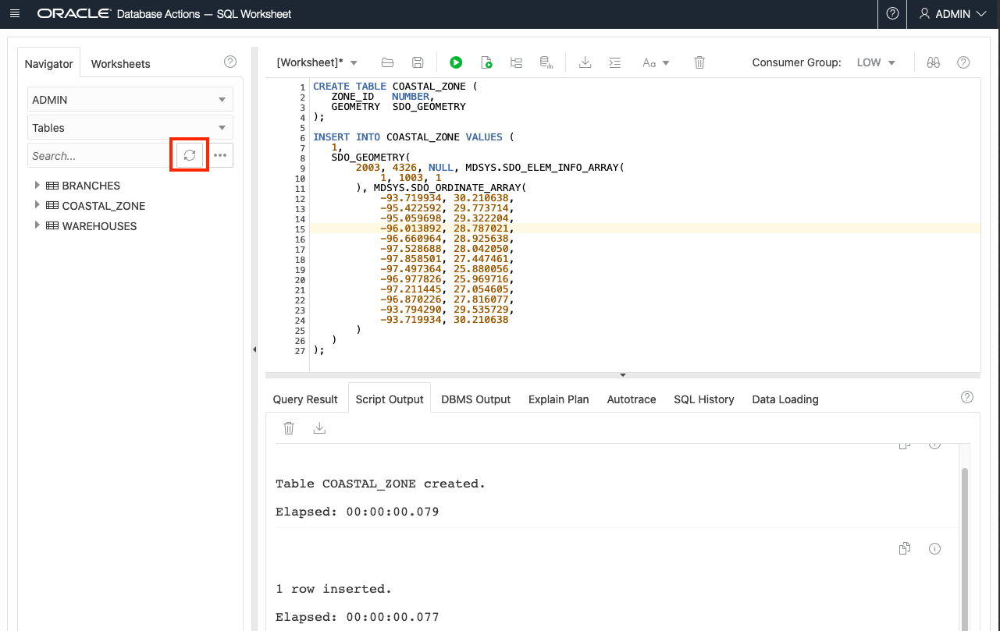
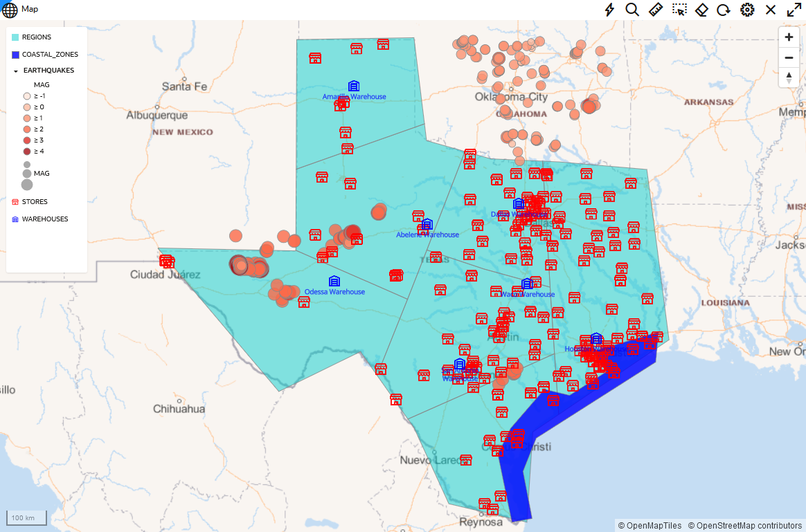

# Create Sample Data


## Introduction

This lab walks you through the steps to create sample spatial data in Oracle Database. 

Estimated Lab Time: 20 minutes

 
### About Spatial Data

Oracle Database stores spatial data (points, lines, polygons) in a native data type called SDO_GEOMETRY. Oracle Database also provides a native spatial index for high performance spatial operations. This spatial index relies on spatial metadata that is entered for each table and geometry column storing spatial data. Once spatial data is populated and indexed, robust APIs are available to perform spatial analysis, calculations, and processing.

The SDO_GEOMETRY type has the following general format:

```
SDO_GEOMETRY( 
    [geometry type]              -- ID for points/lines/polygons
    , [coordinate system]        -- ID of coordinate system
    , [point coordinate]         -- used for points only
    , [line/polygon info]        -- used for lines/polygons only
    , [line/polygon coordinates] -- used for lines/polygons only
)
 ```

The most common geometry types are 2-dimensional:

  | ID |Type |
  | --- | --- | 
  | 2001 |Point |
  | 2002 |Line |
  | 2003 |Polygon |

The most common coordinate systems are:

  | ID |Coordinate System |
  | --- | --- | 
  | 4326 |Latitude/Longitude|
  | 3857 |World Mercator|

When using latitude and longitude, note that latitude is the Y coordinate and longitude is the X coordinate. Since coordinates are listed as X,Y pair, the values within SDO_GEOMETRY need to be in the order: longitude, latitude.

The following example is a point geometry using longitude and latitude coordinates:

```
SDO_GEOMETRY( 
    2001                                      -- 2D point
    , 4326                                    -- Coordinate system
    , SDO_POINT_TYPE(-100.123, 20.456, NULL)  -- lon/lat values, NULL as default value for height when not used     
    , NULL                                    -- Default NULL if not not needed
    , NULL                                    -- Default NULL if not not needed
)
```

The following example is a polygon geometry using a list of longitude and latitude coordinates:

```
SDO_GEOMETRY( 
    2003                                      -- 2D polygon
    , 4326                                    -- Coordinate system
    , NULL                                    -- Default NULL if not not needed 
    , SDO_ELEM_INFO_ARRAY(1, 1003, 1)         -- Identifies a simple exterior polygon
    , SDO_ORDINATE_ARRAY(                     -- list of lon/lat values
        -98.789065,39.90973
        , -101.2522,39.639537
        , -99.84374,37.160316
        , -96.67987,35.460699
        , -94.21875,39.639537
        , -98.789025,39.90973
    )
)
```

### Objectives

In this lab, you will:
* Create tables with a geometry column
* Populate geometries
* Create spatial metadata and indexes


### Prerequisites

As described in the workshop introduction, you need access to an Oracle Database and a SQL Client such as SQL Developer. If you do not have these, then go back to the sections on the Oracle Cloud Account, Autonomous Database, and SQL Developer Web (Database Actions). 


## Task 1: Create Tables with Coordinates

We begin by creating tables that store coordinates represented by their longitude and latitude values. This is a common starting point for creating spatial data, for example coordinates from a GPS device, or from geocoding street addresses or IP addresses. We also fill the tables with their respective point data.
The point data sets used in this workshop contain information about:

* Warehouses
* Stores
* Earthquakes 

The three screenshots included next give you an impression of how the data sets look displayed as points on a map.


The following instructions and screen shots refer to SQL Developer Web, however the same steps apply for a SQL client of your choice.

1. Download two SQL scripts that 
* create the tables [here](files/create-point-data-tables.sql) and 
* populate the tables for point data [here](files/populate-point-data-tables.sql).

2. Copy/paste/run the scripts in SQL Developer Web


3. Refresh searching for tables in the Navigator pane to see the newly created tables STORES, WAREHOUSES and EARTHQUAKES.


## Task 2: Create Point Geometries from Coordinates

Geometries, as objects of type SDO_GEOMETRY, can be populated using SQL, for this case, by specifying the coordinates based on the given longitude and latitude values.

1. Add geometry columns to all tables:

    ```
    <copy> 
    ALTER TABLE WAREHOUSES ADD (
        GEOMETRY SDO_GEOMETRY
    );

    ALTER TABLE STORES ADD (
        GEOMETRY SDO_GEOMETRY
    );

    ALTER TABLE EARTHQUAKES ADD (
        GEOMETRY SDO_GEOMETRY
    );
    </copy> 
    ```

2. Populate geometry columns by storing longitude and latitude values as SDO_GEOMETRY objects:

    ```
    <copy> 
    UPDATE WAREHOUSES
    SET
        GEOMETRY = SDO_GEOMETRY(
            2001
            , 4326
            , SDO_POINT_TYPE(LON, LAT, NULL)
            , NULL
            , NULL
        );
    COMMIT;

    UPDATE STORES
    SET
        GEOMETRY = SDO_GEOMETRY(
            2001
            , 4326
            , SDO_POINT_TYPE(LON, LAT, NULL)
            , NULL
            , NULL
        );
    COMMIT;

    UPDATE EARTHQUAKES
    SET
        GEOMETRY = SDO_GEOMETRY(
            2001
            , 4326
            , SDO_POINT_TYPE(LON, LAT, NULL)
            , NULL
            , NULL
        );
    COMMIT;
    </copy>
    ```

## Task 3: Create Tables with Polygons

Lines and polygons can be created in the same way. While a point geometry requires one coordinate, lines and polygons need a list of coordinates that define the geometry. 
Next, we create two tables to store polygons. The first one, COASTAL_ZONES, contains just one polygon that defines the coastal area of Texas. The second table, REGIONS, contains very simple polygons representing rectangles that fully cover the state of Texas.

1. Create tables COASTAL_ZONES and REGIONS
   
	```
    <copy>
    CREATE TABLE COASTAL_ZONES (
        ZONE_ID     NUMBER
        , GEOMETRY  SDO_GEOMETRY
    );       
    </copy>
    ```

2. Populate table COASTAL_ZONES with data

	```
    <copy>
    INSERT INTO COASTAL_ZONES VALUES (
        1,
        SDO_GEOMETRY(
            2003
            , 4326
            , NULL
            , SDO_ELEM_INFO_ARRAY(1, 1003, 1)
            , SDO_ORDINATE_ARRAY(
                -93.719934, 30.210638
                , -95.422592, 29.773714 
                , -95.059698, 29.322204 
                , -96.013892, 28.787021 
                , -96.660964, 28.925638 
                , -97.528688, 28.042050 
                , -97.858501, 27.447461 
                , -97.497364, 25.880056 
                , -96.977826, 25.969716 
                , -97.211445, 27.054605 
                , -96.870226, 27.816077 
                , -93.794290, 29.535729 
                , -93.719934, 30.210638
            )
        )
    );

    COMMIT;
    </copy>
    ```

3. Create table REGIONS
   
	```
    <copy>
    CREATE TABLE REGIONS (
        REGION_ID       NUMBER          
        , GEOMETRY      SDO_GEOMETRY 
    );
    </copy>
	```

4. Populate table REGIONS with data

Download the SQL script [here](files/populate-polygon-data-tables.sql). Then copy/paste/run the script in SQL Developer Web. 

5. Refresh searching for tables in the Navigator pane to also see the tables COASTAL_ZONES and REGIONS.




## Task 4:  Add Spatial Metadata and Spatial Indexes 

Oracle Database provides a native spatial index for high performance spatial operations. Our sample data sets are so small that a spatial index is not really needed. However we perform the following steps since they are important for typical production data volumes. A spatial index requires a row of metadata for the geometry being indexed. We create this metadata and then the spatial indexes.

1. Add spatial metadata:

    ```
    <copy> 
    INSERT INTO USER_SDO_GEOM_METADATA VALUES (
        'WAREHOUSES'
        , 'GEOMETRY'
        , SDO_DIM_ARRAY(
            SDO_DIM_ELEMENT('lon', -180, 180, 0.05)
            , SDO_DIM_ELEMENT('lat', -90, 90, 0.05)
        )
        , 4326
    );

    INSERT INTO USER_SDO_GEOM_METADATA VALUES (
        'STORES'
        , 'GEOMETRY'
        , SDO_DIM_ARRAY(
            SDO_DIM_ELEMENT('lon', -180, 180, 0.05)
            , SDO_DIM_ELEMENT('lat', -90, 90, 0.05)
        )
        , 4326
    );

    INSERT INTO USER_SDO_GEOM_METADATA VALUES (
        'EARTHQUAKES'
        , 'GEOMETRY'
        , SDO_DIM_ARRAY(
            SDO_DIM_ELEMENT('lon', -180, 180, 0.05)
            , SDO_DIM_ELEMENT('lat', -90, 90, 0.05)
        )
        , 4326
    );

    INSERT INTO USER_SDO_GEOM_METADATA VALUES (
        'COASTAL_ZONES'
        , 'GEOMETRY'
        , SDO_DIM_ARRAY(
            SDO_DIM_ELEMENT('lon', -180, 180, 0.05)
            , SDO_DIM_ELEMENT('lat', -90, 90, 0.05)
        )
        , 4326
    );

    INSERT INTO USER_SDO_GEOM_METADATA VALUES (
        'REGIONS'
        , 'GEOMETRY'
        , SDO_DIM_ARRAY(
            SDO_DIM_ELEMENT('lon', -180, 180, 0.05)
            , SDO_DIM_ELEMENT('lat', -90, 90, 0.05)
        )
        , 4326
    );

    COMMIT;
    </copy>
    ```

2. Create spatial indexes:

    ```
   <copy> 
   CREATE INDEX WAREHOUSES_SIDX ON
       WAREHOUSES (
           GEOMETRY
       )
           INDEXTYPE IS MDSYS.SPATIAL_INDEX_V2 PARAMETERS ('LAYER_GTYPE=POINT');

   CREATE INDEX STORES_SIDX ON
       STORES (
           GEOMETRY
       )
           INDEXTYPE IS MDSYS.SPATIAL_INDEX_V2 PARAMETERS ('LAYER_GTYPE=POINT');

   CREATE INDEX EARTHQUAKES_SIDX ON
       EARTHQUAKES (
           GEOMETRY
       )
           INDEXTYPE IS MDSYS.SPATIAL_INDEX_V2 PARAMETERS ('LAYER_GTYPE=POINT');

   CREATE INDEX COASTAL_ZONES_SIDX ON
       COASTAL_ZONES (
           GEOMETRY
       )
           INDEXTYPE IS MDSYS.SPATIAL_INDEX_V2;

   CREATE INDEX REGIONS_SIDX ON
       REGIONS (
           GEOMETRY
       )
           INDEXTYPE IS MDSYS.SPATIAL_INDEX_V2;
    </copy>
    ```

After the indexes are created, refresh the table listing. You will see five tables having names beginning with MDRT_. These are artifacts of the spatial indexes and are managed by the Oracle Database automatically. You should never manually manipulate these tables.


Our sample data sets are ready to be used in spatial queries. Displaying all data sets on a map gives the following image:
    


You may now proceed to the next lab.

If you need to revert this lab and remove the items created, run the following:

```
<copy> 
DROP TABLE STORES;   
DROP TABLE WAREHOUSES;
DROP TABLE EARTHQUAKES;
DROP TABLE COASTAL_ZONES;
DROP TABLE REGIONS;
    
DELETE FROM USER_SDO_GEOM_METADATA;
COMMIT;
<copy>     
```


## Learn More

* [Spatial product portal](https://oracle.com/goto/spatial)
* [Spatial documentation](https://docs.oracle.com/en/database/oracle/oracle-database/19/spatl)
* [Spatial blog posts on Oracle Database Insider](https://blogs.oracle.com/database/category/db-spatial)
* [Spatial blog posts on Medium.com](https://medium.com/oracledevs/tagged/spatial)


## Acknowledgements

* **Author** - David Lapp, Database Product Management, Oracle
* **Last Updated By/Date** - Karin Patenge, June 2022