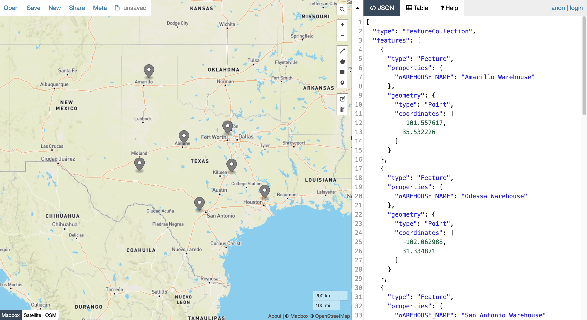
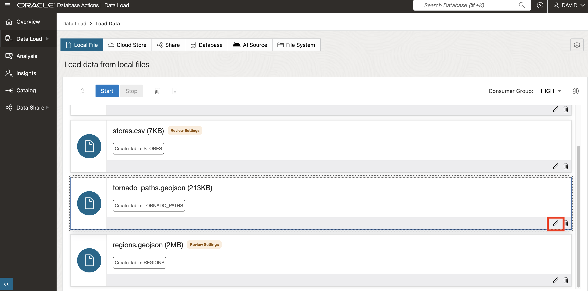
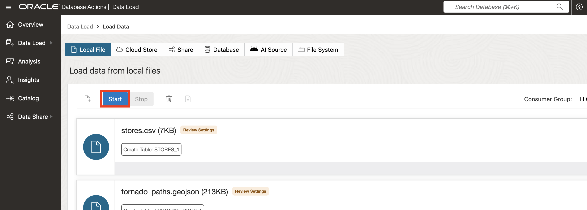
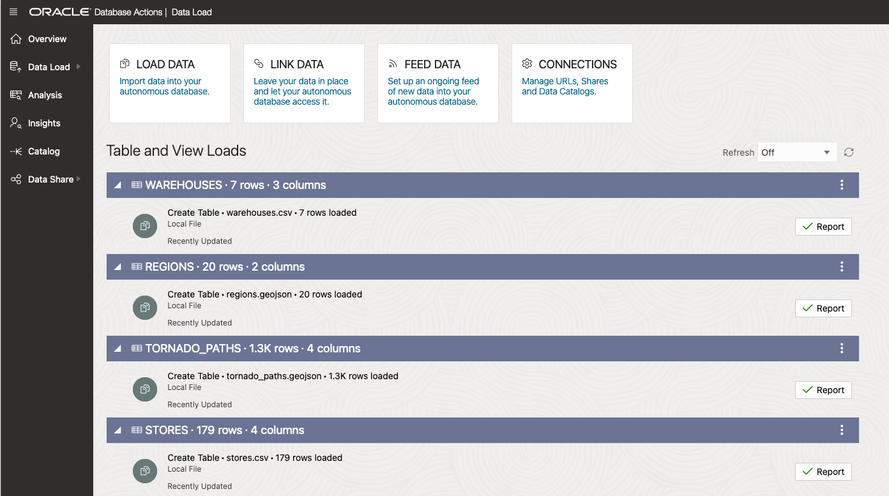
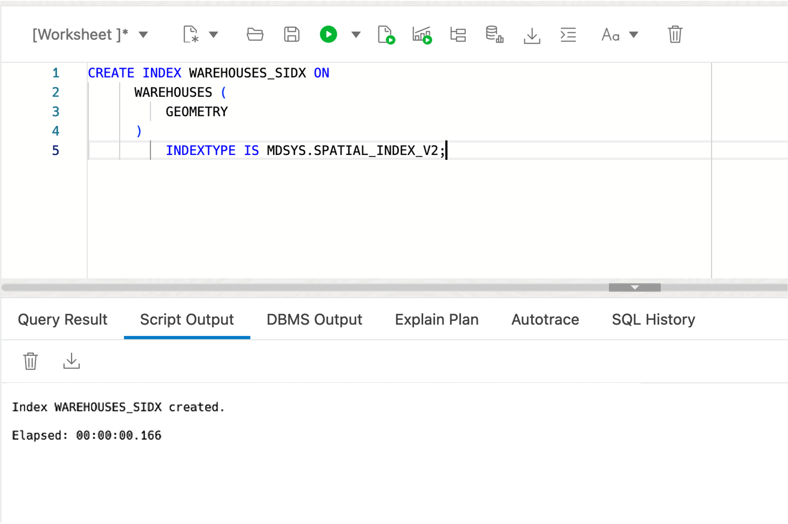

# Create sample data

## Introduction

Spatial data is commonly sourced from files having coordinates or place names, and files storing data in native spatial formats. In this lab you load and configure spatial data from such files and preview the content on a map.

Estimated Time: 20 minutes

### Objectives

In this lab, you will:
*  Learn about spatial data management in Oracle Database
*  Prepare spatial data in Oracle Database from common file formats


### Prerequisites

* Completion of Lab 2: Connect to ADB with SQL Worksheet


### About spatial data

Oracle Database stores spatial data (points, lines, polygons) in a native data type called SDO_GEOMETRY. Oracle Database also provides a native spatial index for high performance spatial operations. This spatial index relies on spatial metadata that is entered for each table and geometry column storing spatial data. Once spatial data is populated and indexed, robust APIs are available to perform spatial analysis, calculations, and processing.

The SDO_GEOMETRY type has the following general format:

```
    SDO_GEOMETRY( 
        [geometry type]              -- ID for points/lines/polygons
        , [coordinate system]        -- ID of coordinate system
        , [point coordinate]         -- used for points only
        , [line/polygon info]        -- used for lines/polygons only
        , [line/polygon coordinates] -- used for lines/polygons only
    )
 ```

The most common geometry types are 2-dimensional:

  | ID |Type |
  | --- | --- | 
  | 2001 |Point |
  | 2002 |Line |
  | 2003 |Polygon |

The most common coordinate systems are:

  | ID |Coordinate System |
  | --- | --- | 
  | 4326 |Latitude/Longitude|
  | 3857 |World Mercator|

When using latitude and longitude, note that latitude is the Y coordinate and longitude is the X coordinate. Since coordinates are listed as X,Y pair, the values within SDO_GEOMETRY need to be in the order: longitude, latitude.

The following example is a point geometry with longitude,latitude coordinates:

```
    SDO_GEOMETRY( 
        2001                       -- 2D point
        , 4326                     -- Coordinate system
        , SDO_POINT_TYPE(
          -100.123, 20.456, NULL)  -- lon/lat values
        , NULL                     -- Not used for points
        , NULL                     -- Not used for points
    )
```

The following example is a polygon geometry with longitude,latitude coordinates:

```
    SDO_GEOMETRY( 
        2003                     -- 2D polygon
        , 4326                   -- Coordinate system
        , NULL                   -- Only used for points
        , SDO_ELEM_INFO_ARRAY(
                  1, 1003, 1)    -- Signifies simple exterior polygon
        , SDO_ORDINATE_ARRAY(    -- lon/lat values
              -98.789065,39.90973
            , -101.2522,39.639537
            , -99.84374,37.160316
            , -96.67987,35.460699
            , -94.21875,39.639537
            , -98.789025,39.90973
        )
    )
```

The general workflow for creating spatial data is to generate geometries and then create a spatial index for optimal performance. Prior to creating a spatial index, a row of spatial metadata is inserted which is used by the spatial index to ensure data consistency.

Spatial metadata is inserted as follows:

```
    INSERT INTO USER_SDO_GEOM_METADATA VALUES (
    [table name],
    [geometry column name],
    SDO_DIM_ARRAY(
      SDO_DIM_ELEMENT('X',[min x],[max x],[tolerance]),
      SDO_DIM_ELEMENT('Y',[min y],[max y],[tolerance])),
    [coordinate system id]   
    );
```


In this workshop you work with longitude,latitude coordinates so the metadata inserts will be as follows:

```
    INSERT INTO USER_SDO_GEOM_METADATA VALUES (
    [table name],
    [geometry column name],
    SDO_DIM_ARRAY(
      SDO_DIM_ELEMENT('X', -180, 180, 0.005),
      SDO_DIM_ELEMENT('Y',-90, 90, 0.005)),
    4326 
    );
```


For **point** data, the most common scenario is to start with data including coordinates representing point locations. The data may be configured either by creating and populating a new geometry column (column with type SDO_GEOMETRY), or creating a function that creates geometries from coordinates, and then creating a spatial index on that function. Both options have their associated use cases, and you will use both methods to gain familiarity. 

For **lines** and **polygons**, it is most common to load from common formats, such as GeoJSON, and convert to a table with a geometry column. GeoJSON which is the most common format for developer integration, and since conversion from/to GeoJSON is included in this workshop, we provide the following brief introduction.

As stated at [https://geojson.org/](https://geojson.org/), "GeoJSON is a format for encoding a variety of geographic data structures". The geospatial industry has accepted GeoJSON as a defacto standard and, as such, it is consumable by virtually all spatial developer platforms, libraries, and toolkits. Therefore handling of GeoJSON is important for interoperability.  

A GeoJSON document is typically a JSON document with the top level structure 

  ```
    {
        "type": "FeatureCollection",
        "features": [
           ... array of GeoJSON features ... 
        ]
     }
  ```

The format of GeoJSON features is show below.

   

Oracle Spatial includes built-in functions to convert between the native spatial type (SDO\_GEOMETRY) and GeoJSON geometry format. Note that GeoJSON geometries are contained within a broader GeoJSON document format including non-spatial attributes and an array structure. 

In this lab you will load data from GeoJSON documents to tables with SDO\_GEOMETRY columns. In a later lab you will generate GeoJSON from tables with SDO\_GEOMETRY columns.

**Note:** In this workshop you use Autonomous Database tools and SQL to load and configure GeoJSON documents. This is useful for understanding the native JSON capabilities of Autonomous Database. However there are also simple tools and utilities available for loading GeoJSON to Oracle Spatial that require no coding. For example [Oracle Spatial Studio](https://www.oracle.com/database/technologies/spatial-studio/get-started.html) and [GDAL](https://gdal.org/). The most appropriate approach depends on your scenario.

### Objectives

In this lab, you will:
* Download files for STORES, WAREHOUSES, REGIONS, and TORNADO\_PATHS
* View the content on a map
* Load the files to database tables
* Configure the tables for spatial analysis


### Prerequisites

Oracle Autonomous Database and Database Actions 


## Task 1: Load data from files

You begin by loading data for warehouses and stores from CSV files that include coordinates which will be used to create point geometries. You then load data for regions and tornado paths from GeoJSON documents. The GeoJSON files will be loaded and converted to tables with geometries. 

1. Download the following files using **right-click > Save link As...**.

   
      * [stores.csv](files/stores.csv)
      * [warehouses.csv](files/warehouses.csv)
      * [regions.geojson](files/regions.geojson)
      * [tornado_paths.geojson](files/tornado_paths.geojson)

2. Then navigate your file system explorer to the downloaded files.

   

2. Begin by viewing the data on map. 
 
   Please note: Oracle Spatial Studio is a web tool for self-service (no code) spatial data loading, configuration, analysis, and map visualization. It is a separate web application that can be deployed from the Cloud Marketplace. As this workshop focuses exclusively on working with Spatial at the SQL level, Spatial Studio is not used. Instead you use a public web site to view the data.
 
   [http://geojson.io](http://geojson.io) is a web site for viewing (as well as manually creating and editing) small spatial datasets. You can use this site to render data in GeoJSON files as well as files that include longitude, latitude columns. To view the downloaded data on a map, click [here](http://geojson.io) to open geojson.io in a new browser tab. Then drag and drop **warehouses.csv** onto the map.

   

   The CSV data is converted to GeoJSON as shown on the right, and rendered on the map.

   

   Click **New** at the top to open a fresh map in a new tab. Drag and drop **stores.csv** onto the map.

   

   

   Repeat for **regions.geojson**.

   

   Repeat for **tornardo_paths.geojson**.

   

  These are the data that you will load, configure, and perform spatial analysis on. Once you have reviewed the maps you can close the geojson.io tabs.

1. Next you load the files to database tables. In Database Actions, click on the main hamburger icon at the top left and then click **Data Load**.

 

2. Accept the defaults (LOAD DATA and LOCAL FILE) and click **Next**.

 

3. Select all 4 of the files you downloaded, then drag and drop them onto the Data Load page.

 

4. You now see the 4 files listed for loading. Click the action menu icon for tornado_paths.geojson and select **Settings**.

 


5.  By default, tables are create with the same name as the input files. This is fine for STORES and WAREHOUSES. However you will be creating REGIONS and TORNADO\_PATHS tables after data loading by converting from GeoJSON. So you need to override the default names. Change the destination table name to **TORNADO\_PATHS\_GEOJSON**.

 

6.  Observe that 2 columns will be created, which correspond to the top level keys in the GeoJSON file. Then click **Close**.

 

7. Repeat for regions.geojson. Click the action menu icon and then **Settings**.

 

8. Update the target table name to **REGIONS\_GEOJSON**. Observe the same structure will be created as the other GeoJSON file, with columns for the top level keys. Click **Close**.

 

9. Click **Start** to initiate the data load.

 

10. When prompted with confirmation popup, click **Run**. 

  

11. Wait for loading to complete for all 4 files, then click **Done**.

  

12. Click the main hamburger icon at the top left, and then select **SQL**.

  


13. Confirm that all 4 tables are now created. 
      
 

14. To prepare for working with the GeoJSON content, add check constraints on the FEATURES columns defining them as JSON.

       ```
       <copy> 
        ALTER TABLE REGIONS_GEOJSON 
            ADD CHECK (FEATURES IS JSON);

        ALTER TABLE TORNADO_PATHS_GEOJSON 
            ADD CHECK (FEATURES IS JSON);
        </copy>
        ```

 


The tables are now ready to be configured for Spatial.


## Task 2: Configure warehouses table using geometry column

Next you configure the WAREHOUSES table for Spatial by generating a geometry column from the coordinate columns.

1. Begin by adding a geometry column (column with type SDO_GEOMETRY).
   
      ```
      <copy> 
      ALTER TABLE WAREHOUSES ADD (
          GEOMETRY SDO_GEOMETRY
          );
      </copy>
      ```

   

2.  Next, populate the geometry column for rows with valid coordinates (all of the rows in this case).

      ```
      <copy> 
      UPDATE WAREHOUSES
      SET GEOMETRY = SDO_GEOMETRY(
                       2001,
                       4326,
                       SDO_POINT_TYPE(LONGITUDE, LATITUDE, NULL),
                       NULL, NULL)
      WHERE LONGITUDE IS NOT NULL 
      AND LONGITUDE BETWEEN -180 AND 180
      AND LATITUDE IS NOT NULL 
      AND LATITUDE BETWEEN -90 AND 90 ;
      </copy>
      ```

   

3.  Before creating a spatial index, you must insert a row of spatial metadata. Every user has an updatable view called USER\_SDO\_GEOM\_METADATA for their spatial metadata. This is a user view on a centralized table storing spatial metadata for the entire database instance. Spatial metadata tracks the coordinate system identifier (longitude/latitude is only one of many coordinate systems) and dimensionality (2D, 3D, etc) of every geometry column to be indexed. These items need to be consistent for all data in an indexed geometry column, so the index creation reads the values and enforces integrity of the index by rejecting any inconsistency. 
   
    Run the following to insert spatial metadata for the WAREHOUSES table.

      ```
      <copy> 
       INSERT INTO USER_SDO_GEOM_METADATA VALUES (
        'WAREHOUSES',  -- table name
        'GEOMETRY',    -- geometry column name
        SDO_DIM_ARRAY(
          SDO_DIM_ELEMENT('X', -180, 180, 0.005),
          SDO_DIM_ELEMENT('Y', -90, 90, 0.005)),
         4326           -- indicates longitude/latitude coordinates
       );
      </copy>
      ```
   

4. Finally, create a spatial index for the WAREHOUSES table.

      ```
      <copy> 
        CREATE INDEX WAREHOUSES_SIDX ON
            WAREHOUSES (
                GEOMETRY
            )
                INDEXTYPE IS MDSYS.SPATIAL_INDEX_V2;
      </copy>
      ```

   

      **Please note:** If a spatial index creation statement fails (for example because a previous step was not done correctly), then before retrying you must still drop the index since some index artifacts may have been created.  So for example, if the spatial index creation statement above were to fail, then before retrying you should run "DROP INDEX WAREHOUSES\_SIDX;".

5.  After creating the spatial index, refresh the table listing. Creating a spatial index automatically creates a special system-managed table with a name having the format **MDRT_xxxx$**. Such tables are managed entirely by Spatial to support spatial indexes and should never be manually dropped. For database users they should be ignored.
      
   


## Task 3: Configure stores table using function-based spatial index

Next you configure the STORES table for Spatial. You could repeat the previous steps to create and index a new geometry column. Instead you will create a "function-based spatial index". With a function-based spatial index, you index geometries returned by a function. The benefit of this approach is that a new geometry column does not need to be added. For scenarios where adding a column is impractical or not desirable, this is the preferred approach.  Details can be found [here](https://docs.oracle.com/en/database/oracle/oracle-database/19/spatl/extending-spatial-indexing.html#GUID-CFB6B6DB-4B97-43D1-86A1-21C1BA853089).

1. The first step is to create a generic function that accepts coordinates and returns a geometry (i.e., a SDO\_GEOMETRY value). The function includes criteria so that a result is only returned for valid input coordinates.
   
      ```
      <copy>
      CREATE OR REPLACE FUNCTION GET_GEOMETRY (
            IN_LONGITUDE NUMBER,
            IN_LATITUDE  NUMBER
        ) RETURN SDO_GEOMETRY
            DETERMINISTIC PARALLEL_ENABLE
        IS
        BEGIN
         IF (IN_LONGITUDE IS NOT NULL 
            AND IN_LONGITUDE BETWEEN -180 AND 180
            AND IN_LATITUDE IS NOT NULL 
            AND IN_LATITUDE BETWEEN -90 AND 90)
         THEN
          RETURN 
            SDO_GEOMETRY(
              2001, 
              4326, 
              SDO_POINT_TYPE(IN_LONGITUDE, IN_LATITUDE, NULL), 
              NULL, NULL);
          ELSE RETURN NULL;
          END IF;
        END;
        /
      </copy>
      ```
     

2.  Next, test the function using the STORES table. SQL Worksheet does not display object types such as SDO\_GEOMETRY in query results, so the result is displayed as **[object Object]**.

      ```
      <copy>
        SELECT
            GET_GEOMETRY(LONGITUDE, LATITUDE)
        FROM
            STORES
        WHERE 
             ROWNUM<10;
      </copy>
      ```

       

3.  Since SQL Worksheet does not display object types such as SDO\_GEOMETRY in query results, call the function inside the built-in function to convert the result to a GeoJSON string.

      ```
      <copy>
        SELECT
            SDO_UTIL.TO_GEOJSON(
                GET_GEOMETRY(LONGITUDE, LATITUDE))
        FROM
            STORES
        WHERE 
             ROWNUM<10;
      </copy>
      ```

       

   Instead of creating and indexing a new geometry column in the STORES table, you will create an index on the values returned by the GET\_GEOMETRY function for the STORES table.


3.  Before creating a spatial index, a row of spatial metadata is inserted.  In the case of a function-based spatial index, instead of a geometry column name you insert the function call. Insert spatial metadata for the STORES table using the GET\_GEOMETRY function. The function must be prepended with the owner name, in this case ADMIN.

      ```
      <copy>
      INSERT INTO USER_SDO_GEOM_METADATA VALUES (
       'STORES',  -- table name
       'ADMIN.GET_GEOMETRY(LONGITUDE,LATITUDE)', -- function returning geometry
       SDO_DIM_ARRAY(
        SDO_DIM_ELEMENT('X', -180, 180, 0.005),
        SDO_DIM_ELEMENT('Y', -90, 90, 0.005)),
       4326  -- indicates longitude/latitude coordinates
      );
      </copy>
      ```

   

4.  Finally create the spatial index. In the case of a function-based spatial index, the "column" being indexed is actually the call to the GET\_GEOMETRY function.

      ```
      <copy>
      CREATE INDEX STORES_SIDX ON
        STORES (
            GET_GEOMETRY(LONGITUDE,LATITUDE)
        )
            INDEXTYPE IS MDSYS.SPATIAL_INDEX_V2;
      </copy>
      ```

   

## Task 4: Create regions table from GeoJSON document

Next you convert regions from GeoJSON format to a table with a geometry column. Start by viewing the content of REGIONS\_GEOJSON. As described earlier, loading JSON in SQL Worksheet creates a table with columns for the document's top-level keys. For GeoJSON that is **type** and **features**. Hover your mouse over the **features** value to see a pop-up of the features array. Since the features are polygons with many coordinates, you only see a portion of the first feature in the array.

 ```
  <copy>
    SELECT *
    FROM REGIONS_GEOJSON;
  </copy>
 ```

   

Oracle Autonomous Database provides robust features for working with JSON data through SQL. For example, run the following statement to see the number of items in the features array (i.e., the number of regions).


 ```
  <copy>
    SELECT 
      JSON_VALUE(features, '$.size()')
    FROM 
       REGIONS_GEOJSON;
  </copy>
 ```


   

   To return the properties (i.e., attributes) of the first feature in the array, run the following. The result is key/value pair(s), in this case only one.

   ```
  <copy>
   SELECT 
      x.features.properties[0]
   FROM
      REGIONS_GEOJSON x;
  </copy>
 ``` 

   


To return the geometry of the first feature in the array as SDO\_GEOMETRY, run the following. As noted earlier, SQL Worksheet does not not display object type values such as SDO\_GEOMETRY, so you will see the result shown as [object Object].

 ```
  <copy>
    SELECT 
      json_value(features,'$[0].geometry' RETURNING SDO_GEOMETRY)
    FROM
        REGIONS_GEOJSON;
  </copy>
 ```

   


To display the geometry in SQL Worksheet, use Spatial's ability to convert SDO\_GEOMETRY to other common string formats. Spatial supports format conversion with both SQL conversion functions and SDO\_GEOMETRY object type methods. Run the following to use an SDO\_GEOMETRY method to return the geometry of the first feature in WKT (Well Known Text) format.

 ```
  <copy>
    SELECT 
      json_value(features,'$[0].geometry' RETURNING SDO_GEOMETRY).Get_WKT()
    FROM
        REGIONS_GEOJSON;
  </copy>
 ```

   

The JSON\_TABLE table function returns items in a JSON array as rows. This is exactly what we will need to convert the features array to a table. Run the following to return the contents of the features array as rows. Note that the arguments to COLUMNS are the property key(s), which is only REGION here, and geometry.

 ```
  <copy>
    SELECT
        JT.*
    FROM
        REGIONS_GEOJSON A,
        JSON_TABLE ( A.FEATURES, '$[*]'
                COLUMNS (
                    REGION VARCHAR ( 30 ) PATH '$.properties.REGION',
                    GEOMETRY SDO_GEOMETRY PATH '$.geometry'
                )
            )
        AS JT;
  </copy>
  ```

   

Create the REGIONS table from the results of the previous query.  

  ```
  <copy>

    CREATE TABLE REGIONS AS (
        SELECT
            JT.*
        FROM
            REGIONS_GEOJSON A,
            JSON_TABLE ( A.FEATURES, '$[*]'
                COLUMNS (
                   REGION VARCHAR ( 30 ) PATH '$.properties.REGION',
                   GEOMETRY SDO_GEOMETRY PATH '$.geometry'
            ))
              AS JT
          );

  </copy>
  ```

   


Insert spatial metadata for REGIONS.


  ```
  <copy>
    INSERT INTO USER_SDO_GEOM_METADATA VALUES (
     'REGIONS',
     'GEOMETRY',
     SDO_DIM_ARRAY(
      SDO_DIM_ELEMENT('X', -180, 180, 0.005),
      SDO_DIM_ELEMENT('Y', -90, 90, 0.005)),
     4326
      );
  </copy>
  ```

   


 Create a spatial index for REGIONS.  

  ```
  <copy>
    CREATE INDEX REGIONS_SIDX ON
          REGIONS (
              GEOMETRY
          )
              INDEXTYPE IS MDSYS.SPATIAL_INDEX_V2;
  </copy>
  ```
   


## Task 5: Create tornado paths table from GeoJSON document

Repeat the previous task steps to convert TORNADO\_PATHS\_GEOJSON. Start by getting the number of features.

  ```
  <copy>
    SELECT
        JSON_VALUE(FEATURES, '$.size()')
    FROM
        TORNADO_PATHS_GEOJSON;
  </copy>
  ```

   


Next, get the properties of the first feature.  This time there are several.

  ```
  <copy>
    SELECT
        x.features.properties[0]
    FROM
        TORNADO_PATHS_GEOJSON x;
  </copy>
  ```

   

Run the following to see the property values, geometry, and geometry as WKT for the first feature.

  ```
  <copy>
    SELECT 
        json_value(features,'$[0].properties.KEY'),
        json_value(features,'$[0].properties.YR'),
        json_value(features,'$[0].properties.LOSS'),
        json_value(features,'$[0].geometry' RETURNING SDO_GEOMETRY),
        json_value(features,'$[0].geometry' RETURNING SDO_GEOMETRY).Get_WKT()
      FROM
          TORNADO_PATHS_GEOJSON;
  </copy>
  ```

   

Use the JSON\_TABLE function to return the content as rows.
  
  ```
  <copy>
    SELECT
          JT.*
      FROM
          TORNADO_PATHS_GEOJSON A,
          JSON_TABLE ( A.FEATURES, '$[*]'
                  COLUMNS (
                      KEY      NUMBER PATH '$.properties.KEY',
                      YR       NUMBER PATH '$.properties.YR',
                      LOSS     NUMBER PATH '$.properties.LOSS',
                      GEOMETRY SDO_GEOMETRY PATH '$.geometry'
                  )
              )
          AS JT;
  </copy>
  ```

  

  Create the TORNADO\_PATHS table from the results of the previous query.
  
  ```
  <copy>
    CREATE TABLE TORNADO_PATHS AS
    SELECT
          JT.*
      FROM
          TORNADO_PATHS_GEOJSON A,
          JSON_TABLE ( A.FEATURES, '$[*]'
                  COLUMNS (
                      KEY      NUMBER PATH '$.properties.KEY',
                      YR       NUMBER PATH '$.properties.YR',
                      LOSS     NUMBER PATH '$.properties.LOSS',
                      GEOMETRY SDO_GEOMETRY PATH '$.geometry'
                  )
              )
          AS JT;
  </copy>
  ```
  
  

  Insert spatial metadata for TORNADO\_PATHS.
  
  ```
  <copy>
    INSERT INTO USER_SDO_GEOM_METADATA VALUES (
     'TORNADO_PATHS',
     'GEOMETRY',
     SDO_DIM_ARRAY(
      SDO_DIM_ELEMENT('X', -180, 180, 0.005),
      SDO_DIM_ELEMENT('Y', -90, 90, 0.005)),
    4326
      );
  </copy>
  ```
  
  

  Create spatial index for TORNADO\_PATHS.
  
  ```
  <copy>
    CREATE INDEX TORNADO_PATHS_SIDX ON
          TORNADO_PATHS (
              GEOMETRY
          )
              INDEXTYPE IS MDSYS.SPATIAL_INDEX_V2;
  </copy>
  ```
  
  

Now that conversion from GeoJSON is complete you may drop the tables storing the uploaded GeoJSON documents. Then refresh the tables listing.


  ```
  <copy>
  DROP TABLE REGIONS_GEOJSON;
  DROP TABLE TORNADO_PATHS_GEOJSON;
  </copy>
  ```
  


 All data is now loaded and prepared for spatial analysis. 

 You may now **proceed to the next lab**.

## Learn more

* [Spatial product portal](https://oracle.com/goto/spatial)
* [Spatial documentation](https://docs.oracle.com/en/database/oracle/oracle-database/19/spatl)
* [Spatial blog posts on Oracle Database Insider](https://blogs.oracle.com/database/category/db-spatial)

## Acknowledgements

* **Author** - David Lapp, Database Product Management, Oracle
* **Contributors** - Karin Patenge, Database Product Management, Oracle
* **Last Updated By/Date** - David Lapp, March 2023