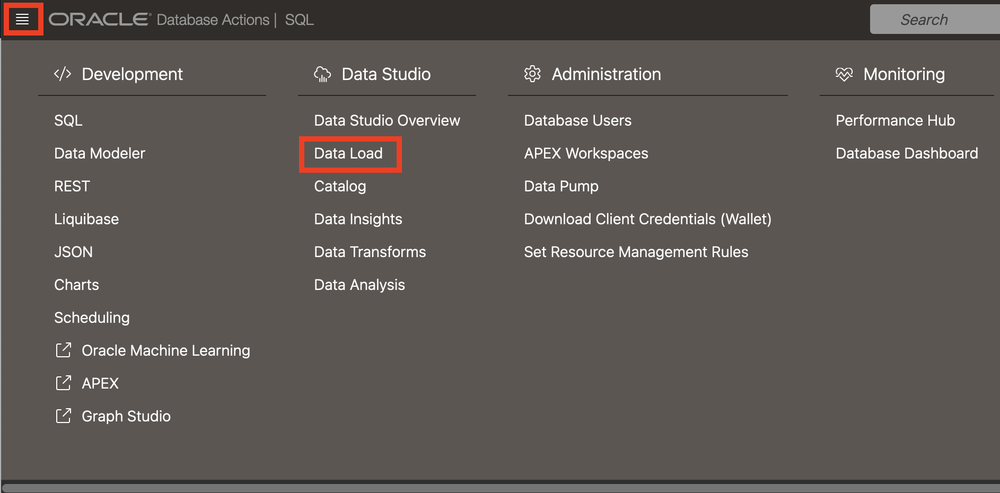
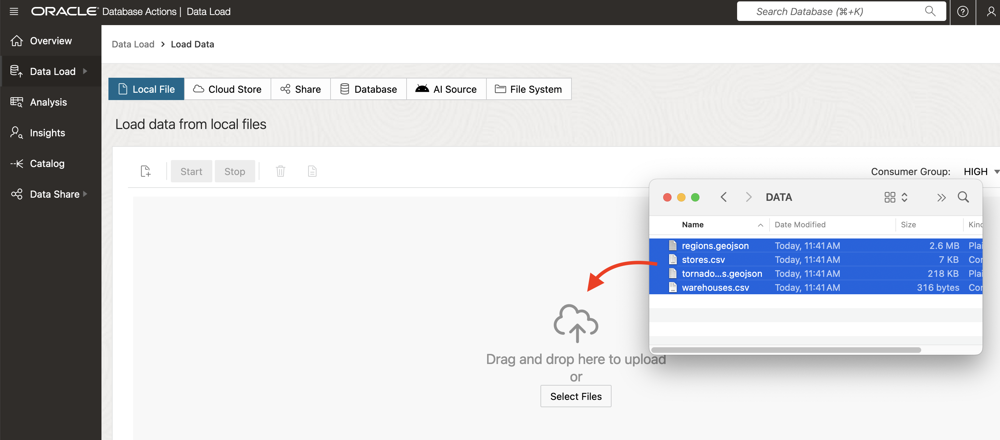
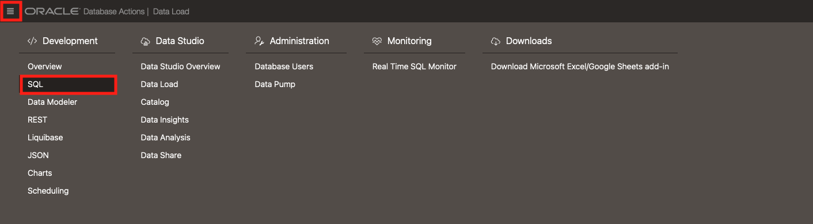
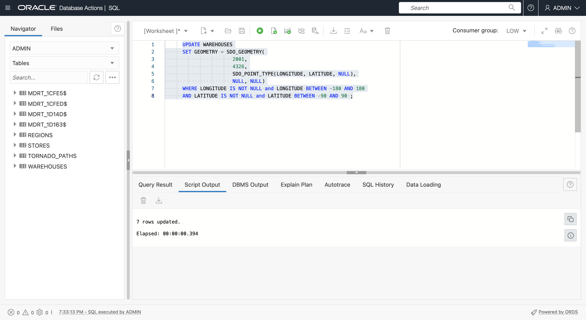
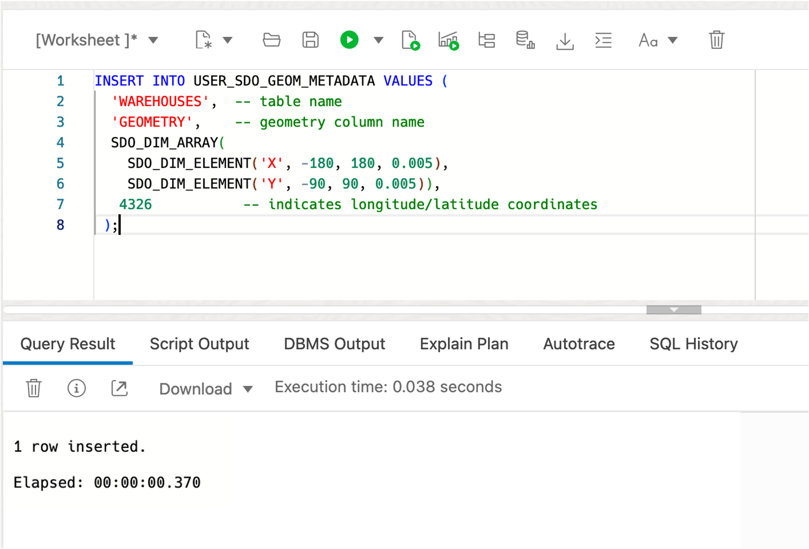
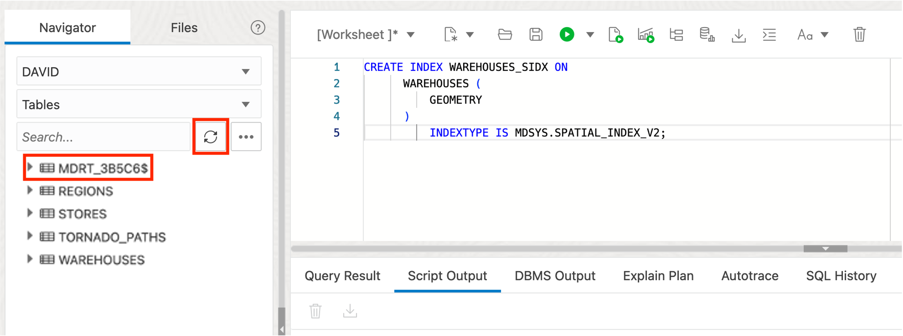

# Create Sample Data


## Introduction

......

Estimated Lab Time: 20 minutes

 
### About Spatial Data

Oracle Database stores spatial data (points, lines, polygons) in a native data type called SDO_GEOMETRY. Oracle Database also provides a native spatial index for high performance spatial operations. This spatial index relies on spatial metadata that is entered for each table and geometry column storing spatial data. Once spatial data is populated and indexed, robust APIs are available to perform spatial analysis, calculations, and processing.

The SDO_GEOMETRY type has the following general format:

```
SDO_GEOMETRY( 
    [geometry type]              -- ID for points/lines/polygons
    , [coordinate system]        -- ID of coordinate system
    , [point coordinate]         -- used for points only
    , [line/polygon info]        -- used for lines/polygons only
    , [line/polygon coordinates] -- used for lines/polygons only
)
 ```

The most common geometry types are 2-dimensional:

  | ID |Type |
  | --- | --- | 
  | 2001 |Point |
  | 2002 |Line |
  | 2003 |Polygon |

The most common coordinate systems are:

  | ID |Coordinate System |
  | --- | --- | 
  | 4326 |Latitude/Longitude|
  | 3857 |World Mercator|

When using latitude and longitude, note that latitude is the Y coordinate and longitude is the X coordinate. Since coordinates are listed as X,Y pair, the values within SDO_GEOMETRY need to be in the order: longitude, latitude.

The following example is a point geometry with longitude,latitude coordinates:

```
SDO_GEOMETRY( 
    2001                                      -- 2D point
    , 4326                                    -- Coordinate system
    , SDO_POINT_TYPE(-100.123, 20.456, NULL)  -- lon/lat values
    , NULL                                    -- Default NULL if not not needed
    , NULL                                    -- Default NULL if not not needed
)
```

The following example is a polygon geometry with longitude,latitude coordinates:

```
SDO_GEOMETRY( 
    2003                                      -- 2D polygon
    , 4326                                    -- Coordinate system
    , NULL                                    -- Default NULL if not not needed 
    , SDO_ELEM_INFO_ARRAY(1, 1003, 1)         -- Identifies a simple exterior polygon
    , SDO_ORDINATE_ARRAY(                     -- list of lon/lat values
        -98.789065,39.90973
        , -101.2522,39.639537
        , -99.84374,37.160316
        , -96.67987,35.460699
        , -94.21875,39.639537
        , -98.789025,39.90973
    )
)
```


**... Add section here on built-in conversion fns ...**


### Objectives

In this lab, you will:
* ....


### Prerequisites

Oracle Autonomous Database and Database Actions 


## Task 1: Load Data from Files

You begin by loading data for warehouses and stores from CSV files. These files include coordinates which will later be used to create geometries. You then load data for regions from a GeoJSON document. GeoJSON is ......

1. Download the following files to a convenient location:
   
  - [stores.csv](files/stores.csv)
  - [warehouses.csv](files/warehouses.csv)
  - [regions.geojson](files/regions.geojson)
  - [tornado_paths.geojson](files/tornado-paths.geojson)
     
   

2. ... see the data on map ...

   geojson.io is a web site for viewing (as well as manually creating and editing) small spatial datasets. To view the downloaded data on a map, click [here](http://geojson.io) to open geojson.io in a new browser tab.

   

   

   

   

   

   


3. Navigate to SQL Developer Web. From the action menu next to Search, select **Data Loading > Upload Data Into New Table** . 
   
   

4. Drag and drop **stores.csv** into the data loading region. You may also click **Select files** to navigate to the files.
   
   

5. Preview the data, observing that the data contains longitude, latitude coordinates for each store. Click **Next** to continue.
   
   

6. Update the column type for POSTAL_CODE to **VARCHAR2** and then click **Next** to continue.
   
   

  
7. Click **Finish**. The table will then be created.
   
   

8. Observe that data is loaded with no failed rows (i.e., no errors). SQL Developer Web automatically creates a table for each data load to store loading errors. In this workshop you can drop these tables since the data will load without errors.

   Enter and run following command to drop the errors table for STORES.

      ```
      <copy> 
         DROP TABLE SDW$ERR$_STORES;
      </copy>
      ```

   

9.  Repeat the previous steps to upload **warehouses.csv**, accepting all defaults. Observe that the data contains longitude, latitude coordinates for each warehouse. 
   
  
   
2. When complete, observe there are no failed rows. 

   Enter and run following command to drop the errors table for WAREHOUSES.

      ```
      <copy> 
         DROP TABLE SDW$ERR$_WAREHOUSES;
      </copy>
      ```

   


3. Repeat the data load process, this time loading the file **REGIONS.geojson**.

   


1. Observe the data preview shows 2 columns, **type** and **features**, which are the top level keys in a GeoJSON document. ...expand on this...   Click **Next**.

   

2. Rename from destination table from to **REGIONS_GEOJSON**. ...expand on this...  Click **Next**.

   


2. Click **Finish** to create the table and load the GeoJSON content.   ...expand on this...   

   

2. When complete, observe there are no failed rows. 

   Enter and run following command to drop the errors table for REGIONS_GEOJSON.

      ```
      <copy> 
         DROP TABLE SDW$ERR$_REGIONS_GEOJSON;
      </copy>
      ```
   

1. Next load **TORNADO_PATHS.geojson**.
   
   

2. Change the destination table name to **TORNADO\_PATHS\_GEOJSON**. 
   
    
   
1.   When complete, observe there are no failed rows. 

   Enter and run following command to drop the errors table for REGIONS_GEOJSON.

      ```
      <copy> 
         DROP TABLE SDW$ERR$_TORNADO_PATHS_GEOJSON;
      </copy>
      ```
   

2. All 4 tables are now created and ready to be configured for Spatial. 
   
    
   

## Task 2: Configure Warehouses Table using Geometry Column

Next ......

1. ...
   
      ```
      <copy> 
      ALTER TABLE WAREHOUSES ADD (
          GEOMETRY SDO_GEOMETRY
          );
      </copy>
      ```

   

2.  ... include check for valid coordinates...

      ```
      <copy> 
      UPDATE WAREHOUSES
      SET GEOMETRY = SDO_GEOMETRY(
                       2001,
                       4326,
                       SDO_POINT_TYPE(LONGITUDE, LATITUDE, NULL),
                       NULL, NULL);
      </copy>
      ```

   

3.  ...

      ```
      <copy> 
        INSERT INTO USER_SDO_GEOM_METADATA VALUES (
            'WAREHOUSES',
            'GEOMETRY',
            SDO_DIM_ARRAY(SDO_DIM_ELEMENT('X', 0, 0, 0.005),
                          SDO_DIM_ELEMENT('Y', 0, 0, 0.005)),
            4326
        );
      </copy>
      ```
   

3.  ...

      ```
      <copy> 
        CREATE INDEX WAREHOUSES_SIDX ON
            WAREHOUSES (
                GEOMETRY
            )
                INDEXTYPE IS MDSYS.SPATIAL_INDEX_V2;
      </copy>
      ```

   


3.  ...MDRT tables...

      
   


## Task 3: Configure Stores Table using Function-based Spatial Index

Next ......

3.  ... ... include check for valid coordinates...

      ```
      <copy>
        CREATE OR REPLACE FUNCTION GET_GEOMETRY (
            IN_LONGITUDE NUMBER,
            IN_LATITUDE  NUMBER
        ) RETURN SDO_GEOMETRY
            DETERMINISTIC PARALLEL_ENABLE
        IS
        BEGIN
          RETURN 
            SDO_GEOMETRY(
              2001, 
              4326, 
              SDO_POINT_TYPE(IN_LONGITUDE, IN_LATITUDE, NULL), 
              NULL, NULL);
        END;
        /
      </copy>
      ```
     

3.  ... ...change this to an object method...

      ```
      <copy>
        SELECT
            SDO_UTIL.TO_GEOJSON(
                 GET_GEOMETRY(-90.123, 30.456)
                 )
        FROM
            DUAL;
      </copy>
      ```

   

3.  ...

      ```
      <copy>
          INSERT INTO USER_SDO_GEOM_METADATA VALUES (
            'STORES',
            'ADMIN.GET_GEOMETRY(LONGITUDE,LATITUDE)',
            SDO_DIM_ARRAY(SDO_DIM_ELEMENT('X', 0, 0, 0.005),
                          SDO_DIM_ELEMENT('Y', 0, 0, 0.005)),
            4326
        );
      </copy>
      ```

   

3.  ...

      ```
      <copy>
      CREATE INDEX STORES_SIDX ON
        STORES (
            GET_GEOMETRY(LONGITUDE,LATITUDE)
        )
            INDEXTYPE IS MDSYS.SPATIAL_INDEX_V2;
      </copy>
      ```

   

## Task 4: Create Regions Table from GeoJSON Document

Next ......

 ```
  <copy>
    SELECT *
    FROM REGIONS_GEOJSON;
  </copy>
 ```

   

   

 ```
  <copy>
    SELECT 
      JSON_VALUE(features, '$.size()')
    FROM 
       REGIONS_GEOJSON;
  </copy>
 ```

   

  
 ```
  <copy>
   SELECT 
      x.features.properties[0]
   FROM
      REGIONS_GEOJSON x;
  </copy>
 ``` 

   

 ```
  <copy>
    SELECT 
      json_value(features,'$[0].geometry' RETURNING SDO_GEOMETRY)
    FROM
        REGIONS_GEOJSON;
  </copy>
 ```

   

 ```
  <copy>
    SELECT 
      json_value(features,'$[0].geometry' RETURNING SDO_GEOMETRY).Get_WKT()
    FROM
        REGIONS_GEOJSON;
  </copy>
 ```

   


 ```
  <copy>
    SELECT
        JT.*
    FROM
        REGIONS_GEOJSON A,
        JSON_TABLE ( A.FEATURES, '$[*]'
                COLUMNS (
                    REGION VARCHAR ( 30 ) PATH '$.properties.REGION',
                    GEOMETRY SDO_GEOMETRY PATH '$.geometry'
                )
            )
        AS JT;
  </copy>
  ```

   

  ```
  <copy>

    CREATE TABLE REGIONS AS (
        SELECT
            JT.*
        FROM
            REGIONS_GEOJSON A,
            JSON_TABLE ( A.FEATURES, '$[*]'
                COLUMNS (
                   REGION VARCHAR ( 30 ) PATH '$.properties.REGION',
                   GEOMETRY SDO_GEOMETRY PATH '$.geometry'
            ))
              AS JT
          );

  </copy>
  ```

   

  ```
  <copy>
    INSERT INTO USER_SDO_GEOM_METADATA VALUES (
          'REGIONS',
          'GEOMETRY',
          SDO_DIM_ARRAY(SDO_DIM_ELEMENT('X', 0, 0, 0.005),
                        SDO_DIM_ELEMENT('Y', 0, 0, 0.005)),
          4326
      );
  </copy>
  ```

   

  ```
  <copy>
    CREATE INDEX REGIONS_SIDX ON
          REGIONS (
              GEOMETRY
          )
              INDEXTYPE IS MDSYS.SPATIAL_INDEX_V2;
  </copy>
  ```
   

## Task 5: Create Tornado Paths Table from GeoJSON Document

Next ......


  ```
  <copy>
    SELECT
        JSON_VALUE(FEATURES, '$.size()')
    FROM
        TORNADO_PATHS_GEOJSON;
  </copy>
  ```

   

  ```
  <copy>
    SELECT
        x.features.properties[0]
    FROM
        TORNADO_PATHS_GEOJSON x;
  </copy>
  ```

   

  ```
  <copy>
    SELECT 
        json_value(features,'$[0].properties.KEY'),
        json_value(features,'$[0].properties.YR'),
        json_value(features,'$[0].properties.LOSS'),
        json_value(features,'$[0].geometry' RETURNING SDO_GEOMETRY),
        json_value(features,'$[0].geometry' RETURNING SDO_GEOMETRY).Get_WKT()
      FROM
          TORNADO_PATHS_GEOJSON;
  </copy>
  ```

   
  
  ```
  <copy>
    SELECT
          JT.*
      FROM
          TORNADO_PATHS_GEOJSON A,
          JSON_TABLE ( A.FEATURES, '$[*]'
                  COLUMNS (
                      KEY      NUMBER PATH '$.properties.KEY',
                      YR       NUMBER PATH '$.properties.YR',
                      LOSS     NUMBER PATH '$.properties.LOSS',
                      GEOMETRY SDO_GEOMETRY PATH '$.geometry'
                  )
              )
          AS JT;
  </copy>
  ```

  
  
  ```
  <copy>
    CREATE TABLE TORNADO_PATHS AS
    SELECT
          JT.*
      FROM
          TORNADO_PATHS_GEOJSON A,
          JSON_TABLE ( A.FEATURES, '$[*]'
                  COLUMNS (
                      KEY      NUMBER PATH '$.properties.KEY',
                      YR       NUMBER PATH '$.properties.YR',
                      LOSS     NUMBER PATH '$.properties.LOSS',
                      GEOMETRY SDO_GEOMETRY PATH '$.geometry'
                  )
              )
          AS JT;
  </copy>
  ```
  
  
  
  ```
  <copy>
    INSERT INTO USER_SDO_GEOM_METADATA VALUES (
          'TORNADO_PATHS',
          'GEOMETRY',
          SDO_DIM_ARRAY(SDO_DIM_ELEMENT('X', 0, 0, 0.005),
                        SDO_DIM_ELEMENT('Y', 0, 0, 0.005)),
          4326
      );
  </copy>
  ```
  
  
  
  ```
  <copy>
    CREATE INDEX TORNADO_PATHS_SIDX ON
          TORNADO_PATHS (
              GEOMETRY
          )
              INDEXTYPE IS MDSYS.SPATIAL_INDEX_V2;
  </copy>
  ```
  
  
  
  ```
  <copy>
    DROP TABLE REGIONS_GEOJSON;
    DROP TABLE TORNADO_PATHS_GEOJSON;
  </copy>
  ```
  

## Learn More

* [Spatial product portal](https://oracle.com/goto/spatial)
* [Spatial documentation](https://docs.oracle.com/en/database/oracle/oracle-database/19/spatl)
* [Spatial blog posts on Oracle Database Insider](https://blogs.oracle.com/database/category/db-spatial)
* [Spatial blog posts on Medium.com](https://medium.com/oracledevs/tagged/spatial)


## Acknowledgements

* **Author** - David Lapp, Database Product Management, Oracle
* **Last Updated By/Date** - Karin Patenge, June 2022