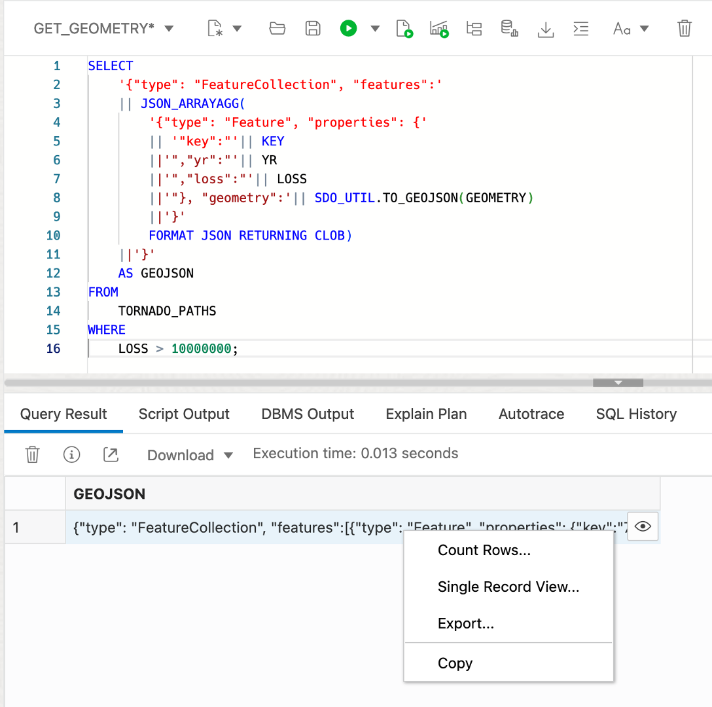

# Return GeoJSON


## Introduction

GeoJSON is the preferred format for developer integration of spatial data. Virtually all spatial and mapping client libraries consume GeoJSON. So it is important to return content and results from Spatial as GeoJSON. Please refer to **Lab 3 - Introduction** for an explanation of GeoJSON. In this lab you will generate GeoJSON documents from tables with geometries. In practice, the value of generating GeoJSON in ADB is in returning GeoJSON to diverse clients and that then deliver the content from their framework. For example, SQL and PL/SQL returning GeoJSON can be leveraged by Oracle REST Data Services (ORDS) to publish location-based REST APIs returning GeoJSON documents, and Oracle Data Science to combine with popular open source spatial ML libraries that natively support GeoJSON.

Estimated Time: 15 minutes

Watch the video below for a quick walk-through of the lab.
[Prepare spatial data](videohub:1_bj22bt29)

### Objectives

In this lab, you will:
*  Explore native JSON handing in Oracle Autonomous Database
*  Convert tables with geometries to GeoJSON documents to support developer integration


### Prerequisites

* Completion of Lab 3: Prepare Spatial Data

## Task 1: Construct GeoJSON document from query results

1. Begin by returning a tornado path geometry as in GeoJSON format.

      ```
      <copy> 
      SELECT
          SDO_UTIL.TO_GEOJSON(GEOMETRY)
      FROM
          TORNADO_PATHS
      WHERE
          LOSS > 10000000;
      </copy>
      ```

      

2. Next, use the JSON_ARRAYAGG( ) function to convert rows of GeoJSON geometries into an array, as needed to build the GeoJSON document. Notice the argument **RETURNING CLOB** which is needed since geometries with many coordinates (like complex polygons) can result in very long strings. Hover your mouse over the result to see the JSON array.

      ```
      <copy> 
      SELECT
          JSON_ARRAYAGG(
              SDO_UTIL.TO_GEOJSON(GEOMETRY) 
              FORMAT JSON RETURNING CLOB )
      FROM
          TORNADO_PATHS
      WHERE
          LOSS > 10000000;
      </copy>
      ```

      

3. The feature array must include both geometries and properties. Run the following query to construct elements of the feature array. Hover your mouse over the result to see the JSON array now with properties.


      ```
      <copy> 
      SELECT
          '{"type": "Feature", "properties": {'
          || '"key":"'|| KEY
          ||'","yr":"'|| YR
          ||'","loss":"'|| LOSS
          ||'"}, "geometry":'|| SDO_UTIL.TO_GEOJSON(GEOMETRY)
          ||'}' AS features
      FROM
          TORNADO_PATHS
      WHERE
          LOSS > 10000000;
      </copy>
      ```

      

4.  Use JSON_ARRAYAGG( ) to compile the previous results into an array. This is now the actual features array. Hover your mouse over the result to see a popup with result.

    ```
    <copy> 
    SELECT
        JSON_ARRAYAGG( 
            '{"type": "Feature", "properties": {'
            || '"key":"'|| KEY
            ||'","yr":"'|| YR
            ||'","loss":"'|| LOSS
            ||'"}, "geometry":'|| SDO_UTIL.TO_GEOJSON(GEOMETRY)
            ||'}' 
            FORMAT JSON RETURNING CLOB)   
    FROM
        TORNADO_PATHS
    WHERE
        LOSS > 10000000;
    </copy>
    ```

    


5.  To complete the construction of a GeoJSON document, include the top level keys **type** and **features**, and a closing curly brace. This now returns a complete GeoJSON document. Hover your mouse over the result to see a popup with result.

    ```
    <copy> 
    SELECT
        '{"type": "FeatureCollection", "features":'
        || JSON_ARRAYAGG( 
            '{"type": "Feature", "properties": {'
            || '"key":"'|| KEY
            ||'","yr":"'|| YR
            ||'","loss":"'|| LOSS
            ||'"}, "geometry":'|| SDO_UTIL.TO_GEOJSON(GEOMETRY)
            ||'}' 
            FORMAT JSON RETURNING CLOB) 
        ||'}'
        AS GEOJSON
    FROM
        TORNADO_PATHS
    WHERE
        LOSS > 10000000;
    </copy>
    ```

  

 6. Right-click in the results cell and select **Copy**.

      

 7. Verify the result by rendering. Click [here](http://geojson.io) to open geojson.io in a new browser tab. Clear the content on the right panel under JSON (select all > delete) and then paste in your GeoJSON copied from the SQL Worksheet. Click on any of the tornado lines to see a popup that includes its properties.

       

 8. To make the result a bit more interesting, run the following to create a GeoJSON document with geometries that are 5 mile buffers surrounding the tornado paths.  Notice that a new property key is added to indicate the buffer distance. Run the query and then, as done previously, copy the result.

       ```
       <copy> 
       SELECT
          '{"type": "FeatureCollection", "features":'
          || JSON_ARRAYAGG( 
              '{"type": "Feature", "properties": {'
              || '"key":"'|| KEY
              ||'","yr":"'|| YR
              ||'","loss":"'|| LOSS
              ||'","buffer":"5 MI'
              ||'"}, "geometry":'|| SDO_UTIL.TO_GEOJSON(
                                     SDO_GEOM.SDO_BUFFER(GEOMETRY, 5, 1, 'unit=MILE'))
              ||'}' 
              FORMAT JSON RETURNING CLOB)   
          ||'}'
          AS GEOJSON
       FROM
           TORNADO_PATHS
       WHERE
           LOSS > 10000000;
       </copy>
       ```

       

9. Open a new geojson.io tab, clear the JSON panel on the right, and paste in the result copied from your SQL Worksheet. Observe the buffer geometries and click on one to see a popup with properties including the buffer key that was added.

      


  In a real-world scenario, the GeoJSON you have generated would be served to clients, such as mapping JavaScript libraries and Python notebooks, for example through JDBC or APIs published with Oracle REST Data Services.


You may now **proceed to the next lab**.

## Learn more

* [Spatial product portal](https://oracle.com/goto/spatial)
* [Spatial documentation](https://docs.oracle.com/en/database/oracle/oracle-database/19/spatl)
* [Spatial blog posts on Oracle Database Insider](https://blogs.oracle.com/database/category/db-spatial)

## Acknowledgements

* **Author** - David Lapp, Database Product Management, Oracle
* **Last Updated By/Date** - David Lapp, September 2022